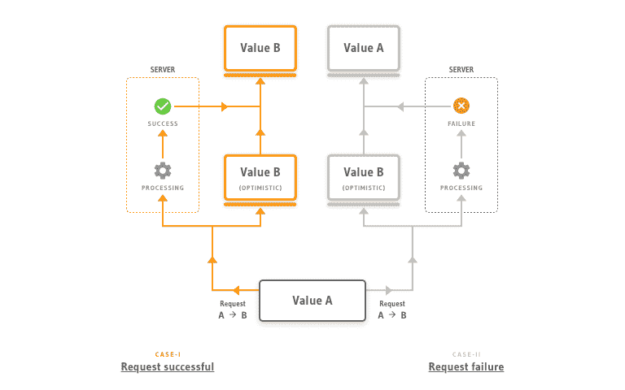
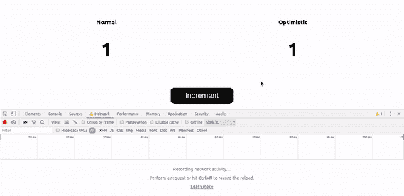
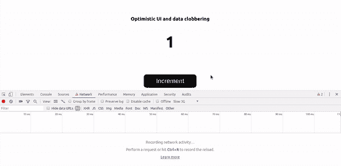
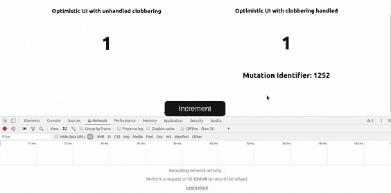

# 乐观的用户界面和痛击

> 原文：<https://dev.to/hasurahq/optimistic-ui-and-clobbering-24lm>

## 什么是乐观 UI？

> 乐观 UI 是一种前端开发范例，其中，在向 API 发出突变请求后，假设请求成功，客户端乐观地更新 UI**。**

 **<figure> 

<figcaption>乐观 UI</figcaption>

</figure>

请看下面 GIF 中的例子。它显示数据库中的一个计数器值，而 increment 按钮使其递增。左边的计数器实现传统的同步 UI，右边的计数器实现乐观 UI。

<figure> 

<figcaption>乐观 UI 示例</figcaption>

</figure>

**同步 UI**

1.  向数据库发出`increment`请求。
2.  一旦响应成功，UI 上的计数器值就会更新。
3.  如果响应不成功，UI 上的计数器值保持不变。

**乐观 UI**

1.  向数据库发出`increment`请求。
2.  假设响应成功，UI 上的计数器值会立即更新。
3.  如果响应成功，则使用成功响应的数据更新 UI
4.  如果响应不成功，UI 上的计数器值将恢复到之前的状态。

## 为什么要用乐观 UI？

正如您在上面看到的，在这两种情况下，成功和不成功的响应都得到了优雅的处理。唯一的区别是乐观 UI **看起来**更快，不管网络瓶颈如何。在大多数情况下，没有理由等待成功的响应，因为在生产环境中，大多数请求都有望成功。如果请求不成功，您还可以有一个恢复机制来恢复到原始状态。

## 用乐观的 UI 痛击

### 问题

毁坏是一个软件工程问题，数据源由于副作用而被覆盖。在乐观 UI 的情况下，当 UI 快速连续地进行多个突变，并且一个突变的乐观 UI 被来自不同突变的响应数据覆盖时，通常会发生碰撞。

考虑这样一种情况，一个 UI 元素从值 **1** 快速连续地突变为值 **2** 和值 **3** 。你可以在下面的 GIF 中看到这个问题:

如果我们试图在不考虑碰撞的情况下实现乐观 UI，UI 将经历以下状态:

**初始状态**

*   数据库中的值: **1**
*   UI 上的值: **1**

**值(2)的突变开始**

*   数据库中的值: **1**
*   UI 上的值(乐观): **2**

**值(3)的突变开始**

*   数据库中的值: **1**
*   UI 上的值(乐观): **3**

**突变到值(2)成功**

*   数据库中的值: **2**
*   UI 上的值(来自成功响应): **2**

**突变到值(3)成功**

*   数据库中的值: **3**
*   UI 上的值(来自成功响应): **3**

这意味着，对于一个只是查看 UI 的人来说，UI 从 **1** 到 **2** 到 **3** 到 **2** 到 **3** ，这在语义上是错误的。理想情况下，用户界面应该从 **1** 到 **2** 再到 **3** ，如此而已。

这是乐观 UI 最大的问题。

### 解

我们可以通过在更新 UI 之前检查陈旧数据来解决这个问题。为了实现这一点，我们将每个突变与一个唯一的可比较的标识符相关联，例如时间戳或数字。这意味着，随着每一个突变，您关联的标识符(比如说，一个数字)略大于与前一个突变关联的标识符。这个标识符应该是你的乐观反应和突变反应的一部分。现在，每当必须更新 UI 时，我们只需检查新数据是否具有比现有数据更大的突变标识符。这样，我们就避免了用陈旧的数据更新 UI。

现在我们知道了如何解释乱序，让我们重新看看当一个值从 **1** 到 **2** 到 **3:** 时的 UI 状态

**初始状态**

*   数据库中的值: **1**
*   突变标识符:1252
*   UI 上的值: **1**

**值(2)的突变开始**

*   数据库中的值: **1**
*   乐观数据的突变标识符:1253
*   现有数据的突变标识符:1252
*   UI 上的值(乐观): **2**

**值(3)的突变开始**

*   数据库中的值: **1**
*   乐观数据的突变标识符:1254
*   现有数据的突变标识符:1252
*   UI 上的值(乐观): **3**

**突变到值(2)成功**

*   数据库中的值: **2**
*   成功响应数据的突变标识符:1253
*   现有数据的突变标识符:1254
*   UI 上的值(来自成功响应): **3**

> 请注意，UI 不会使用来自变异响应的数据进行更新，因为变异标识符小于 UI 数据中的变异标识符

**突变到值(3)成功**

*   数据库中的值: **3**
*   成功响应数据的突变标识符:1254
*   现有数据的突变标识符:1254
*   UI 上的值(来自成功响应): **3**

如你所见，用户界面从 **1** 到 **2** 再到 **3** ，如此而已。

这个想法是在更新一个数据源之前检查和清理数据，它可以用来解决大多数干扰问题。实现这个解决方案的惟一要求是服务器应该支持原子增量和更新。

### 错误处理

有了这个解决方案，处理不成功的请求也很容易。因为每个 UI 状态都与一个变异标识符相关联，所以每当从服务器收到一个不成功的响应时，我们就可以回滚到前一个变异标识符。

### 举例

让我们举一个在 todo 应用程序中实现这个解决方案的例子。

假设您有一个从 Postgres 中的`todo`表读取数据的 todo 应用程序。todo 表通常看起来像这样:**