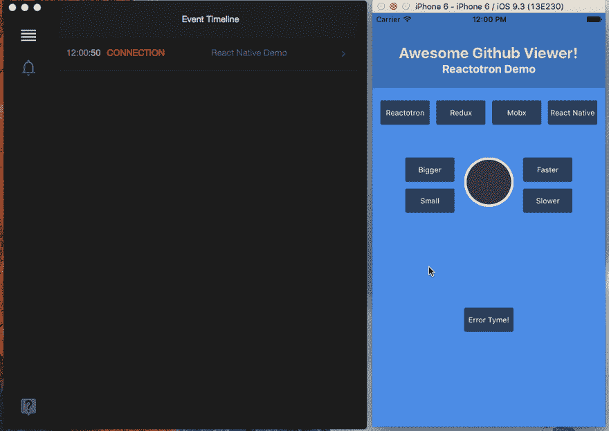

# React Native 中排名前五的开源应用

> 原文：<https://dev.to/mrcflorian/top-5-open-source-apps-in-react-native-40ed>

在当今的编程世界中，我们看到 React Native 中提供了许多开源库，使开发人员的任务变得更加容易。鉴于技术领域的激烈竞争，重用代码一如既往地至关重要。在 Instamobile，我们通过为开发者和创业者提供完整的 [React 原生模板](https://www.instamobile.io/)，让他们能够更快地推出自己的应用。

在本文中，我们将看看几个开源的 React 原生项目，我们建议您在启动下一个移动应用程序时查看这些项目。

所有这些项目也可以被希望通过研究真实的源代码来学习 React Native 的学生使用。

对于那些更喜欢冒险的人，请查看这些优质的[移动应用程序模板](https://instamobile.io/mobile-development/best-mobile-app-templates/)，它们可以帮助你在一天内创建自己的移动应用程序。

# 1。React 本地初学者工具包

这个 React Native Starter Kit 是一个功能性的开源 React Native 应用程序，它为您提供了大量有用且受欢迎的功能，例如 Firebase 数据库集成、存储、推送通知、用户登录、持久登录凭据等等。

# 2。F8 App 2017

F8 应用是 GitHub 上推荐的 13K 星开源项目之一。这个 React Native 项目非常受欢迎，因为它是从 React Native 构建的产品的真实展示示例，而不仅仅是源代码。

# 3。反应本地元素

[react-native-elements](https://github.com/react-native-training/react-native-elements) 是一个完全用 Javascript 构建的高度可定制的跨平台 UI 工具包。它拥有超过 12k 的星星，是 React Native 最大的可用 UI 库。

# 4。天才聊天

天才聊天是一款 7k stars React 原生开源 app。天赋聊天号称 React Native 最全的聊天 UI。然而，天才聊天库只有 UI，所以它没有集成的聊天后端。如果你正在寻找一个功能齐全的本地聊天系统，请查看一个与后端集成的功能齐全的解决方案。

# 5。电抗器

Reactotron 在调试方面为您节省了大量的开发时间。对于像我们这样的开发人员，我们总是需要一些有用的工具来检查我们在编写代码时得到的错误。Reactotron 是一款 macOS、Windows 和 Linux 应用，用于检查 React JS 和 React Native 应用。

# 结论

有许多开源项目可以帮助您引导您的新移动应用程序，或者帮助您有效地学习 React Native。请记住，React 原生生态系统仍处于初期阶段(RN 版本仅为 0.60！)，所以你可能找不到任何你能找到的 web 开发的东西。

在 Instamobile，我们的使命是帮助移动开发者快速推出他们的应用，拥有全功能的 [iOS 应用模板](https://www.iosapptemplates.com)、 [React 原生模板](https://www.instamobile.io)、 [Flutter 模板](https://www.instaflutter.com)和 [Kotlin 模板](https://www.instakotlin.com)。

是否缺少任何重要的 React 本地项目？请在评论中告诉我！