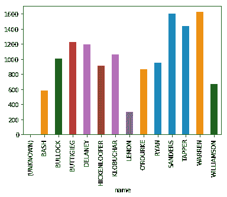
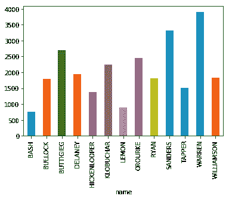

# 主要辩论分析快速入门

> 原文：<https://dev.to/charlesdlandau/primary-debate-analysis-quickstart-19k1>

编辑:在两个晚上的辩论结束后，我做了一个更彻底的记录。我鼓励你去看看。

[](/charlesdlandau) [## 可视化初选辩论

### 查尔斯兰道 8 月 1 日 191 分钟阅读

#dataviz #showdev #python #nlp](/charlesdlandau/visualizing-the-primary-debates-4ff6)

如果你正在观看今晚的辩论，并且想“我如何能从这分析抄本数据？”下面是一些简单而容易地解析脚本的起始代码。

```
import pandas as pd
import sklearn as sk
import requests
import bs4

# http request r = requests.get('https://www.washingtonpost.com/politics/'
    '2019/07/31/transcript-first-night-second-democratic-debate')
r.status_code

# Parse html soup = bs4.BeautifulSoup(r.content)
graphs = soup.find_all('p')
utterances = [x.get_text() for x in graphs if 'data-elm-loc' in x.attrs.keys()]

# Parse utterances utterances = utterances [2:]
seq = 0
data = []
for i in utterances:
    graph = i.split()
    if graph[0][-1] == ':':
        text = ' '.join(graph[1:])
        num_words = len(graph) - 1
        name = graph[0][:-1]
        seq += 1
    elif len(graph) > 1 and graph[1] == '(?):':
        # Cases like 'WARREN (?):'
        text = ' '.join(graph[2:])
        num_words = len(graph) - 2
        name = graph[0]
        seq += 1
    else:
        text = ' '.join(graph)

    data.append({"name": name,
      "graph": text,
      "seq": seq,
      "num_words": num_words})

df = pd.DataFrame(data)

# "Unknown", O'Rourke parsing errors df = df[df.name != "(UNKNOWN)"]
df['name'] = df['name'].apply(lambda x: ''.join([char for char in x if char.isalpha()]))

# Example... df.groupby('name').sum()['num_words'].plot(kind='bar') 
```

<svg width="20px" height="20px" viewBox="0 0 24 24" class="highlight-action crayons-icon highlight-action--fullscreen-on"><title>Enter fullscreen mode</title></svg> <svg width="20px" height="20px" viewBox="0 0 24 24" class="highlight-action crayons-icon highlight-action--fullscreen-off"><title>Exit fullscreen mode</title></svg>

[](https://res.cloudinary.com/practicaldev/image/fetch/s--4zj7xyeM--/c_limit%2Cf_auto%2Cfl_progressive%2Cq_auto%2Cw_880/https://thepracticaldev.s3.amazonaws.com/i/8lxx12ytavzepyn3h2m3.png)

(图片拍摄于辩论中期，这些不是最终数字)

[](https://res.cloudinary.com/practicaldev/image/fetch/s--9PBXl65W--/c_limit%2Cf_auto%2Cfl_progressive%2Cq_auto%2Cw_880/https://thepracticaldev.s3.amazonaws.com/i/9lv9cehjbpfnghhy4b6p.png)

(清理后的辩论后数据)

您可以在 Kaggle 上的一个交互式笔记本中快速开始使用这些代码和更多内容:

[https://www . ka ggle . com/charleslandau/democratic-debate-analysis-quick start](https://www.kaggle.com/charleslandau/democratic-debate-analysis-quickstart)