# 你的 WordPress 网站被黑了吗？了解下一步该做什么！

> 原文：<https://dev.to/bitofwp/did-your-wordpress-site-get-hacked-find-out-what-to-do-next-51gk>

## WordPress 被黑问题？

如果你正在使用 WordPress，你应该知道它比其他任何 CMS 或平台更容易被黑客攻击。这是因为它非常受欢迎。事实上， [WordPress 现在占据了超过 33%的网络份额](https://wordpress.org/),涵盖了将近 75，000，000 个网站。

正因为如此，WordPress 经常被黑客作为盈利的目标。黑客已经成为一个非常有利可图(尽管非法)的行业，每年为黑客赚取数万亿美元。没错。万亿。[根据一些消息来源](https://www.thesslstore.com/blog/2018-cybercrime-statistics/)，网络犯罪每年产生至少 1.5 万亿美元，各种规模的公司为此付出的代价远远超过他们愿意失去的。

这些统计数据表明，黑客攻击是一个真正的威胁，它可能发生在任何人身上。其实可能已经发生在你身上了。

如果你的 WordPress 网站被黑了(或者你想知道如果被黑了该怎么办)，继续读下去。我们已经概述了 WordPress 网站被黑客攻击的后果，如何判断你的网站是否已经被入侵，以及在你的网站被网络罪犯控制的情况下应该做什么。

### WordPress 网站被黑的后果

首先，当你的网站遭到黑客攻击时，要知道你已经完全失去了对它的控制。其他人已经闯入，可以访问它，改变它，污损它，甚至删除它，如果他们想的话。但是，请记住，删除您的网站是不可能发生的。这是因为黑客攻击通常是为了访问受保护的信息，或者作为合法网站将用户重定向到黑客的网站。WordPress Pharma Hack 就是这种恶意软件感染的一个例子。

具有良好 SEO 排名的网站是一个明显的目标——黑客将利用在搜索结果中排名良好的高流量网站来之不易的声誉，将流量重定向到他们自己的网站上。这同时增加了他们的流量和搜索排名，同时也减少了被黑网站的有机流量。如果你在经营网上业务，这意味着你很快就会开始赔钱和失去客户。

最重要的是，谷歌和其他主要搜索引擎已经开发出自动识别感染了恶意软件的网站的算法。网站被黑本身已经够糟糕了，但是如果谷歌发现你的网站被黑了，你的问题会变得更大。

现在让我们来看看人们如何判断你的 WordPress 站点是否被黑了。

### 人们如何知道你的 WordPress 网站是否被黑了

很难知道你的网站什么时候被黑了，因为网络罪犯在控制网站并利用它为自己谋利时是偷偷摸摸的。也就是说，如果有人运行谷歌搜索，你被黑的 WordPress 站点出现在搜索结果中，他们可能会注意到这样的消息:

[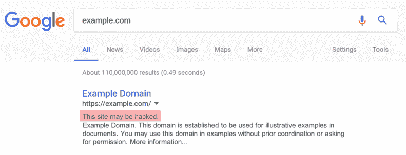](https://res.cloudinary.com/practicaldev/image/fetch/s--hkW68e_u--/c_limit%2Cf_auto%2Cfl_progressive%2Cq_auto%2Cw_880/https://img.bitofwp.com/wp-content/uploads/2019/07/how-to-tell-if-WordPress-hacked.png)

如果 Google 算法检测到以下一个(或多个)问题，此消息可能会出现在您的网站下:

*   您的网站已被第三方修改。
*   网站上的可疑链接或页面与恶意软件无关，不会感染用户，但也不应该出现在那里。(例如，销售伟哥产品的隐藏和伪装的垃圾邮件页面)。
*   恶意软件重定向，一旦点击你的谷歌搜索结果，就会把网站访问者带到另一个网站

像这样的警告可以减少多达 95%的网站流量。最糟糕的是，谷歌仍然没有在你的网站上发现任何恶意软件。它只是向潜在访问者发出警告，但却有能力说服人们不要访问你的网站。

如果谷歌在你的网站上发现恶意软件，**你的网站将被隔离并被列入黑名单**。

接下来，谷歌会从搜索结果中删除你的网页和帖子。然后，当有人试图直接访问你的网站时，他们会看到一个警告，说“前面的网站包含恶意软件。”根据浏览器的不同，消息可能会有所不同，但看起来会类似于以下内容:

[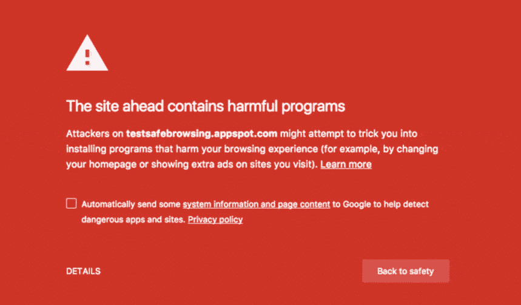](https://res.cloudinary.com/practicaldev/image/fetch/s---BpVvQmG--/c_limit%2Cf_auto%2Cfl_progressive%2Cq_auto%2Cw_880/https://img.bitofwp.com/wp-content/uploads/2019/07/google-warning-for-site-ahead-contains-harmful-programs.png)

因此，除了必须清除你网站上的恶意软件，你还必须[将你的网站从谷歌黑名单](https://developers.google.com/web/fundamentals/security/hacked/request_review)(以及任何其他搜索引擎黑名单)中移除。

你的网站每天花在隔离上的时间会让你付出金钱、名誉和 SEO 排名的代价。如果你依靠你的网站来创收，这可能是毁灭性的。

虽然你可以自己清理你的网站，并将其从谷歌的黑名单中删除，但雇佣一家专业的 WordPress 安全公司来帮你做这件事可能是个好主意。他们将有工具和经验来更好更快地修复你的 WordPress 被黑网站，从而减少你网站的停机时间。

现在让我们来看看如何判断你的网站是否被黑了。

### 你的 WordPress 网站被黑客攻击的 5 个迹象

假设你的网站还没有被列入黑名单，但是你认为它可能已经被入侵了。

以下是你应该关注的 5 件事。

#### 1。你的主页已经被损坏了

曾经有一段时间,《Vogue》的英国网站被一群迅猛龙丑化。

[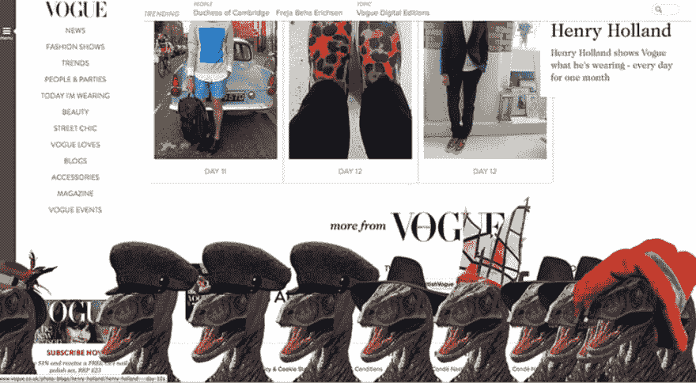](https://res.cloudinary.com/practicaldev/image/fetch/s--5eThmzNF--/c_limit%2Cf_auto%2Cfl_progressive%2Cq_auto%2Cw_880/https://img.bitofwp.com/wp-content/uploads/2019/07/WordPress-homepage-defaced.png) 

虽然这看起来很幽默，但这只是黑客闯入网站并给网站访问者留下特殊信息的众多例子中的一个。不管表面上看起来有多傻，事实是，网站的污损会对你的业务产生负面影响。

也就是说，大多数黑客并不是闯入网站玩玩；他们想在没人注意的情况下从你的辛勤工作中获利。如果黑客修改了你的主页，使之包含一些他们认为有趣的内容，比如巨魔信息或“黑客入侵”的电话卡，他们通常是为了获得恶名。这也是一个非常明显的迹象，表明您的网站已经受到威胁。

#### 2。你的 WordPress 站点性能下降了

[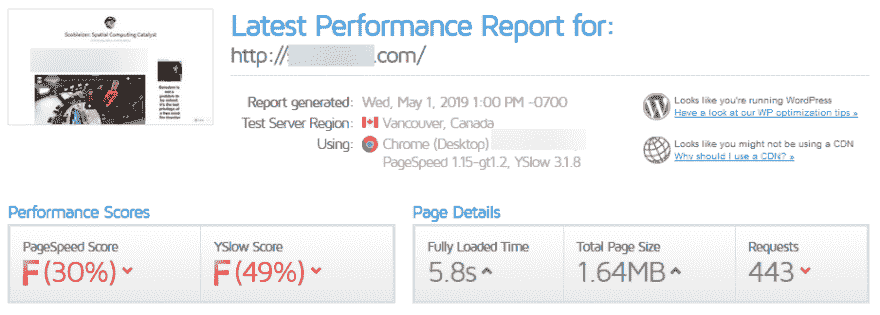](https://res.cloudinary.com/practicaldev/image/fetch/s--W5WZ9LWj--/c_limit%2Cf_auto%2Cfl_progressive%2Cq_auto%2Cw_880/https://img.bitofwp.com/wp-content/uploads/2019/07/WordPress-slow-site-speed-due-to-being-hacked.png) 

当网站受到“暴力攻击”或有恶意脚本使用您的服务器资源时，您可能会注意到您的网站需要更长时间来响应点击，甚至返回 503 服务器错误。它甚至可能崩溃，因为压力太大，服务器无法立即处理。

也就是说，一个缓慢加载的网站不一定会被黑客攻击，因为许多因素会影响网站的速度和性能。例如，您的网站可能需要更长的加载时间，原因如下:

*   共享主机环境中服务器资源的紧张
*   主要的 WordPress 核心更新和兼容性问题
*   一个膨胀的插件使你的数据库膨胀
*   太大的图像文件
*   缓存问题

然而，如果这些都不适用于您的站点，那么性能下降可能表明该站点被感染或受到 DDoS 攻击。

#### 3。具有奇怪名称和内容的文件会列在您的站点目录中

[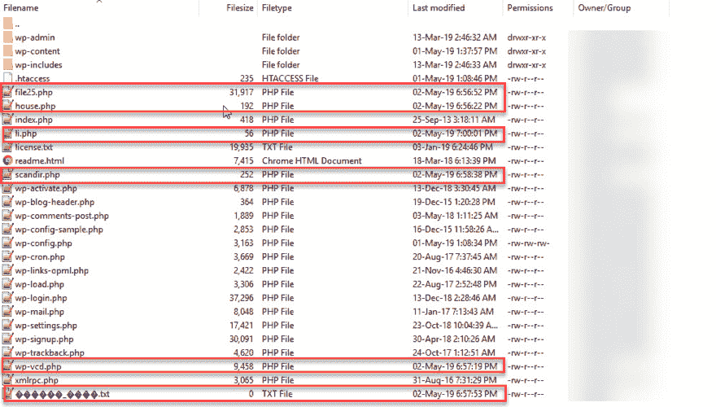](https://res.cloudinary.com/practicaldev/image/fetch/s--fnuHUdqh--/c_limit%2Cf_auto%2Cfl_progressive%2Cq_auto%2Cw_880/https://img.bitofwp.com/wp-content/uploads/2019/07/WordPress-hacked-weird-filenames.jpg) 

PHP 文件名如 file25.php '，或者看起来像是乱码的文件，是你的站点被入侵的主要标志。虽然现在黑客更加勤奋，并试图命名恶意文件，以便它们可以作为插件或主题文件传递，但发现具有奇怪名称的 PHP 文件并不少见。另一个危险信号是看到所有这些文件都有相同的修改日期，这与你的 WordPress 核心文件不同。

#### 4。你的邮件列表一夜之间变得巨大

[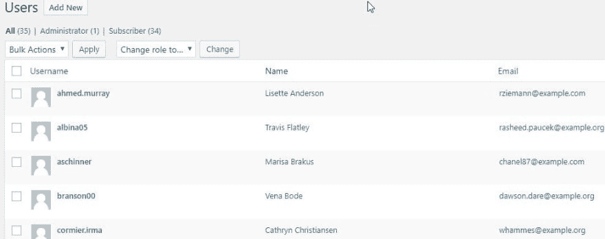](https://res.cloudinary.com/practicaldev/image/fetch/s--_T5THD2V--/c_limit%2Cf_auto%2Cfl_progressive%2Cq_auto%2Cw_880/https://img.bitofwp.com/wp-content/uploads/2019/07/WordPress-hacked-spam-users-subsribers.jpg) 

一些网站所有者不保护他们的 WordPress 注册表单。这使得垃圾邮件机器人可以注册为用户，并在其网站上发布垃圾邮件内容。

垃圾邮件本身已经够糟糕了，但是过多的垃圾邮件表明有人试图利用插件漏洞创建管理员用户。最近在 Easy WP SMTP 插件中发现了一个 0 天漏洞，该漏洞允许黑客注册为用户，但授予他们自己管理权限。一旦有人拥有了你网站的管理员权限，他们就可以为所欲为了。

#### 5。管理员登录详细信息已更改

如果你试着登录你的 WordPress 网站，但是不能，你应该担心。

 

当这种情况发生时，通常意味着黑客已经获得了您网站的访问权限，并通过删除您的管理员用户将您锁定，这样他们就可以完全控制该网站。

### 如何修复被黑的 WordPress 网站

为了让任何黑客工作，恶意文件必须放在你的 WordPress 目录中。它可以在任何地方:WordPress 核心、插件和主题文件以及“wp-content/uploads”目录。根据黑客的不同，恶意软件代码也可能隐藏在数据库中。

为了从您的网站上正确删除恶意软件，您必须遵循以下 5 个步骤:

#### 1。扫描文件内容差异

有很多 WordPress 安全插件和在线服务会搜索所有的 WordPress 核心文件，第三方主题和插件，以及你的数据库中的帖子和评论表，寻找可疑的条目和不寻常的文件名。这将帮助您隔离流氓黑客和恶意软件文件，并删除它们。

#### 2。删除流氓黑客和恶意软件文件

使用安全插件(或手动搜索)隔离恶意软件文件后，您应该删除它们。如果文件位于一个免费插件的目录中(比如 Akismet)，那么最好删除整个插件目录，然后下载并上传一个新的安装。所有插件设置都单独保存在数据库中，因此，您的所有设置都将被保留。

#### 3。检查一下。htaccess 文件(并在需要时重新生成)

的。htaccess 文件可能包含指向恶意站点的重定向，因此这是一个检查的好地方。如果你看到任何可疑的代码，你可以在 WordPress 仪表盘中点击**设置>永久链接**并点击**保存**来删除它并重新生成它。您必须重新生成。因为如果不这样做，所有页面(除了主页)都会返回 404 错误。这就是[默认的 WordPress。htaccess](https://codex.wordpress.org/htaccess) 文件看起来像。

#### 4。从 WordPress 数据库中删除恶意代码

这一步将涉及使用 SQL 查询和 phpMyAdmin 搜索选项卡来查找可疑的数据库条目并删除它们。你可以在你的主机面板中找到 phpMyAdmin 数据库工具，如果你找不到它，我们建议向你的主机提供商寻求帮助。

[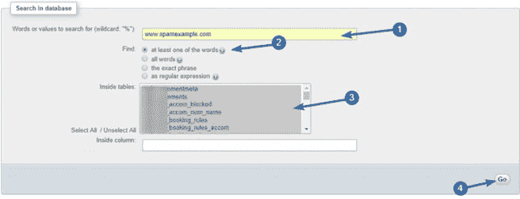T4】](https://res.cloudinary.com/practicaldev/image/fetch/s--xjPdc25S--/c_limit%2Cf_auto%2Cfl_progressive%2Cq_auto%2Cw_880/https://img.bitofwp.com/wp-content/uploads/2019/07/WordPress-hacked-database.png)

#### 5。利用谷歌搜索控制台

谷歌搜索控制台(之前的谷歌网站管理员工具)是一项巨大的资产。它可以用来诊断可疑的活动，并解除谷歌在你被黑客攻击和列入黑名单后施加的惩罚。

[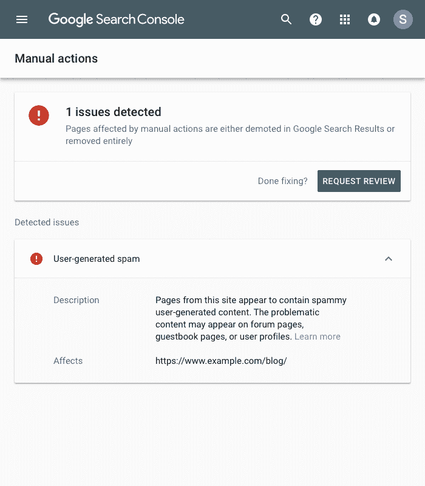](https://res.cloudinary.com/practicaldev/image/fetch/s--DnZ9JYiu--/c_limit%2Cf_auto%2Cfl_progressive%2Cq_auto%2Cw_880/https://img.bitofwp.com/wp-content/uploads/2019/07/WordPress-security-issues.png) 

谷歌搜索控制台会在你的网站被黑时通知你。这将有助于您及时做出回应，并尽快清理您的网站。它还将帮助您在网站清理后重新索引，以便在谷歌搜索结果中找到它。在时间，这将帮助您恢复您的搜索引擎优化排名。

### 如何保护你的 WordPress 网站免受黑客攻击

既然你已经知道(或者更糟，经历过)恶意软件是如何影响你的网站和 SEO 排名的，你想防止它发生在你身上，这里有五个步骤来加固你的 WordPress 网站:

#### 1。保护登录页面

[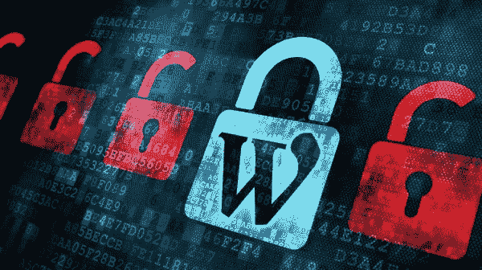](https://res.cloudinary.com/practicaldev/image/fetch/s--NrDVd7rd--/c_limit%2Cf_auto%2Cfl_progressive%2Cq_auto%2Cw_880/https://img.bitofwp.com/wp-content/uploads/2019/07/protect-WordPress-login.jpg) 

防止未经授权访问您的网站的第一步是限制登录尝试的次数。改变你的 WordPress 登录网址也是一个好主意。

#### 2。保护您的文件和数据库

[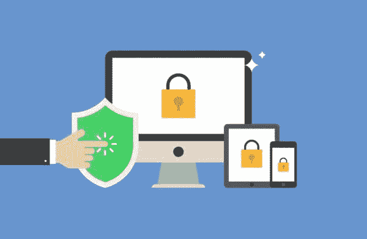](https://res.cloudinary.com/practicaldev/image/fetch/s--CzEF0M7K--/c_limit%2Cf_auto%2Cfl_progressive%2Cq_auto%2Cw_880/https://img.bitofwp.com/wp-content/uploads/2019/07/secure-WordPress-database-and-files.jpg) 

接下来，为服务器上的文件和目录设置适当的权限，禁止文件编辑，并更改数据库前缀。你可以通过使用一个合适的 WordPress 安全插件来完成所有这些。

#### 3。定期更新你的主题、插件和 WordPress 核心文件

[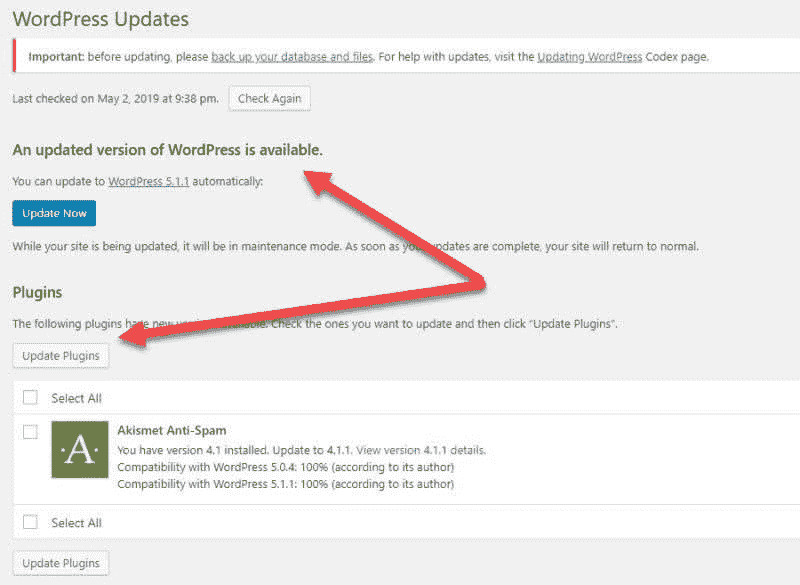](https://res.cloudinary.com/practicaldev/image/fetch/s--McCvHdTt--/c_limit%2Cf_auto%2Cfl_progressive%2Cq_auto%2Cw_880/https://img.bitofwp.com/wp-content/uploads/2019/07/update-WordPress.jpg) 

时刻更新软件很重要。过时的软件是 WordPress 网站安全漏洞的主要原因。

#### 4。对僵尸程序、特定 IP 和国家/地区应用限制

[拦截机器人](https://wordpress.org/plugins/stopbadbots/)可以帮助维护您的网站性能，防止垃圾邮件机器人攻击您的网站。除非你正在运行一个大型企业网站，否则你不需要把它们全部屏蔽掉。可以屏蔽一些 IP 和国家。

#### 5。监控您的网站

[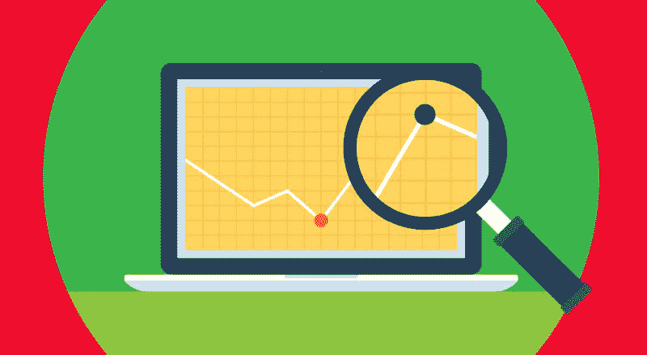](https://res.cloudinary.com/practicaldev/image/fetch/s--L2HgOrf7--/c_limit%2Cf_auto%2Cfl_progressive%2Cq_auto%2Cw_880/https://img.bitofwp.com/wp-content/uploads/2019/07/WordPress-site-monitoring.jpg) 

时刻监控你网站的可疑活动，或者使用审计和扫描插件来帮助。许多可靠的插件会在你的文件和数据库有任何变化时通知你。

### 恭喜恭喜！你已经走到这一步了。那么…现在怎么办？

WordPress 恶意软件感染可能很棘手。黑客不想让人们知道他们的网站已经被黑客攻击，并被用来为他人谋利，所以他们确保将他们的恶意软件隐藏得很深，这样你就不会注意到他们。

除非你在 WordPress 文件和数据库管理方面经验丰富，否则你可能会忽略一些恶意文件。如果这些后门留在你的网站上，黑客将很容易一次又一次地入侵它。他们还会黑掉在同一个托管账户下托管的所有其他网站。然后你又回到起点或者最糟糕的地方。

这就是为什么通过保持每日备份和运行任何未完成的更新，特别是那些为了修复 WordPress 漏洞而发布的更新，来正确维护你的 WordPress 网站可能是一个好主意。如果你没有时间或专业知识来运行这些任务，那么我们强烈建议向一个 [WordPress 支持和维护服务](https://bitofwp.com/wordpress-support-services/)寻求帮助，它可以维护和保护你的 WordPress 站点，并且每月收取少量费用。

你的 WordPress 网站被黑了吗？了解下一步该做什么！首先出现在由 BitofWP 提供的 [WordPress 支持服务上。](https://bitofwp.com)