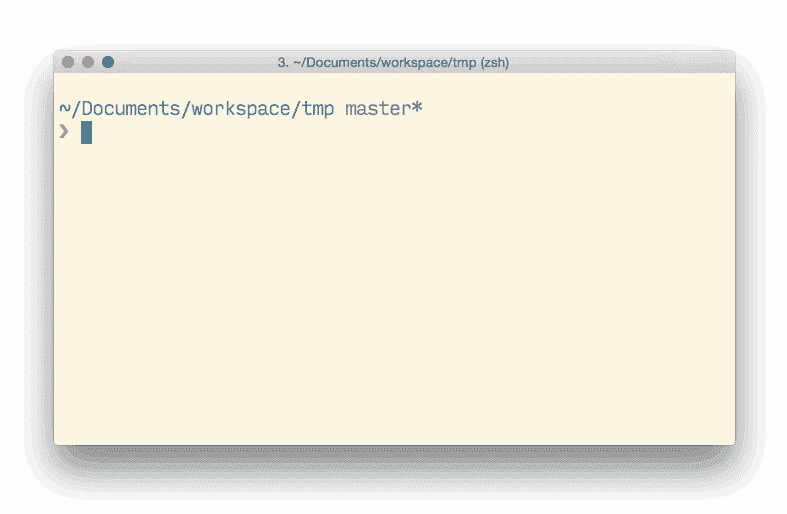

# ntl@4.0.0

> 原文：<https://dev.to/ruyadorno/ntl-4-0-0-9n1>

刚刚发布了一个新版本的 **ntl** (Npm 任务列表:列出和运行 Npm 任务的交互式 cli 菜单)，它终于提供了最近最受欢迎的功能之一:使用自定义运行器(如 yarn 或 pnpm)的能力。

[](https://res.cloudinary.com/practicaldev/image/fetch/s--SKnMkTHY--/c_limit%2Cf_auto%2Cfl_progressive%2Cq_66%2Cw_880/http://i.imgur.com/ZjjQ7Vi.gif%3F1)

* * *

您可以使用 npm:
获得最新版本

```
npm install -g ntl 
```

Enter fullscreen mode Exit fullscreen mode

并参与 Github 回购:

[https://github.com/ruyadorno/ntl](https://github.com/ruyadorno/ntl)

* * *

完整的变更列表如下:

*   **突破性改变:**使用`--descriptions`选项时缺少描述现在只抛出警告而不是错误消息+退出
*   增加了`npm-tasklist`作为手写命令替代( [#48](https://github.com/ruyadorno/ntl/pull/48) )感谢 [@wgolledge](https://github.com/wgolledge) 🎉
*   增加了`runner`选项( [#45](https://github.com/ruyadorno/ntl/pull/45) 和 [#49](https://github.com/ruyadorno/ntl/pull/49) )感谢 [@Mehdi-Hp](https://github.com/Mehdi-Hp) 🎉
*   更新的依赖关系