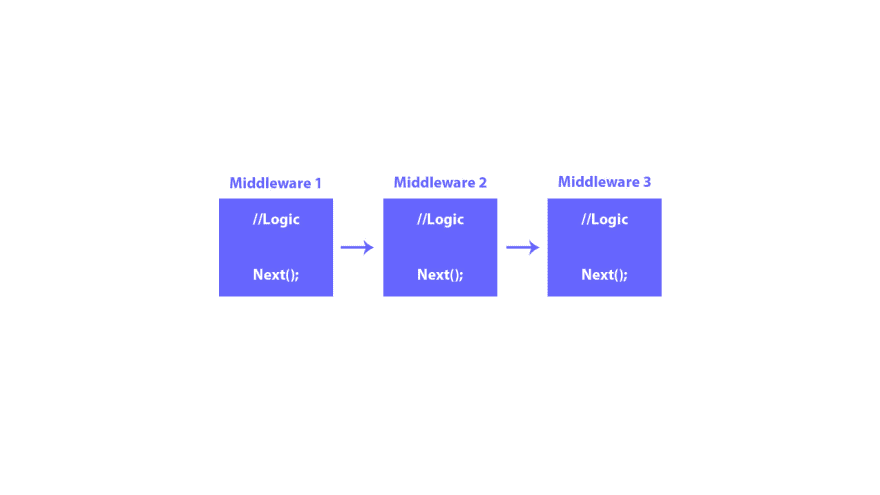

# 了解和编写 node.js 上的 middleware com express

> [https://dev . to/Daniels clet/understanding-e-writing-middlewares-no-nodejs-com-express-2 和 59](https://dev.to/danielsclet/entendendo-e-escrevendo-middlewares-no-nodejs-com-express-2e59)

当我们开始用 Express 研究 NodeJs 时，我们听到的第一个词汇之一就是‘t0’，就像 express 网站本身已经说过的那样:

`O Express é uma estrutura web de roteamento e middlewares que tem uma funcionalidade mínima por si só: Um aplicativo do Express é essencialmente uma série de chamadas de funções de middleware.`

但是，到底什么是米德尔威尔？

[](https://res.cloudinary.com/practicaldev/image/fetch/s--TmRkubfH--/c_limit%2Cf_auto%2Cfl_progressive%2Cq_auto%2Cw_880/https://thepracticaldev.s3.amazonaws.com/i/ioc6haypf5xutxtip02e.jpg)

middleware 是可以访问请求、响应和下一个中间件的功能。如上所述，middlewares 在某种程度上相互关联，一旦其中一个运行，就会调用下一个，依此类推，直到请求响应周期结束的最后一个中间件到达为止。

为了更好地说明这一点，我们将创建一个非常简单的 Hello World 应用程序。首先，进入某个终端并输入以下代码:

```
// Cria um diretório chamado hello-world
mkdir hello-world

// Entra no diretório recém criado
cd hello-world

// Cria o arquivo package.json
npm init -y

// Instala o Express
npm install express 
```

创建一个名为“`index.js`”的文件，并在其中输入以下代码:

```
const express = require('express');
const app = express();

app.get('/', function(req, res) {
    return res.send('Hello world!');
})

app.listen(3000, function() {
    console.log('Servidor online na porta 3000.');
}) 
```

在终端中运行命令`node index.js`，在任何浏览器中进入[【http://localhost:3000/](http://localhost:3000/)，我们将会看到应用程序正在运行。

如果返回代码，我们将看到一个函数作为参数接收一个`req`(请求或请求)和一个`res`(响应或响应)，该函数负责验证用户是否已进入过去的路由(在本例中为根路由'/')，然后返回一个包含“Hello World！”的响应对他来说。

此函数是一个中间件，更具体地说，就是请求-响应周期结束的中间件。也就是说，在像图片所示的一串中型散货箱中，这种功能将是最后一种，为了更容易理解，我们就叫它`middleware final`。

### 中间件主体:

```
app.use(function(req, res, next) {
    // Logic

    next();
}) 
```

与最终中间件一样，最终中间件也接收相同的 req 和 res 参数，但是，最终中间件也接收一个名为 next 的参数，负责调用下一个中间件，并且由于最终中间件中没有下一个中间件，因此我们可以将其视为下一个中间件。在所有 middlewares 中，req 和 res 参数都是相同的，因此我们可以为字符串中的下一个函数编辑此内容，例如:

```
const express = require('express');
const app = express();

app.use(function(req, res, next) {
    console.log('Tudo certo no primeiro middleware, chamando o proximo...');

    next();
})

app.use(function(req, res, next) {
    console.log('Adicionando informaçoes a requisição e chamando proximo middleware...');

    req['name'] = "Daniel";

    next();
})

app.get('/', function(req, res) {
    return res.send('Hello world, ' + req.name);
})

app.listen(3000, function() {
    console.log('Servidor online na porta 3000.');
}) 
```

通过运行此脚本并进入[【http://localhost:3000/](http://localhost:3000/)，结果将是`Hello world, Daniel`，在控制台上，我们可以看到每个 middlewares 中描述的连续消息，这是因为:

1.  用户访问'/'路径，陷入 middlewares 链；
2.  调用第一个中间件，在控制台上显示一条消息，然后调用下一个；
3.  第二个中间件被调用，它将属性`name`添加到对象`req`，并调用下一个中间件；
4.  返回在先前中间件中添加到属性“`name`”的书面消息`Hello world,` +并结束请求-响应循环。

### 举例说明

使用 middleware 的最常见示例之一是身份验证示例，您可以在其中创建中间件来拦截请求，查看用户是否已登录，然后就此做出决定。

诸如 [bodyParser](https://www.npmjs.com/package/body-parser) 和[mult](https://github.com/expressjs/multer)等包也是 middlewares。