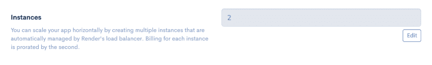
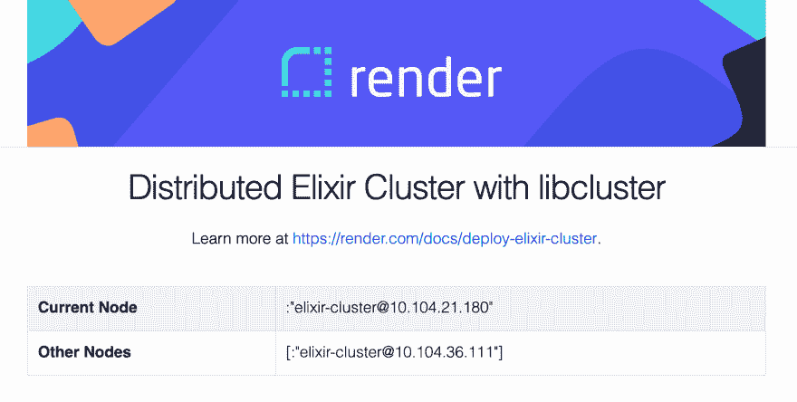

# 具有混合版本和 libcluster 的分布式酏剂

> 原文：<https://dev.to/render/distributed-elixir-with-mix-releases-and-libcluster-47f5>

这是一个使用 [libcluster](https://hexdocs.pm/libcluster) 、 [Phoenix](https://phoenixframework.org) 和 [Mix releases](https://hexdocs.pm/mix/Mix.Tasks.Release.html) 在 Render 上部署分布式 Elixir 集群的指南。集群设置为自动发现节点，并在节点加入或离开集群时保持节点列表最新。

我们将从一个裸的 Phoenix 项目开始，修改它以使用 Mix releases 和`libcluster`并在 Render 上部署它。这个例子的完整源代码可以在 https://github.com/render-examples/elixir_cluster 获得。

## 创建凤凰 App

*   在终端中创建新的 Phoenix 应用程序。在这个例子中我们不需要数据库，所以我们将把`--no-ecto`标志传递给`mix`。

```
 # install phx.new; feel free to change 1.4.9 to a different version
   $ mix archive.install hex phx_new 1.4.9
   # create a new Phoenix app
   $ mix phx.new elixir_cluster_demo --no-ecto # also fetch and install dependencies
   $ cd elixir_cluster_demo 
```

<svg width="20px" height="20px" viewBox="0 0 24 24" class="highlight-action crayons-icon highlight-action--fullscreen-on"><title>Enter fullscreen mode</title></svg> <svg width="20px" height="20px" viewBox="0 0 24 24" class="highlight-action crayons-icon highlight-action--fullscreen-off"><title>Exit fullscreen mode</title></svg>

*   更新`mix.exs`以将`libcluster`添加到 deps。

```
 defp deps do
     [ ...,
       {:libcluster, "~> 3.1"}
     ] 
```

<svg width="20px" height="20px" viewBox="0 0 24 24" class="highlight-action crayons-icon highlight-action--fullscreen-on"><title>Enter fullscreen mode</title></svg> <svg width="20px" height="20px" viewBox="0 0 24 24" class="highlight-action crayons-icon highlight-action--fullscreen-off"><title>Exit fullscreen mode</title></svg>

然后在您的终端中运行`mix deps.get`来更新依赖关系。

## 配置混合发布

创建 Mix 发布所需的运行时配置。

1.  将`config/prod.secret.exs`重命名为`config/releases.exs`。
2.  将新的`config/releases.exs`文件中的`use Mix.Config`更改为`import Config`。
3.  取消`config/releases.exs`中以下行的注释:

```
 config :elixir_cluster_demo, ElixirClusterDemoWeb.Endpoint, server: true 
```

<svg width="20px" height="20px" viewBox="0 0 24 24" class="highlight-action crayons-icon highlight-action--fullscreen-on"><title>Enter fullscreen mode</title></svg> <svg width="20px" height="20px" viewBox="0 0 24 24" class="highlight-action crayons-icon highlight-action--fullscreen-off"><title>Exit fullscreen mode</title></svg>

最后更新`config/prod.exs`删除底部的行`import_config "prod.secret.exs"`。

## 配置 libcluster

我们的设置将创建名为`elixir-cluster-demo@10.200.30.4`的节点，其中 IP 地址是动态的。首次启动时，渲染会为节点指定 IP，每次部署都会产生一个新的节点 IP。这就是`libcluster`的用武之地:它通过多种可配置的[集群管理策略](https://hexdocs.pm/libcluster/readme.html#clustering)实现[自动集群形成](https://hexdocs.pm/libcluster/readme.html#features)。

给定动态节点 IP，DNS 是可靠地形成集群并保持其最新的最佳方式。因此，我们将使用`libcluster`的 [DNS 策略](https://hexdocs.pm/libcluster/Cluster.Strategy.Kubernetes.DNS.html)来形成集群。

让我们将`libcluster`添加到生产配置中。将以下几行添加到`rel/prod.exs`。

```
dns_name = System.get_env("RENDER_DISCOVERY_SERVICE")
app_name = System.get_env("RENDER_SERVICE_NAME")

config :libcluster, topologies: [
  render: [
    strategy: Cluster.Strategy.Kubernetes.DNS,
    config: [
      service: dns_name,
      application_name: app_name
    ]
  ]
] 
```

<svg width="20px" height="20px" viewBox="0 0 24 24" class="highlight-action crayons-icon highlight-action--fullscreen-on"><title>Enter fullscreen mode</title></svg> <svg width="20px" height="20px" viewBox="0 0 24 24" class="highlight-action crayons-icon highlight-action--fullscreen-off"><title>Exit fullscreen mode</title></svg>

Render 根据您的服务名自动填充`RENDER_DISCOVERY_SERVICE`和`RENDER_SERVICE_NAME`。

最后，通过将下面突出显示的行添加到`application.ex` :
，将`libcluster`添加到应用主管

```
 def start(_type, _args) do
    # List all child processes to be supervised
    topologies = Application.get_env(:libcluster, :topologies) || []

    children = [
      # start libcluster
      {Cluster.Supervisor, [topologies, [name: ElixirClusterDemo.ClusterSupervisor]]},
      # Start the endpoint when the application starts
      ElixirClusterDemoWeb.Endpoint
      # Starts a worker by calling: ElixirClusterDemo.Worker.start_link(arg)
      # {ElixirClusterDemo.Worker, arg},
    ]

    # See https://hexdocs.pm/elixir/Supervisor.html
    # for other strategies and supported options
    opts = [strategy: :one_for_one, name: ElixirClusterDemo.Supervisor]
    Supervisor.start_link(children, opts)
  end 
```

<svg width="20px" height="20px" viewBox="0 0 24 24" class="highlight-action crayons-icon highlight-action--fullscreen-on"><title>Enter fullscreen mode</title></svg> <svg width="20px" height="20px" viewBox="0 0 24 24" class="highlight-action crayons-icon highlight-action--fullscreen-off"><title>Exit fullscreen mode</title></svg>

## 显示连接的节点

一旦一切就绪，您就可以使用`node()`访问当前节点，使用`Node.list()`访问集群中的其他节点。

我们的示例应用程序在主页上显示所有连接的节点。在您自己的应用程序中编辑索引视图和模板，如 [this commit](https://github.com/render-examples/elixir_cluster/commit/a7bec265602ab3e038a8e7af5e8a6cd67eba3e8b) 所示。

## 更新你的应用程序进行渲染

更新`config/prod.exs`以更改下面的代码。

```
 config :elixir_cluster_demo, ElixirClusterDemoWeb.Endpoint,
     url: [host: "example.com", port: 80], 
```

<svg width="20px" height="20px" viewBox="0 0 24 24" class="highlight-action crayons-icon highlight-action--fullscreen-on"><title>Enter fullscreen mode</title></svg> <svg width="20px" height="20px" viewBox="0 0 24 24" class="highlight-action crayons-icon highlight-action--fullscreen-off"><title>Exit fullscreen mode</title></svg>

对此:

```
 config :elixir_cluster_demo, ElixirClusterDemoWeb.Endpoint,
     url: [host: System.get_env("RENDER_EXTERNAL_HOSTNAME") || "localhost", port: 80], 
```

<svg width="20px" height="20px" viewBox="0 0 24 24" class="highlight-action crayons-icon highlight-action--fullscreen-on"><title>Enter fullscreen mode</title></svg> <svg width="20px" height="20px" viewBox="0 0 24 24" class="highlight-action crayons-icon highlight-action--fullscreen-off"><title>Exit fullscreen mode</title></svg>

Render 为`config/prod.exs`填充`RENDER_EXTERNAL_HOSTNAME`。

> 如果您将自定义域添加到渲染应用程序，请不要忘记将主机更改为您的新域。

## 创建一个构建脚本

我们需要在每次推送 Git repo 时运行一系列命令来构建我们的应用程序，我们可以通过构建脚本来完成这一任务。在 repo 的根目录下创建一个名为`build.sh`的脚本:

```
 #!/usr/bin/env bash
   # Initial setup
   mix deps.get --only prod
   MIX_ENV=prod mix compile

   # Compile assets
   npm install --prefix ./assets
   npm run deploy --prefix ./assets
   mix phx.digest

   # Remove the existing release directory and build the release
   rm -rf "_build"
   MIX_ENV=prod mix release 
```

<svg width="20px" height="20px" viewBox="0 0 24 24" class="highlight-action crayons-icon highlight-action--fullscreen-on"><title>Enter fullscreen mode</title></svg> <svg width="20px" height="20px" viewBox="0 0 24 24" class="highlight-action crayons-icon highlight-action--fullscreen-off"><title>Exit fullscreen mode</title></svg>

在将脚本签入 g it 之前，确保脚本是可执行的:

```
 $ chmod a+x build.sh 
```

<svg width="20px" height="20px" viewBox="0 0 24 24" class="highlight-action crayons-icon highlight-action--fullscreen-on"><title>Enter fullscreen mode</title></svg> <svg width="20px" height="20px" viewBox="0 0 24 24" class="highlight-action crayons-icon highlight-action--fullscreen-off"><title>Exit fullscreen mode</title></svg>

## 在本地构建您的版本

通过运行`./build.sh`在本地编译您的版本。输出应该是这样的:

```
 Generated elixir_cluster_demo app
   * assembling elixir_cluster_demo-0.1.0 on MIX_ENV=prod
   * using config/releases.exs to configure the release at runtime
   * skipping elixir.bat for windows (bin/elixir.bat not found in the Elixir installation)
   * skipping iex.bat for windows (bin/iex.bat not found in the Elixir installation)

   Release created at _build/prod/rel/elixir_cluster_demo!

       # To start your system
       _build/prod/rel/elixir_cluster_demo/bin/elixir_cluster_demo start

   Once the release is running:

       # To connect to it remotely
       _build/prod/rel/elixir_cluster_demo/bin/elixir_cluster_demo remote

       # To stop it gracefully (you may also send SIGINT/SIGTERM)
       _build/prod/rel/elixir_cluster_demo/bin/elixir_cluster_demo stop

   To list all commands:

       _build/prod/rel/elixir_cluster_demo/bin/elixir_cluster_demo 
```

<svg width="20px" height="20px" viewBox="0 0 24 24" class="highlight-action crayons-icon highlight-action--fullscreen-on"><title>Enter fullscreen mode</title></svg> <svg width="20px" height="20px" viewBox="0 0 24 24" class="highlight-action crayons-icon highlight-action--fullscreen-off"><title>Exit fullscreen mode</title></svg>

如果一切看起来都很好，把你的改变推进到你的回购中。您现在可以在生产中部署您的应用程序了！🎉

## 部署渲染

1.  在 Render 上创建一个新的 **Web 服务**，并授予 Render 访问新 repo 的权限。

2.  在创建过程中使用以下值:

    | 钥匙 | 价值 |
    | --- | --- |
    | **环境** | `Elixir` |
    | **构建命令** | `./build.sh` |
    | **开始命令** | `_build/prod/rel/elixir_cluster_demo/bin/elixir_cluster_demo start` |

    在**高级**部分下，添加以下环境变量:

    | 钥匙 | 价值 |
    | --- | --- |
    | `SECRET_KEY_BASE` | 一个足够强大的秘密。您可以通过运行`mix phx.gen.secret`在本地生成一个秘密 |

就是这样！一旦构建完成，您的分布式 Elixir web 服务将在您的 Render URL 上运行。

您可以通过在**设置**下增加您的服务的实例数量来向您的集群添加节点。

[](https://res.cloudinary.com/practicaldev/image/fetch/s--sJxh0dfg--/c_limit%2Cf_auto%2Cfl_progressive%2Cq_auto%2Cw_880/https://thepracticaldev.s3.amazonaws.com/i/ib4xegfo67u5le6h4gr4.png)

实例更新开始后，您应该会在主页上看到第二个节点。

[](https://res.cloudinary.com/practicaldev/image/fetch/s--QKheHwxT--/c_limit%2Cf_auto%2Cfl_progressive%2Cq_auto%2Cw_880/https://thepracticaldev.s3.amazonaws.com/i/wsxpx3ahh3dq9lx20zm1.png)

恭喜你！您已经成功地在生产中设置了分布式 Elixir，并且您的集群将随着节点的添加或删除而自动更新。🎉