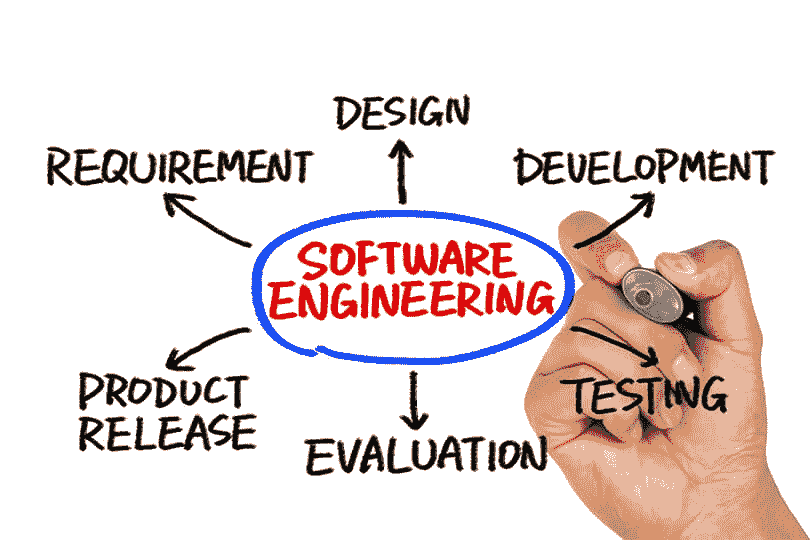
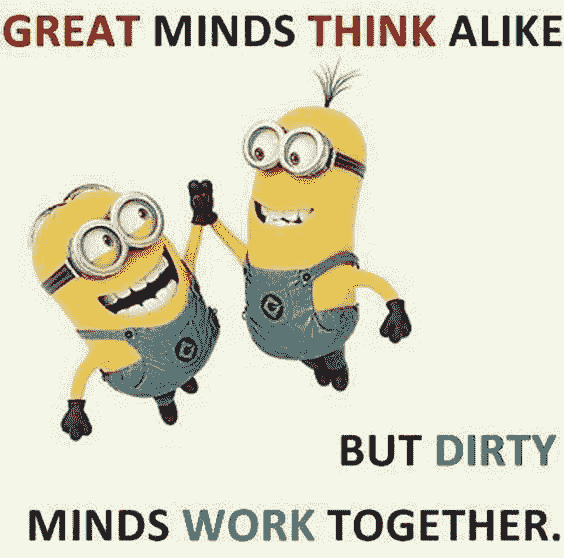
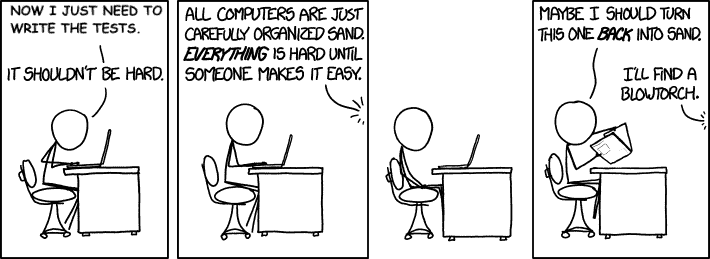

# 认识海森堡团队，一个伟大团队的内部形象

> 原文：<https://dev.to/jhotterbeekx/meet-team-heisenberg-an-inside-look-in-a-great-team-2pfj>

我很乐意向你介绍过去三年来我引以为豪的团队。我们一起经历了起起落落。简化我们的流程，不仅增加我们完成的工作量，还提高 it 质量。学习做什么，当然还有不做什么。如果你感兴趣，请坐下，把你自己绑在座位上，和我一起，我将带你经历海森堡团队的旅程。

## 我们是谁？

三年前，我们的产品和工程部门进行了一次重组，将六个人组成了一个团队。我们来自世界的各个角落，如果你认为我们大楼的楼层是一个世界，这基本上是因为在软件部门工作本身就是一个世界。无论如何，当我们组建团队时，我们大多数人已经在为公司工作了，但我们也有一些新人。

该团队由我们的产品负责人 Mike 组成。他们一直在努力开发需要开发的功能，为我们的产品定义清晰的路线图和愿景，最重要的是确保讲笑话的水平尽可能低。我们还有尼尔斯，我们的 scrum 大师。不仅仅是教我们使用 scrum 来敏捷地工作，还带我们踏上了一段指导之旅，以提高我们构建的产品的质量，同时提高团队的质量。最后但同样重要的是，有四名软件工程师。我们所有人都确保事情以正确的方式构建，确保一切按预期运行，并确保我们的产品所有者的情绪在我们放入的过山车中保持紧密捆绑。

正如所有开发人员一样，我们都有自己的怪癖。以约翰为例，他一直试图说服每个人我们必须说荷兰语，或者乔，他是一个比利时人，喜欢烧烤、武器和烂片。这就像你的团队中有你自己的 Chuck Norris 和 Jo Bonten 的交叉组合。我们的第三个开发人员从我们的好朋友 Bert 开始，他非常喜欢告诉我们在每个测试中添加注释，比如 arrange、act 和 assert，或者我们必须删除 C#文件中未使用的 usings，即使在两年前离开公司后，我们仍然把这些东西称为 Bertjes。如今，他的位置已经被我们的巴西朋友热拉尔多取代，他有着令人敬畏的逻辑思维，能把任何事情发生的几率简化为 50/50，有他在身边总是很棒的。最后是我自己，我不会在这里表扬我自己，但是如果你停下来，我的队友可能会告诉你很多关于我的奇怪的事情。这群不合群的人就是我们，海森堡队。

但是为什么海森堡你可能会奇怪。组建一个新团队应该总是从你做过的最好的事情开始...想出一个名字。我记得我们写下了一长串名字。电视节目，童年卡通，很多名字里都有`code`这个词。慢慢地把他们减少到几个人，最终投票给海森堡。当然想到了有点名气的德国物理学家[维尔纳·卡尔·海森堡](https://en.wikipedia.org/wiki/Werner_Heisenberg)...不完全是，我们都很喜欢这部电视剧。我是说，进来的时候说“我是敲门的人”有多棒？除了它的名字几乎和令人恐惧的[海森堡](https://en.wikipedia.org/wiki/Heisenbug)一样之外，我们没有比这更棒的了，对吗？

## 满栈加更

虽然我听到软件工程师在他们的团队中定义角色的不同方式，但我们已经找到了自己的方式。从一开始，我们的协议就是，我们团队中的每个工程师都应该能够做我们需要的一切来构建和维护我们的产品。你可能不擅长，但你应该了解基本知识，并能够使用它。虽然这些知识的基础是我们的完整堆栈，也就是我们的 React 前端和 C#后端，但我们不止于此。我们都编写自己的测试，监控我们正在运行的产品，维护我们在云中的基础设施，维护我们的 CI/CD 管道，做我们的基本设计，管理我们的数据库，运行我们的数据仓库，任何属于构建我们产品的事情。去年，在我们的 scrum master 离开团队后，我们也开始每周在团队成员之间轮换 scrum master 的角色。虽然这需要做大量的工作来跟上每件事情，但是这种工作方式给我们带来了巨大的优势，可以将故事集中在一起，减少彼此之间的依赖。在这一点上，任何三个开发人员都可以去度假，第四个开发人员能够处理他需要的一切。

## 我们如何工作？

从团队成立开始，我们就一直在做敏捷 scrum。这意味着我们做所有常规的 scrum 工作，比如站立、冲刺回顾、冲刺计划和回顾。我们处理故事、积压工作和冲刺。但是当我们深入研究如何处理这些故事时，事情变得更有趣了。

当开始一个故事时，我们做的第一件事是“设计讨论”。这是所有工程师聚在一起讨论我们到底要如何建造它的地方。这通常以几个非常详细的任务结束，这有助于我们将故事集中起来。在设计讨论中，我们还会考虑可能需要添加哪些端到端、监控和数据验证测试，所有其他测试都是常规任务的一部分。接下来，我们制定一个我们称之为“测试计划”的东西。我们中的一个人用我们想要为故事手动测试的所有东西制作思维导图，以确保它能工作。虽然自动化测试已经覆盖了大部分内容，但是我们还是继续做这一步，因为即使自动化测试很棒，也没有什么比手动测试更好的了。您可以将其与探索性测试进行比较，但需要一些指导。然后，第二个人会查看该计划，如果可能的话，他会在查看计划时添加更多步骤。

这就把我们带到了总是被处理两次的任务。一个人拿起它，在上面签上他的首字母，一旦完成，包括为它写所有的测试，检查它。然后另一个人选择同样的任务，并回顾其他人所做的一切。所以没有一个任务是完成的，除非有两个人看着它。

### 建筑评论

一旦所有的任务都完成了，包括所有的测试，我们还剩下一个任务。我们称之为“建筑评论”。我们和团队中的所有开发人员坐在一起，检查我们在代码中接触到的所有东西。现在，我们特别注意命名实体的方式、放置实体的位置以及实体之间的依赖关系。我们讨论代码和结构的发展方向。通常这意味着我们会改变一些事情，以我们想要的方式前进。这使我们的代码架构保持良好的状态，并给我们一个定期思考它的点。

现在，我们将代码推送到测试环境中，让自动化测试运行并获取我们的测试计划。在这一点上，两个不同的人使用测试计划，并在测试环境中手工执行和验证我们的测试计划中的所有步骤。尽力找到至少一个问题，因为一位智者曾经告诉我们，如果你测试得足够好，你应该总能找到至少一个错误。你会发现一个，我们倾向于发现相当多的问题，否则我们会忽略使用这种方法。一旦我们开发人员同意故事完成，我们就向我们的产品负责人演示，如果他签字同意，我们就把一切推向生产，并放弃我们的功能分支。

## 我们学到的东西

当你们作为一个团队一起工作时，你会不断调整你的工作方式来提高团队的质量和绩效。我们已经尝试了很多，有些事情很好，有些则不然。我想看看其中的一些。

### 蝙蝠侠和罗宾

除了我们的职能，我们在团队中还有几个角色。你可以成为那个星期的 scrum master，你可以被指定在下一次 sprint 回顾中做演示，最后你可以是蝙蝠侠或者罗宾...排队蝙蝠-音乐！

这些角色在我们的团队中相对较新，但工作得非常好。你可能会问，他们是怎么回事。如果你是蝙蝠侠，黑暗骑士，披着斗篷的十字军战士，那么你的任务不仅是保护哥谭市，也是保护团队的流动。你要做的就是注意在我们前进的道路上是否有任何 bug 或其他事件。你不会孤军奋战，如果你需要帮助，你可以永远依靠你可信赖的伙伴罗宾。听起来很棒，不是吗？是的，而且真的有效！

如果你在团队中工作，你可能知道总会有干扰。这可能是报告的 bug，需要处理的导入信息请求，基本上是 sprint 中没有计划但不能等到下一次的任何事情。我们的蝙蝠侠接受这个任务，如果他需要帮助，他会问罗宾。这确保了其他两个开发人员能够保持在他们的流程中。一旦任务搞定，蝙蝠侠就退休了，我们的罗宾就成了蝙蝠侠。然后他会挑选一只新的知更鸟，它们会一直守护到下一期到来。这种方式在整个团队之间分配，团队的大多数人不会被打断，你可以偶尔成为一个很酷的超级英雄。

### 零 bug 策略

就像每个团队一样，当遇到 bug 时，我们也经历过一些挣扎。你总是优先考虑他们的新功能吗？您如何确保快速找到并修复它们？你能做些什么来减少虫子的机会？

对于大多数问题，我们遵循最佳实践。我们关注质量，建立了很多自动化测试，做手工测试，有监控等等。但是 bug 可以、会、也应该发生。如果你没有任何错误，你可能花了太多时间来提高代码质量。有趣的观点对吗？也许有一天我会写点什么。无论如何，我们要做的事情之一就是维护我们自己版本的零 bug 政策。

大多数零策略的定义都非常直接，如果有一个已知的 bug，在开发新特性之前先修复它。虽然这听起来很棒，但在现实生活中，这在实用主义方面有所欠缺。这就是我们如何想出我们版本的零 bug 策略的。任何发现或报告的缺陷都将被调查、评估和讨论。影响够大吗？这将成为我们当前冲刺阶段的重中之重。如果影响不是很大，它将会被搁置，并在下一个 sprint 中成为最高优先级。这意味着所有的 bug 通常在 sprint 的时间跨度内被解决，对我们来说是两周。我们发现这种解决方案在提供我们想要达到的质量和新特性工作中的干扰量之间给了我们最好的平衡。

### 齐心协力

这听起来很简单，没有必要提及，但事实并非如此。我无法表达一起工作有多重要。在我们团队的每一件事上，你都能感觉到我们对此的重视。我们做我们的单口相声，我们的故事，有像“设计讨论”和“建筑评论”这样的任务，我们都坐在一起。正如我之前提到的，每项任务都是由至少两个彼此独立的人完成的，所以很多信息也是通过这种方式共享的。

除此之外，在我们的办公室里总是有很多谈论。并不是所有的事情都与工作相关，但是它保持了线路的畅通，这是非常重要的。因为现在当有人遇到困难、有疑问或其他需要帮助的事情时，在我们的房间里大声问出来就相对容易了。我无法表达在你的团队中营造这种氛围有多重要。当你走进房间时，你应该感觉是一个团队，而不是一个人在团队中工作。当出现问题时，作为一个团队，你应该感到有责任。当你完成冲刺时，你应该庆祝，作为一个团队。一起吃午餐，一起做有趣的事情，创造一个人们不害怕谈论他们正在努力解决的事情的地方，无论是工作还是个人相关的事情。那时你就知道你已经建立了一个好的团队。这就是我们在海森堡团队中所建立的。

### 团队学习事件

我们不仅一起工作，还一起学习。每两周我们会安排一个半小时的时间，在那里我们会预定一个会议室，看一个我们感兴趣的主题的视频。看完视频后，我们将进行讨论，看看我们的工作方式中是否有新的步骤。这样你可以不断学习新东西，不断挑战自己，不断发现新的有趣的概念。我们开始看鲍勃叔叔的视频，但现在我们写下我们遇到的任何有趣的视频，并选择一个。

### 围攻开球

大多数开发团队时不时会结对，我们也一样。但我们也使用一个概念，我喜欢称之为暴民开球。当我们开始新的东西时，通常是一个大的新概念，我们还不确定如何实现它。我们将预订一个会议室一两天，并开始围攻。围攻和结对基本一样，只是人多而已。我们有一个键盘和鼠标，10 分钟后交给下一个人。所有这些都是在与电视相连的机器上进行的，因此每个人都参与其中。由于这涉及到团队中的所有开发人员，您可以立即共享知识，每个人都必须了解正在发生什么，您将获得适合团队的解决方案。这真的是一个伟大的方式来启动一个新的史诗，你还不知道如何实现。

### 你不是你的产品

这些年来我学到的另一件事。我参加过很多团队，看到他们来来去去，通常一个团队只负责一个产品。一旦产品完成了，或者需要其他产品的帮助，你就离开了。慢慢地，我看到产品和团队之间的联系越来越少。这让我意识到，在一个产品上与几个人一起工作和在一个团队中工作有着非常重要的区别。一个好的团队有他们在一起工作的力量，而不是在某个项目上工作。可以有单个项目吗？是啊，当然。但它不应该定义你的团队。不要害怕做其他项目，而是作为一个团队来做。这是你处于最佳状态的地方。

### 测试很难

比其他课程更专业一点，但是就像题目说的测试很难。不仅仅是编写测试可能是一个挑战，还要考虑测试什么，不要测试太多，使用或不使用 TDD，命名你的测试，保持端到端测试稳定，保持测试最新。这个怎么样...不要让测试妨碍简单的重构，而要让测试允许简单的重构...哦，是的，我刚刚说过了...

我很想说我们已经找到了完美的解决方案，但我不认为有。至少不是一个完美的技术方案。你需要的重要工具是经验、沟通和务实。体验；继续努力。你会做太多的测试，太少，命名错误。但是继续努力，你练习得越多，你就会做得越好。交流；继续和你的团队讨论这个问题。互相挑战，实验，但要一起做。实用主义；不要做过头了。不要花 3 天时间为一个在崩溃时没有任何影响的特性编写测试。保持务实。

## 谢谢

我想以对团队的感谢来结束这篇文章。谢谢你让我成为这个团队的一员，谢谢你帮助我成长，谢谢你让我经历了这个奇妙的旅程。

这篇文章也发表在了我自己的博客上。