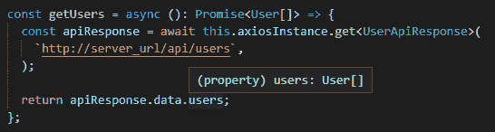
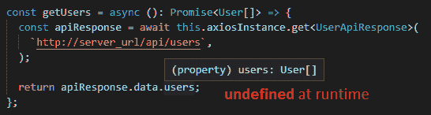
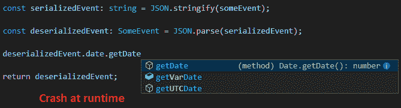
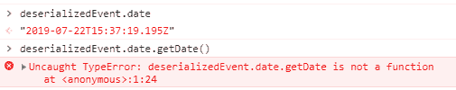
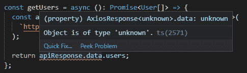
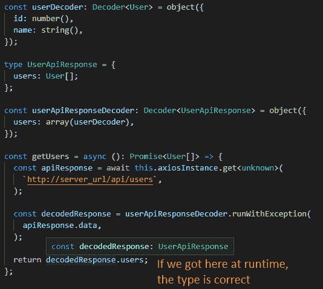

# 当打字稿说谎时...以及如何让它变得诚实

> 原文：<https://dev.to/yakimych/when-typescript-lies-and-how-to-make-it-honest-305b>

大约一年前，我们部门从普通 JavaScript 转向 TypeScript，这被证明是我们所做的最成功的技术决策之一。令人惊讶的是，使用我们的前端代码时的生产力提升超出了任何预期。然而，在本文中，我将重点关注 TypeScript 没有解决的一些问题(尽管有人可能认为它会解决)，以及我们为了减轻这些问题所做的工作。

## 当类型脚本说谎时— API 响应

当依赖类型系统时，最明显的挑战是确保它提供的保证不被破坏，无论何时一些数据来自外部源，比如通过 API 调用来自远程服务器。

```
const getUsers = (): Promise<User[]> => {
  const result = axios.get<UserApiResponse>("http://server_url/users");
  return result.data.users;
}; 
```

我们很乐意通过一个泛型类型参数“强类型化”函数`getUsers`和`axios.get`，但是如果从服务器返回的内容没有一个名为`users`的字段，会发生什么呢？我们的 IDE 会告诉我们访问`users`是安全的，并且它会随时帮助我们使用智能感知:

[](https://res.cloudinary.com/practicaldev/image/fetch/s--jRp4eIVT--/c_limit%2Cf_auto%2Cfl_progressive%2Cq_auto%2Cw_880/https://thepracticaldev.s3.amazonaws.com/i/ihlhoo63apnpux40um8f.png)

编译器和类型检查器将更乐意确认类型是正确的，并且在调用函数的任何地方使用返回的承诺都是安全的。此外，依赖于初始类型的整个函数调用链在 UI 上看起来都很好，在 UI 上，我们热情地映射`users`数组(**咳嗽** 未定义的**咳嗽** )并获得运行时崩溃——就像我们对优秀的旧 JavaScript 所做的那样。

[](https://res.cloudinary.com/practicaldev/image/fetch/s--2jsMrpgy--/c_limit%2Cf_auto%2Cfl_progressive%2Cq_auto%2Cw_880/https://thepracticaldev.s3.amazonaws.com/i/ecttt7yn3r64prrneybk.png)

更令人不安的是，根据`users`通过代码库的旅程，一旦我们遇到运行时崩溃，追踪错误的来源可能(也可能不会)相当棘手。例如，在数组的情况下，变量可以在函数调用之间自由传递——不仅仅是忽略，而是隐藏了错误类型的问题，直到我们最终决定映射它。虽然这是(**共** ...？)对于 JavaScript 来说，这很正常，我们已经习惯了这种东西，只是耐心地等待它在运行时崩溃，对于 TypeScript 来说，这甚至更令人讨厌，因为人们期望类型系统能够帮助处理这类问题。

## 当 TypeScript 说谎时— JSON.parse()

乍一看，由于我们对前端的内容有完全的控制权，所以这不应该像从外部来源接收数据那样是个大问题。然而，有一些令人不快的陷阱，人们可能会很不幸地遇到，比如下面的例子。假设我们有一个带有`Date`字段的类型:

```
type SomeEvent = {
  description: string;
  date: Date;
}; 
```

我们希望将结果解析成另一个类型为`SomeEvent` :
的对象

```
const someEvent: SomeEvent = {
  description: "Birthday",
  date: new Date()
};

const serializedEvent: string = JSON.stringify(someEvent);

const deserializedEvent: SomeEvent = JSON.parse(serializedEvent); 
```

这似乎是一个合理的操作，TypeScript 不会一路和我们作对。但是，因为日期被字符串化为...良好的...一个字符串，解析后的类型实际上是`{ description: string; date: string; }`。此外，如果我们试图在这个“日期”调用`getDate()`:`Uncaught TypeError: deserializedEvent.date.getDate is not a function`，这将在运行时痛苦地崩溃。

[](https://res.cloudinary.com/practicaldev/image/fetch/s--jaCpiZ1I--/c_limit%2Cf_auto%2Cfl_progressive%2Cq_auto%2Cw_880/https://thepracticaldev.s3.amazonaws.com/i/m21cdrn2rv2znkss415z.png)

[](https://res.cloudinary.com/practicaldev/image/fetch/s--Jpa2v3Es--/c_limit%2Cf_auto%2Cfl_progressive%2Cq_auto%2Cw_880/https://thepracticaldev.s3.amazonaws.com/i/u9cfnrojm6eh1i49domf.png)

这实际上不是 TypeScript 本身的问题，也不是 JavaScript 的问题，而是日期在 JSON 中表示方式的结果。然而，这是一个例子，说明 TypeScript 给了我们错误的信心，让我们不知道在代码的某个地方我们能做什么，不能做什么。

## 如何做到诚实

有几种方法可以缓解这些问题——有些需要更多的魔法，有些需要更多的代码。

### 不太神奇的方法

最直接的方法是编写代码，在从 API 调用函数返回 API 响应之前验证它们。手动验证一切是相当繁琐的，但是有一些用于 TypeScript 的 JSON 解码库，比如 [json-type-validation](https://github.com/mojotech/json-type-validation) 和 [io-ts](https://github.com/gcanti/io-ts) 。这些反过来又受到了 Elm 和 [bs-json 中](https://github.com/glennsl/bs-json) [JSON 解码器的启发。](https://guide.elm-lang.org/effects/json.html)

这确实需要为所有类型编写解码器来反映应用程序中的 API 响应，并增加了相当多的额外代码:

```
type User = {
  id: number;
  name: string;
};

const userDecoder = object({
  id: number(),
  name: string()
}); 
```

现有的解码器可以组合在一起，以便解码复合对象:

```
type UsersApiResponse = {
  users: Array<User>;
};

const userApiResponseDecoder = object({
  users: array(userDecoder)
}); 
```

当从 API 获取数据时，我们可以通过格外诚实地将 axios 响应的返回类型标记为`unknown`来控制自己。毕竟，我们并不真正知道在“编译时”服务器将返回什么，不是吗？😄

现在，TypeScript 甚至不允许我们自由地四处传递`apiResponse.users`并假装我们确信它是一组用户。我们必须首先解码`apiResponse`:

```
const getUsers = (apiBaseUrl: string) => {
  const apiResponse = axios.get<unknown>(apiBaseUrl);

  return apiResponse.data.users; // Error: Object is of type 'unknown'
}; 
```

[](https://res.cloudinary.com/practicaldev/image/fetch/s--sxWxR5_4--/c_limit%2Cf_auto%2Cfl_progressive%2Cq_auto%2Cw_880/https://thepracticaldev.s3.amazonaws.com/i/4m2f89i5r5g53ejmq8b7.png)T3】

```
const getUsers = (apiBaseUrl: string) => {
  const apiResponse = axios.getUsers<unknown>(apiBaseUrl);
  const decodedResponse = usersApiResponseDecoder.runWithException(
    apiResponse.data
  );

  return decodedResponse.users; // Now we can safely access the user array
}; 
```

[](https://res.cloudinary.com/practicaldev/image/fetch/s--tE1lzi2N--/c_limit%2Cf_auto%2Cfl_progressive%2Cq_auto%2Cw_880/https://thepracticaldev.s3.amazonaws.com/i/56bhdb7ppsq1o9cpaqz0.png)

在这种情况下，我们仍然会在运行时崩溃，但是我们会很早就失败，并且会出现一个明确的错误消息:`DecoderError: the key 'users' is required but was not present`，这意味着我们不仅会得到如何修复错误的明显线索，而且 TypeScript 在代码库中的任何位置都不会再出现错误！😄

### 采用“神奇”的方法

基于解码器的方法需要手工编写 API 调用代码和解码器本身。在一个完美的世界中，我们希望避免这种情况，取而代之的是从 API 模式/定义中自动生成一切。swagger-codegen 就是这样一个解决方案——给定一个 swagger 规范文件，它可以用多种语言生成 API 调用代码，包括 TypeScript。如果我们将代码生成作为 CI 管道的一部分，我们甚至不需要解码器，因为 API 调用代码将总是匹配 API 本身！

对于用 TypeScript 编写的 node.js APIs，甚至可以通过 [tsoa](https://github.com/lukeautry/tsoa) 生成运行时验证的 swagger 规范和代码(更多细节参见[本评论](https://dev.to/cubiclebuddha/comment/dke7))。

虽然“神奇的”解决方案有时可能难以理解或调试，但这种方法比手工编写验证或解码代码有一些明显的好处。例如，我们不需要编写和维护大量额外的代码来验证 API 响应。事实上，对 API 的突破性更改将(间接地)被 TypeScript 编译器捕获，这意味着我们在确保我们没有发布一个失败的产品方面获得了很多(自动化的)帮助。

### “疯狂但有趣”的方法

哦，对于更冒险的类型——也可以在 ReasonML 中实现一个 [API 调用层，通过](https://github.com/Yakimych/articles/blob/master/react-typescript/README.md) [genType](https://github.com/cristianoc/genType) 生成类型脚本类型，并通过 [BuckleScript](https://bucklescript.github.io/) 将所有东西与代码库的其余部分捆绑在一起。似乎有些过头了，但为什么不学习一项新技术，同时享受一些乐趣呢？😄