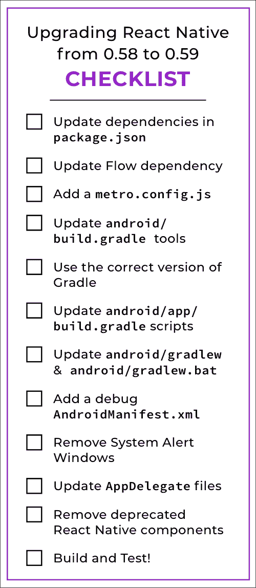

# 如何从 React Native 0.57 升级到 0.59 |第 2 部分:升级到 0.59

> 原文：<https://dev.to/julietter/how-to-upgrade-from-react-native-0-57-to-0-59-part-2-upgrading-to-0-59-2921>

[](https://res.cloudinary.com/practicaldev/image/fetch/s--7g2QxAOo--/c_limit%2Cf_auto%2Cfl_progressive%2Cq_auto%2Cw_880/https://cdn-images-1.medium.com/proxy/1%2Atg4oPcJpJ7dOTE9x0WstQg.jpeg)

#### 欢迎来到第二部分！

如果你在这里，我会假设:

*   你知道你需要更新 React 原生 0.59
*   你已经上了 React 原生 0.58

没有吗？不正确？那么请看看本教程的第一部分:[第一部分:升级到 0.58](https://dev.to/julietter/how-to-upgrade-from-react-native-0-57-to-0-59-part-1-upgrading-to-0-58-492i)

其他人，请一起阅读，看看如何升级和准备好您的 React 原生 Android 应用程序 64 位！

#### 第二部分:升级反应原生 0.59 ⬆️

#### 🔑主要变化

*   完整的 64 位 Android 支持！(再也没有 Play Store 的警告了！)
*   [React 挂钩](https://reactjs.org/docs/hooks-intro.html)支持！
*   我们第一次反对是因为[精益核心计划](https://github.com/react-native-community/discussions-and-proposals/issues/6)

#### 第一步:更新你的`package.json` ⬆️

打开您的`package.json`并更新以下依赖项:

```
//  package.json  "dependencies":  {  "react":  "16.8.3",  "react-native":  "0.59.10",  },  "devDependencies":  {  "@babel/core":  "^7.4.5",  "@babel/runtime":  "^7.4.5",  "babel-jest":  "^24.8.0",  "jest":  "^24.8.0",  "metro-react-native-babel-preset":  "^0.54.1",  "react-test-renderer":  "16.8.3"  } 
```

然后，删除您的`node_modules`并用`npm i`重新安装一个新批次。

#### 第二步:更新流量⬆️

再说一次，简单的。打开`.flowconfig`，更新流程依赖:

```
// .flowconfig

// Delete this line:
node_modules/react-native/flow-github/

// Update this version number, if you have not already:
[version]
^0.92.0 
```

如果你使用 Flow 并在这次更新后遇到错误，去他们的 [changelog](https://github.com/facebook/flow/blob/master/Changelog.md) 诊断任何问题。

#### 第三步:添加一个新的`metro.config.js`文件🆕

在根目录下创建一个名为`metro.config.js`的新文件，并添加以下内容:

```
// metro.config.js

module.exports = {
  transformer: {
    getTransformOptions: async () => ({
      transform: {
        experimentalImportSupport: false,
        inlineRequires: false,
      },
    }),
  },
} 
```

现在一切都设置为`false`,但是您现在有能力使用一些新的捆绑选项。酷！😎

#### 第四步:更新`android/build.gradle` ⬆️

**1。**更新`android/build.gradle`以支持一些新的库/SDK。不要删除任何东西，只更新以下版本号:

```
// android/build.gradle

buildscript {
     ext {
          buildToolsVersion = "28.0.3"
          targetSdkVersion = 28
     }

     dependencies {
          classpath("com.android.tools.build:gradle:3.4.0")
     }
} 
```

**2。**现在，删除以下内容。您将不再需要在这里指定您需要使用的 Gradle 版本:

```
// android/build.gradle

// Delete this section:
task wrapper(type: Wrapper) {
     gradleVersion = '4.7'
     distributionUrl = distributionUrl.replace("bin", "all")
} 
```

#### 第五步:更新格拉德⬆️

虽然我们不再指定版本，但我们仍然需要将 Gradle 更新到 5.4.1。

打开`android/gradle/wrapper/gradle-wrapper.properties`，改变`distributionUrl` :

```
distributionUrl=https\://services.gradle.org/distributions/gradle-5.4.1-all.zip 
```

#### 第六步:更新`android/app/build.gradle` ⬆️

**1。**在`android/app/build.gradle`中，删除以下一行:

```
// android/build.gradle

android {
     // Delete the next line
     buildToolsVersion rootProject.ext.buildToolsVersion
} 
```

**2。**现在，在`android`对象中添加下面的`compileOptions`部分:

```
// android/app/build.gradle

android {

    compileOptions {
        sourceCompatibility JavaVersion.VERSION_1_8
        targetCompatibility JavaVersion.VERSION_1_8
    }

} 
```

**3。**接下来，将最终需要的 64 位构建系统`"x86_64"`添加到下面的列表中:

```
android {
  splits {
    abi {
      include "armeabi-v7a", "x86", "arm64-v8a", "x86_64"
    }
  }
  buildTypes {
    variant.outputs.each { output ->
      def versionCodes = ["armeabi-v7a":1, "x86":2, "arm64-v8a": 3, "x86_64": 4]
  }
} 
```

**4。**最后，由于我们只是升级到 React Native `0.59.10`(还有更新的版本)，我们必须指定 Android 应该使用的 React Native 依赖:

```
dependencies {
     // implementation "com.facebook.react:reactnative:+"
     implementation "com.facebook.react:react-native:0.59.10"
} 
```

#### 第七步:更新⬆️的`android/gradlew`和`android/gradlew.bat`

更新到 64 位版本的最后一步。将以下选项添加到您的`android/gradlew` :

```
# android/gradlew

DEFAULT_JVM_OPTS='"-Xmx64m" "-Xms64m"' 
```

…敬你的`android/gradlew.bat` :

```
# android/gradlew.bat

set DEFAULT_JVM_OPTS="-Xmx64m" "-Xms64m" 
```

#### 第八步:添加新的`android/app/src/debug/AndroidManifest.xml`🆕

创建一个名为`android/app/src/debug/AndroidManifest.xml`的新文件，并添加以下内容:

```
<?xml version="1.0" encoding="utf-8"?>
<manifest xmlns:android="http://schemas.android.com/apk/res/android"
    xmlns:tools="http://schemas.android.com/tools">
    <uses-permission android:name="android.permission.SYSTEM_ALERT_WINDOW"/>
    <application android:usesCleartextTraffic="true" tools:targetApi="28" tools:ignore="GoogleAppIndexingWarning" />
</manifest> 
```

我们现在有一个单独的 Android 调试版本清单。

#### 第九步:删除系统提醒窗口🚨

权限是让我们在 Android 中看到我们最喜欢的红框错误。由于我们已经将他们的权限移动到上面的新调试清单文件中，所以从发布清单文件中删除它，这样我们就不会在生产中看到它。

在`android/app/src/main/AndroidManifest.xml` :

```
<!-- android/app/src/main/AndroidManifest.xml -->

<manifest...
  <!-- Delete the following: -->
  <uses-permission android:name="android.permission.SYSTEM_ALERT_WINDOW"/> 
```

#### 第十步:更新 iOS 文件🍎

需要对您的`AppDelegate`文件进行一些更改，以防止出现一些错误:

**1。**打开`ios/APP_NAME/AppDelegate.h`，添加以下导入:

```
// ios/APP_NAME/AppDelegate.h

#import <React/RCTBridgeDelegate.h> 
```

**2。**接下来，将那个`RCTBridgeDelegate`导入添加到`AppDelegate`类:

```
// ios/APP_NAME/AppDelegate.h

@interface AppDelegate : UIResponder <UIApplicationDelegate, RCTBridgeDelegate> 
```

**3。**打开`ios/APP_NAME/AppDelegate.m`并移除以下所有:

```
// ios/APP_NAME/AppDelegate.m 

// DELETE:
 NSURL *jsCodeLocation;

// DELETE:
jsCodeLocation = [[RCTBundleURLProvider sharedSettings] jsBundleURLForBundleRoot:@"index" fallbackResource:nil];
  RCTRootView *rootView = [[RCTRootView alloc] initWithBundleURL:jsCodeLocation
                                                      moduleName:@"RnDiffApp"
                                               initialProperties:nil
                                                   launchOptions:launchOptions];
  rootView.backgroundColor = [UIColor blackColor]; 
```

**4。**仍在`ios/APP_NAME/AppDelegate.m`，添加以下导入:

```
// ios/APP_NAME/AppDelegate.m 

#import <React/RCTBridge.h> 
```

**5。**在`- (BOOL)application:(UIApplication *) ... didFinishLaunchingWithOptions.. {`实现中，添加以下内容。注意，将`YOUR_APP_NAME_HERE`替换为您的应用程序的名称(根据 XCode 的名称)。

```
// ios/APP_NAME/AppDelegate.m 

- (BOOL)application:(UIApplication *) ... 
{
  // Add the following:
  RCTBridge *bridge = [[RCTBridge alloc] initWithDelegate:self launchOptions:launchOptions];

    RCTRootView *rootView = [[RCTRootView alloc] initWithBridge:bridge 
      moduleName:@"YOUR_APP_NAME_HERE"
      initialProperties:nil];

  rootView.backgroundColor = [[UIColor alloc] initWithRed:1.0f green:1.0f blue:1.0f alpha:1]; 
```

**6。**在文件末尾的`@end`之前，添加以下内容:

```
// ios/APP_NAME/AppDelegate.m 

- (NSURL *)sourceURLForBridge:(RCTBridge *)bridge
{
#if DEBUG
  return [[RCTBundleURLProvider sharedSettings] jsBundleURLForBundleRoot:@"index" fallbackResource:nil];
#else
  return [[NSBundle mainBundle] URLForResource:@"main" withExtension:@"jsbundle"];
#endif
}

@end 
```

#### 第十一步:修剪肥肉！✂️

作为[精益核心计划](https://github.com/react-native-community/discussions-and-proposals/issues/6)的一部分，React Native 开始移除 React Native 曾经附带的组件。在此迭代中，以下组件受到影响:

[T2`<AsyncStorage>`](https://github.com/react-native-community/react-native-async-storage)

[T2`<ImageStore>`](https://github.com/itinance/react-native-fs)

[T2`<MaskedViewIOS>`](https://github.com/react-native-community/react-native-masked-view)

[T2`<NetInfo>`](https://github.com/react-native-community/react-native-netinfo)

[T2`<Slider>`](https://github.com/react-native-community/react-native-slider)

[T2`<ViewPagerAndroid>`](https://github.com/react-native-community/react-native-viewpager)

如果您使用这些组件中的任何一个，您将会看到一些不推荐使用的警告。⚠️好玩！！

不过不要担心！这些组件已经迁移到不同的 repos，现在由 React 本地社区维护。我已经将每个社区与上面相应的组件联系起来。

要消除警告，您需要检查您的应用程序，并用正确的导入替换这些组件的任何实例。

例如..

**替代进口:一个例子:**

**1。**用`npm i @react-native-community/viewpager`安装新库

**2。**链接库:`react-native link @react-native-community/viewpager`

**3。**在你的应用里找一个`ViewPagerAndroid`的实例。

**4。**删除 React 本地导入:

```
// Old Code
import { View, ViewPagerAndroid } from "react-native"

// New Code
import { View } from "react-native" 
```

**5。**添加新的导入:

```
import ViewPager from "@react-native-community/viewpager" 
```

**6。**阅读新文档，查看是否需要进行任何更改。在这种情况下，`ViewPagerAndroid`需要替换为`ViewPager` :

```
// Old Code
render() {
     return (
          <ViewPagerAndroid>
          ...
          </ViewPagerAndroid>
     )
}

// New Code
render() {
     return (
          <ViewPager>
          ...
         </ViewPager>
     )
} 
```

7 .**。**重复，直到你不再反对！

**关于你的一个说明** **`node_modules`** ℹ️

不推荐使用的组件也可以存在于您的包中！如果您看到一个弃用，首先检查处理该弃用的包更新是否已经存在。如果没有，创建一个拉请求！或者如果你很着急，自己修补软件包😉

**修补软件包**🚑

需要打个包补丁？我最喜欢的方法是用[补丁包](https://github.com/ds300/patch-package)。这是一个库，它区分您对`node_modules package`所做的更改，保存这些更改，并在您每次运行`npm i`时应用这些更改。这里有一个快速教程:

**1。**跑`npm i patch-package`

**2。**将这个安装后脚本添加到您的`package.json` :

```
"scripts":  {  "postinstall":  "patch-package"  } 
```

**3。**进入你的`node_modules`，对你的目标依赖做出任何你需要的改变。

**4。**一旦完成，运行`npx patch-package package-name`。这将为该特定包创建一个补丁文件。您应该将这些文件提交到项目中。

**5。**现在，每当您删除`node_modules`时，您的补丁将在您运行`npm i`后添加。🙌

#### 第十二步:测试，测试，测试🧪

构建您的应用程序。确保在实际的 iOS 和 Android 设备上运行它们。看到任何新的反对警告吗？最好现在就把他们消灭在萌芽状态。请注意，警告也可能来自您的依赖项内部！

#### 大功告成！

为你的项目工作？你。是。**搞定！**🎉 🎉 🎉 🎉

去吧。构建一些 Android APKs。有些将在 64 位中构建。你怎么能确定？

**测试 64 位版本**

**1。**导航到您的 Android 发布目录(存储您的发布 apk 的位置)。

**2。**连接 64 位设备

**3。**根据您设备的架构(ARM 或 X86)，运行以下命令之一:

`adb install --abi arm64-v8a ARM64-APP-NAME-HERE.apk`

或者

`adb install --abi x86_64 X86-APP-NAME-HERE.apk`

**4。**您现在已经强制安装了一个 64 位应用程序。如果它安装和运行正确，那么你是好的！

没有安卓设备？只需将您的 apk 上传到游戏商店。如果你没有通过 64 位测试，谷歌会让你知道🙂

[](https://res.cloudinary.com/practicaldev/image/fetch/s--xelyHLeY--/c_limit%2Cf_auto%2Cfl_progressive%2Cq_auto%2Cw_880/https://cdn-images-1.medium.com/proxy/1%2AfNFOi-aa-bSLwOMpTy3l1g.png)

👋嗨！我是[朱丽叶](http://www.julietterapala.com)。我在 [Eventric](https://www.eventric.com/) 工作，是一名软件开发员。请在推特上关注我，地址是 [@Juliette](https://twitter.com/JulietteR) 。