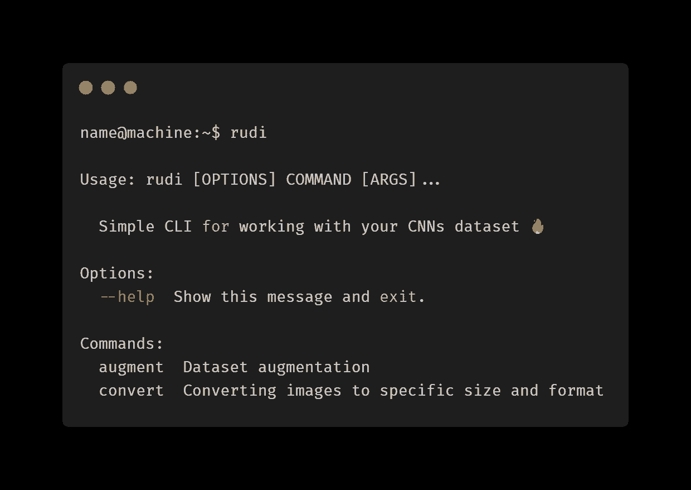

# 小，快速，简单的 Python CLI 图像转换器

> 原文：<https://dev.to/liashchynskyi/small-fast-and-simple-python-cli-image-converter-for-cnns-27co>

大家好)我一直在开发 CLI 工具，它将帮助 CNN 或 GANs 或其他需要图像作为输入数据的设备进行数据集扩充和图像转换。

这就是 https://github.com/liashchynskyi/rudi

用一颗星支持回购，如果你喜欢的话！谢谢，希望这个工具能帮到你😀