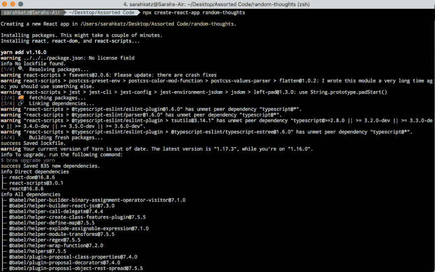
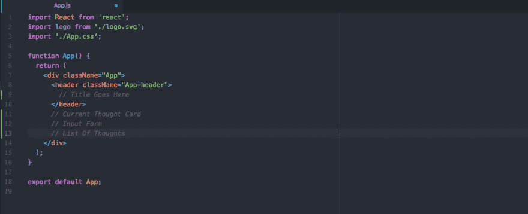
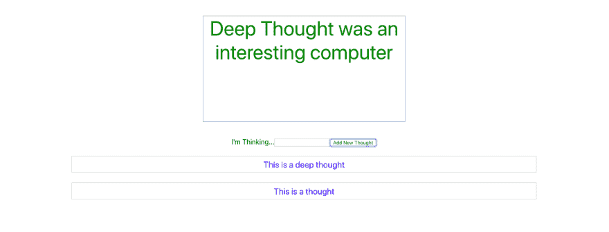

# 在 React 中构建快速简单的东西

> 原文：<https://dev.to/sarahscode/building-something-fast-and-easy-in-react-1312>

我已经有一段时间没有快速做出简单的东西了，我想确保我仍然可以做到，所以我决定看看我是否可以在不到一个小时的时间内建立一个超级简单的应用程序。

首先我需要一个主意。我想不出该做什么，但我在想许多其他随机的事情...所以我有了一个主意。我会创建一个应用程序来显示我所有的随机想法。该应用程序将是一个页面，但有三个“部分”——顶部是一张我最近想法的卡片，一个输入新想法的区域，底部是我以前想法的列表。

现在我有了一个想法，并且知道了我想要的样子，是时候写一些代码了。我没有从头开始创建整个东西，而是使用 [Create React App](https://facebook.github.io/create-react-app/docs/getting-started) 来初始化我的应用程序。通过一个命令(`npx create-react-app random-thoughts`)，我能够在短短几分钟内创建我的应用程序的基本结构。
[T6】](https://res.cloudinary.com/practicaldev/image/fetch/s--zz_r3PQ5--/c_limit%2Cf_auto%2Cfl_progressive%2Cq_auto%2Cw_880/https://thepracticaldev.s3.amazonaws.com/i/v5395rqtt00080t70zng.png)

当 Create React App 发挥它的魔力时，我列出了我需要构建的东西:

*   输入形式
*   带有最近想法的卡片
*   旧想法列表我认为列出所有的想法并不实际，所以我决定只列出最近的 25 个想法。

一旦我的应用程序被创建，我就在文本编辑器中打开代码(我使用 Atom，尽管我通常使用 Sublime Text)并在 App.js 文件中写一些伪代码:
[](https://res.cloudinary.com/practicaldev/image/fetch/s--0lRIW8vx--/c_limit%2Cf_auto%2Cfl_progressive%2Cq_auto%2Cw_880/https://thepracticaldev.s3.amazonaws.com/i/g1661csvjpibagqisafi.png)

一旦知道了自己要写什么，就该开始写代码了。我从输入表单开始，因为为了显示想法，我必须能够输入想法。我决定，因为这是一个“快速和肮脏”的应用程序，而不是将想法存储在数据库中的某个地方，我只是将它们存储在本地状态。我没有专门为此创建一个有状态的组件，而是决定在我的功能组件中使用 React 钩子来创建一个存储我的想法的状态。我决定将输入表单保存在主应用程序文件中，所以我编写了一个快速输入表单和将输入保存到状态所需的逻辑:

```
import React, {useState} from 'react';
import './App.css';

function App() {
  const [thoughts, setThoughts] = useState([])

  function addThought(e) {
    e.preventDefault();

    const newThought = e.target.thought.value
    e.target.thought.value = ''
    const allThoughts = [newThought, ...thoughts]
    setThoughts(allThoughts)
  }

  return (
    <div className="App">
      <form onSubmit={addThought}>
        <label htmlFor="thought">I'm Thinking...</label>
        <input type="text" name="thought" id="thought" />
        <button>Add New Thought</button>
      </form>
    </div>
  );
}

export default App; 
```

下一步是显示我刚刚输入的想法。为此，我创建了一个单独的组件，我称之为`ThoughtCard`，我把它放在一个`components`文件夹中:

```
import React from 'react';

const ThoughtCard = ({thought}) => (
  <div style={styles}>
    {thought}
  </div>
)

const styles = {
  color: 'green',
  height: '33vh',
  width: '33vw',
  margin: '5vh auto',
  fontSize: '3rem',
  textAlign: 'center',
  border: '1px solid darkgrey',

}

export default ThoughtCard 
```

正如你在上面看到的，我也给`ThoughtCard`添加了一些样式，让它与页面的其他部分区分开来。我决定将样式添加到组件文件中，因为我想快速完成，也因为我不想担心范围问题。

我还为我的组件文件夹创建了一个`index.js`文件，这样我就可以一起导出我的所有组件。

下一步是展示旧思想。为此，我创建了一个`MiniCard`组件来显示每个想法，然后映射到想法列表(从想法数组中的第二个项目开始，因为第一个项目已经显示为最近的想法)并将每个想法显示为一张卡片:

```
import React, {useState} from 'react';
import {ThoughtCard, MiniCard} from './components/index'
import './App.css';

function App() {
  ...
  return (
    <div className="App">
      ...
      {
        thoughts.slice(1).map(thought => <MiniCard thought={thought} />)
      }
    </div>
  );
}

export default App; 
```

```
import React from 'react';

const MiniCard = ({thought}) => (
  <div style={styles}>
    {thought}
  </div>
)

const styles = {
  color: 'blue',
  width: '75vw',
  margin: '3vh auto',
  padding: '1vh',
  fontSize: '1.25rem',
  border: '1px solid lightgrey',

}

export default MiniCard 
```

如您所见，`MiniCard`组件与`ThoughtCard`组件除了样式之外是相同的。我原本计划将旧的想法作为一个列表，而不是卡片，这就是为什么我将它们分离出来，但我对这个项目的下一步是摆脱`MiniCard`组件，改变`ThoughtCard`以接受样式作为道具，并在两个地方使用相同的组件，但传递不同的样式。

这是我的应用程序。下面是它运行时的样子:
[](https://res.cloudinary.com/practicaldev/image/fetch/s--T6q5e8py--/c_limit%2Cf_auto%2Cfl_progressive%2Cq_auto%2Cw_880/https://thepracticaldev.s3.amazonaws.com/i/shixdukinqw574sbdr2q.png)

所有这些都是在大约 49 分钟内完成的。

这个应用程序还有更多工作要做。第一步是将`ThoughtCard`和`MiniCard`组件合并成一个组件，因为现在那里有很多重复的代码。我还想在造型上下功夫，让它看起来更有吸引力。

这个应用程序也有一些缺点，特别是将想法存储在状态中意味着它们不会在会话之间持续。所以没办法知道你昨天在想什么。

但这并不意味着是一个完美的应用程序...这只是我用了不到一个小时拼凑出来的东西。只是为了向自己证明我可以。