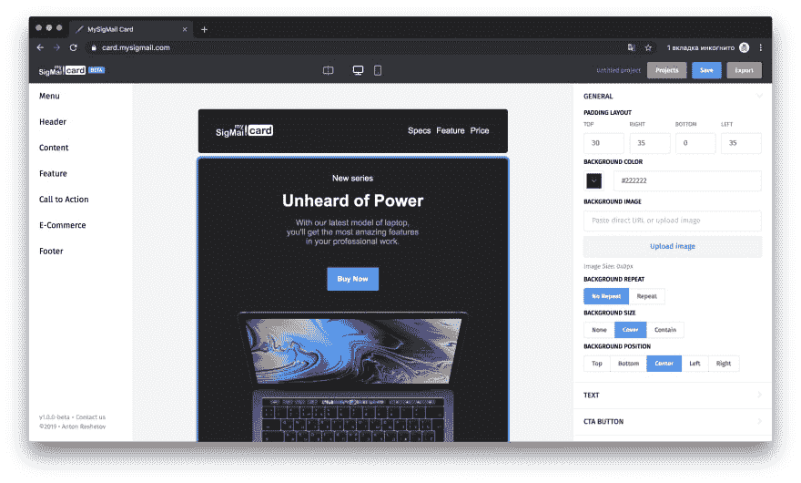

# 我的邮箱卡坏了🚀🎉一个免费的拖放式电子邮件模板生成器

> 原文：<https://dev.to/antonreshetov/mysigmail-card-is-out-53g6>

嗨伙计们！👋 [MySigMail](https://github.com/antonreshetov/mysigmail) 开发者在此。我很高兴推出我的电子邮件卡-【https://mysigmail.com/card】T2。

MySigMail Card 是一个免费的拖放生成器，可以帮助您直观快速地创建电子邮件模板。无需注册或创建帐户。

特点:

*   50 多个类别的预设计组件:菜单、页眉、内容、功能、行动号召、电子商务、页脚
*   组件中的内容编辑
*   上传外部图像
*   实时预览
*   项目管理
*   支持电子邮件客户端:模板已经过测试，可以在主要的电子邮件客户端上呈现，支持流行的 web、桌面和移动平台
*   导出现成的、与任何 ESP 兼容的电子邮件模板

堆栈:

*   某视频剪辑软件
*   武契特
*   索引 b

**免费的！**

我很乐意得到任何反馈😇