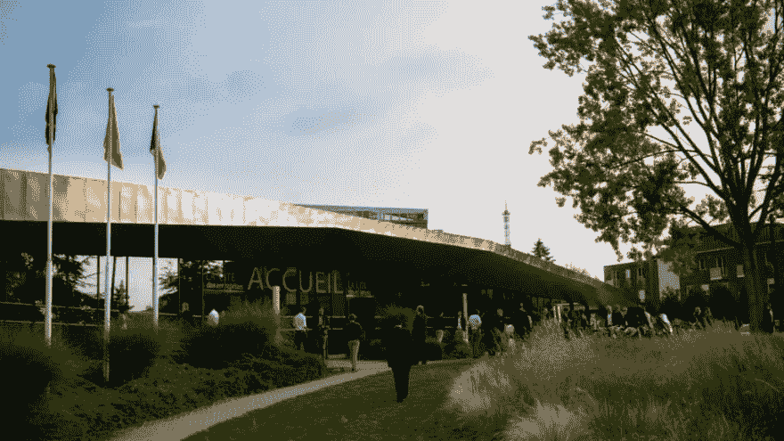
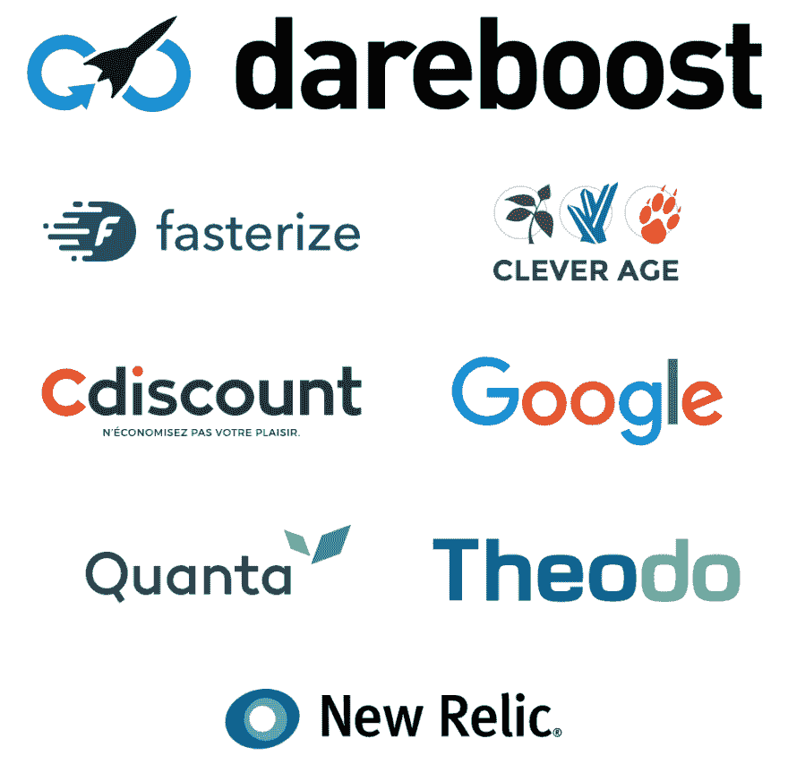

# 我们喜欢 9 月 20 日在法国里尔举行的速度 2019

> 原文：<https://dev.to/borisschapira/we-love-speed-2019-on-september-20-in-lille-france-5c7m>

在最成功的 [2018 年版](https://blog.dareboost.com/en/2018/08/event-webperf-we-love-speed-2018/)之后，Dareboost 自豪地继续赞助法国网络表演活动:**我们爱速度**。

2019 年的展览将于 9 月 20 日在里尔举行([从巴黎乘火车](https://www.welovespeed.com/en/2019/informations/)一小时)，将比上一届更有趣，包括来自 Dareboost 客户的一些反馈，如【SeLoger.com】Antonio Gomes Rodrigues 或[loc Troquet(pages jaunes . fr)](https://www.welovespeed.com/en/2019/line-up/#pagesjaunes_top10)。

预计将有 200 多人参加这次为期一天的双轨会议，会议将举办 16 场会谈(11 场法语，5 场英语)。

由有时会跨越大西洋(Estelle Weyl，Jérémy Wagner)或英吉利海峡(Matt Hobbs，Ryan Townsend)的 web 性能或 Web 质量专家(Peter Hedenskog)主讲，当他们不从瑞典出发时，他们将讨论各种主要的 Web 性能主题，如可用性、优化项目管理、JavaScript 性能、第三方治理、渐进式 Web 应用程序、图像压缩、网络协议、CSS 和生态设计。

他们在 OUI.sncf、Wikipedia、L 'équipe . fr、Protonmail、Shift Commerce、英国政府或 SiteSpeed.io 或 Fasterize solutions 的 IT 部门中获得的分享经验肯定会与您的经验相呼应，并激发讨论。

与前一版一样，将安排交流时间，以便开发人员、决策者和 Web 性能专家可以在一个用户友好的环境中进行互动，通过技术和方法技巧以及关于他们自己的计划的启发性轶事来相互丰富。

## 我们相信的独立事件

作为 Dareboost 的客户成功经理近两年来，我再一次投入了大量的时间和精力，与来自 Fasterize、BrainCracking、Cdiscount 和 Theodo 的专业人员组成的出色团队一起，决心使这次活动成为法国 WebPerf 的一个重要时刻。

我们分享了我们的技术和组织知识，但最重要的是，我们认真听取了您的期望，以建立一个丰富、开放和务实的会议，为您提供一个带着新的观点回到团队的机会。

即使 conf 承诺比去年丰富一倍，它的价格仍然保持不变:全天 180 欧元。[现在就买票](https://www.welovespeed.com/en/2019/register/)！

Dareboost 将在现场设立展位。随时来和我们交流:我们总是很乐意和我们的用户交流。你想在活动开始前发现 Dareboost 吗？欢迎[向我们索取免费试用版](https://www.dareboost.com/en/demo-request?subject=Demande%20d%27essai%20-%20monitoring%20synth%C3%A9tique)。

其他赞助商也将出席，没有他们，这项活动就不可能举行。我们感谢他们的支持！

