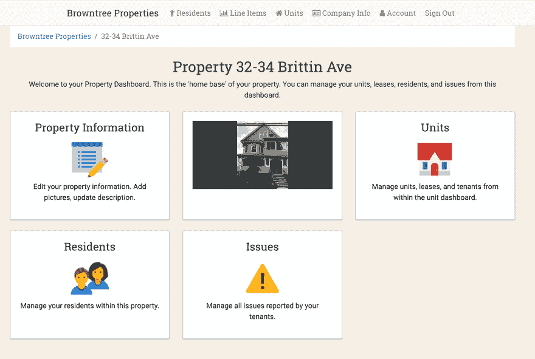
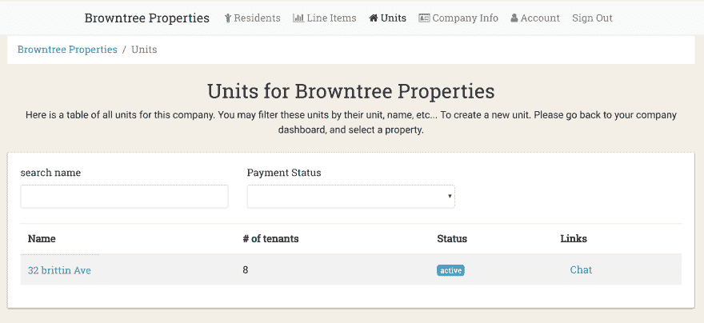

# 使用 Rails 和 React 快速创建 SaaS 产品

> 原文：<https://dev.to/cpow/creating-a-saas-product-quickly-with-rails-an-react-392k>

### 客厅开始运行了！

## “客户端”

[Living Room](https://livingroomhq.com) 是一家为物业经理开发软件的公司(由布朗树实验室创办)。LivingRoom 希望构建一个漂亮的应用程序，为租户和物业经理提供工具，使公寓管理变得更加简单。

## 问题

我开始了自己的客厅，作为一个个人项目和专业努力。我喜欢制作产品，也喜欢做自己感兴趣的事情。在非常有限的时间内，我想开发一款产品，让房东能够:

*   收租金
*   处理租户报告的问题
*   管理租赁
*   管理他们的房产、公寓和租户

并允许租户:

*   在线支付租金
*   与房东/物业经理聊天
*   允许

## 解

因为我们希望在非常有限的时间内构建一个功能全面的产品，所以我们选择了一组非常著名的框架和库:

*   用于渲染和 API 的 Ruby on Rails
*   对更多用户密集型部分做出反应
*   付款处理的条纹

### Ruby on Rails 用于渲染和基本页面

Ruby on Rails 是构建 web 应用程序最知名的框架之一。在布朗树实验室，我们的大多数项目都涉及 Ruby on Rails，所以我们对这个框架非常熟悉。因为这个框架非常受欢迎，所以在开源社区中，每个典型的问题都已经有了一个非常好的解决方案。

典型问题解决方案的一个很好的例子是一个名为[device](https://github.com/plataformatec/devise)的 gem。Devise 是一个 Ruby on Rails gem，它为您的应用程序添加了身份验证和授权逻辑。通过使用 Devise，我们几乎可以在几分钟内启动并运行身份验证。如果我们使用一个社区没有解决这个问题的不同框架，那么处理认证的所有细微差别就要花费几个小时，更不用说授权的要求了(只允许某些用户访问某些信息)。

通过利用 Ruby on Rails，我们能够快速迭代这个站点的大部分内容。例如，像属性信息页面这样的页面根本不用花时间来制作，因为没有 API 调用，也没有复杂的设置。它只是从数据库中获取数据，并以 HTML 和 ERB 显示信息。

*<small></small>*

*<small>房产信息页面</small>*

*<small></small>*

### 将 React 用于用户更密集的部分

尽管 Rails 在显示基本数据和创建基本 CRUD(创建读取更新销毁)界面方面很棒，但有时您需要具有更丰富用户体验的东西。例如，当显示一个具有模糊搜索功能的可排序表格时，您不希望每当有人键入一个字母或对一列进行排序时就刷新页面。对于网站的这些部分，我们使用了一个名为 [React](https://reactjs.org) 的 Javascript 库。

React 最初由[脸书](https://facebook.com)开发，多年来一直是最受欢迎的 javascript 库和/或框架。React 于 2013 年出现，由于其简单的 API、易于理解的模式以及在 javascript 应用程序中采用反应式编程的强大方法，它很快就受到了欢迎。

通过使用 react，我们能够在应用程序中快速创建一些令人惊叹的东西。整个应用程序中的数据表；例如，我们使用 react 的一个特性。

 
*<small></small>*

*<small>单位数据表</small>*

*<small></small>*

我们使用 React 在 Rails 生成的一些 HTML 中呈现了上面的表格。当用户试图搜索一个单元时，React 将调用 rails 来获取该单元名称的任何可能的匹配。有了这个设置，用户就有了一个非常快捷的界面来分类和搜索信息。在我们使用 React 的应用中，还有很多其他的例子。如:租户/房东之间的全单元聊天、问题创建和管理、租户和物业数据表以及租户和房东之间的全物业聊天！因为这些都是用众所周知的工具完成的，所以我们能够非常快速、轻松地创建所有东西。

### 使用条纹进行支付处理

在线支付处理的世界有点复杂。许多不同的问题有许多解决方法。但是对我们来说，我们选择了[条纹](https://stripe.com)。Stripe 有一些最好的 API 文档，并且是最容易使用的支付处理技术，因为它有针对你能想到的任何可能的语言/框架的包。通过使用 Stripe，我们有了一个几乎即插即用的解决方案来立即处理用户支付。

我们的付款方式有点奇怪。我们需要使用 [Stripe Connect](https://stripe.com/connect) 平台，使我们能够允许第三方向他们的客户收费(房东向租户收费)，并通过我们的应用程序获得报酬。有一些自定义代码涉及到设置这一点；然而，文档是优秀的，一般来说这是相当容易完成的。

## 结论

自始至终，我们只用了几个月的业余时间在客厅里。但是因为我们坚持使用众所周知的工具，我们在非常有限的时间内完成了很多工作。使用众所周知的工具和模式是我们在布朗树实验室所做工作的一部分，这个项目只是这种策略如何有效的另一个例子。