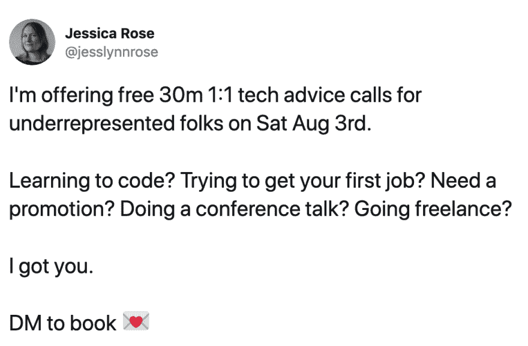

# 保持开放式建议 1:1

> 原文：<https://dev.to/jesslynnrose/holding-open-advice-1-1s-2hk4>

你好，戴夫·托👋我是杰西。

我一直在做很多一对一和规模化的技术社区外联活动，通常专注于为进入技术行业的人、希望在职业生涯中获得提升的人或对技术教育选择有疑问的人提供支持。

作为这一推广活动的一部分，我一直在提供一对一的电话服务，与需要短期个人支持的人进行一对一的通话。

《出埃及记》
[T3】](https://res.cloudinary.com/practicaldev/image/fetch/s--eUXIR8fa--/c_limit%2Cf_auto%2Cfl_progressive%2Cq_auto%2Cw_880/https://thepracticaldev.s3.amazonaws.com/i/2hmo9hdildffqzvbvlhy.png)

我真的很喜欢做这些一对一的拜访，所以我记录了我使用的工具和运行它们的过程。我想你们中的一些人可能也想对你的技术领域的初学者进行一对一的咨询。我已经(希望)在这里写下了你需要开始的一切。

如果你尝试自己开一对一的电话会议，我很想听听进展如何。反馈(和 PRs！)感激地欢迎。

祝你好运，并愉快的建议💖