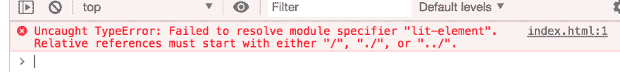
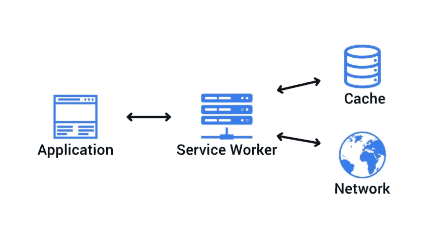
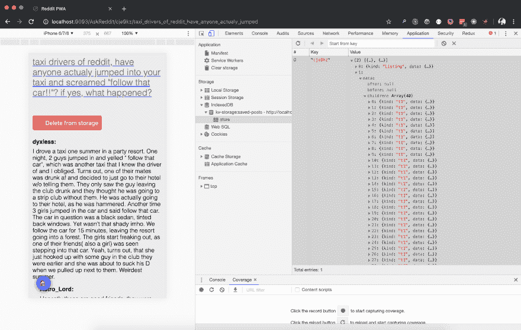

# 去无建筑

> 原文：<https://dev.to/open-wc/on-the-bleeding-edge-3cb8>

# 不明不白

大家好👋

我在异地恋，这意味着每隔几周我就要坐飞机去英国。每次我在飞机上的时候，我都会想如果能读一些 reddit 上的帖子该有多好。我可以做的是找到一个 reddit 应用程序，让你缓存离线发布的帖子(我肯定有一个)，*或*我可以借此机会自己写点东西，使用一些最新最棒的技术和网络标准，找点乐子！

最重要的是，最近有很多关于我喜欢称之为“无构建”的讨论，我认为这是一个非常迷人和伟大的最新发展。这也正是这篇文章的内容；给发展带来乐趣。

我也喜欢把这篇博客想象成对社区中一些真正了不起的人的敬意，他们使一些真正了不起的事情成为可能，也是一些令人兴奋的新技术和标准的展示，随着我们的发展，我将链接到所有这些好东西。

请注意，这不会是一个循序渐进的教程，但如果您想查看代码，可以在 [github](https://github.com/thepassle/reddit-pwa) 上找到完成的项目。我们的最终结果应该是这样的:
[](https://res.cloudinary.com/practicaldev/image/fetch/s--g1qGxggR--/c_limit%2Cf_auto%2Cfl_progressive%2Cq_auto%2Cw_880/https://raw.githubusercontent.com/thepassle/reddit-pwa/master/blog/app.png)

所以让我们直入主题，快速安装*几个*依赖项:

```
npm i @babel/core babel-loader @babel/preset-env @babel/preset-react webpack webpack-cli react react-dom redux react-redux html-webpack-plugin are-you-tired-yet html-loader webpack-dev-server 
```

Enter fullscreen mode Exit fullscreen mode

我开玩笑的。我们不会用这些的。我们将努力避免尽可能多的工具/依赖，并保持较低的准入门槛。

我们*将*使用的是:

*   对于这个项目，我们将使用 LitElement 作为我们的组件模型。它易于使用，重量轻，接近金属，并利用 web 组件。

*   [`@vaadin/router`](https://github.com/vaadin/vaadin-router)
    Vaadin 路由器是一款非常小的(< 7kb)路由器，拥有*令人敬畏的*开发者体验，我怎么推荐都不为过。

*   [`snowpack`](https://github.com/pikapkg/snowpack)
    Snowpack 将帮助我们将模块组合在一起，以便于开发。

*   [`es-dev-server`](https://open-wc.org/developing/es-dev-server.html)
    我们在 [open-wc](https://www.open-wc.org) 为现代 web 开发工作流制作的简单开发服务器。虽然任何 http 服务器都可以；请随意带你自己的。

仅此而已。我们还将使用一些浏览器标准，即: [es 模块](https://hacks.mozilla.org/2018/03/es-modules-a-cartoon-deep-dive/)、 [web 组件](https://developer.mozilla.org/en-US/docs/Web/Web_Components)、[导入-映射](https://github.com/WICG/import-maps)、[kv-存储](https://github.com/WICG/kv-storage)和[服务人员](https://developers.google.com/web/fundamentals/primers/service-workers/)。

所以让我们继续安装我们的依赖项:

```
npm i -S lit-element @vaadin/router
npm i -D snowpack es-dev-server 
```

Enter fullscreen mode Exit fullscreen mode

我们还将为我们的`package.json`添加一个`postinstall`钩子，它将为我们运行 snow pack:

```
 "scripts":  {  "start":  "es-dev-server",  "prepare":  "snowpack"  } 
```

Enter fullscreen mode Exit fullscreen mode

## 🐭鼠兔-积雪场

Pika 是 Fred K. Schott 的一个项目，旨在将 2014 年怀旧的简单性带到 2019 年的网络开发中。弗雷德正在做各种各样令人敬畏的事情，例如，他制作了 [pika.dev](https://www.pika.dev/) ，让你可以在 npm 上轻松搜索现代 JavaScript 包。他最近还在恐龙化石 2019 上发表了他的演讲[重塑注册表](https://www.youtube.com/watch?v=2Wwx-lF5NhE)，我强烈推荐你观看。

`snowpack`更进一步。如果我们运行`snowpack`，它会将我们的依赖项作为单个 javascript 文件安装到一个新的`web_modules/`目录中。如果您的依赖项在其`package.json`清单中导出一个 ES“模块”入口点，Snowpack 支持它。如果你有任何可传递的依赖关系，Snowpack 将为你的依赖关系中的任何共享代码创建单独的块。简易柠檬榨汁机。它甚至支持[树摇动](https://twitter.com/pikapkg/status/1214693540938145792)！

这意味着，在我们的例子中，我们的输出看起来像:

```
└─ web_modules/
   ├─ lit-element.js
   └─ @vaadin
        └─ router.js 
```

Enter fullscreen mode Exit fullscreen mode

太棒了。就是这样。我们已经准备好了我们的依赖项，作为单个 javascript 模块文件，这将使我们在这篇博文的后面变得非常方便，敬请关注！

## 📥导入地图

好吧！现在我们已经解决了依赖关系，让我们开始工作吧。我们将制作一个类似于这样的`index.html`:

```
<html>
    <!-- head etc -->
    <body>
      <reddit-pwa-app></reddit-pwa-app>
      <script src="./src/reddit-pwa-app.js" type="module"></script>
    </body>
</html> 
```

Enter fullscreen mode Exit fullscreen mode

和`reddit-pwa-app.js` :

```
 import { LitElement, html } from 'lit-element';

class RedditPwaApp extends LitElement {

  // ...

  render() {
    return html`
      <h1>Hello world!</h1>
    `;
  }
}

customElements.define('reddit-pwa-app', RedditPwaApp); 
```

Enter fullscreen mode Exit fullscreen mode

我们有了一个好的开始。让我们试着看看目前为止在浏览器中是什么样子，让我们启动服务器，打开浏览器并...这是什么？一个错误？

[](https://res.cloudinary.com/practicaldev/image/fetch/s--UMsWtcxo--/c_limit%2Cf_auto%2Cfl_progressive%2Cq_auto%2Cw_880/https://raw.githubusercontent.com/thepassle/reddit-pwa/master/blog/bare-module-error.png)

哦天啊。

我们甚至还没有开始。好吧，让我们看看。这里的问题是我们的模块说明符是空的。他们是*裸模块说明符*。这意味着没有指定路径，没有文件扩展名，它们只是...相当光秃秃的。我们的浏览器不知道该怎么做，所以它会抛出一个错误。

> ```
> import { LitElement, html } from 'lit-element'; // <-- bare module specifier
> import { Router } from '@vaadin/router'; // <-- bare module specifier
> 
> import { foo } from './bar.js'; // <-- not bare!
> import { html } from 'https://unpkg.com/lit-html'; // <-- not bare! 
> ```

当然，我们可以为此使用一些工具，比如 webpack，或者 rollup，或者一个开发服务器，它可以将裸模块说明符重写为对浏览器有意义的东西，这样我们就可以加载我们的导入。但这意味着我们必须引入一堆工具，投入配置，我们试图在这里保持最小化。我们只想写代码！为了解决这个问题，我们将看一看[导入地图](https://github.com/WICG/import-maps)。

Import maps 是一个新提议，它允许您控制 JavaScript 导入的行为。使用导入映射，我们可以控制 JavaScript `import`语句和`import()`表达式获取哪些 URL，并允许在非导入上下文中重用该映射。这很好，有几个原因:

*   允许我们的裸模块说明符工作
*   提供一个回退解决方案，这样`import $ from "jquery";`可以尝试先进入一个 CDN，但是如果 CDN 服务器关闭了，就退回到一个本地版本
*   启用对[内置模块](https://github.com/tc39/proposal-javascript-standard-library/)的多重填充或其他控制(稍后将详细介绍，请抓紧！)
*   解决了[嵌套依赖问题](https://dev.to/open-wc/nested-dependencies-in-frontend-558c)(去看看那个博客吧！)

听起来很甜蜜，不是吗？导入地图目前在 Chrome 75+中可用，在一面旗帜后面，记住这些知识，让我们去我们的`index.html`，并添加一个导入地图到我们的`<head>` :

```
 <head>
    <script type="importmap">
      {
        "imports": {
          "@vaadin/router": "/web_modules/@vaadin/router.js",
          "lit-element": "/web_modules/lit-element.js"
        }
      }
    </script>
  </head> 
```

Enter fullscreen mode Exit fullscreen mode

如果我们返回浏览器，刷新页面，就不会再有错误了，我们应该会在屏幕上看到我们的`<h1>Hello world!</h1>`。

导入地图是一个非常有趣的新标准，绝对是你应该关注的东西。如果你有兴趣尝试它们，并基于一个`yarn.lock`文件生成你自己的导入地图，你可以试试我们的[open-WC](https://www.open-wc.org)[import-maps-generate](https://github.com/open-wc/open-wc/tree/master/packages/import-maps-generate)包。我真的很兴奋看到人们将结合进口地图开发什么。

## 📡服务行业人员

好了，我们要稍微提前一点时间。我们已经让我们的依赖项工作，我们已经设置了我们的路由器，我们已经完成了一些 API 调用来从 reddit 获取数据，并将其显示在我们的屏幕上。查看所有代码有点超出了这篇博客的范围，但是请记住，如果您想阅读实现细节，您可以在  中找到所有代码。

因为我们制作这个应用程序是为了在飞机上阅读 reddit 帖子，如果我们的应用程序离线工作，如果我们能以某种方式保存一些帖子来阅读，那就太好了。

[](https://res.cloudinary.com/practicaldev/image/fetch/s--PS9kEGdg--/c_limit%2Cf_auto%2Cfl_progressive%2Cq_auto%2Cw_880/https://raw.githubusercontent.com/thepassle/reddit-pwa/master/blog/service-worker.jpg)

服务工作者是一种在后台运行的 JavaScript 工作者。你可以把它想象成位于网页和网络之间。每当你的网页发出请求时，它首先通过服务人员。这意味着我们可以拦截请求，并对其进行处理！比如说；我们可以让请求通过网络获得响应，并在它返回时缓存它，这样我们可以在以后离线时使用缓存的数据。我们也可以使用服务人员来预先保管我们的资产。这意味着我们可以预先缓存我们的应用程序可能需要的任何关键资产，以便脱机工作。如果我们没有网络连接，我们可以简单地返回到我们缓存的资产，并且仍然有一个工作的(尽管是离线的)应用程序。

如果你有兴趣了解更多关于渐进式网络应用和服务工作者的知识，我强烈推荐你阅读由[杰克·阿奇博尔德](https://twitter.com/jaffathecake)撰写的[离线食谱](https://developers.google.com/web/fundamentals/instant-and-offline/offline-cookbook/)。以及这个视频教程[系列](https://www.youtube.com/watch?v=GSSP5BxBnu0&list=PLIiQ4B5FSuphk6P-zg_E3W9zL3J22U4dT)作者 [Jad Joubran](https://twitter.com/JoubranJad) 。

因此，让我们继续实现一个服务工作者。在我们的`index.html`中，我们将添加以下代码片段:

```
 <script>
    if ('serviceWorker' in navigator) {
      window.addEventListener('load', () => {
        navigator.serviceWorker.register('./sw.js').then(() => {
          console.log('ServiceWorker registered!');
        }, (err) => {
          console.log('ServiceWorker registration failed: ', err);
        });
      });
    }
  </script> 
```

Enter fullscreen mode Exit fullscreen mode

我们还将添加一个  文件到我们项目的根目录。因此，我们即将预缓存我们的应用程序的资产，这就是 Snowpack 让我们的生活变得非常简单的地方。如果你看一下服务工作者文件中的安装处理程序:

```
self.addEventListener('install', (event) => {
  event.waitUntil(
    caches.open(CACHENAME).then((cache) => {
      return cache.addAll([
        '/',
        './web_modules/lit-element.js',
        './web_modules/@vaadin/router.js',
        './src/reddit-pwa-app.js',
        './src/reddit-pwa-comment.js',
        './src/reddit-pwa-search.js',
        './src/reddit-pwa-subreddit.js',
        './src/reddit-pwa-thread.js',
        './src/utils.js',
      ]);
    })
  );
}); 
```

Enter fullscreen mode Exit fullscreen mode

你会发现我们完全控制了我们的资产，我们有一个很好的，干净的文件列表，我们需要离线工作。

## 📴离线

没错。既然我们已经缓存了离线工作的资源，如果我们能够保存一些可以离线阅读的文章，那就太好了。通往罗马的道路有很多，但由于我们有点处于边缘，我们将选择:Kv-存储！

### 📦内置模块

这里有几件事要说一下。Kv-storage 是一个 [*内置模块*](https://developers.google.com/web/updates/2019/03/kv-storage#what_are_built-in_modules) 。内置模块非常类似于常规的 JavaScript 模块，除了它们是浏览器自带的。值得注意的是，虽然浏览器自带内置模块，但它们是*而不是*在全局范围内公开的，并以`std:`命名(是的，真的。).这有几个优点:它们不会增加启动新的 JavaScript 运行时上下文的任何开销(例如，新的选项卡、工作器或服务工作器)，并且它们不会消耗任何内存或 CPU，除非它们被实际导入，并且避免了与现有代码的命名冲突。

另一个有趣的，如果不是有点争议的，作为内置模块的提议是 [std-toast](https://github.com/jackbsteinberg/std-toast) 元素和 [std-switch](https://github.com/tkent-google/std-switch/blob/master/README.md) 元素。

### 🗃千伏-储

好了，先不说这个，让我们来谈谈[kv-存储](https://github.com/WICG/kv-storage)。Kv-storage(或“*键值*存储”)与 localStorage 非常相似，除了一些**的主要区别**，它位于 IndexedDB 之上。

kv-storage 的动机是 localStorage 是同步的，这会导致糟糕的性能和同步问题。它还仅限于字符串键/值对。另一种方法 IndexedDb 是...[难用](https://youtu.be/cmGr0RszHc8?t=1927)。它如此难以使用的原因是它早于承诺，这导致了非常糟糕的开发者体验。不好玩。然而，Kv-storage 非常有趣，异步、*和*易于使用！考虑下面的例子:

```
import { storage, /* StorageArea */ } from "std:kv-storage";

(async () => {
  await storage.set("mycat", "Tom");
  console.log(await storage.get("mycat")); // Tom
})(); 
```

Enter fullscreen mode Exit fullscreen mode

> 注意我们是如何从`std:kv-storage`导入的？这个导入说明符也是空的，但在这种情况下没关系，因为它实际上是浏览器附带的。

相当整洁。我们可以很好地使用它来添加一个“离线保存”按钮，并简单地存储 reddit 线程的 JSON 数据，并在需要时获取它。

`reddit-pwa-thread.js:52` :

```
const savedPosts = new StorageArea("saved-posts");

// ...

async saveForOffline() {
  await savedPosts.set(this.location.params.id, this.thread); // id of the post + thread as json
  this.isPostSaved = true;
} 
```

Enter fullscreen mode Exit fullscreen mode

现在，如果我们点击“保存以供脱机使用”按钮，转到开发人员工具的“应用程序”选项卡，我们可以看到一个保存这篇文章的 JSON 数据的`kv-storage:saved-posts`:

[](https://res.cloudinary.com/practicaldev/image/fetch/s--WlnbwT3f--/c_limit%2Cf_auto%2Cfl_progressive%2Cq_auto%2Cw_880/https://raw.githubusercontent.com/thepassle/reddit-pwa/master/blog/save.png)

如果我们返回到我们的搜索页面，我们会看到一个已保存帖子的列表，其中包含我们刚刚保存的帖子:

[](https://res.cloudinary.com/practicaldev/image/fetch/s--fVH0dYdQ--/c_limit%2Cf_auto%2Cfl_progressive%2Cq_auto%2Cw_880/https://raw.githubusercontent.com/thepassle/reddit-pwa/master/blog/saved.png)

### 🔮聚合填充

非常好。然而，我们即将遇到另一个问题。生活在边缘很有趣，但也很危险。我们在这里遇到的问题是，在撰写本文时，kv-storage 只是在 Chrome 中的一个标志后面实现的。这显然不太好。幸运的是，有一个 polyfill 可用，同时我们可以展示另一个真正有用的导入特性——地图；多填充！

首先，让我们安装 kv-storage-polyfill:

`npm i -S kv-storage-polyfill`

> 请注意，我们的`prepare`钩子将再次为我们运行 Snowpack

让我们将以下内容添加到我们的`index.html` :
中的导入映射

```
<script type="importmap">
  {
    "imports": {
      "@vaadin/router": "/web_modules/@vaadin/router.js",
      "lit-element": "/web_modules/lit-element.js",
      "/web_modules/kv-storage-polyfill.js": [
        "std:kv-storage",
        "/web_modules/kv-storage-polyfill.js"
      ]
    }
  }
</script> 
```

Enter fullscreen mode Exit fullscreen mode

所以这里发生的事情是，每当请求或导入`/web_modules/kv-storage-polyfill.js`时，浏览器将首先*尝试查看`std:kv-storage`是否可用；然而，如果失败了，它会加载`/web_modules/kv-storage-polyfill.js`。*

所以在代码中，如果我们导入:

```
import { StorageArea } from '/web_modules/kv-storage-polyfill.js'; 
```

Enter fullscreen mode Exit fullscreen mode

这是将要发生的事情:

```
"/web_modules/kv-storage-polyfill.js": [     // when I'm requested
  "std:kv-storage",                      // try me first!
  "/web_modules/kv-storage-polyfill.js"      // or fallback to me
] 
```

Enter fullscreen mode Exit fullscreen mode

## 🎉结论

我们现在应该有一个简单的、功能性的 PWA，具有最小的依赖性。这个项目有一些我们可以抱怨的吹毛求疵的地方，它们可能都是公平的。比如说；我们可能不需要使用积雪场，但它确实让我们的生活变得很容易。关于添加一个简单的 Webpack 配置，您可以提出同样的论点，但是您没有抓住要点。这里的重点是做一个好玩的应用，同时使用一些最新的功能，去掉一些流行语，入门门槛低。正如弗雷德·肖特所说:“在 2019 年，你应该使用捆扎机，因为你想这样做，而不是因为你需要这样做。”

然而，如果你对吹毛求疵感兴趣，你可以阅读[这篇关于使用 Webpack vs Pika vs buildless 的精彩讨论](https://github.com/lukejacksonn/perflink/issues/15)，你会从 Webpack 核心团队的[肖恩·拉金](https://twitter.com/TheLarkInn)以及 Pika 的创造者[弗雷德·k·肖特](https://twitter.com/FredKSchott)那里获得一些深刻的见解。

我希望你喜欢这篇博文，我希望你能学到一些东西，或者发现一些新的有趣的人。现在这个领域有许多令人兴奋的发展，我希望我能让你和我一样对它们感到兴奋。如果你有任何问题、评论、反馈或挑剔，请随时在 twitter 上联系我，电话: [@passle_](https://twitter.com/passle_) 或 [@openwc](https://twitter.com/openwc) ，别忘了查看 open-wc.org😉。

## 优秀奖

在结束这篇博客之前，我想对一些非常有趣的人说几句话，他们正在做一些伟大的事情，你可能想关注一下。

开始:[盖伊·贝德福德](https://twitter.com/guybedford)，他写了[es-模块-垫片](https://github.com/guybedford/es-module-shims)，嗯，垫片 es 模块，并导入地图。如果你问我，这是一个相当惊人的壮举，并允许我实际上使用这些新技术中的一些尚未在所有浏览器上实现。

如果你对同样的东西感兴趣，你一定要去看看[卢修斯·杰克逊](https://twitter.com/lukejacksonn)的演讲[不要开发那个应用！](https://www.youtube.com/watch?v=mVjZQrsXBQE)没有网络包，没有烦恼🤓🤙正如路加所说。

我还要感谢本尼·鲍尔斯(Benny Powers)和 T2·拉尔斯·登·贝克(Lars den Bakker)提供的有益评论和反馈。