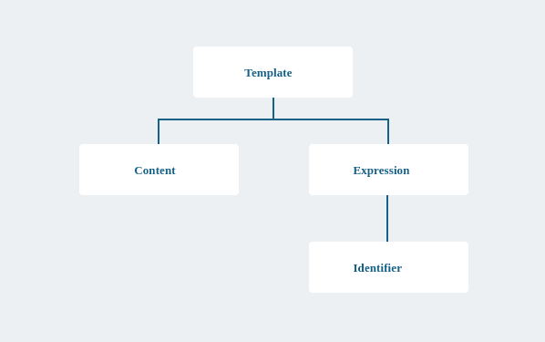
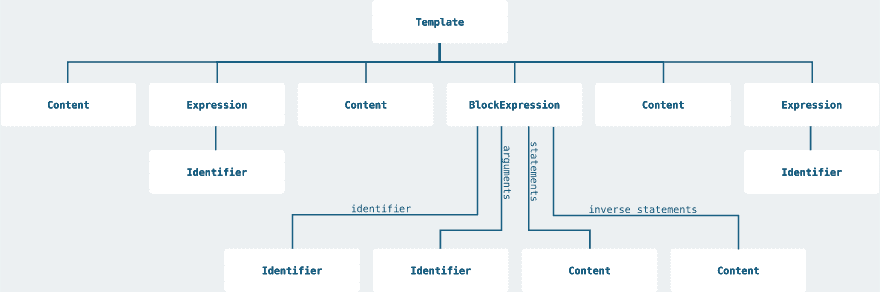

# 深入探究 Ruby 模板:解析器

> 原文：<https://dev.to/appsignal/digging-deeper-into-ruby-templating-the-parser-1co1>

今天，我们继续我们的 Ruby 模板之旅。有了词法分析器，让我们进入下一步:解析器。

[上一次](https://blog.appsignal.com/2019/07/02/ruby-magic-brewing-our-own-template-lexer-in-ruby.html)，我们看了字符串插值，然后开始创建我们自己的模板语言。我们首先实现了一个 lexer，它读取模板并将其转换为令牌流。今天，我们将实现附带的解析器。我们还将尝试一些语言理论。

开始了。

## 抽象语法树

让我们回过头来看看`Welcome to {{name}}`的简单示例模板。在使用 lexer 对字符串进行标记化之后，我们得到了一个标记列表，如下所示。

```
Magicbars::Lexer.tokenize("Welcome to {{name}}")
# => [[:CONTENT, "Welcome to "], [:OPEN_EXPRESSION], [:IDENTIFIER, "name"], [:CLOSE]] 
```

最终，我们希望评估模板并用真实值替换表达式。为了让事情变得更有挑战性，我们还想评估复杂的块表达式，允许重复和条件。

为此，我们必须生成一个描述模板逻辑结构的抽象语法树(AST)。该树由可以引用其他节点或存储来自令牌的附加数据的节点组成。

对于我们的简单示例，所需的抽象语法树如下所示:

[](https://res.cloudinary.com/practicaldev/image/fetch/s--0wa_Ml2O--/c_limit%2Cf_auto%2Cfl_progressive%2Cq_auto%2Cw_880/https://blog.appsignal.cimg/blog/2019-07/simple-ast.svg)

## 定义一个语法

要定义语法，我们先从一门语言的理论基础说起。像其他编程语言一样，我们的模板语言是一种[上下文无关语言](https://en.wikipedia.org/wiki/Context-free_language)，因此可以用一种[上下文无关语法](https://en.wikipedia.org/wiki/Context-free_grammar)来描述。*(不要被维基百科详细描述中的数学符号吓跑了。这个概念非常简单，而且有更多对开发人员友好的方法来表示语法。)*

上下文无关语法是一组规则，描述了一种语言的所有可能的字符串是如何构造的。让我们看看 [EBNF 符号](https://en.wikipedia.org/wiki/Extended_Backus%E2%80%93Naur_form) :
中模板语言的语法

```
template = statements;
statements = { statement };
statement = CONTENT | expression | block_expression;
expression = OPEN_EXPRESSION, IDENTIFIER, arguments, CLOSE;
block_expression = OPEN_BLOCK, IDENTIFIER, arguments, CLOSE, statements, [ OPEN_INVERSE, CLOSE, statements ], OPEN_END_BLOCK, IDENTIFIER, CLOSE;
arguments = { IDENTIFIER }; 
```

每个赋值定义一个规则。规则的名字在左边，一堆其他的规则(小写)或者来自我们 lexer 的标记(大写)在右边。规则和标记可以使用逗号`,`连接起来，或者使用管道符号`|`交替使用。花括号`{ ... }`中的规则和标记可能会重复几次。当它们在括号`[ ... ]`内时，它们被认为是可选的。

上面的语法是描述模板由语句组成的简明方法。一个语句可以是一个`CONTENT`标记、一个表达式或者一个块表达式。一个表达式是一个`OPEN_EXPRESSION`标记，后面是一个`IDENTIFIER`标记，后面是参数，再后面是一个`CLOSE`标记。块表达式是一个很好的例子，说明为什么使用像上面这样的符号比试图用自然语言描述它更好。

有一些工具[可以从语法定义中自动生成解析器](https://en.wikipedia.org/wiki/Comparison_of_parser_generators)，如上图所示。但是在真正的 Ruby Magic 传统中，让我们找点乐子，自己构建解析器，希望在这个过程中学到一两件事。

## 构建解析器

抛开语言理论，让我们开始实际构建解析器。让我们从一个更简单但仍然有效的模板开始:`Welcome to Ruby Magic`。这个模板没有任何表达式，标记列表只包含一个元素。下面是它的样子:

```
[[:CONTENT, "Welcome to Ruby Magic"]] 
```

首先，我们设置解析器类。看起来是这样的:

```
module Magicbars
  class Parser
    def self.parse(tokens)
      new(tokens).parse
    end

    attr_reader :tokens

    def initialize(tokens)
      @tokens = tokens
    end

    def parse
      # Parsing starts here
    end
  end
end 
```

该类接受一个标记数组并存储它。它只有一个名为`parse`的公共方法，将令牌转换成 AST。

回头看看我们的语法，最上面的规则是`template`。这意味着在解析过程开始时，`parse`将返回一个`Template`节点。

节点是简单的类，没有自己的行为。它们只是连接其他节点或存储令牌中的一些值。下面是`Template`节点的样子:

```
module Magicbars
  module Nodes
    class Template
      attr_reader :statements

      def initialize(statements)
        @statements = statements
      end
    end
  end
end 
```

为了让我们的例子工作，我们还需要一个`Content`节点。它只是存储来自令牌的文本内容(`"Welcome to Ruby Magic"`)。

```
module Magicbars
  module Nodes
    class Content
      attr_reader :content

      def initialize(content)
        @content = content
      end
    end
  end
end 
```

接下来，让我们实现 parse 方法来创建一个`Template`实例和一个`Content`实例，并将它们正确连接起来。

```
def parse
  Magicbars::Nodes::Template.new(parse_content)
end

def parse_content
  return unless tokens[0][0] == :CONTENT

  Magicbars::Nodes::Content.new(tokens[0][1])
end 
```

当我们运行解析器时，我们得到正确的结果:

```
Magicbars::Parser.parse(tokens)
# => #<Magicbars::Nodes::Template:0x00007fe90e939410 @statements=#<Magicbars::Nodes::Content:0x00007fe90e939578 @content="Welcome to Ruby Magic">> 
```

不可否认，这只适用于只有一个内容节点的简单示例。让我们切换到一个更复杂的例子，它实际上包含了一个表达式:`Welcome to {{name}}`。

```
Magicbars::Lexer.tokenize("Welcome to {{name}}")
# => [[:CONTENT, "Welcome to "], [:OPEN_EXPRESSION], [:IDENTIFIER, "name"], [:CLOSE]] 
```

为此，我们需要一个`Expression`节点和一个`Identifier`节点。`Expression`节点存储标识符以及任何参数(根据语法，这些参数是零个或多个`Identifier`节点的数组)。与其他节点一样，这里没有什么可看的。

```
module Magicbars
  module Nodes
    class Expression
      attr_reader :identifier, :arguments

      def initialize(identifier, arguments)
        @identifier = identifier
        @arguments = arguments
      end
    end
  end
end

module Magicbars
  module Nodes
    class Identifier
      attr_reader :value

      def initialize(value)
        @value = value.to_sym
      end
    end
  end
end 
```

有了新的节点，让我们修改`parse`方法来处理常规内容和表达式。我们通过引入一个`parse_statements`方法来做到这一点，只要它返回一个值，就一直调用`parse_statement`。

```
def parse
  Magicbars::Nodes::Template.new(parse_statements)
end

def parse_statements
  results = []

  while result = parse_statement
    results << result
  end

  results
end 
```

`parse_statement`本身首先调用`parse_content`，如果没有返回值，它就调用`parse_expression`。

```
def parse_statement
  parse_content || parse_expression
end 
```

你有没有注意到`parse_statement`方法开始看起来和语法中的`statement`规则非常相似？这就是花时间事先明确地写出语法对确保我们在正确的道路上有很大帮助的地方。

接下来，我们修改一下`parse_content`方法，让它不要只看第一个令牌。我们通过在初始化器中引入一个额外的`@position`实例变量，并使用它来获取当前令牌。

```
attr_reader :tokens, :position

def initialize(tokens)
  @tokens = tokens
  @position = 0
end

# ...

def parse_content
  return unless token = tokens[position]
  return unless token[0] == :CONTENT

  @position += 1

  Magicbars::Nodes::Content.new(token[1])
end 
```

`parse_content`方法现在查看当前令牌并检查其类型。如果它是一个`CONTENT`标记，它增加位置(因为当前标记被成功解析)并使用标记的内容创建`Content`节点。如果没有当前的标记(因为我们在标记的末尾)或者类型不匹配，那么该方法提前退出并返回`nil`。

有了改进的`parse_content`方法，让我们来处理新的`parse_expression`方法。

```
def parse_expression
  return unless token = tokens[position]
  return unless token[0] == :OPEN_EXPRESSION

  @position += 1

  identifier = parse_identifier
  arguments = parse_arguments

  if !tokens[position] || tokens[position][0] != :CLOSE
    raise "Unexpected token #{tokens[position][0]}. Expected :CLOSE."
  end

  @position += 1

  Magicbars::Nodes::Expression.new(identifier, arguments)
end 
```

首先，我们检查是否有一个当前令牌，并且它的类型是`OPEN_EXPRESSION`。如果是这种情况，我们前进到下一个令牌，通过分别调用`parse_identifier`和`parse_arguments`来解析标识符和参数。这两种方法都将返回各自的节点并推进当前令牌。完成后，我们确保当前令牌存在并且是一个`:CLOSE`令牌。如果不是，我们就抛出一个错误。否则，在返回新创建的`Expression`节点之前，我们最后一次提升位置。

在这一点上，我们看到一些模式出现。我们多次前进到下一个令牌，我们还检查是否有当前令牌及其类型。因为代码有点麻烦，所以让我们介绍两个助手方法。

```
def expect(*expected_tokens)
  upcoming = tokens[position, expected_tokens.size]

  if upcoming.map(&:first) == expected_tokens
    advance(expected_tokens.size)
    upcoming
  end
end

def advance(offset = 1)
  @position += offset
end 
```

`expect`方法接受可变数量的令牌类型，并根据令牌流中的下一个令牌检查它们。如果它们都匹配，它会前进通过匹配的令牌并返回它们。`advance`方法只是将`@position`实例变量增加给定的偏移量。

对于下一个期望的令牌没有灵活性的情况，我们还引入了一种方法，当令牌不匹配时，该方法会产生一条很好的错误消息。

```
def need(*required_tokens)
  upcoming = tokens[position, required_tokens.size]
  expect(*required_tokens) or raise "Unexpected tokens. Expected #{required_tokens.inspect} but got #{upcoming.inspect}"
end 
```

通过使用这些辅助方法，`parse_content`和`parse_expression`现在更加清晰，可读性更好。

```
def parse_content
  if content = expect(:CONTENT)
    Magicbars::Nodes::Content.new(content[0][1])
  end
end

def parse_expression
  return unless expect(:OPEN_EXPRESSION)

  identifier = parse_identifier
  arguments = parse_arguments

  need(:CLOSE)

  Magicbars::Nodes::Expression.new(identifier, arguments)
end 
```

最后，我们也来看看`parse_identifier`和`parse_arguments`。多亏了助手方法，`parse_identifier`方法和`parse_content`方法一样简单。唯一的区别是它返回另一种节点类型。

```
def parse_identifier
  if identifier = expect(:IDENTIFIER)
    Magicbars::Nodes::Identifier.new(identifier[0][1])
  end
end 
```

当实现`parse_arguments`方法时，我们注意到它几乎与`parse_statements`方法相同。唯一的区别是它调用`parse_identifier`而不是`parse_statement`。我们可以通过引入另一个辅助方法来消除重复的逻辑。

```
def repeat(method)
  results = []

  while result = send(method)
    results << result
  end

  results
end 
```

`repeat`方法使用`send`调用给定的方法名，直到它不再返回一个节点。一旦发生这种情况，就返回收集的结果(或者只是一个空数组)。有了这个助手，`parse_statements`和`parse_arguments`都变成了单行方法。

```
def parse_statements
  repeat(:parse_statement)
end

def parse_arguments
  repeat(:parse_identifier)
end 
```

有了所有这些改变，让我们试着解析令牌流:

```
Magicbars::Parser.parse(tokens)
# => #<Magicbars::Nodes::Template:0x00007f91a602f910
#     @statements=
#      [#<Magicbars::Nodes::Content:0x00007f91a58802c8 @content="Welcome to ">,
#       #<Magicbars::Nodes::Expression:0x00007f91a602fcd0
#        @arguments=[],
#        @identifier=
#         #<Magicbars::Nodes::Identifier:0x00007f91a5880138 @value=:name>  > 
```

这有点难读，但事实上，这是正确的抽象语法树。`Template`节点有一个`Content`和一个`Expression`语句。`Content`节点的值是`"Welcome to "`，而`Expression`节点的标识符是值为`:name`的`Identifier`节点。

## 解析块表达式

为了完成我们的解析器实现，我们还必须实现块表达式的解析。提醒一下，下面是我们要解析的模板:

```
Welcome to {{name}}!

{{#if subscribed}}
  Thank you for subscribing to our mailing list.
{{else}}
  Please sign up for our mailing list to be notified about new articles!
{{/if}}

Your friends at {{company_name}} 
```

为此，我们先介绍一个`BlockExpression`节点。虽然这个节点存储了更多的数据，但它不做任何其他事情，因此并不令人兴奋。

```
module Magicbars
  module Nodes
    class BlockExpression
      attr_reader :identifier, :arguments, :statements, :inverse_statements

      def initialize(identifier, arguments, statements, inverse_statements)
        @identifier = identifier
        @arguments = arguments
        @statements = statements
        @inverse_statements = inverse_statements
      end
    end
  end
end 
```

像`Expression`节点一样，它存储标识符和任何参数。此外，它还存储块和逆块的语句。

回头看看语法，我们注意到为了解析块表达式，我们必须通过调用`parse_block_expression`来修改`parse_statements`方法。它现在看起来就像语法中的规则。

```
def parse_statement
  parse_content || parse_expression || parse_block_expression
end 
```

`parse_block_expression`方法本身有点复杂。但是多亏了我们的帮助器方法，它仍然具有很好的可读性。

```
def parse_block_expression
  return unless expect(:OPEN_BLOCK)

  identifier = parse_identifier
  arguments = parse_arguments

  need(:CLOSE)

  statements = parse_statements

  if expect(:OPEN_INVERSE, :CLOSE)
    inverse_statements = parse_statements
  end

  need(:OPEN_END_BLOCK)

  if identifier.value != parse_identifier.value
    raise("Error. Identifier in closing expression does not match identifier in opening expression")
  end

  need(:CLOSE)

  Magicbars::Nodes::BlockExpression.new(identifier, arguments, statements, inverse_statements)
end 
```

第一部分非常类似于`parse_expression`方法。它用标识符和参数解析开始的块表达式。之后，它调用`parse_statements`来解析块的内部。

一旦完成，我们检查一个`{{else}}`表达式，由一个`OPEN_INVERSE`标记和一个`CLOSE`标记标识。如果两个标记都找到了，我们再次调用`parse_statements`来解析逆块。否则，我们就完全跳过这一部分。

最后，我们确保有一个 end 块表达式使用与 open 块表达式相同的标识符。如果标识符不匹配，我们就抛出一个错误。否则，我们创建一个新的`BlockExpression`节点并返回它。

用高级块表达式模板的标记调用解析器将返回模板的 AST。我不会在这里包括示例输出，因为它几乎不可读。相反，这里是生成的 AST 的可视化表示。

[](https://res.cloudinary.com/practicaldev/image/fetch/s--6koqFbUa--/c_limit%2Cf_auto%2Cfl_progressive%2Cq_auto%2Cw_880/https://blog.appsignal.cimg/blog/2019-07/complex-ast.svg)

因为我们在`parse_block_expression`内部调用`parse_statements`，所以块和逆块可能包含更多的表达式、块表达式以及常规内容。

## 旅程继续…

我们在实现自己的模板语言的过程中取得了不错的进展。在对语言理论进行了简短的探讨之后，我们为模板语言定义了一个语法，并使用它从头开始实现了一个解析器。

有了 lexer 和解析器，我们只差一个解释器来从模板生成插入的字符串。我们将在即将到来的 RubyMagic 版本中讨论这一部分。订阅[Ruby Magic 邮件列表](https://blog.appsignal.com/ruby-magic/)，在它发布时得到提醒。

*客座作家[贝内迪克特·德克](http://benediktdeicke.com/)是一名软件工程师，也是 [Userlist.io](http://userlist.io/) 的联合创始人。另外，他正在写一本关于用 Ruby on Rails 构建 [SaaS 应用程序的书。你可以通过](http://saasguidebook.com/) [Twitter](http://twitter.com/benediktdeicke) 联系 Benedikt。*