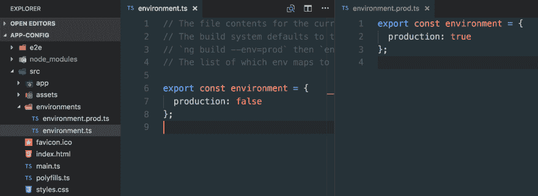

# Angular 应用程序的编译时与运行时配置

> 原文：<https://dev.to/angular/compile-time-vs-runtime-configuration-of-your-angular-app-15f2>

当你开发一个更大的应用程序时，你很有可能需要某种配置。这可以从简单地可视化应用程序的版本号到注入自定义主题等。在 Angular 中有不同种类的方法:编译时和运行时配置。让我们来看看他们两个。

## 编译期配置

[(点击打开书呆子课)](https://egghead.io/lessons/angular-configure-an-angular-app-at-compile-time-with-the-angular-cli)

**什么是编译时配置？**这基本上意味着您在编译和捆绑应用程序时，将配置编译到应用程序中。如果您使用的是 Angular CLI，那么已经有了一个预配置的设置，可以使用这样的编译时配置选项。

[](https://res.cloudinary.com/practicaldev/image/fetch/s--dnHS6Agh--/c_limit%2Cf_auto%2Cfl_progressive%2Cq_auto%2Cw_880/https://juristr.com/blog/assets/imgs/angular-cli-compiletime-config.png)

在`environments`文件夹中有一个`environment.ts`和`environment.prod.ts`文件。

```
// environment.ts
export const environment = {
  production: false
}; 
```

<svg width="20px" height="20px" viewBox="0 0 24 24" class="highlight-action crayons-icon highlight-action--fullscreen-on"><title>Enter fullscreen mode</title></svg> <svg width="20px" height="20px" viewBox="0 0 24 24" class="highlight-action crayons-icon highlight-action--fullscreen-off"><title>Exit fullscreen mode</title></svg>

```
// environment.prod.ts
export const environment = {
  production: true
}; 
```

<svg width="20px" height="20px" viewBox="0 0 24 24" class="highlight-action crayons-icon highlight-action--fullscreen-on"><title>Enter fullscreen mode</title></svg> <svg width="20px" height="20px" viewBox="0 0 24 24" class="highlight-action crayons-icon highlight-action--fullscreen-off"><title>Exit fullscreen mode</title></svg>

因为这些只是普通的 JavaScript 对象，所以您可以在它们上面添加特定于环境的属性。

负责引导我们的 Angular 应用程序的默认`main.ts`文件使用那些环境文件来确定应用程序是否正在运行生产模式，以便应用一些运行时优化，例如调用`enableProdMode()`。

```
import { enableProdMode } from '@angular/core';
import { platformBrowserDynamic } from '@angular/platform-browser-dynamic';

import { AppModule } from './app/app.module';
import { environment } from './environments/environment';

if (environment.production) {
  enableProdMode();
}

platformBrowserDynamic().bootstrapModule(AppModule)
  .catch(err => console.log(err)); 
```

<svg width="20px" height="20px" viewBox="0 0 24 24" class="highlight-action crayons-icon highlight-action--fullscreen-on"><title>Enter fullscreen mode</title></svg> <svg width="20px" height="20px" viewBox="0 0 24 24" class="highlight-action crayons-icon highlight-action--fullscreen-off"><title>Exit fullscreen mode</title></svg>

通过简单地将`environment.ts`导入到您的文件中，您可以任意地获得对那个`environment`对象的引用。

```
import { environment } from '../environment/environment';

// do something meaningful with `environment`
console.log(environment); 
```

<svg width="20px" height="20px" viewBox="0 0 24 24" class="highlight-action crayons-icon highlight-action--fullscreen-on"><title>Enter fullscreen mode</title></svg> <svg width="20px" height="20px" viewBox="0 0 24 24" class="highlight-action crayons-icon highlight-action--fullscreen-off"><title>Exit fullscreen mode</title></svg>

注意，我们总是导入`environment.ts`，而不是像`environment.prod.ts`这样的特定于环境的文件。原因是在编译时， **Angular CLI 会将环境特定的配置文件重命名为`environment.ts`** ，并相应地将其编译到您的应用程序中。

您还可以创建新文件，比如为您的“暂存”环境创建文件。只需创建一个新的`environment.staging.ts`，并确保在您的`angular.json`文件:
中配置它

```
{  //  ...  "projects":  {  "demo":  {  //...  "architect":  {  "build":  {  "builder":  "@angular-devkit/build-angular:browser",  //  ...  "configurations":  {  "staging":  {  "fileReplacements":  [  {  "replace":  "src/environments/environment.ts",  "with":  "src/environments/environment.staging.ts"  }  ],  //...  },  "production":  {  "fileReplacements":  [  {  "replace":  "src/environments/environment.ts",  "with":  "src/environments/environment.prod.ts"  }  ],  //...  }  }  },  //...  }  }  }  } 
```

<svg width="20px" height="20px" viewBox="0 0 24 24" class="highlight-action crayons-icon highlight-action--fullscreen-on"><title>Enter fullscreen mode</title></svg> <svg width="20px" height="20px" viewBox="0 0 24 24" class="highlight-action crayons-icon highlight-action--fullscreen-off"><title>Exit fullscreen mode</title></svg>

最后，我们需要告诉 CLI 我们正在为哪个环境构建，s.t .它能够选择正确的配置文件。这发生在我们的`package.json` :
的脚本部分

```
{  ...  "scripts":  {  "ng":  "ng",  "build":  "ng build --prod",  "build:staging":  "ng build --prod --env=staging"  },  ...  } 
```

<svg width="20px" height="20px" viewBox="0 0 24 24" class="highlight-action crayons-icon highlight-action--fullscreen-on"><title>Enter fullscreen mode</title></svg> <svg width="20px" height="20px" viewBox="0 0 24 24" class="highlight-action crayons-icon highlight-action--fullscreen-off"><title>Exit fullscreen mode</title></svg>

注意，我们传入了`--env=<your-environment>`标志。`--prod`是一个内置命令，如果没有另外指定，它会自动使用生产配置。另外它还**启用 AOT 编译**。

## 运行时配置

[(点击打开书呆子课)](https://egghead.io/lessons/angular-configure-an-angular-app-at-runtime)

然而，如果你需要能够改变你的应用程序的配置设置，或者你甚至可以通过 API 公开它们，那么你需要使用**一种运行时配置方法**。通常你只需要一些 JSON 文件——比如说`appConfig.json`,其中包含必要的配置选项，然后你就可以在服务器上部署你的应用了。当您的应用程序运行时，您对该 JSON 文件执行一个 HTTP 请求并读取设置。

然而，你想要的是，只有在你的设置被加载和应用后才启动你的应用程序。一种简单的方法如下。在你的`app.component.ts`中，你只需添加一个`*ngIf`守卫:

```
@Component({
    selector: 'app-root',
    template: `
        <div *ngIf="configLoaded">

        </div>
    `
})
export class AppComponent implements OnInit {
    configLoaded = false;

    ngOnInit() {
        this.http.get('./assets/appConfig.json')
            .subscribe(config => {
                // do something with your configuration
                ...

                this.configLoaded = true;
            });
    }
} 
```

<svg width="20px" height="20px" viewBox="0 0 24 24" class="highlight-action crayons-icon highlight-action--fullscreen-on"><title>Enter fullscreen mode</title></svg> <svg width="20px" height="20px" viewBox="0 0 24 24" class="highlight-action crayons-icon highlight-action--fullscreen-off"><title>Exit fullscreen mode</title></svg>

这样你的其他组件就不会启动，除非`configLoaded`为真，从而显示出`<div>`。

虽然这可行，但还有一种更优雅的方式:我们可以通过使用`APP_INITIALIZER`令牌来挂钩 Angular 的引导阶段。我们首先**创建一个角度服务来处理远程配置的获取**...

[阅读更多](https://juristr.com/blog/2018/01/ng-app-runtime-config?utm_source=devto&utm_medium=crosspost)