# 提高生产力的三大工具

> 原文：<https://dev.to/emmabostian/top-3-tools-for-boosting-your-productivity-1lh>

“你是如何完成这么多工作的？”这是我每周都会收到几次的问题。直到今天，我的回答都是一样的:“我在努力让自己不负债。”

我有太多的承诺。以下是我积极参与的几件事:

*   从事朝九晚五的全职工作
*   管理我的开源项目，[编码蔻驰](https://codingcoach.io/)
*   共同主持[瓢虫播客](https://ladybug.dev/)
*   [JS Party](https://changelog.com/jsparty) 播客小组成员
*   博客(为我自己和[终极课程](https://ultimatecourses.com/)
*   [Egghead.io](https://egghead.io/) 教官
*   2019 年在 10 个会议上发言
*   参加并帮助组织当地的 JavaScript 会议
*   在 Twitter 上浏览互联网

在这期间，我试着找时间去旅行，花时间和家人朋友在一起，学德语，放松。

不用说，我有点心不在焉。因此，我决定振作起来，组织起来。

以下是我最喜欢的三个工具，它们帮助我把生活安排得井井有条，完成更多工作。

**注意:我用的是 Mac book，所以我推荐的应用在其他操作系统上可能会有所不同(或者不可用)。**

# 观念

观念一直是我欣赏的工具，但坦率地说，我害怕使用它。虽然界面看起来简约且用户友好，但该应用程序非常强大。

于是，我终于看了一个 [YouTube 教程](https://www.youtube.com/watch?v=66fN1cZadPA)来制定一个有效的工作流程。

## 创建工作区架构

第一步是拿出一张纸，勾画出我理想的工作空间。我把它分成八类:

*   长期目标
*   短期目标
*   下周
*   假期计划
*   物流和信息
*   会议
*   笔记
*   博客

[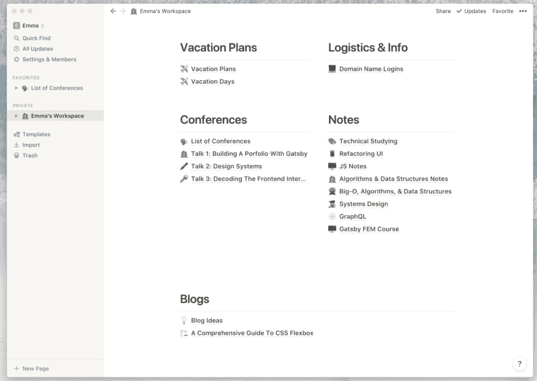](https://res.cloudinary.com/practicaldev/image/fetch/s--7bqvkyBj--/c_limit%2Cf_auto%2Cfl_progressive%2Cq_auto%2Cw_880/https://cdn-images-1.medium.com/max/1600/1%2AAWqys2bA7N-53PeHyEOUQA.png)

在每一部分中，我都有大量的页面。例如，在我的会议部分下面，有一个页面包含了我将要演讲的所有会议的列表，以及它们的后勤。我也有我必须开发的三个会议演讲的后续页面。这有助于我将相关信息拼凑在一起。

[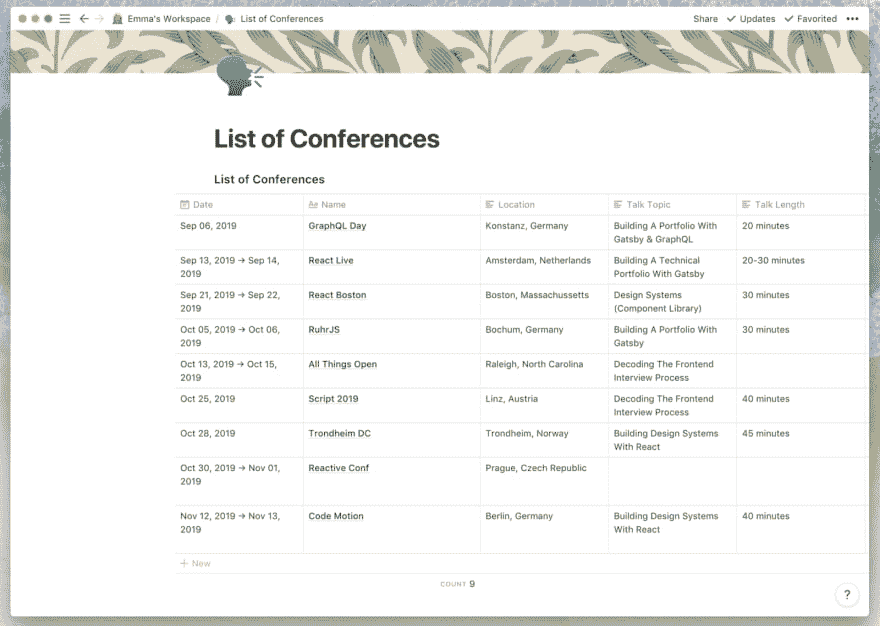](https://res.cloudinary.com/practicaldev/image/fetch/s--ozTpbXig--/c_limit%2Cf_auto%2Cfl_progressive%2Cq_auto%2Cw_880/https://cdn-images-1.medium.com/max/1600/1%2A0xFgzY8yKqItdynoL1-ABg.png)

## 待办事项

我决定在我的待办事项列表中也使用这个概念。在我工作区的顶部，我为不同的边项目创建了一个彩色编码的图例。这允许我快速搜索特定的任务。

[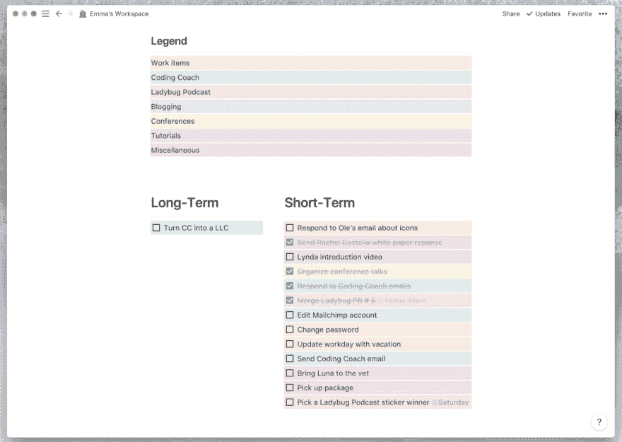](https://res.cloudinary.com/practicaldev/image/fetch/s--pwb-eLyh--/c_limit%2Cf_auto%2Cfl_progressive%2Cq_auto%2Cw_880/https://cdn-images-1.medium.com/max/1600/1%2AbKaarZK61SOcDOY5MICTZg.png)

### 周一览

虽然 ideal 不是我的主要日历应用，但在我的其他任务旁边包含一个日历视图也不错，只是为了提醒我即将到来的任何重要承诺。

[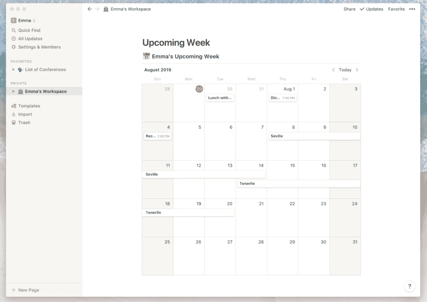](https://res.cloudinary.com/practicaldev/image/fetch/s--JE-px-vb--/c_limit%2Cf_auto%2Cfl_progressive%2Cq_auto%2Cw_880/https://cdn-images-1.medium.com/max/1600/1%2AGJzTIzy7oYPgQGX9Skc-RQ.png)

opinion 还有一个手机应用程序，所以我可以在我所有的设备上跟踪我的待办事项和文档。

[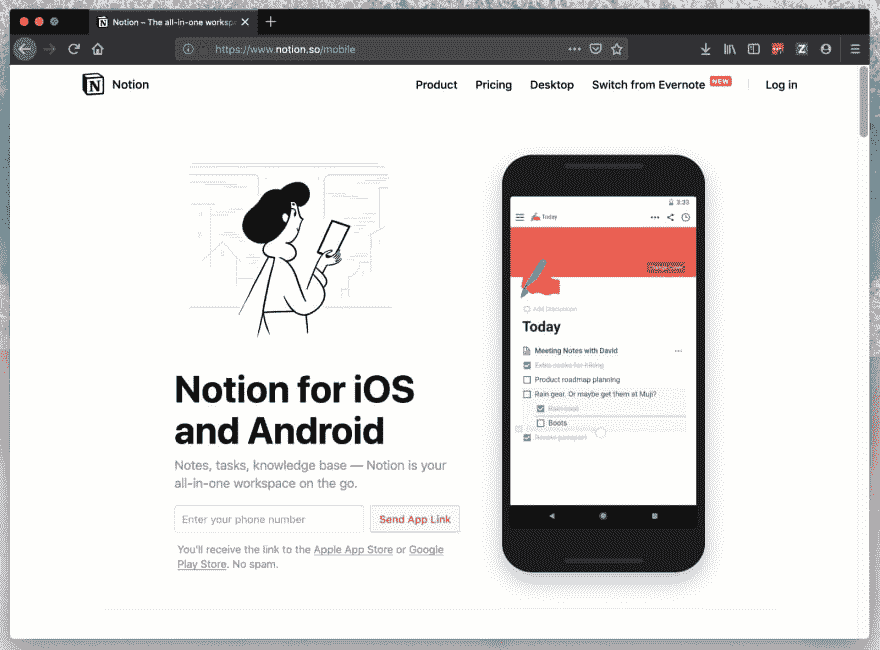](https://res.cloudinary.com/practicaldev/image/fetch/s--OXIIE9hJ--/c_limit%2Cf_auto%2Cfl_progressive%2Cq_auto%2Cw_880/https://cdn-images-1.medium.com/max/1600/1%2ALdwK8oJLwZk2OotJknmHWw.png)

## 定价

你可以使用免费版本的概念，但我支付的是[个人账户](https://www.notion.so/pricing)。每月支付 4 美元，我就可以获得更多的功能来帮助我保持有序。

[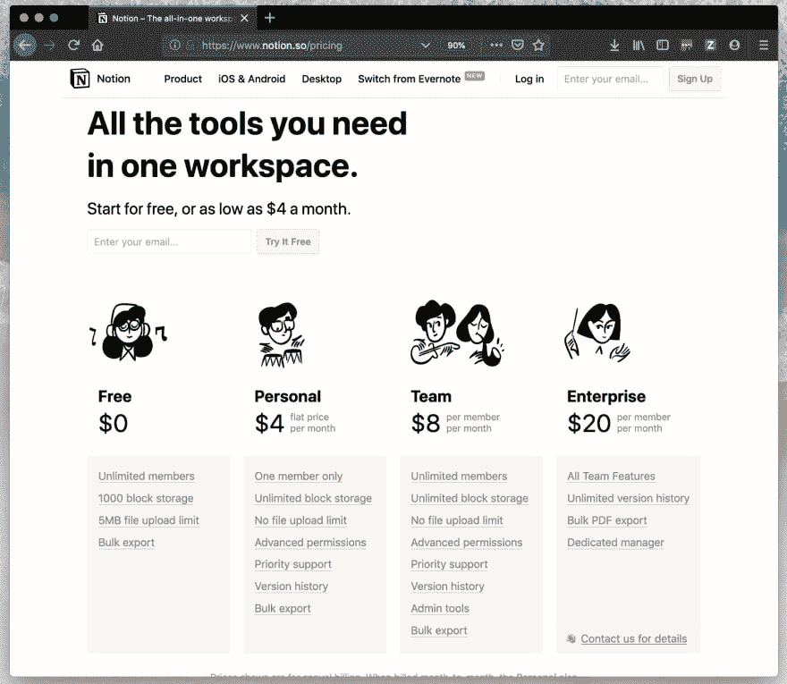](https://res.cloudinary.com/practicaldev/image/fetch/s--5luEVNfd--/c_limit%2Cf_auto%2Cfl_progressive%2Cq_auto%2Cw_880/https://cdn-images-1.medium.com/max/1600/1%2AoQYIa_9V6Nal10rqLgyTJA.png)

# 火花

我有多得离谱的电子邮件地址。在结婚和开始几个兼职项目之间，我积极使用六个电子邮件地址(是的，我疯了，我知道。)

所以对我来说重要的是找到一个电子邮件应用程序，它可以合并我所有的地址，同时过滤掉所有我不关心的垃圾。

输入 Spark。

Spark 是一个令人惊叹的电子邮件应用程序，我不会切换回其他任何东西。

[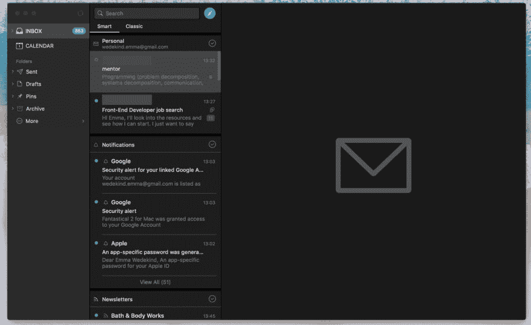](https://res.cloudinary.com/practicaldev/image/fetch/s--SToU-YI---/c_limit%2Cf_auto%2Cfl_progressive%2Cq_auto%2Cw_880/https://cdn-images-1.medium.com/max/1600/1%2AXc2uXseJyJXZqmOwDEkIag.png)

我喜欢 Spark 将我的个人电子邮件与我的通知、时事通讯和 pin 进行分组的方式(尽管如果你喜欢这种折磨的话，它们确实具有包罗万象的经典收件箱风格。)

还有一款手机应用，你可以[免费下载](https://apps.apple.com/us/app/spark-email-app-by-readdle/id997102246)。

[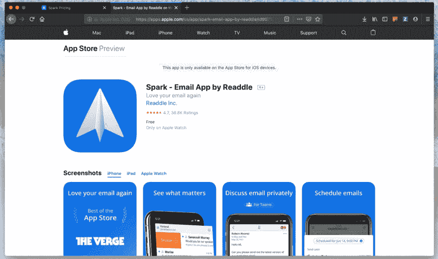](https://res.cloudinary.com/practicaldev/image/fetch/s--I-5Mbhn9--/c_limit%2Cf_auto%2Cfl_progressive%2Cq_auto%2Cw_880/https://cdn-images-1.medium.com/max/1600/1%2AjvpLGb33JhpNPb3foG97Sw.png)

## 特性

*   智能收件箱，可以按主题分类邮件
*   智能搜索(非常有效)
*   电子邮件打盹
*   电子邮件日程安排
*   电子邮件签名
*   提醒跟进

## 定价

我使用 Spark 的[免费版](https://sparkmailapp.com/pricing)，它让我:

*   5GB 存储空间
*   2 名积极合作者
*   5 个电子邮件模板
*   标准链接共享

您还可以升级到 Premium，每活跃用户 6.39 美元(按年计费)或 7.99 美元(按月计费)。

[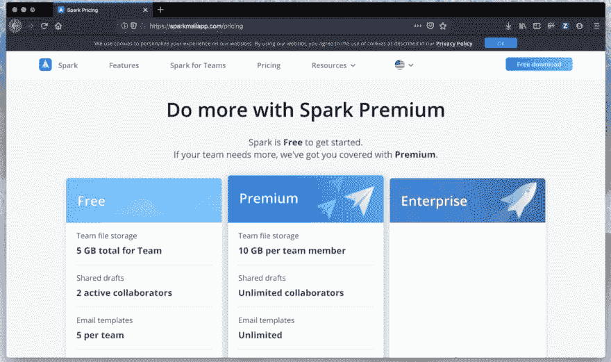](https://res.cloudinary.com/practicaldev/image/fetch/s--H58iBlPs--/c_limit%2Cf_auto%2Cfl_progressive%2Cq_auto%2Cw_880/https://cdn-images-1.medium.com/max/1600/1%2AUrC_LI_KdgbG4XF6zH-3Rg.png)

# 狂想 2

我试过很多日历应用程序，出于某种原因，我总是无法在它们之间同步我的众多日历。

由于我有六个电子邮件地址(以及所有相关的日历会议邀请)，我需要一个应用程序来优雅地组合它们。

我的同事[卡希尔·勒歇尔特](https://twitter.com/kahliltweets)正在使用[fantastic](https://flexibits.com/fantastical)，我立刻被它的用户界面吸引住了。这是一个华丽且易于使用的应用程序，看起来与苹果日历非常相似。

[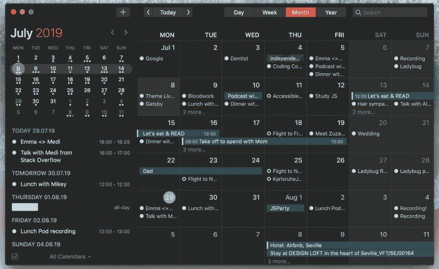](https://res.cloudinary.com/practicaldev/image/fetch/s--w2cqJ3Qu--/c_limit%2Cf_auto%2Cfl_progressive%2Cq_auto%2Cw_880/https://cdn-images-1.medium.com/max/1600/1%2A40pVrzRw-sh2xgnNBNS2SQ.png)

他们还包括一个光明和黑暗的主题。

[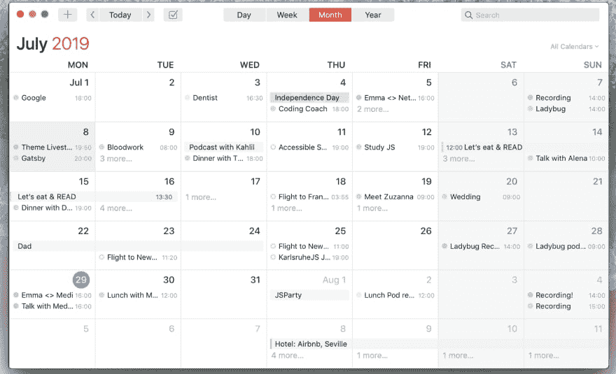](https://res.cloudinary.com/practicaldev/image/fetch/s--HVjl-xUu--/c_limit%2Cf_auto%2Cfl_progressive%2Cq_auto%2Cw_880/https://cdn-images-1.medium.com/max/1600/1%2ASw7puD__s9Ap-v5ucFpVpQ.png)

Fantastical 使添加新的日历事件和会议变得非常容易。你只需开始输入，选择日期和时间，你就可以走了。您甚至可以选择要将此事件与哪个电子邮件地址相关联。

[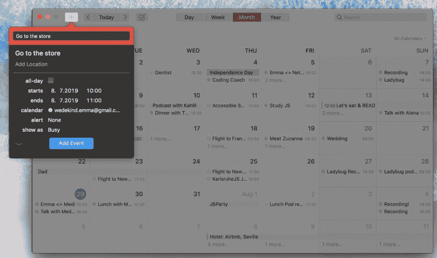](https://res.cloudinary.com/practicaldev/image/fetch/s--XEPyOviR--/c_limit%2Cf_auto%2Cfl_progressive%2Cq_auto%2Cw_880/https://cdn-images-1.medium.com/max/1600/1%2AGCQzrkRCUbktN-k6cY5Idg.png)

## 定价

诚然，Fantastical 有点贵，但我发现它是值得的。一次性购买价格为 54.99 欧元，可以在多种苹果电脑上下载。你还必须为手机应用程序支付 4.99 美元，如果你已经支付了桌面应用程序的费用，这有点令人失望。

[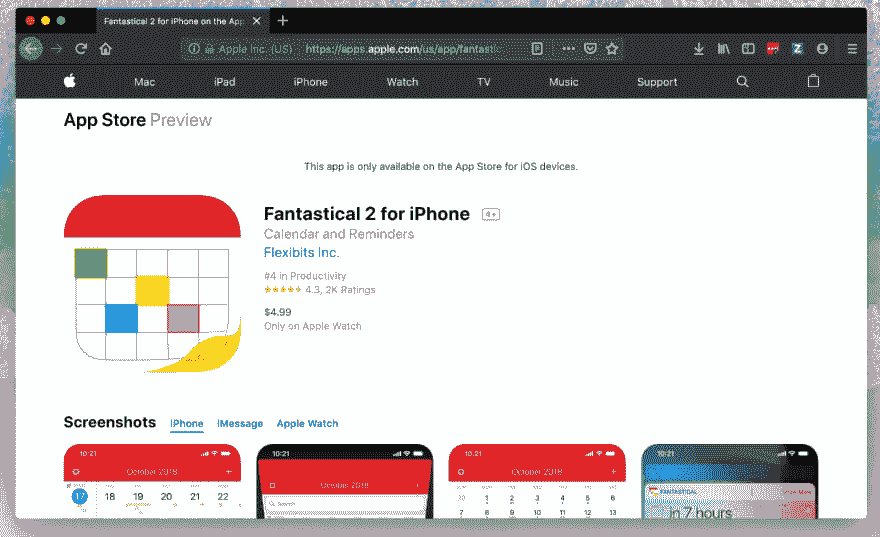](https://res.cloudinary.com/practicaldev/image/fetch/s--V4obu3md--/c_limit%2Cf_auto%2Cfl_progressive%2Cq_auto%2Cw_880/https://cdn-images-1.medium.com/max/1600/1%2AZxs_MIVTU4-Nkb2ePyjLsg.png)

# 其他值得注意的生产力工具

## 语法

语法上是一个帮助你学习英语语法和拼写的好工具。

有一个免费的浏览器扩展和一个桌面应用程序。

Grammarly 的免费版本允许您捕捉语法、拼写和标点符号错误，但如果您正在寻找更强大的功能，premium 帐户提供了更多功能，包括:

*   不一致的写作风格
*   句子结构不清晰
*   过度使用的单词
*   无效词汇
*   模糊语言
*   粗鲁
*   不敏感或不包容的语言
*   不适当的语气或正式程度
*   剽窃

您可以选择每月支付 26.87 欧元，也可以选择每年支付 10.46 欧元。

[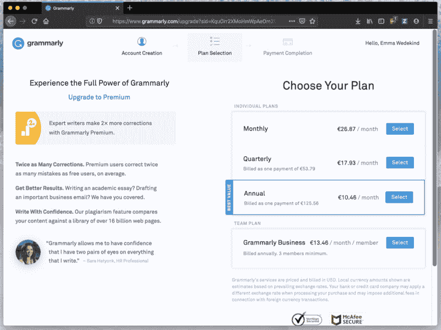](https://res.cloudinary.com/practicaldev/image/fetch/s--0MwsbIyo--/c_limit%2Cf_auto%2Cfl_progressive%2Cq_auto%2Cw_880/https://cdn-images-1.medium.com/max/1600/1%2A7zYOaJjpJnC67VhjcyMU1w.png)

## Lightshot 截图

我使用 [Lightshot 截图](https://app.prntscr.com/en/index.html)来满足我所有的截图需求。它允许我快速截屏并在上下文中注释它们。

它可以在 Mac 和 Windows 上运行，而且是免费的！

[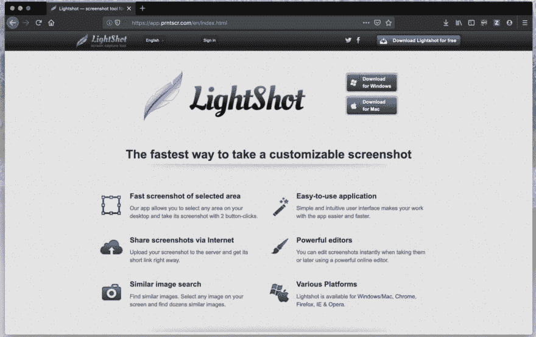](https://res.cloudinary.com/practicaldev/image/fetch/s---t6plwQl--/c_limit%2Cf_auto%2Cfl_progressive%2Cq_auto%2Cw_880/https://cdn-images-1.medium.com/max/1600/1%2AX82X6pzvFmBgdN9yI6qp8w.png)

## 奇观

[奇观](https://www.spectacleapp.com/)非常适合在你的电脑上移动窗口和调整窗口大小。别的不多说，除了免费！

[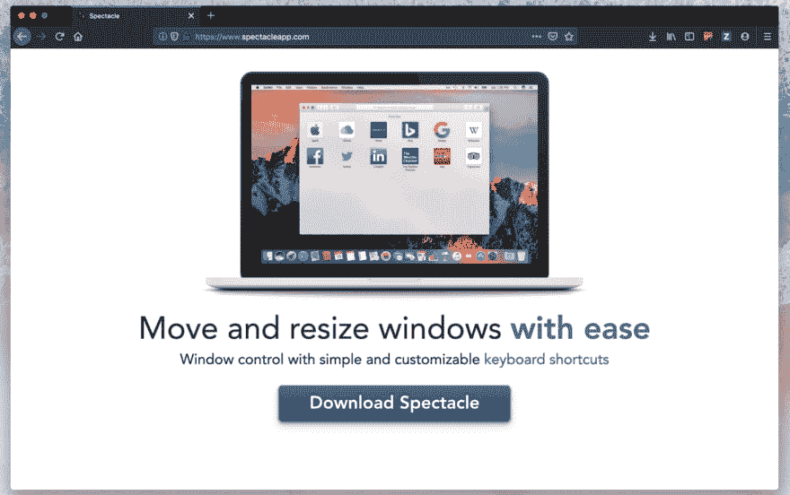](https://res.cloudinary.com/practicaldev/image/fetch/s--teRsRT_1--/c_limit%2Cf_auto%2Cfl_progressive%2Cq_auto%2Cw_880/https://cdn-images-1.medium.com/max/1600/1%2AuvK7fQtwtF2iIftnHvXSuw.png)

## TweetDeck

我最近发现了 TweetDeck，用于安排推文和过滤 Twitter 的噪音。它节省了我大量的时间！
[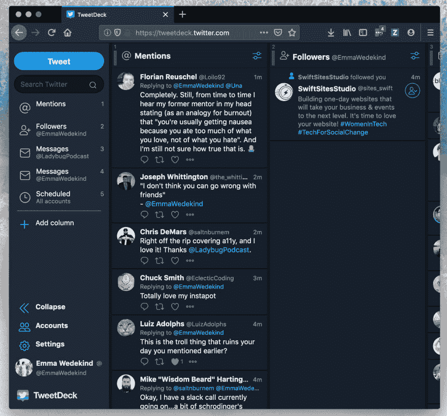T3】](https://res.cloudinary.com/practicaldev/image/fetch/s--8RK4OG4z--/c_limit%2Cf_auto%2Cfl_progressive%2Cq_auto%2Cw_880/https://cdn-images-1.medium.com/max/1600/1%2AT6UOqjA9JJAp-mnbul9-sg.png)

* * *

你最喜欢的生产力应用是什么？把他们留在下面！