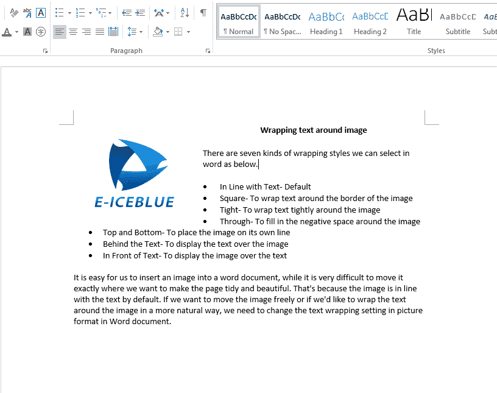

# 如何在 Java 中用文字环绕 Word 文档中的图像

> 原文：<https://dev.to/eiceblue/how-to-wrap-text-around-image-on-word-document-in-java-34jn>

我们通常会在 Word 文档中添加图像，使文档更有吸引力和美观。在我们用 word 文档添加后，默认情况下图像与文本是一致的。如果我们想自由移动图像，或者想让文本以更自然的方式环绕图像，我们需要让文本环绕图像来设置图像和文本的位置。在 word 中有几种环绕方式可供选择，如下所示。

*   与文本一致-默认
*   方形-将文本环绕图像的边框
*   紧密-将文本紧密环绕在图像周围
*   通过-填充图像周围的负空间
*   顶部和底部-将图像放在它自己的行上
*   文本后面-在图像上显示文本
*   在文本前面-在文本上显示图像

本文将向您展示如何借助 [Free Spire 设置环绕样式来调整 Java 应用程序中图像的位置。Java 的 doc](https://www.e-iceblue.com/Introduce/free-doc-for-java.html)。

如何在图像周围环绕文字的完整代码:

```
import com.spire.doc.*;
import com.spire.doc.documents.Paragraph;
import com.spire.doc.documents.TextWrappingStyle;
import com.spire.doc.documents.TextWrappingType;
import com.spire.doc.fields.DocPicture;

public class WrapText {
    public static void main(String[] args) throws Exception {

        Document doc = new Document();
        doc.loadFromFile("Sample.docx");

        Section sec = doc.getSections().get(0);

        Paragraph para = sec.getParagraphs().get(0);
        DocPicture picture = para.appendPicture("logo.png");

        //Set image width and height
        picture.setWidth(150f);
        picture.setHeight(125f);

        //Set text wrapping style to Square
        picture.setTextWrappingStyle(TextWrappingStyle.Square);
        picture.setTextWrappingType(TextWrappingType.Both);
        //Save the document to file
        doc.saveToFile("Output/WrapStyle.docx");
        doc.close();

    }
} 
```

文字环绕方式在正方形处的有效截图:
[](https://res.cloudinary.com/practicaldev/image/fetch/s--XniK1-QC--/c_limit%2Cf_auto%2Cfl_progressive%2Cq_auto%2Cw_880/https://thepracticaldev.s3.amazonaws.com/i/nd29dsxycu7ot868y7qq.png)

## 更多信息:

网址:[https://www.e-iceblue.com/](https://www.e-iceblue.com/)
支持论坛:[免费尖塔。Java 文档](https://www.e-iceblue.com/forum/spire-doc-f6.html)