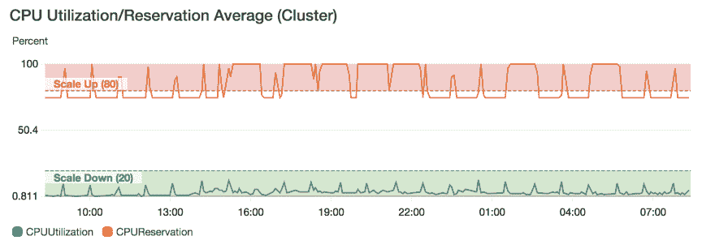
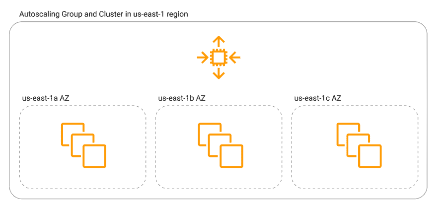
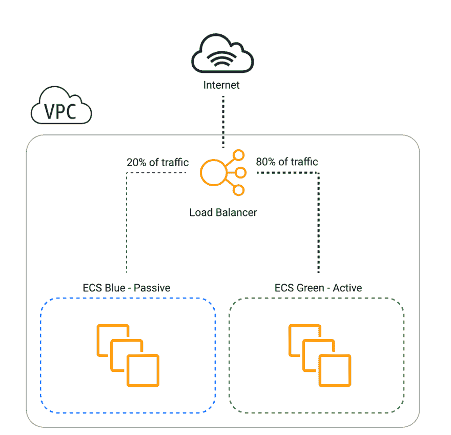

# 防弹 ECS 集群——在 AWS 上创建安全、稳定且经济高效的集群的最佳实践

> 原文：<https://dev.to/rafalwilinski/bulletproof-ecs-cluster-best-practices-for-creating-secure-stable-and-cost-effective-clusters-on-aws-404a>

在 AWS 上运行 ECS 集群可能会很麻烦。在经历了一系列停机和战争故事之后，我向您展示了一系列经验教训，这些经验教训让您的群集在预算范围内变得安全且不易损坏。

### 私下主持，曝光为 via ALB/ELB

负载平衡器应该是集群的网关。当运行 web 服务时，确保您已经在私有子网中运行了您的集群，并且您的容器不能从互联网直接访问。理想情况下，您的内部容器应该公开一个随机的、短暂的端口，该端口绑定到一个目标组。还要确保只允许来自负载平衡器的安全组的流量。

### 使用聚光灯实例

Spot 实例是在计算繁重/工作集群或开发/试运行环境中节省资金的好方法。如果你不知道什么是 spot 实例，这里引用 AWS 文档中的一段话:

> *Spot 实例是一个未使用的 EC2 实例，其价格低于按需价格。*

实际上，通过使用它们，您可以节省高达 80%的成本！但是，有一个条件。Spot 实例是基于投标定价模型的，AWS 可以自动杀死它们，因此，您应该知道，您的实例可能会在一分钟的警告后随时被关闭。

### 为环境变量使用参数存储

在容器的任务定义中，您可以直接指定环境变量，但是，这不是将配置变量传递给容器的最佳方式。这是不安全的，它将基础设施与 env 变量耦合在一起，更改它们需要您更改任务定义并执行新的部署。相反，环境变量应该在启动时从 AWS SSM(简单系统管理器)参数存储中注入。

这是一个安全的、加密的、可审计的、可扩展的和可管理的中央真实来源，不仅可以被 ECS 使用，还可以被 Lambda、EC2、CloudFormation 等等使用。此外，它与其他 AWS 服务很好地集成在一起，因此一旦变量发生变化，您可能会对该事件做出反应。更多信息请访问 AWS 官方博客。

### 在 EC2 实例启动时更新 ECS 代理

```
> service MY-SERVICE was unable to place a task because no container instance met all of its requirements. 
```

Enter fullscreen mode Exit fullscreen mode

这是我们有一天在调查停电时看到的错误。“怎么了？”-我们一直在问自己这个问题。挖了一段时间，找到了一个根本原因。

因为我们在 Spot 实例上运行我们的集群，AWS 决定终止它们。幸运的是，我们的自动伸缩小组重新产生了它们，以保持所需数量的运行实例，但有一个问题。AMI 安装了过期的 ECS 代理，它没有能力从存储中提取 SSM 参数，因此该任务拒绝重复启动。

解决方案？在您的 EC2 自动扩展组*用户数据*中包含这两个简单的行，确保 ECS 代理在启动的实例上是最新的:

```
sudo yum update -y ecs-init

# Depending on AMI
### On ECS-optimized Amazon Linux 2 AMI
sudo systemctl restart docker

### On ECS-optimized Amazon Linux AMI
sudo service docker restart && sudo start ecs 
```

Enter fullscreen mode Exit fullscreen mode

### 根据预留量而不是使用量来扩展实例

还记得`service MY-SERVICE was unable to place a task...`错误吗？另一种情况可能是您的集群没有足够的资源来放置它。当 CPU 预留达到 80%但使用率停留在非常低的水平时，这是一种非常常见的情况，会妨碍扩展操作。

[](https://res.cloudinary.com/practicaldev/image/fetch/s--TP0JYtZk--/c_limit%2Cf_auto%2Cfl_progressive%2Cq_auto%2Cw_880/https://thepracticaldev.s3.amazonaws.com/i/86ylutdcchajfv8mceil.png)

典型的缩放操作问题。使用率很低，但预订率很高。

这就是为什么您希望根据内存或 CPU *预留量*而不是使用量来扩展运行集群的 EC2 机器。您的*服务*应该根据使用情况进行扩展，随着它们数量的增加，保留资源的数量也会增加，这将有效地触发底层 ec2 上的自动扩展组操作。

### 调整健康检查宽限期和缩放冷却时间

知道您的容器大约需要多长时间启动是正确调整健康检查宽限期的重要信息。如果您配置得过于激进，您的实例可能会过早地被标记为不健康，甚至在它们设法启动之前就被调度程序杀死。这将触发永无止境的实例供应和终止循环。在大多数情况下，延长这段时间应该可以解决你的问题。

另一方面，宽限期太长可能会导致部署缓慢，并使您的集群不能很好地扩展。我的建议是从 60 秒开始，检查这个量是否足够。

### 使用目标轨迹缩放代替步长缩放

与您为向上或向下扩展操作设置两个阈值的分步扩展不同，在*中，目标跟踪扩展*服务会自动计算服务/实例的数量，以将指标保持在或接近指定值。这不仅更容易设置，因为需要更少的配置，而且从我的经验来看更有效。

### 或者甚至可以使用 Lambda 中的事件尝试定制缩放策略

如果 AWS 提供的自动缩放选项不足以满足您的需求，您可以在 Lambda 函数中包含自定义缩放逻辑，该逻辑对 ECS 事件、指标和警报做出反应。你可以在这里找到更多关于那个[的信息。](https://www.miketheman.net/2017/01/09/extending-ecs-auto-scaling-for-under-2month-with-lambda/)

### 走多 AZ

AZ 代表*可用性区域*，你可以把 AZ 想象成一个独立的数据中心。在历史上，我们有过一些[整个 AWS AZs 宕机的情况](https://www.vox.com/2017/3/2/14792636/amazon-aws-internet-outage-cause-human-error-incorrect-command)，所以这很可能在未来发生。然而，保护您的集群免受类似的中断非常简单——只需将您的机器分布在多个 az 中。

Auto Scaling group 跨多个 AZ 管理集群的可用性，为您提供弹性和可靠性，而 ECS scheduler 跨不同区域中的这些底层计算机管理任务分配，有效地使您的集群高度可用，并且不受单个 AZ 故障的影响。

[](https://res.cloudinary.com/practicaldev/image/fetch/s--eSFULW_3--/c_limit%2Cf_auto%2Cfl_progressive%2Cq_auto%2Cw_880/https://thepracticaldev.s3.amazonaws.com/i/wmiilkq2l2lat5x45j8z.png)

### 配置蓝绿色部署

在工程中实现完全敏捷性的一个挑战是允许工程师轻松地进行部署，而不是一项需要停机和整个团队密切关注的任务。这就是蓝绿部署发挥作用的地方。

[](https://res.cloudinary.com/practicaldev/image/fetch/s--2ApLHM_N--/c_limit%2Cf_auto%2Cfl_progressive%2Cq_auto%2Cw_880/https://thepracticaldev.s3.amazonaws.com/i/k4s25tdmb0cdnysnarej.png)

在执行部署时，会产生与当前环境/服务完全相同的副本，流量逐渐被路由到新目标，每分钟增加几个百分点，最终在新单元上达到 100%。一旦所有的流量都到达新的目标并且稳定下来，绿色单元就退役了，新版本也就是*【蓝色】*成为新标准也就是*【绿色】*。当新版本出现故障时，例如响应太多的`400` s，程序停止，流量完全返回绿色。

这种方法允许您的开发团队每天推送几次新版本的代码，而不用担心停机时间和将错误代码推送到产品中。你可以在 AWS 官方博客上了解更多信息。

### 使用 IaaC

像 Terraform、Cloudformation 或云开发工具包(CDK)这样的工具是以可重复的方式供应您的集群的完美方式。当您的客户向您请求一个额外的环境或者您需要运行动态的、每个分支的登台环境时，这尤其有用。此外，您可以找到许多即插即用的、根据这些最佳实践制作得非常好的模块，只需单击一下就可以创建这样的集群。

### 使用 CloudWatch 日志

为了使应用程序的故障排除更加容易，总是将容器`STDOUT`日志推送到 CloudWatch。你可以简单地在`containerDefinitions`中添加下面几行:

```
"logConfiguration": {
  "logDriver": "awslogs",
  "options": {
    "awslogs-group": "awslogs",
    "awslogs-region": "us-west-2",
    "awslogs-stream-prefix": "awslogs-example"
  }
} 
```

Enter fullscreen mode Exit fullscreen mode

不要忘记附加必要的 IAM 权限:`logs:CreateLogGroup, logs:CreateLogStream, logs:PutLogEvents, logs:DescribeLogStreams`

一旦他们进入 CloudWatch，你就可以使用 [Insights](https://docs.aws.amazon.com/AmazonCloudWatch/latest/logs/AnalyzingLogData.html) 非常容易地找到相关信息。

此外，在您的应用程序代码中，记得将日志行结尾从`\n`更改为`\r`，以将多行字符串保存为一个条目。这不仅能节省你的钱，还能让它们变得更值钱。

如果你喜欢这篇文章，看看我的云创业-[dyno base-dynamo db 的专业 GUI 客户端](https://dynobase.dev)