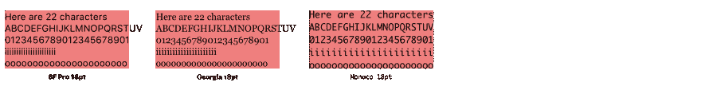

# CSS 中的 Vmin CSS 单位(em，rem，pt，px，vw，vh，Vmin，vmax，ex，ch，...)

> 原文：<https://dev.to/matthias/units-in-css-em-rem-pt-px-vw-vh-vmin-vmax-ex-ch-53l0>

CSS 知道几个度量单位。最广为人知的单位是像素，但也有其他单位不那么流行，但在某些用例中非常方便。

本文涵盖了相对单位，绝对单位和视口单位。

| 媒体 | 被推荐的 | 偶尔使用 | 不常使用 | 不推荐 |
| --- | --- | --- | --- | --- |
| 屏幕 | em，rem，% | 像素 | ch、ex、vw、vh、vmin、vmax | 厘米，毫米，英寸，磅，pc |
| 打印 | em，rem，% | 厘米，毫米，英寸，磅，pc | ch，ex | px、vw、vh、vmin、vmax |

## 相对单位

与像素、点或厘米等绝对单位相反，您也可以用百分比、em 或 rem 等相对单位来定义大小。
相关单位也[符合无障碍标准](https://www.w3.org/WAI/WCAG21/Techniques/css/C28.html)。
在大多数浏览器中，默认的字体大小是`16px`，你可以使用这个值作为计算的基础(例如 16px 等于 1em、1rem 或 100%)。

| 单位 | 描述 |
| --- | --- |
| % | 百分率 |
| 全身长的 | 元素的字体大小(例如，2.5em 表示字体比普通字体大 2.5 倍) |
| 雷姆 | 文档根元素的字体大小 |
| 荣誉勋爵 | “0”字符的宽度，在单色空间字体中，所有字符都具有相同的宽度，1ch 等于 1 个字符 |
| 前夫;前妻;前男友;前女友 | 当前字体的 x 高度，以小写字母 x 的高度度量 |

[https://codepen.io/fullstack-to/embed/PrXNGW?height=600&default-tab=result&embed-version=2](https://codepen.io/fullstack-to/embed/PrXNGW?height=600&default-tab=result&embed-version=2)

### em 和 rem 有什么区别？

区别在于传承。`rem`值基于根元素(`html`)。每个子元素都使用`html`字体大小作为计算基础。

另一方面，`em`是基于父元素的字体大小。

`rem`使字体大小的计算变得更加容易。对于嵌套元素或者甚至多个嵌套元素(例如列表)，不再需要根据父元素的字体大小来计算字体大小。`rem`总是计算与`html`标签相关的字体大小。

### 不同的字体系列

所有字体都有相同的大小(18pt)，但是红色条表示字体的 x 高度(`ex`)不同。

字体再次具有相同的大小(18pt)。在该图中，比较了字符宽度(`ch`)。单色空格字体的每个字符宽度相同，而衬线字体或无衬线字体的每个字符宽度可能不同(`i`比`o`窄)。

## 绝对单位

绝对单位的大小是固定的，你不能讨论一厘米有多长。如果需要精确的长度，应该使用绝对单位(例如，对于不应该调整大小的组件)。如果您想要定义限制以避免区域变得过宽或过窄，它们也会很有用。绝对单位不会根据屏幕大小、方向或其他变化而改变。

| 单位 | 描述 |  |
| --- | --- | --- |
| 厘米 | 厘米 | 1 厘米= 1 厘米 |
| 毫米 | 毫米 | 10 毫米= 1 厘米 |
| 在 | 英寸 | 1 英寸= 96px = 2.54 厘米 |
| 像素 | 像素 | 1 px = 1 英寸的 1/96 |
| 元素铂的符号 | 点 | 1 磅= 1 英寸的 1/72 |
| 个人计算机 | 异食癖 | 1pc = 12 磅 |

[https://codepen.io/fullstack_to/embed/mZaVBZ?height=600&default-tab=result&embed-version=2](https://codepen.io/fullstack_to/embed/mZaVBZ?height=600&default-tab=result&embed-version=2)

## Viewport units

视口单位表示当前浏览器视口的百分比。
与百分比单位的区别在于，视口单位总是以浏览器视口大小的百分比来计算。而百分比单位继承其父元素的大小。

| 单位 | 描述 |
| --- | --- |
| 大众汽车（Volkswagen 的缩写） | 视口宽度的 1%(50%表示视口宽度的一半) |
| vh | 视口高度的 1%(50%表示视口高度的一半) |
| 虚拟机(VMM) | 视口较小尺寸(vw 或 vh)的 1% |
| vmax | 视口较大尺寸(vw 或 vh)的 1% |

[https://codepen.io/fullstack-to/embed/gNZryX?height=600&default-tab=result&embed-version=2](https://codepen.io/fullstack-to/embed/gNZryX?height=600&default-tab=result&embed-version=2)

`vmin`和`vmax`可以在浏览器窗口调整大小或移动电话方向改变时改变。
`vmin`是视口的高度和宽度之间的最小值，以百分比表示，取决于哪个更小。

`vmax`是视口的高度和宽度之间的最大值，以百分比表示，取决于哪个更大。

* * *

如果你喜欢我的内容，你可能想在 Twitter 上关注我？！ [@fullstack_to](https://twitter.com/fullstack_to)

在 [Unsplash](https://unsplash.com/search/photos/measurement?utm_source=unsplash&utm_medium=referral&utm_content=creditCopyText) 上由[威廉·沃比](https://unsplash.com/@wwarby?utm_source=unsplash&utm_medium=referral&utm_content=creditCopyText)拍摄的封面图片