# 蓝丘服务器，带 apache mesos、Marathon 和 Traefik ...

> 原文:# t0]https://dev . to/deep 75/ranch er-server-with Apache-meus-marathon-and-traefik-in-azure-1 CAD

### 牧场主服务器，带有 apache mesos、Marathon 和 Traefik 的蓝色……

[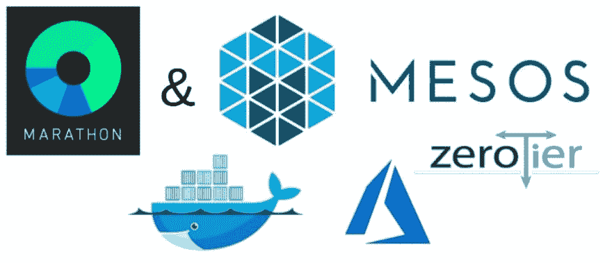](https://res.cloudinary.com/practicaldev/image/fetch/s--HkxTZ_gD--/c_limit%2Cf_auto%2Cfl_progressive%2Cq_auto%2Cw_880/https://cdn-images-1.medium.com/max/1024/1%2ArY1zX-zrYTG1YoFA0c2wqQ.jpeg)

兰彻 Server 1.6 看起来已经过时，但它允许使用 apache mesos 快速部署 Docker 容器协调器:

[牧场主的 Mesos](https://rancher.com/docs/rancher/v1.6/en/mesos/)

我将开始部署蓝色的第一个楼梯集，使兰彻服务器 1.6:

[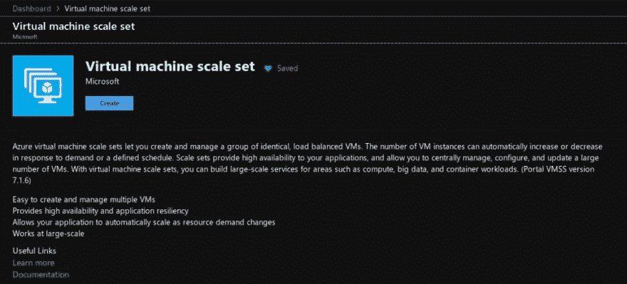](https://res.cloudinary.com/practicaldev/image/fetch/s--G8wZjgDV--/c_limit%2Cf_auto%2Cfl_progressive%2Cq_auto%2Cw_880/https://cdn-images-1.medium.com/max/1024/1%2AwoBs1UI0NbnKzmNZ5zXPEA.jpeg)

[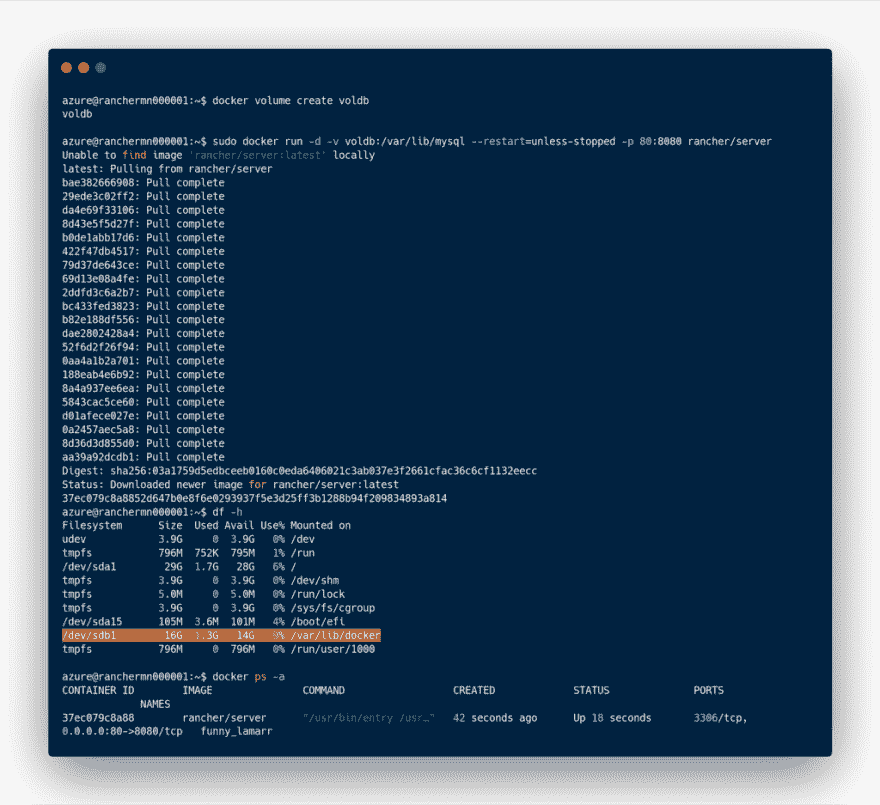](https://res.cloudinary.com/practicaldev/image/fetch/s---2NOTQVy--/c_limit%2Cf_auto%2Cfl_progressive%2Cq_auto%2Cw_880/https://cdn-images-1.medium.com/max/1024/1%2AiqHMBX1hRn--XJ2j_t-IDQ.png)

蓝丘服务器通过 ZeroTier 提供的 IP 地址发出:

[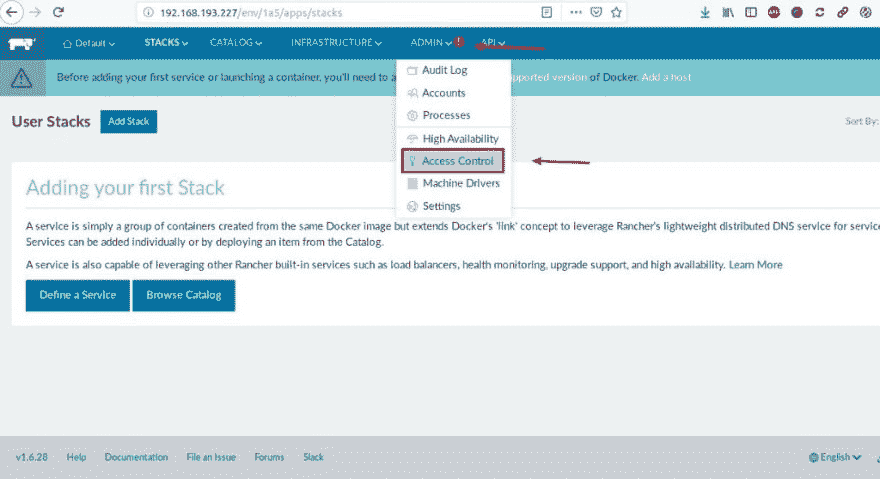](https://res.cloudinary.com/practicaldev/image/fetch/s--PFGxGgUI--/c_limit%2Cf_auto%2Cfl_progressive%2Cq_auto%2Cw_880/https://cdn-images-1.medium.com/max/1024/1%2AAcgt_18ZaZSd4uBIj3hS9A.jpeg)

您可以使用蓝丘服务器预配置其身份验证方法(在本例中为本地)。

[](https://res.cloudinary.com/practicaldev/image/fetch/s--PMMHiqSc--/c_limit%2Cf_auto%2Cfl_progressive%2Cq_auto%2Cw_880/https://cdn-images-1.medium.com/max/1024/1%2AvTZ2euNz1BFO2GKpcc_Aaw.jpeg)

[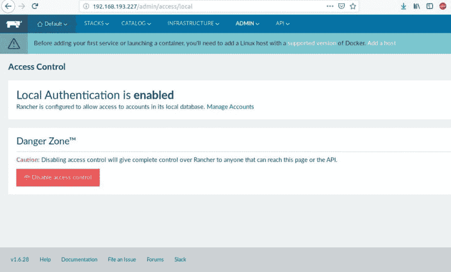](https://res.cloudinary.com/practicaldev/image/fetch/s--Ls4whKVJ--/c_limit%2Cf_auto%2Cfl_progressive%2Cq_auto%2Cw_880/https://cdn-images-1.medium.com/max/1024/1%2AKO9CItt-PMIQaStYH67BZA.jpeg)

然后，必须使用 apache mesos(而不是默认的牧场环境)配置新环境:

[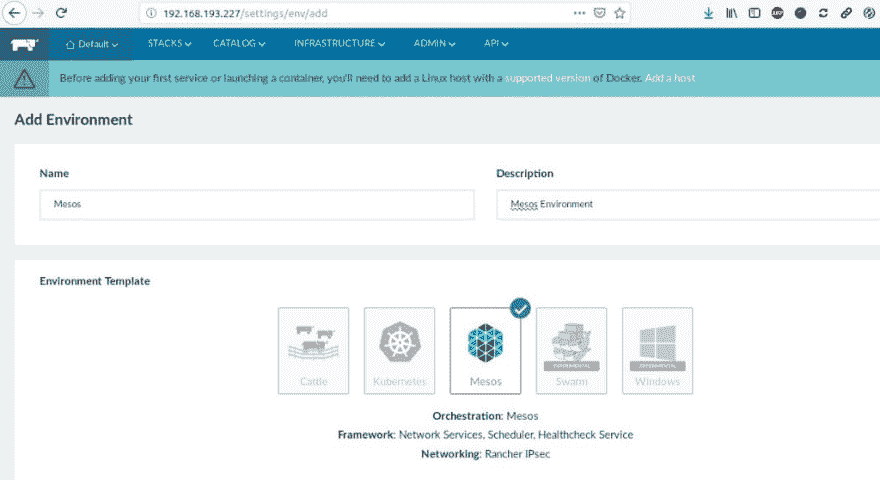](https://res.cloudinary.com/practicaldev/image/fetch/s--_HQ6Yi7m--/c_limit%2Cf_auto%2Cfl_progressive%2Cq_auto%2Cw_880/https://cdn-images-1.medium.com/max/1024/1%2AGmOdMsFPJ8jZj0Zm5Wjv5Q.jpeg)

[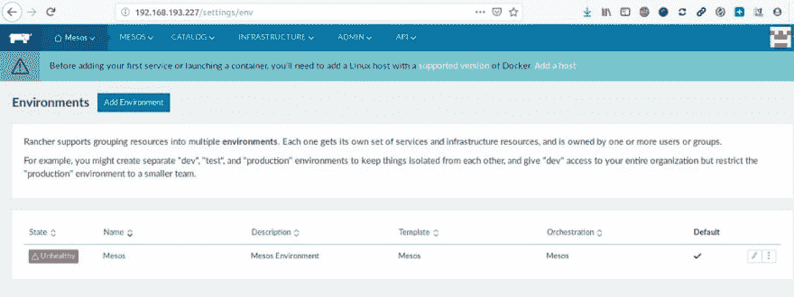](https://res.cloudinary.com/practicaldev/image/fetch/s--V0prfCWZ--/c_limit%2Cf_auto%2Cfl_progressive%2Cq_auto%2Cw_880/https://cdn-images-1.medium.com/max/1024/1%2A4zc1dLNgPpn9sgE20pAzBA.jpeg)

> 我通过蓝丘代理获取部署 mesos 群集主机所需的脚本。创建 mesos 环境后，在环境中至少添加一台主机之前，不会启动基础架构服务。至少需要添加 3 台主机。对于所有类型的 docker 容器，添加主机的过程都是相同的。添加第一台主机后，蓝丘服务器将自动开始部署基础架构服务，其中包括 meso-master、meso-slave 和 Zookeeper 服务。您可以通过兰彻服务器提供的控制板查看部署进度:

[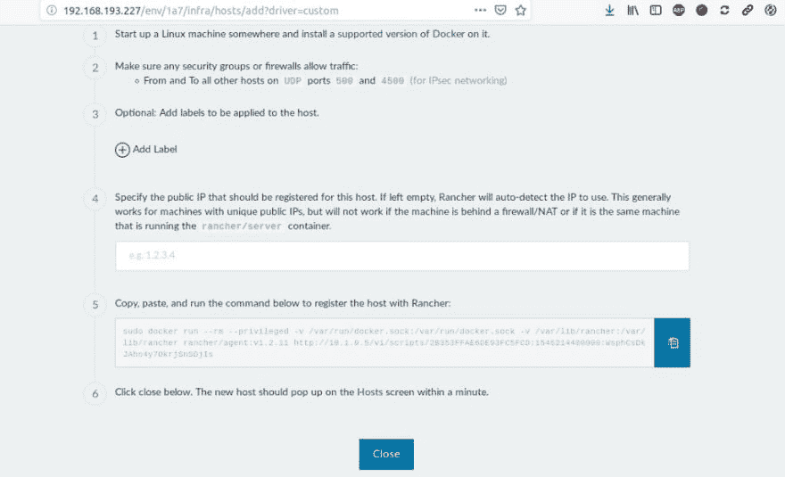](https://res.cloudinary.com/practicaldev/image/fetch/s--mQU_UAuo--/c_limit%2Cf_auto%2Cfl_progressive%2Cq_auto%2Cw_880/https://cdn-images-1.medium.com/max/1024/1%2AgUJwoCQKgNpelelUHt5jzA.jpeg)

因此，我将创建一个由 3 个实例组成的蓝色新比例集:

[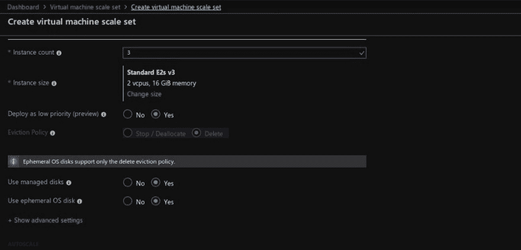](https://res.cloudinary.com/practicaldev/image/fetch/s--e9XJpLKd--/c_limit%2Cf_auto%2Cfl_progressive%2Cq_auto%2Cw_880/https://cdn-images-1.medium.com/max/1024/1%2AL1FDX8CQfQx3FylRmxS_-A.jpeg)

[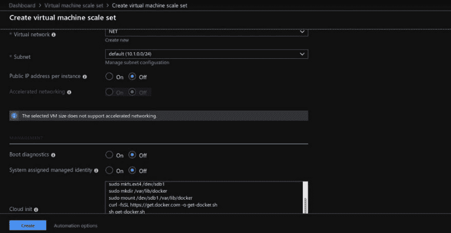](https://res.cloudinary.com/practicaldev/image/fetch/s--1zHEk3O---/c_limit%2Cf_auto%2Cfl_progressive%2Cq_auto%2Cw_880/https://cdn-images-1.medium.com/max/1024/1%2AUenGeE-GPudcGCl0L8M7ug.jpeg)

伴随此文件*云-init* :

[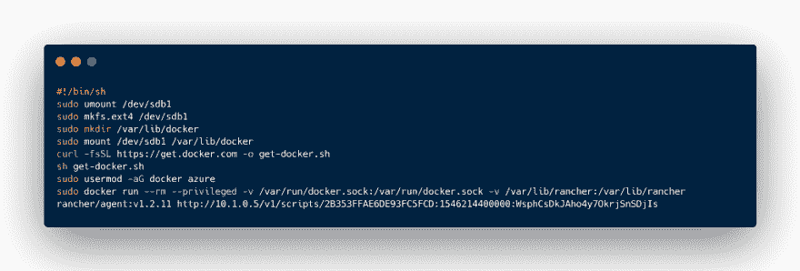](https://res.cloudinary.com/practicaldev/image/fetch/s--9IVbtjqX--/c_limit%2Cf_auto%2Cfl_progressive%2Cq_auto%2Cw_880/https://cdn-images-1.medium.com/max/1024/1%2AM2OyKbz3mzLkWfMiHoEnFg.png)

然后，第二个比例集开始运作:

[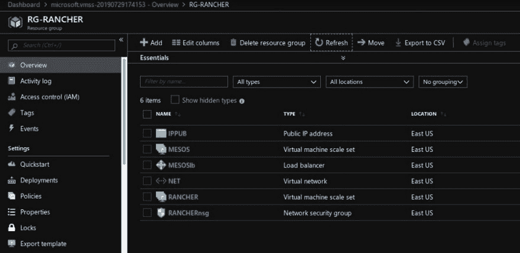](https://res.cloudinary.com/practicaldev/image/fetch/s--7Rdvsdds--/c_limit%2Cf_auto%2Cfl_progressive%2Cq_auto%2Cw_880/https://cdn-images-1.medium.com/max/1024/1%2A4nrGkChWCA7YVNeULWEyxQ.jpeg)

使用 ZeroTier 可以避免使用 Scale Set 中提供的负载平衡器，因为默认情况下这些实例具有专用 IP 地址:

[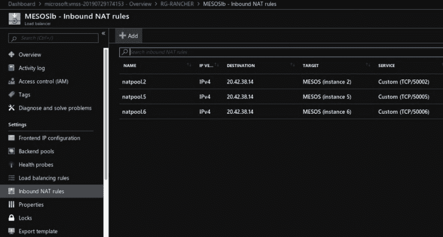](https://res.cloudinary.com/practicaldev/image/fetch/s--fabkX2b_--/c_limit%2Cf_auto%2Cfl_progressive%2Cq_auto%2Cw_880/https://cdn-images-1.medium.com/max/1024/1%2AFt1d1nukANDIyJ6XugHnmA.jpeg)

集群主机配置是从“代理中继”部署开始的:

[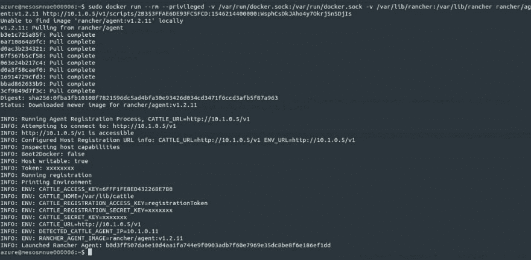](https://res.cloudinary.com/practicaldev/image/fetch/s--cB5azXB_--/c_limit%2Cf_auto%2Cfl_progressive%2Cq_auto%2Cw_880/https://cdn-images-1.medium.com/max/1024/1%2AA7ikZYTB-4xWab_gKNHYew.jpeg)

这三个主机将显示在“中间”环境控制面板中:

[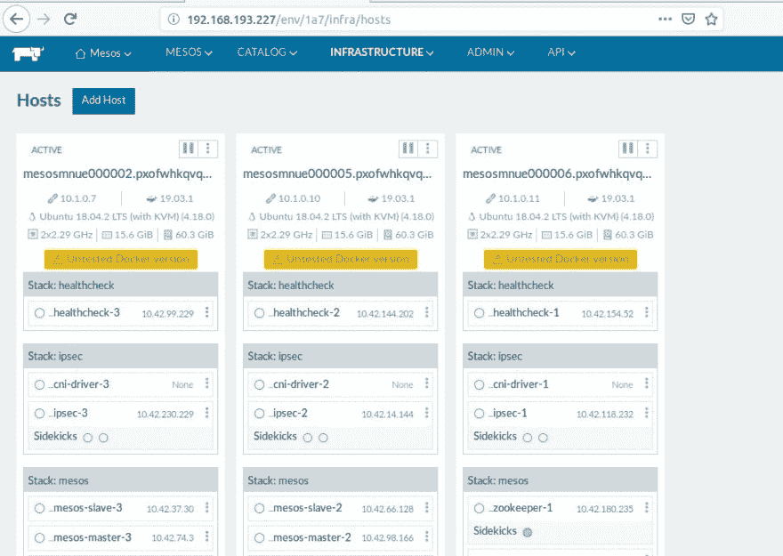](https://res.cloudinary.com/practicaldev/image/fetch/s--hLyux30Y--/c_limit%2Cf_auto%2Cfl_progressive%2Cq_auto%2Cw_880/https://cdn-images-1.medium.com/max/951/1%2A5_nqxZ-mDaxcLu_Br4iOJg.jpeg)

[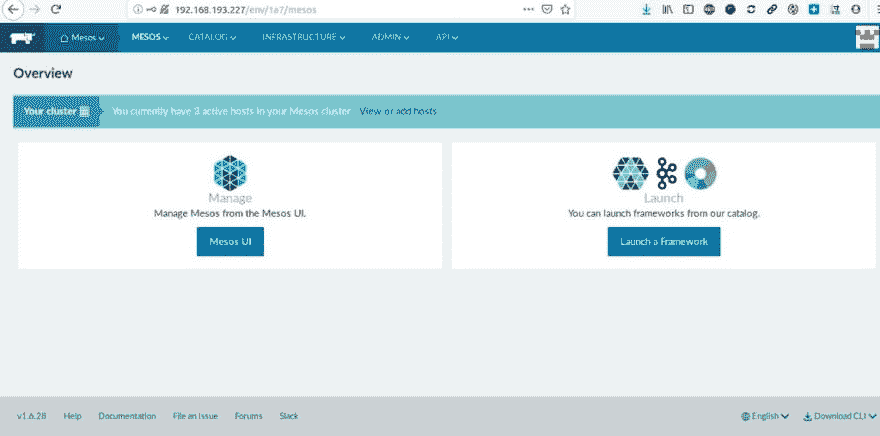](https://res.cloudinary.com/practicaldev/image/fetch/s--MI56r4Sv--/c_limit%2Cf_auto%2Cfl_progressive%2Cq_auto%2Cw_880/https://cdn-images-1.medium.com/max/1024/1%2AJONv8_H0fy3GW4cBT9-TQg.jpeg)

以及基础架构堆栈的状态:

[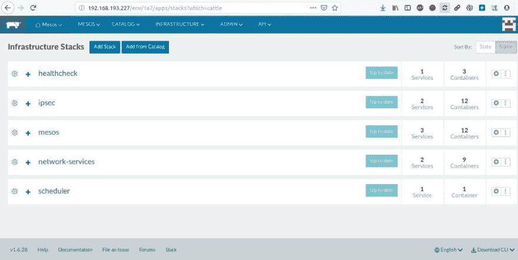](https://res.cloudinary.com/practicaldev/image/fetch/s--3jrUBjjj--/c_limit%2Cf_auto%2Cfl_progressive%2Cq_auto%2Cw_880/https://cdn-images-1.medium.com/max/1024/1%2AC4HHA79MHXG3_WmTKhVmow.jpeg)

然后，我可以通过蓝丘服务器上的市场区部署 Marathon(包括 docker 容器):

[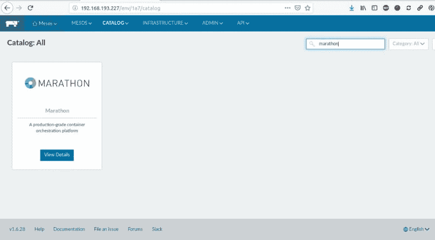](https://res.cloudinary.com/practicaldev/image/fetch/s--aEwlNGiT--/c_limit%2Cf_auto%2Cfl_progressive%2Cq_auto%2Cw_880/https://cdn-images-1.medium.com/max/1024/1%2ABhfCbJHZ10VF0gwQFwtNpw.jpeg)

[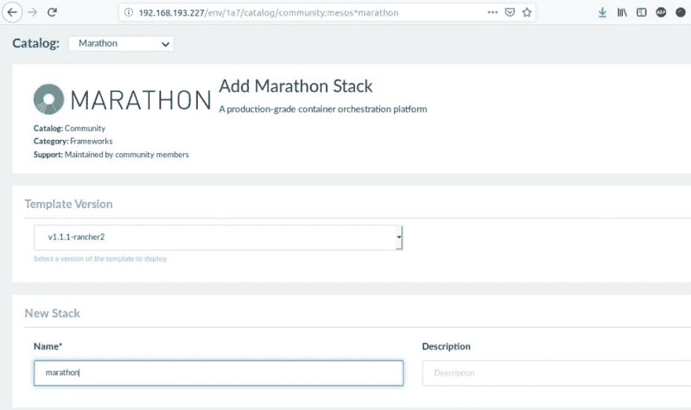](https://res.cloudinary.com/practicaldev/image/fetch/s--u6VsP5kX--/c_limit%2Cf_auto%2Cfl_progressive%2Cq_auto%2Cw_880/https://cdn-images-1.medium.com/max/1024/1%2AVvzHdNwl1EpmlOpOZ6mxWA.jpeg)

然后，它出现在 mesos 环境堆栈中:

[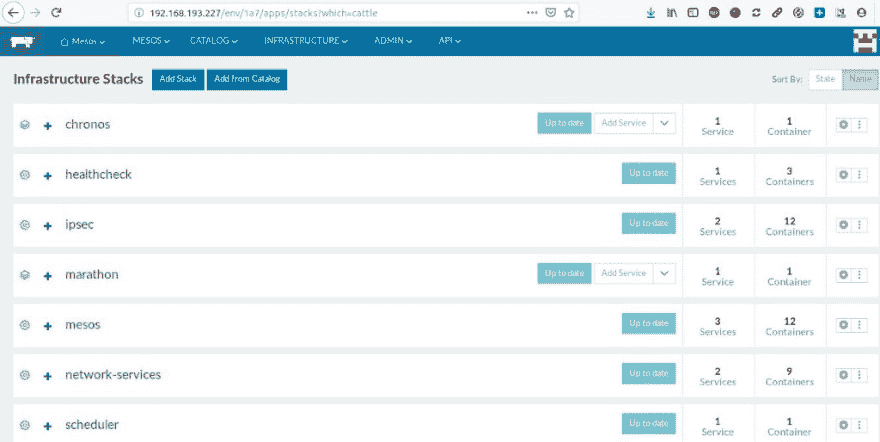](https://res.cloudinary.com/practicaldev/image/fetch/s--a8uxdGM9--/c_limit%2Cf_auto%2Cfl_progressive%2Cq_auto%2Cw_880/https://cdn-images-1.medium.com/max/1024/1%2A57tNjRvp9ql1YSODdrpnPQ.jpeg)

[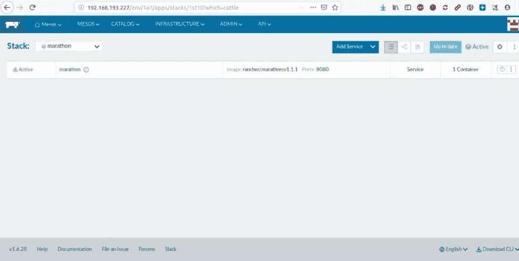](https://res.cloudinary.com/practicaldev/image/fetch/s--nBC7wXnC--/c_limit%2Cf_auto%2Cfl_progressive%2Cq_auto%2Cw_880/https://cdn-images-1.medium.com/max/1024/1%2ASZDmk5xV0J7mp8RORpIQBA.jpeg)

还是通过 ZeroTier 我可以参加马拉松比赛使用以下类型的 JSON 参数启动多个 docker 容器组:

[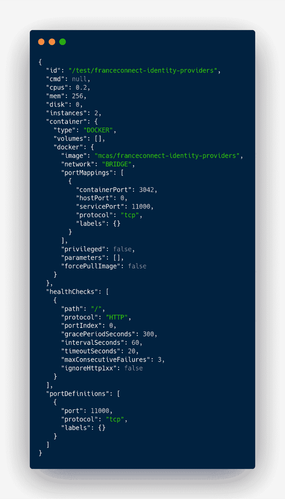](https://res.cloudinary.com/practicaldev/image/fetch/s--rJDwtU4w--/c_limit%2Cf_auto%2Cfl_progressive%2Cq_auto%2Cw_880/https://cdn-images-1.medium.com/max/1024/1%2A3Bie_Vg8-1U14Rb4L5BU7w.png)

[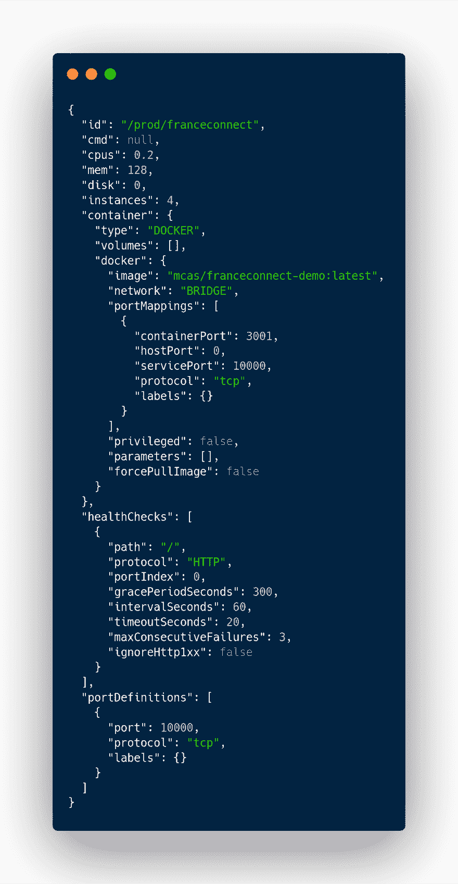](https://res.cloudinary.com/practicaldev/image/fetch/s--dBfx_Lsb--/c_limit%2Cf_auto%2Cfl_progressive%2Cq_auto%2Cw_880/https://cdn-images-1.medium.com/max/972/1%2A4L1gKN94Ym1d4AesOIVnEQ.png)

容器组在 Mesos 群集中处于活动状态:

[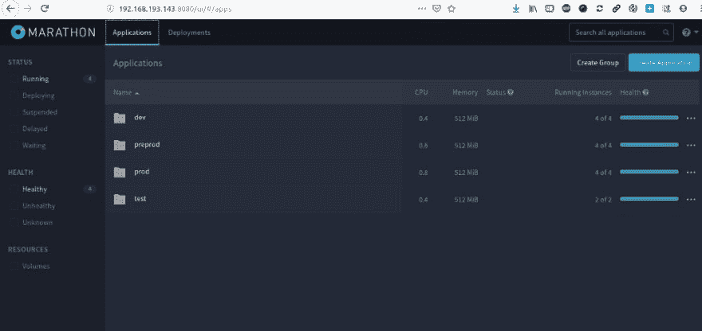](https://res.cloudinary.com/practicaldev/image/fetch/s--BlfDtyRy--/c_limit%2Cf_auto%2Cfl_progressive%2Cq_auto%2Cw_880/https://cdn-images-1.medium.com/max/1024/1%2AJPq5PWZAnWeKlHS1lC5bhw.jpeg)

[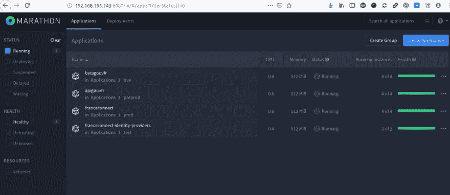](https://res.cloudinary.com/practicaldev/image/fetch/s--c4Ia-Qxq--/c_limit%2Cf_auto%2Cfl_progressive%2Cq_auto%2Cw_880/https://cdn-images-1.medium.com/max/1024/1%2AoS5l6mCCmd4A93MGXUAxCQ.jpeg)

容器显示在兰彻服务器的仪表板中:

[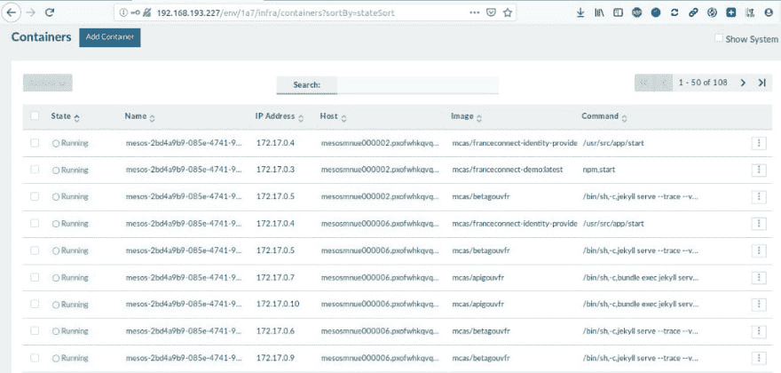](https://res.cloudinary.com/practicaldev/image/fetch/s--sW-m2Dk8--/c_limit%2Cf_auto%2Cfl_progressive%2Cq_auto%2Cw_880/https://cdn-images-1.medium.com/max/1024/1%2AAAjhdxAXakRrAHFAoi5V4w.jpeg)

还提供了一个 Web 界面来管理其 mesos 群集:

[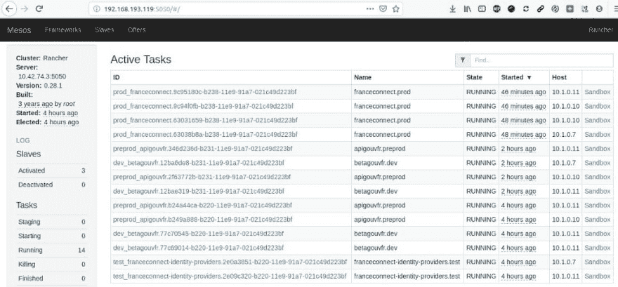](https://res.cloudinary.com/practicaldev/image/fetch/s--RgZZE8VF--/c_limit%2Cf_auto%2Cfl_progressive%2Cq_auto%2Cw_880/https://cdn-images-1.medium.com/max/1024/1%2AkjDO7oC0ECApjqvvhkjLxg.jpeg)

[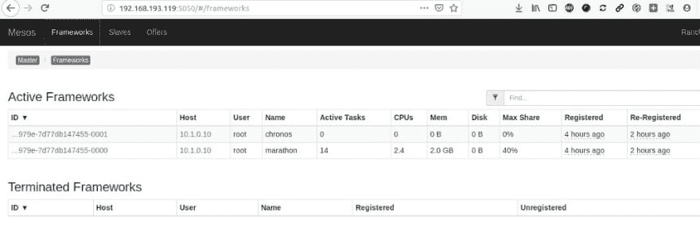](https://res.cloudinary.com/practicaldev/image/fetch/s--x6vwj4eq--/c_limit%2Cf_auto%2Cfl_progressive%2Cq_auto%2Cw_880/https://cdn-images-1.medium.com/max/1024/1%2Ah-PYanyzvUZEWesALyZ87g.jpeg)

[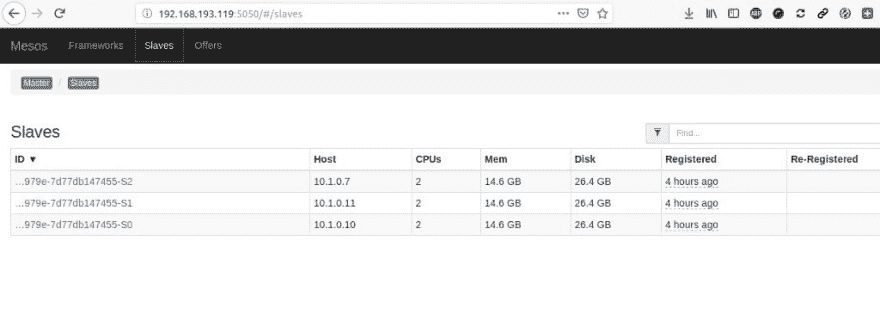](https://res.cloudinary.com/practicaldev/image/fetch/s--_x2vfij5--/c_limit%2Cf_auto%2Cfl_progressive%2Cq_auto%2Cw_880/https://cdn-images-1.medium.com/max/1024/1%2AbsyhoHF0RaRqaZvaCKf6xA.jpeg)

为了访问这些容器提供的服务，我安装了 Traefik 服务器，

[云原生边缘路由器](https://traefik.io/)

[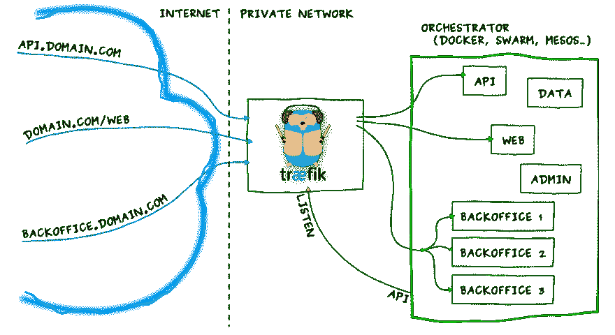](https://res.cloudinary.com/practicaldev/image/fetch/s--vi4NvxMQ--/c_limit%2Cf_auto%2Cfl_progressive%2Cq_auto%2Cw_880/https://cdn-images-1.medium.com/max/1024/0%2AJclxmO-Wb1tMqeyT.png)

在 ranch set scale 中添加实例(具有公共 IP 地址):

[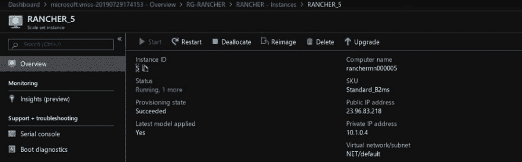](https://res.cloudinary.com/practicaldev/image/fetch/s--1Hjz2kAe--/c_limit%2Cf_auto%2Cfl_progressive%2Cq_auto%2Cw_880/https://cdn-images-1.medium.com/max/1024/1%2A-38PtB5fkdj7b8Ma5C3CEQ.jpeg)

我使用此 TOML 文件来配置它:

[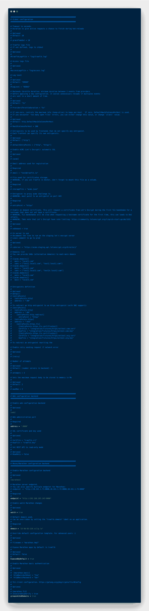](https://res.cloudinary.com/practicaldev/image/fetch/s--hQ8uE3XX--/c_limit%2Cf_auto%2Cfl_progressive%2Cq_auto%2Cw_880/https://cdn-images-1.medium.com/max/1024/1%2AZQtmS9pbJF6FxX6pxIfTVw.png)T3】

```
$ nohup sudo traefik --configFile=traefik.toml & 
```

Traefik 服务器及其控制面板是可访问的(仅适用于 Camembert 1.12):

[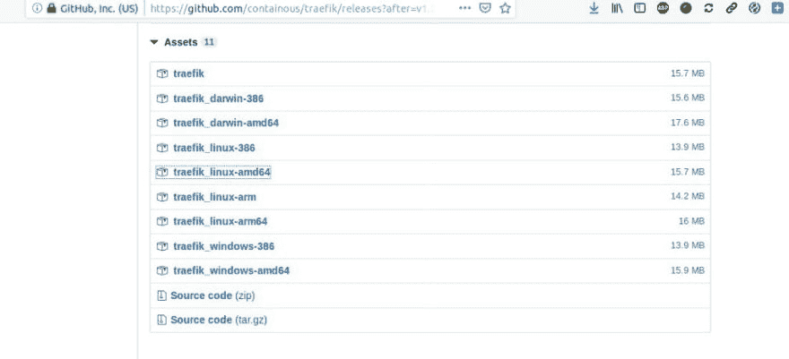](https://res.cloudinary.com/practicaldev/image/fetch/s--JESYxLg4--/c_limit%2Cf_auto%2Cfl_progressive%2Cq_auto%2Cw_880/https://cdn-images-1.medium.com/max/1024/1%2Aoq_IUBtSKTkyoikbYR3xnw.jpeg)

[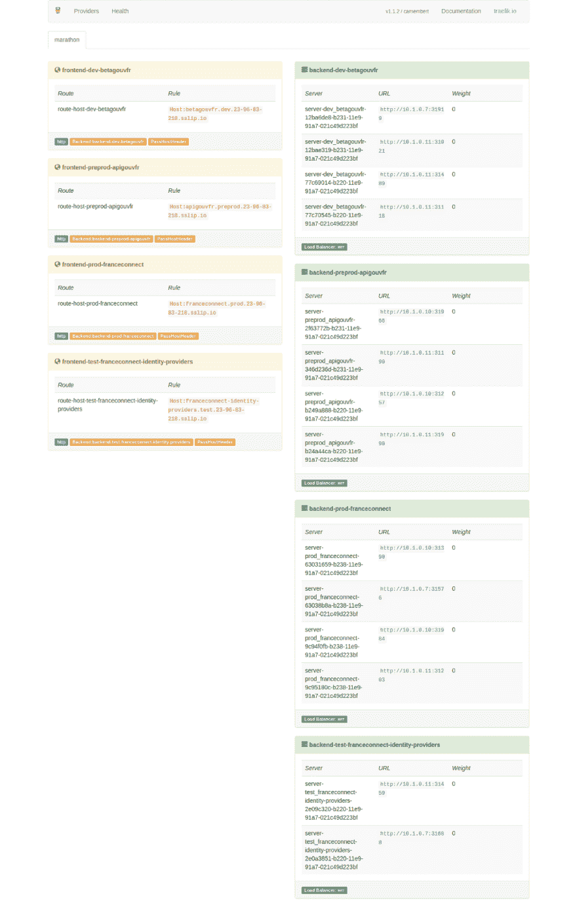](https://res.cloudinary.com/practicaldev/image/fetch/s--YyeNxrpW--/c_limit%2Cf_auto%2Cfl_progressive%2Cq_auto%2Cw_880/https://cdn-images-1.medium.com/max/1024/1%2AkBBgni2VaaSIx8vgjN0oxg.png)

[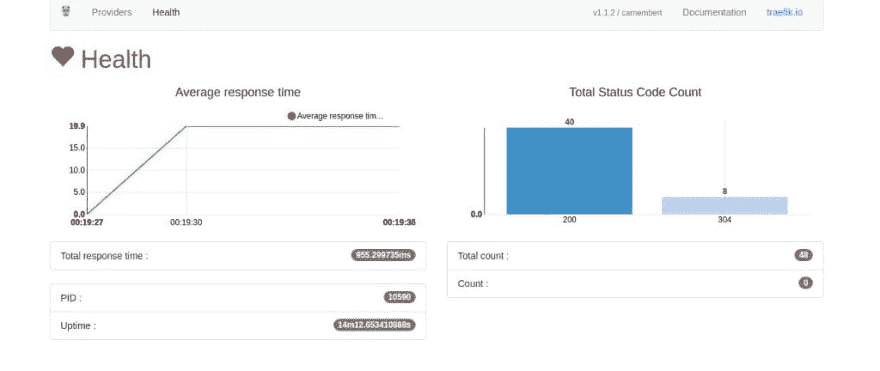](https://res.cloudinary.com/practicaldev/image/fetch/s--nOFuKi3t--/c_limit%2Cf_auto%2Cfl_progressive%2Cq_auto%2Cw_880/https://cdn-images-1.medium.com/max/1024/1%2AjOoCgzFbUttnUzf5Tvdx_Q.jpeg)

Traefik 中使用通配符域自动提供的地址允许公众访问以前使用 docker 容器部署的各种服务:

[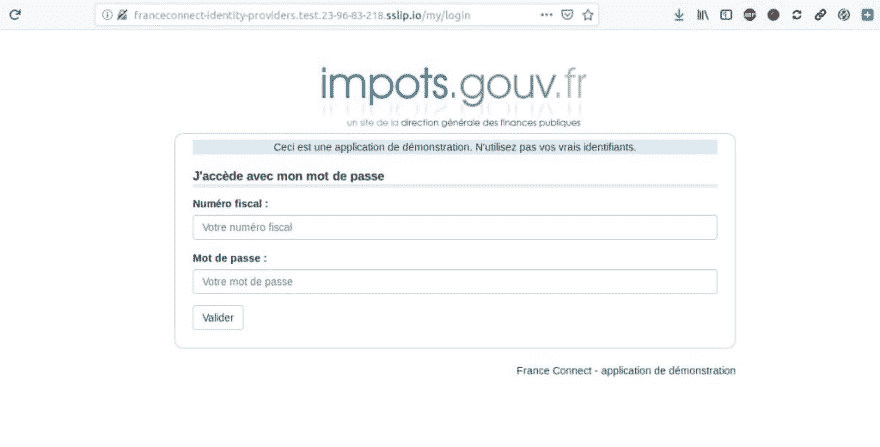](https://res.cloudinary.com/practicaldev/image/fetch/s--pNlvCbXU--/c_limit%2Cf_auto%2Cfl_progressive%2Cq_auto%2Cw_880/https://cdn-images-1.medium.com/max/1024/1%2ACkvzDENUrqIqw5qJp7vHpg.jpeg)

[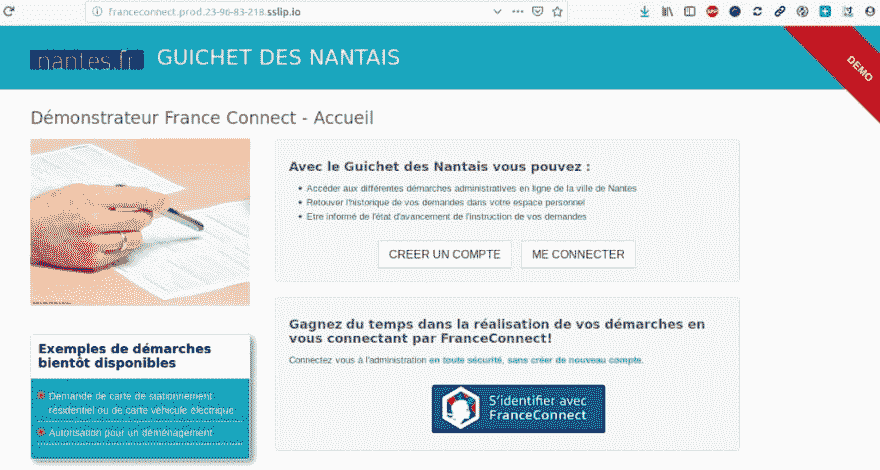](https://res.cloudinary.com/practicaldev/image/fetch/s--fzNe6mH8--/c_limit%2Cf_auto%2Cfl_progressive%2Cq_auto%2Cw_880/https://cdn-images-1.medium.com/max/1024/1%2Aazj4RIUdkhhEAZ0ommOIxQ.jpeg)

[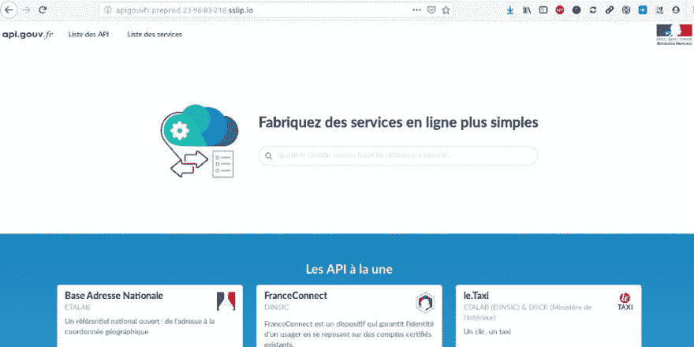](https://res.cloudinary.com/practicaldev/image/fetch/s--7GdeywQP--/c_limit%2Cf_auto%2Cfl_progressive%2Cq_auto%2Cw_880/https://cdn-images-1.medium.com/max/1024/1%2A6Ie14gpnogNqLOFYccTGjw.jpeg)

[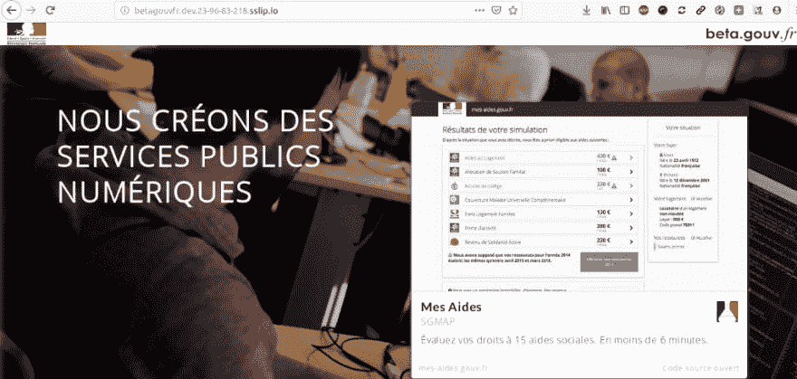](https://res.cloudinary.com/practicaldev/image/fetch/s--ClW3u5Qy--/c_limit%2Cf_auto%2Cfl_progressive%2Cq_auto%2Cw_880/https://cdn-images-1.medium.com/max/1024/1%2AUzVIixTBkknOGhVbxYdo0Q.jpeg)

[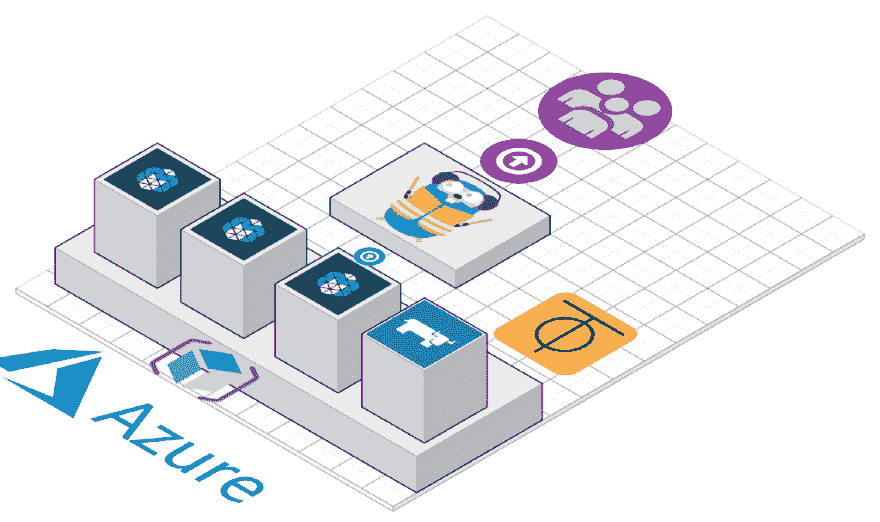](https://res.cloudinary.com/practicaldev/image/fetch/s--b5sYG4kL--/c_limit%2Cf_auto%2Cfl_progressive%2Cq_auto%2Cw_880/https://cdn-images-1.medium.com/max/1024/1%2AYb0ok_H1mkOU9HyUbHb_kg.png)

[](https://res.cloudinary.com/practicaldev/image/fetch/s--6uNoWbP5--/c_limit%2Cf_auto%2Cfl_progressive%2Cq_auto%2Cw_880/https://cdn-images-1.medium.com/max/649/1%2AceNddV91LRBsNa8ML-MnAg.jpeg)

也可以在单个实例中重新创建此群集。首先，我将启动一个新的子网，以使用蓝色堡垒(从上个月开始预览) :

[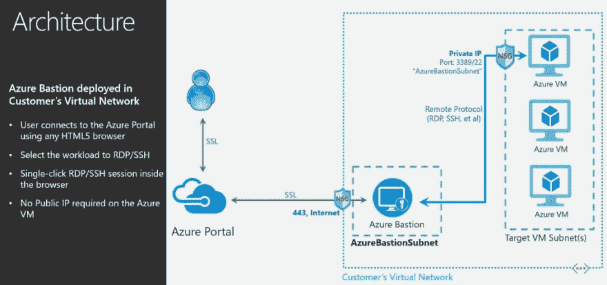](https://res.cloudinary.com/practicaldev/image/fetch/s--QctLW-Wu--/c_limit%2Cf_auto%2Cfl_progressive%2Cq_auto%2Cw_880/https://cdn-images-1.medium.com/max/1011/1%2A9K7RFUk2TLg_cR8o45T4ew.jpeg)

[Azure Bastion |微软 Azure](https://azure.microsoft.com/fr-fr/services/azure-bastion/)

[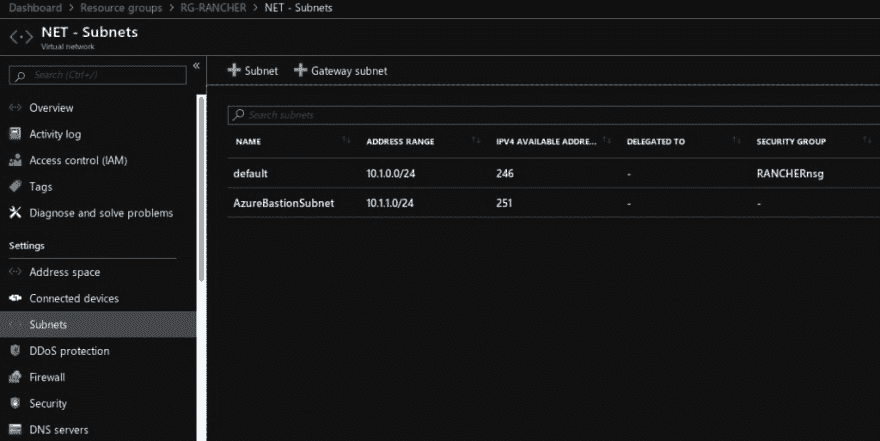](https://res.cloudinary.com/practicaldev/image/fetch/s--Fn6GMjZf--/c_limit%2Cf_auto%2Cfl_progressive%2Cq_auto%2Cw_880/https://cdn-images-1.medium.com/max/1024/1%2AsaX1M7eKdFMnr1sU97XcQg.jpeg)

它被称为 azurebastionsubnet。我要把 Azure Bastion 和 Ubuntu 的新版本联系起来:

[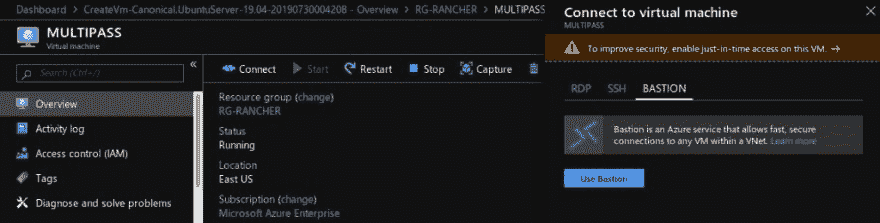](https://res.cloudinary.com/practicaldev/image/fetch/s--U-j-roSO--/c_limit%2Cf_auto%2Cfl_progressive%2Cq_auto%2Cw_880/https://cdn-images-1.medium.com/max/1024/1%2ANS9Teazpb5BWJIbERcmheg.jpeg)

[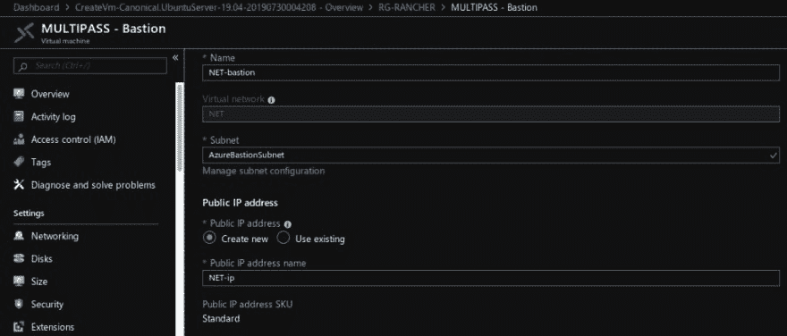](https://res.cloudinary.com/practicaldev/image/fetch/s--e9Xl8GPe--/c_limit%2Cf_auto%2Cfl_progressive%2Cq_auto%2Cw_880/https://cdn-images-1.medium.com/max/1024/1%2Ayy9UnFbqwObS_yKhlh9UkA.jpeg)

以前，我已配置增加此实例的系统磁盘大小，以支持创建此新的 mesos 群集:

[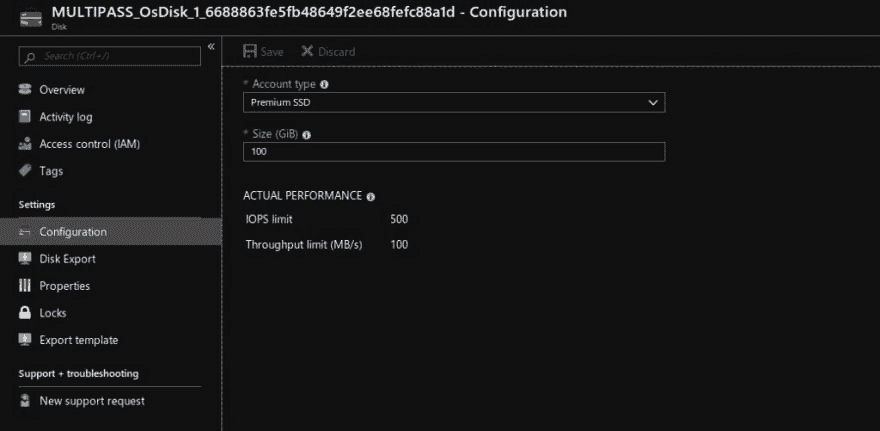](https://res.cloudinary.com/practicaldev/image/fetch/s--BNQA9iOI--/c_limit%2Cf_auto%2Cfl_progressive%2Cq_auto%2Cw_880/https://cdn-images-1.medium.com/max/1024/1%2AbKhhZSSbcni6rLyvlIg6Ow.jpeg)

然后，我可以直接从蓝色门户连接到此实例:

[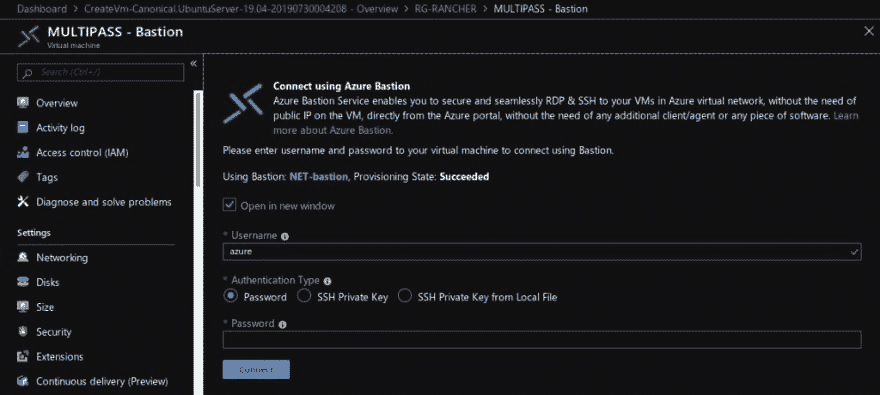](https://res.cloudinary.com/practicaldev/image/fetch/s--Mz0Zug-q--/c_limit%2Cf_auto%2Cfl_progressive%2Cq_auto%2Cw_880/https://cdn-images-1.medium.com/max/1024/1%2A4BBfqf4qBoyRzq_ICc7JWA.jpeg)

随着具有 Shell 访问权限的新网页的出现:

[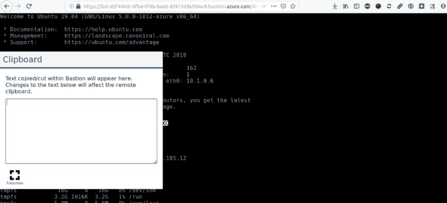](https://res.cloudinary.com/practicaldev/image/fetch/s--d9zur_FX--/c_limit%2Cf_auto%2Cfl_progressive%2Cq_auto%2Cw_880/https://cdn-images-1.medium.com/max/1024/1%2AH8VmyyUZ6BHd_mq14jnOGQ.jpeg)

安装最新的 Multipass 版本:

[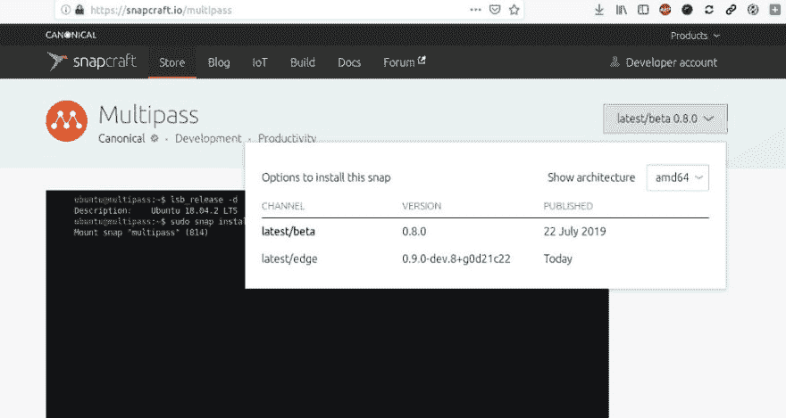](https://res.cloudinary.com/practicaldev/image/fetch/s--HpxFJ5a4--/c_limit%2Cf_auto%2Cfl_progressive%2Cq_auto%2Cw_880/https://cdn-images-1.medium.com/max/1024/1%2AcZV-Xpu6Dteh6pGJANe_AA.jpeg)

[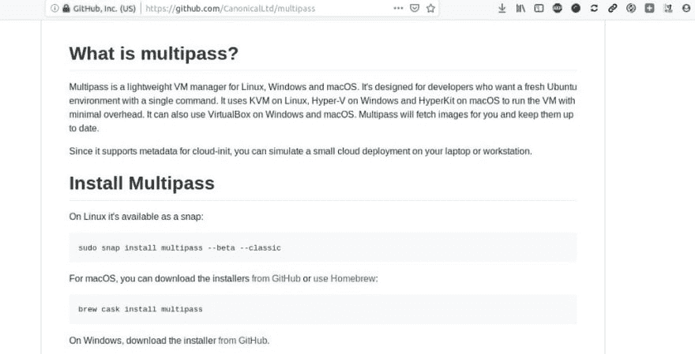](https://res.cloudinary.com/practicaldev/image/fetch/s--ol1l1QHX--/c_limit%2Cf_auto%2Cfl_progressive%2Cq_auto%2Cw_880/https://cdn-images-1.medium.com/max/1024/1%2AvEOoIevhKMk4SS8PHyYqZw.jpeg)

[](https://res.cloudinary.com/practicaldev/image/fetch/s--JeUDYiLD--/c_limit%2Cf_auto%2Cfl_progressive%2Cq_auto%2Cw_880/https://cdn-images-1.medium.com/max/1024/1%2AG0B3Hc0LiuX3OdQZ-Synmg.jpeg)

并创建四个虚拟机，这些虚拟机将构成此新 mesos 群集(包括 Rancher 服务器)的框架。它们像以前一样连接到 ZeroTier:

[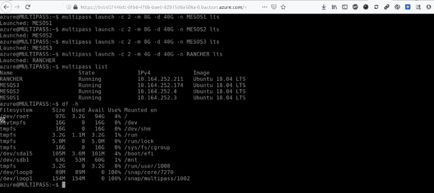](https://res.cloudinary.com/practicaldev/image/fetch/s--0uGIMYCQ--/c_limit%2Cf_auto%2Cfl_progressive%2Cq_auto%2Cw_880/https://cdn-images-1.medium.com/max/1024/1%2A0Ypzafpz0ucFruHW_j34QA.jpeg)

部署完兰彻服务器后，我可以开始在虚拟机上部署兰彻代理，并创建我的新 mesos 群集中的主机池:

[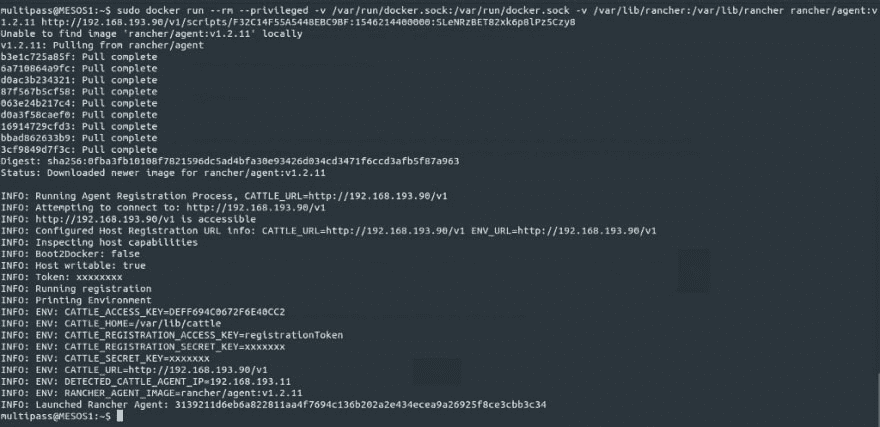](https://res.cloudinary.com/practicaldev/image/fetch/s--uzZUBTi7--/c_limit%2Cf_auto%2Cfl_progressive%2Cq_auto%2Cw_880/https://cdn-images-1.medium.com/max/1024/1%2Au0zcLRjfa5FwqyTerJ1Fcg.jpeg)

[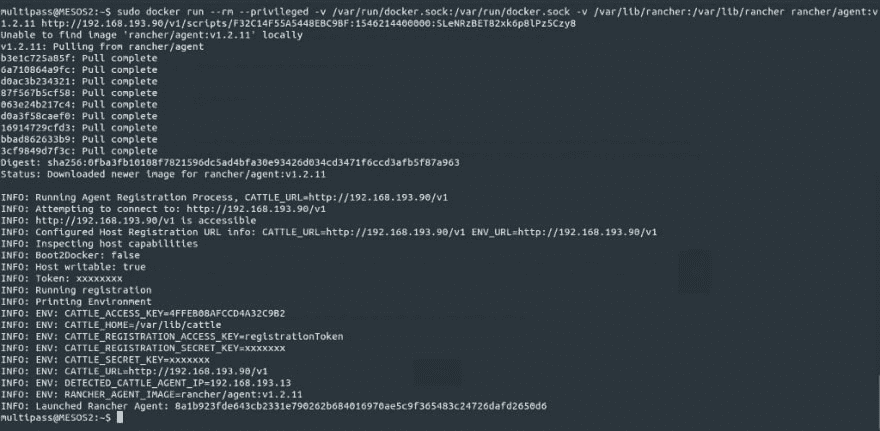](https://res.cloudinary.com/practicaldev/image/fetch/s--Lav1RUYU--/c_limit%2Cf_auto%2Cfl_progressive%2Cq_auto%2Cw_880/https://cdn-images-1.medium.com/max/1024/1%2AlRGNO24OGQk0yoHwdC4-qg.jpeg)

[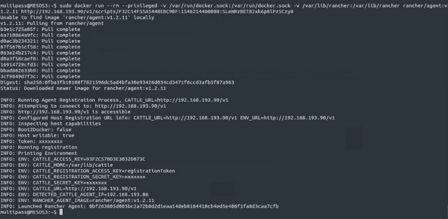](https://res.cloudinary.com/practicaldev/image/fetch/s--HcyYMUC4--/c_limit%2Cf_auto%2Cfl_progressive%2Cq_auto%2Cw_880/https://cdn-images-1.medium.com/max/1024/1%2ATgbQf_2TJ4gtjuZFI2fRKA.jpeg)

所有三个主机都可以运行:

[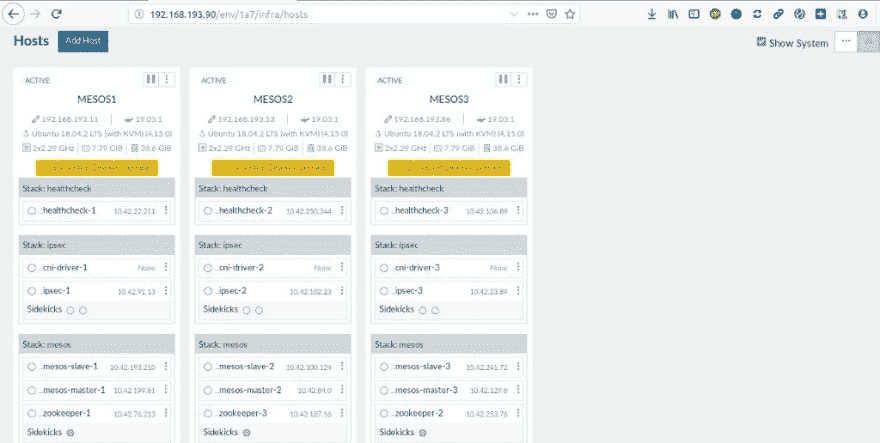](https://res.cloudinary.com/practicaldev/image/fetch/s--2z2HGoNr--/c_limit%2Cf_auto%2Cfl_progressive%2Cq_auto%2Cw_880/https://cdn-images-1.medium.com/max/1024/1%2AxEbelfX6QuVp1M96UADiDA.jpeg)

我在集群中安装了马拉松服务:

[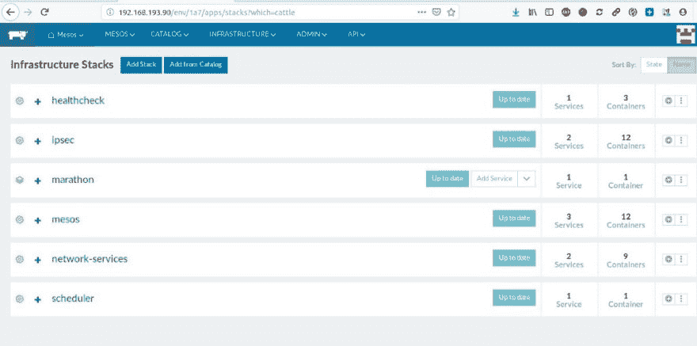](https://res.cloudinary.com/practicaldev/image/fetch/s--zBb1irHP--/c_limit%2Cf_auto%2Cfl_progressive%2Cq_auto%2Cw_880/https://cdn-images-1.medium.com/max/1024/1%2AkzaTAfuvFl7P8U4muX7l6A.jpeg)

在马拉松比赛中，我重新启动我的码头集装箱组:

[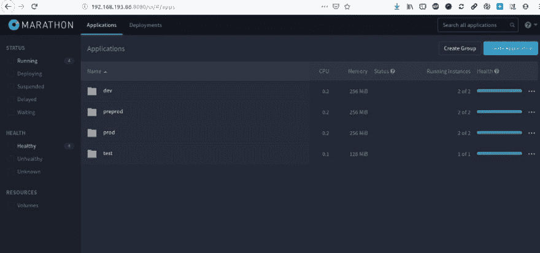](https://res.cloudinary.com/practicaldev/image/fetch/s--ZLgvBZxU--/c_limit%2Cf_auto%2Cfl_progressive%2Cq_auto%2Cw_880/https://cdn-images-1.medium.com/max/1024/1%2A35_Vqmyf2ZsjZArvJxEQhQ.jpeg)

[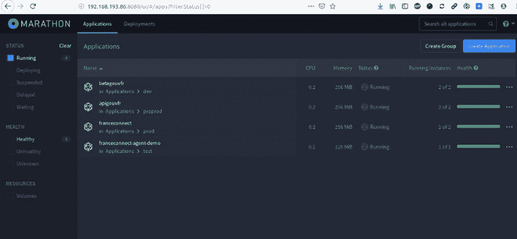](https://res.cloudinary.com/practicaldev/image/fetch/s--d1OjYxRb--/c_limit%2Cf_auto%2Cfl_progressive%2Cq_auto%2Cw_880/https://cdn-images-1.medium.com/max/1024/1%2AroCY8ONbp9Zo6eY_XdwwCQ.jpeg)

[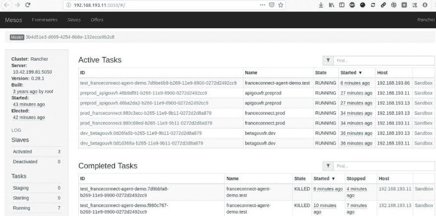](https://res.cloudinary.com/practicaldev/image/fetch/s--5-ffvcTN--/c_limit%2Cf_auto%2Cfl_progressive%2Cq_auto%2Cw_880/https://cdn-images-1.medium.com/max/1024/1%2A9WvQfQxamrUMck143n3KEg.jpeg)

[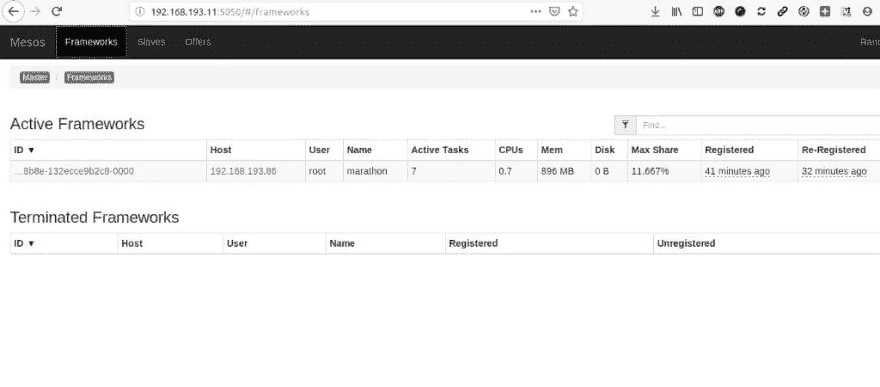](https://res.cloudinary.com/practicaldev/image/fetch/s--sJPYR9s5--/c_limit%2Cf_auto%2Cfl_progressive%2Cq_auto%2Cw_880/https://cdn-images-1.medium.com/max/1024/1%2A12cWlbZ6_0qUOSpumFJRsg.jpeg)

[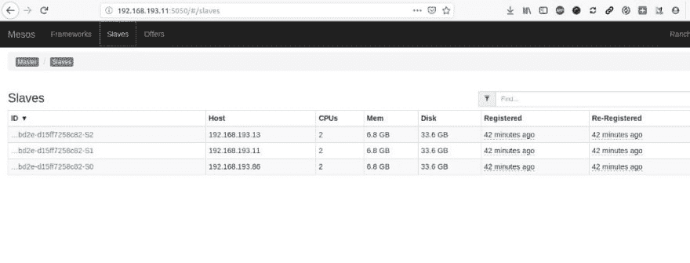](https://res.cloudinary.com/practicaldev/image/fetch/s--6RJGZnmh--/c_limit%2Cf_auto%2Cfl_progressive%2Cq_auto%2Cw_880/https://cdn-images-1.medium.com/max/1024/1%2AmZK0d6lRXJKHjQAlJRqaHw.jpeg)

我将通过此 TOML 文件(与上一个文件相同，并更改了 IP 地址)在 Multipass 实例中重新部署 Traefik:

[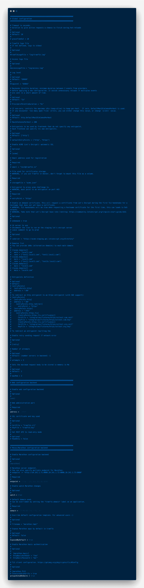](https://res.cloudinary.com/practicaldev/image/fetch/s--ZCswKgGZ--/c_limit%2Cf_auto%2Cfl_progressive%2Cq_auto%2Cw_880/https://cdn-images-1.medium.com/max/1024/1%2AzS4iQ_nLZR5imRB1kLcptw.png)

Traefik 通过通配符域自动将地址返回给我:

[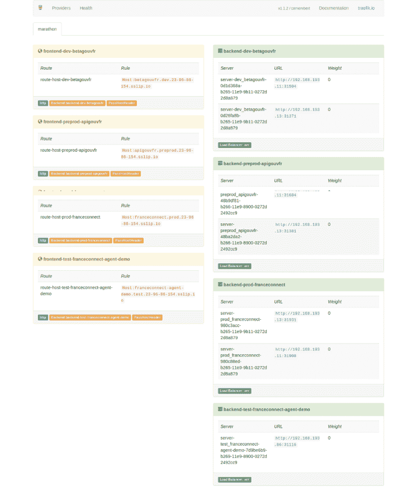](https://res.cloudinary.com/practicaldev/image/fetch/s--a2Br5F9f--/c_limit%2Cf_auto%2Cfl_progressive%2Cq_auto%2Cw_880/https://cdn-images-1.medium.com/max/1024/1%2Aid-64NikrEvDKl0fewMvYQ.png)

让我可以使用以前的服务:

[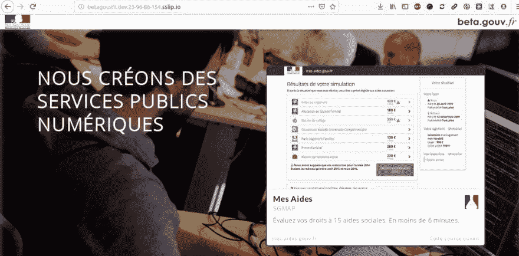](https://res.cloudinary.com/practicaldev/image/fetch/s--jnDGERJs--/c_limit%2Cf_auto%2Cfl_progressive%2Cq_auto%2Cw_880/https://cdn-images-1.medium.com/max/1024/1%2Amt0vti2JoUJUc9GSyA9tEQ.jpeg)

[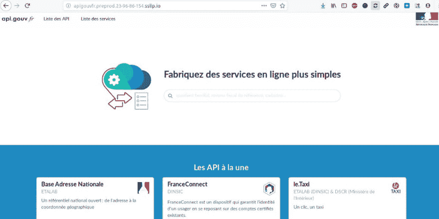](https://res.cloudinary.com/practicaldev/image/fetch/s--xnT-l7w1--/c_limit%2Cf_auto%2Cfl_progressive%2Cq_auto%2Cw_880/https://cdn-images-1.medium.com/max/1024/1%2AyiVYT522LTlJwdUgSPqISg.jpeg)

[](https://res.cloudinary.com/practicaldev/image/fetch/s--GTIzrvI8--/c_limit%2Cf_auto%2Cfl_progressive%2Cq_auto%2Cw_880/https://cdn-images-1.medium.com/max/1024/1%2AhmXAt-2SmTO0O1oFxGALZg.jpeg)

因此，在此示例中，mesos 群集依赖于一个实例，而不会过度消耗:

[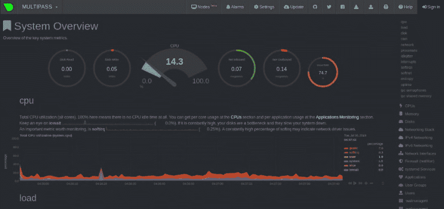](https://res.cloudinary.com/practicaldev/image/fetch/s--0ulhWB5_--/c_limit%2Cf_auto%2Cfl_progressive%2Cq_auto%2Cw_880/https://cdn-images-1.medium.com/max/1024/1%2Awv0sZfNN1YvH9rCvx9wMmQ.jpeg)

[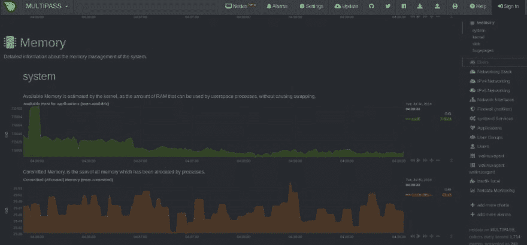](https://res.cloudinary.com/practicaldev/image/fetch/s--joa4zGH3--/c_limit%2Cf_auto%2Cfl_progressive%2Cq_auto%2Cw_880/https://cdn-images-1.medium.com/max/1024/1%2Aw6PMOJm7CHtWBeHdY5MB6g.jpeg)

[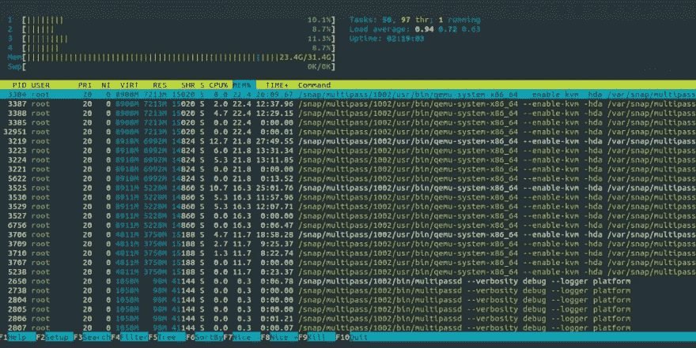](https://res.cloudinary.com/practicaldev/image/fetch/s--dVHhnUSj--/c_limit%2Cf_auto%2Cfl_progressive%2Cq_auto%2Cw_880/https://cdn-images-1.medium.com/max/1024/1%2AbfvdImnBs-s6FsVQUsadbQ.jpeg)

此版本 1.6 版的兰彻服务器将会消失(这种简单的中端群集部署方法也可能随之消失，即使 DC/OS 已经接管很长一段时间) :

[牧场主实验室支持和维护-服务条款](https://rancher.com/support-maintenance-terms/)

[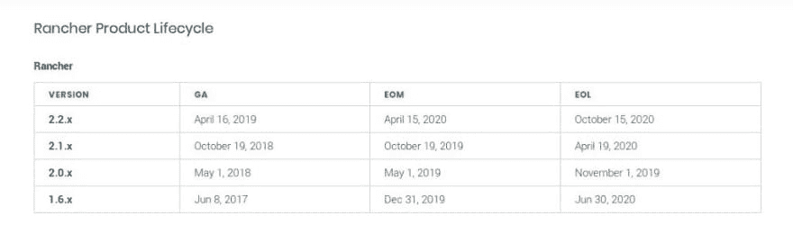](https://res.cloudinary.com/practicaldev/image/fetch/s--4r-o329u--/c_limit%2Cf_auto%2Cfl_progressive%2Cq_auto%2Cw_880/https://cdn-images-1.medium.com/max/1024/1%2AS9ZU6cnpJsZwqYLkt2wPYQ.jpeg)

下一个！……

[](https://res.cloudinary.com/practicaldev/image/fetch/s--oSgfPsFK--/c_limit%2Cf_auto%2Cfl_progressive%2Cq_auto%2Cw_880/https://cdn-images-1.medium.com/max/638/0%2AEFXy_s9iAStxIcsU)