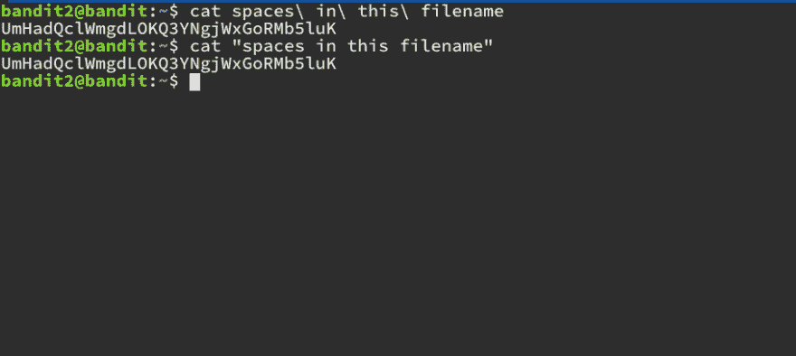

# 越线强盗 2 级 3 级演练

> 原文：<https://dev.to/kkaosninja/overthewire-bandit-level-2-level-3-walk-through-4947>

挑战页面= >[https://overthewire.org/wargames/bandit/bandit3.html](https://overthewire.org/wargames/bandit/bandit3.html)

这个挑战与前一个非常相似，因为它也涉及到从一个具有复杂文件名的文件中读取密码。

密码所在的文件名包含空格。现在，如果你曾经在命令行中使用过文件名，你应该已经知道怎么做了。如果你不知道也没关系。到最后，你会的！

* * *

提示 1:谷歌一下就好！“如何读取带空格的文件名”。有多种方法可以做到这一点。

* * *

你找到了，不是吗？太棒了。

基本上有两种方法可以读取名称中包含空格的文件。这两种方法都可以确保您的 shell 不会将文件名中的单词解释为命令参数。

### 解

第一种方法是用反斜杠对空格进行转义。

第二种方法是在文件名两边加上引号。下图显示了这两种情况。

页（page 的缩写）s:您也可以让 shell 自动完成文件名，方法是在文件名的第一个单词中键入几个字母，然后按`TAB`

黑客快乐！