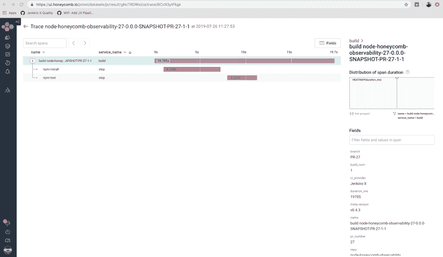

# 增加 Jenkins X 中 CI/CD 管道的可观察性

> 原文：<https://dev.to/devopsoscar/increasing-ci-cd-pipeline-observability-in-jenkins-x-5e0i>

# 概述

你可能听说过可观测性，因为人们已经谈论它有一段时间了。当然，你可能会认为这只是最新的科技术语。然而，这种做法已经存在很长时间了。

鉴于微服务架构、分布式系统以及通过利用 CI/CD 管道到 Kubernetes(在这种情况下使用 Jenkins X)以更快的速度部署现代应用程序的特点，可观察性在今天当然是相关的。实际上，在应用程序部署后设置监控的旧做法不再被接受。

让我们面对现实吧，现代的应用程序需要现代的工具，不仅仅是在部署之后；即使在构建时，拥有适当的工具也可以帮助您深入了解构建和发布过程的各个阶段发生了什么。这可能包括发现任何延迟问题、性能和依赖性下载时间。换句话说，在 Jenkins X 中，工具和监控应该被放入我们的部署管道中。

鉴于 Jenkins X 是 Kubernetes 的本地 CI/CD 平台，我们必须在通过该平台构建和发布我们的容器化应用程序的上下文中开始考虑可观测性，而不是在部署过程本身之后。

# 我们今天在做什么

今天，我将通过实现对几个事件的跟踪，例如作为示例 NodeJS 应用程序一部分的`npm install`和`npm test`，带您了解在构建和发布管道中增加可观察性的过程。

注意:跟踪只是其他需要就位的事情的一小部分。还需要日志记录和指标。这些数据的组合和汇总使您能够了解您的渠道的可观察性。

[](https://res.cloudinary.com/practicaldev/image/fetch/s--vO8oNudt--/c_limit%2Cf_auto%2Cfl_progressive%2Cq_auto%2Cw_880/https://peter.bourgon.org/img/instrumentation/01.png)

作者:Peter Bourgon

## 利用第三方工具

Jenkins X 的设计考虑了可扩展性和灵活性。今天，你可以很容易地为一种尚未实现的语言创建**快速入门**。您还可以构建**插件**来增强平台功能。目前有**插件**用于`istio`、`prometheus`和`anchore`等等。鉴于这种可扩展性，我们鼓励我们的社区构建这些组件并与每个人共享。

如果你环顾四周，你会发现 [Honeycomb.io](http://Honeycomb.io) 处于可观测性的最前沿。我们正与他们合作，最终为 Jenkins X 开发一个*蜂巢插件*

在本文中，我们使用 Honeycomb.io API 来跟踪管道事件。

### 跟踪 CI/CD 管道事件

在这个场景中，我们希望跟踪某些事件的开始和结束时间。在我们的示例 NodeJS 应用程序中，我们有像`npm install`和`npm test`这样的命令，它们是开箱即用的**构建包**管道的一部分。为了开始跟踪，我们修改了 Tekton 管道，并在这些特定的**构建包**命名步骤之前和之后注入对 Honeycomb.io API 的调用。

注:请务必注册 [honeycomb.io](http://honeycomb.io) 以获得您的 **API 密匙**

#### 创造永恒的秘密

一旦我们有了 API 密匙，我们就想创建一个 Kubernetes Secret，它是在我们的管道中进行 API 调用所必需的。为此，我们在`jx`和`jx-staging`名称空间中创建它。对于每个名称空间，执行以下命令(确保根据需要修改名称空间值)。

```
>$ kubectl create secret generic honeycomb-creds —from-literal=BUILDEVENT_APIKEY=<KEY>  --namespace=<NAMESPACE> 
```

<svg width="20px" height="20px" viewBox="0 0 24 24" class="highlight-action crayons-icon highlight-action--fullscreen-on"><title>Enter fullscreen mode</title></svg> <svg width="20px" height="20px" viewBox="0 0 24 24" class="highlight-action crayons-icon highlight-action--fullscreen-off"><title>Exit fullscreen mode</title></svg>

#### 修改 Tekton 管道

现在我们已经有了 Kubernetes 的秘密，我们将修改`jenkins-x.yaml`文件，该文件目前只有一行，如下所示:

```
buildpack: javascript 
```

<svg width="20px" height="20px" viewBox="0 0 24 24" class="highlight-action crayons-icon highlight-action--fullscreen-on"><title>Enter fullscreen mode</title></svg> <svg width="20px" height="20px" viewBox="0 0 24 24" class="highlight-action crayons-icon highlight-action--fullscreen-off"><title>Exit fullscreen mode</title></svg>

让我们检查一下修改后的 YAML 文件的重要组成部分。我想强调的第一项是所需的环境变量。我们需要向 honeycomb.io 提供三条关键信息:

*   **CI 提供者**:这是 JENKINS-X 环境变量。Honeycomb 将向我们的数据集中添加额外的元数据字段
*   **BUILDEVENT_DATASET** :这表示我们想要填充哪个数据集(可以有多个)。
*   **build event _ API Key**:Kubernetes 秘密值，它是通过蜂巢站点提供的 API 密钥

```
buildPack: javascript
pipelineConfig:
  env:
  - name: JENKINS-X
    value: JENKINS-X
  - name: BUILDEVENT_DATASET
    value: jx
  - name: BUILDEVENT_APIKEY
    valueFrom:
      secretKeyRef:
        key: BUILDEVENT_APIKEY
        name: honeycomb-creds 
```

<svg width="20px" height="20px" viewBox="0 0 24 24" class="highlight-action crayons-icon highlight-action--fullscreen-on"><title>Enter fullscreen mode</title></svg> <svg width="20px" height="20px" viewBox="0 0 24 24" class="highlight-action crayons-icon highlight-action--fullscreen-off"><title>Exit fullscreen mode</title></svg>

NodeJS 应用程序使用的**构建包**是该语言检测到的 **javascript** 。因此我们有一行作为`jenkins-x.yaml`文件的内容。

因为我们知道正在使用哪个构建包，所以我们可以确定存在哪些命名的步骤。通常它们包括一个`npm install`和`npm test`。

因此，我们希望在调用这些命名的步骤之前的和之后的分别注入一个时间戳**。下面展示了我如何注入这个。** 

```
 pipelines:
    overrides:
    - name: npm-install
      pipeline: pullRequest
      stage: build
      steps:
      - command: echo ===== pullrequest:build:before  sending honeycomb step trace  ===============
      - name: honeycomb-npm-install-set-step-start-timestamp
        sh: echo $(date +%s) > step_start
      - name: honeycomb-npm-install-before-timestamp
        sh: echo =================================  $(cat step_start)  =================================
      type: before

    - name: npm-install
      pipeline: pullRequest
      stage: build
      steps:
      - command: echo ===== pullrequest:build:after   sending honeycomb step trace  ===============
      - name: honeycomb-npm-install-after-timestamp
        sh: echo =================================  $(cat step_start)  =================================
      - name: honeycomb-step-log-after-npm-install
        sh: ./buildevents step "${APP_NAME}-${PULL_NUMBER}-${VERSION}-${BUILD_NUMBER}" $(echo npm-install | sum | cut -f 1 -d \ ) $(cat step_start) npm-install
      type: after
    - name: npm-test
      pipeline: pullRequest
      stage: build
      steps:
      - name: honeycomb-npm-test-set-step-start-timestamp
        sh: echo $(date +%s) > step_start
      - name: honeycomb-npm-test-before-timestamp
        sh: echo =================================  $(cat step_start)  =================================
      type: before
    - name: npm-test
      pipeline: pullRequest
      stage: build
      steps:
      - name: honeycomb-npm-test-after-timestamp
        sh: echo =================================  $(cat step_start)  =================================
      - name: honeycomb-step-log-after-npm-test
        sh: ./buildevents step "${APP_NAME}-${PULL_NUMBER}-${VERSION}-${BUILD_NUMBER}" $(echo npm-test | sum | cut -f 1 -d \ ) $(cat step_start) npm-test
      type: after 
```

<svg width="20px" height="20px" viewBox="0 0 24 24" class="highlight-action crayons-icon highlight-action--fullscreen-on"><title>Enter fullscreen mode</title></svg> <svg width="20px" height="20px" viewBox="0 0 24 24" class="highlight-action crayons-icon highlight-action--fullscreen-off"><title>Exit fullscreen mode</title></svg>

现在我已经捕获了这两个命名步骤的时间戳，我想如下所示向 honeycomb 发送一个 API 调用。你会注意到我是如何使用一个名为 **buildevents** 的二进制文件的，这个文件是在我的管道设置期间下载的，稍后我会讨论。

通过将 Jenkins X 中作为**环境变量**存在的一些元数据片段串联起来，我构建了一个惟一的名称，honeycomb 需要这个名称来正确地跟踪事物。

```
 - pipeline: pullRequest
      stage: build
      steps:
      - name: honeycomb-build-name-concat
        sh: echo the build is "${APP_NAME}-${PULL_NUMBER}-${VERSION}-${BUILD_NUMBER}" and HONEYCOMB_BUILD_START=$(cat build_start)
      - name: honeycomb-send-success
        sh: ./buildevents build "${APP_NAME}-${PULL_NUMBER}-${VERSION}-${BUILD_NUMBER}" $(cat build_start) success
      type: after 
```

<svg width="20px" height="20px" viewBox="0 0 24 24" class="highlight-action crayons-icon highlight-action--fullscreen-on"><title>Enter fullscreen mode</title></svg> <svg width="20px" height="20px" viewBox="0 0 24 24" class="highlight-action crayons-icon highlight-action--fullscreen-off"><title>Exit fullscreen mode</title></svg>

我们对**发布**管道做同样的事情...

```
# release pipeline releated calls

    - name: npm-install
      pipeline: release
      stage: build
      steps:
      - command: echo ===== release:build:before  sending honeycomb step trace  ===============
      - name: release-honeycomb-npm-install-step-start-timestamp
        sh: echo $(date +%s) > release_step_start
      - name: release-honeycomb-npm-install-before-timestamp
        sh: echo ================================= release  release-npm-install step start  $(cat release_step_start)  =================================
      type: before

    - name: npm-install
      pipeline: release
      stage: build
      steps:
      - name: release-honeycomb-npm-install-after-timestamp
        sh: echo ================================= release npm-install step end  $(cat release_step_start)  =================================
      - name: release-honeycomb-step-log-after-npm-install
        sh: ./buildevents step "${APP_NAME}-${PULL_NUMBER}-${VERSION}-${BUILD_NUMBER}" $(echo release-npm-install | sum | cut -f 1 -d \ ) $(cat release_step_start) release-npm-install
      type: after

    - pipeline: release
      stage: build
      steps:
      - name: release-honeycomb-build-name-concat
        sh: echo the build is "${APP_NAME}-${PULL_NUMBER}-${VERSION}-${BUILD_NUMBER}" and HONEYCOMB_BUILD_START=$(cat release_start)
      - name: release-honeycomb-build-send-success
        sh: ./buildevents build "${APP_NAME}-${PULL_NUMBER}-${VERSION}-${BUILD_NUMBER}" $(cat release_start) success
      type: after 
```

<svg width="20px" height="20px" viewBox="0 0 24 24" class="highlight-action crayons-icon highlight-action--fullscreen-on"><title>Enter fullscreen mode</title></svg> <svg width="20px" height="20px" viewBox="0 0 24 24" class="highlight-action crayons-icon highlight-action--fullscreen-off"><title>Exit fullscreen mode</title></svg>

这是流水线首先执行的部分，因此是**设置**节点。在管道设置中，我们希望完成几件事情。

*   下载 Honeycomb 提供的构建事件二进制文件，使其可执行
*   创建我们将用来跟踪 **pullRequest** 管道执行的时间戳。为此，我保存了一个带有时间戳的临时文件。

这是为两个管道都做的，因为我们都在工作。

```
 pullRequest:
      setup:
        steps:
          - command: echo =========================== pullrequest:setup downloading Honeycomb.io buildevents binary ===========================
          - name: pullrequest-download-honeycomb-binary
            sh: curl -L -o buildevents https://github.com/honeycombio/buildevents/releases/latest/download/buildevents-linux-amd64
          - name: honeycomb-set-binary-permissions
            sh: chmod 755 buildevents
          - name: honeycomb-display-buildevents-version
            sh: ./buildevents --version
          - name: honeycomb-setup-build-timestamp
            sh: echo $(date +%s) > build_start
          - name: honeycomb-output-debug
            sh: echo the build is "${APP_NAME}-${PULL_NUMBER}-${VERSION}-${BUILD_NUMBER}" and HONEYCOMB_BUILD_START=$(cat build_start)   =======================================================
    release:
      setup:
        steps:
        - command: echo =========================== release:setup downloading Honeycomb.io buildevents binary ===========================
        - name: release-download-honeycomb-binary
          sh: curl -L -o buildevents https://github.com/honeycombio/buildevents/releases/latest/download/buildevents-linux-amd64
        - name: release-honeycomb-set-binary-permissions
          sh: chmod 755 buildevents
        - name: release-honeycomb-setup-build-timestamp
          sh: echo $(date +%s) > release_start
        - name: release-honeycomb-output-debug
          sh: echo the build is "${APP_NAME}-${PULL_NUMBER}-${VERSION}-${BUILD_NUMBER}" and HONEYCOMB_BUILD_START=$(cat release_start)   ======================================================= 
```

<svg width="20px" height="20px" viewBox="0 0 24 24" class="highlight-action crayons-icon highlight-action--fullscreen-on"><title>Enter fullscreen mode</title></svg> <svg width="20px" height="20px" viewBox="0 0 24 24" class="highlight-action crayons-icon highlight-action--fullscreen-off"><title>Exit fullscreen mode</title></svg>

一旦这条管道执行完毕，honeycomb.io 站点上的仪表板将向我们显示执行跟踪，如下所示。

[](https://res.cloudinary.com/practicaldev/image/fetch/s--0Q6uDBO7--/c_limit%2Cf_auto%2Cfl_progressive%2Cq_auto%2Cw_880/https://jenkins-x.io/news/jenkins-x-observability/honeycomb_trace_example.png)

如您所见，我们为被跟踪的构建起了一个独特的名字，在它下面，我们跟踪两个事件`npm install`和`npm test`的时间跨度。我们可以很容易地看到下载我们的依赖项需要多长时间，以及运行应用程序的测试需要多长时间。

# 结论

希望我已经诱使您至少了解了为什么您会考虑将可观测性合并到您的构建和发布过程中。还有很多事情可以做。在以后的文章中，我们将介绍更多的设置。

## 詹金斯世界| DevOps 世界 2019

在今年的大会上，我将在不同的时间演示这个解决方案。使用代码:**预览**依然可以注册并获得大优惠。你的成本不是 1499 美元，打折后只要 799 美元

你可以在[官网](https://www.cloudbees.com/devops-world/san-francisco/agenda)上找到我的完整日程安排

干杯，

[@SharePointOscar](https://twitter.com/SharePointOscar)