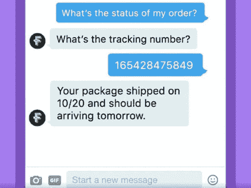
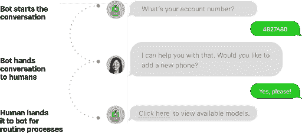
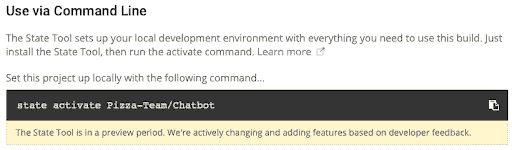

# 客户支持聊天机器人:比你想象的更容易和更有效

> 原文：<https://dev.to/dcrane604/customer-support-chatbots-easier-more-effective-than-you-think-n20>

在这篇文章的最后，你将能够用 Python 创建你自己的聊天机器人，只需要几个命令。但是首先，你可能想知道为什么客服聊天机器人现在这么火。

对于聊天机器人在企业中的使用，人们意见不一:令人惊讶的是，大多数人似乎喜欢它们(见下文)，而其他人则觉得它们很烦人。毋庸置疑的是成本节约和 24×7 客户服务聊天机器人。

一些需要考虑的要点:

*   聊天机器人的最大好处是全天候服务、即时响应和简单问题的答案。
*   63%的人更喜欢在线机器人，而不是与公司的人力资源互动。
*   到 2020 年，聊天机器人将为 85%的客户服务提供动力。
*   到 2022 年，聊天机器人有望削减 80 亿美元的商业成本。

虽然聊天机器人所基于的机器学习(ML)技术已经取得了很大进展，但它还不能完全复制自然语言理解。但是聊天机器人仍然有许多潜在的应用，不需要完全理解。支付账单、查看账户余额或者如图 1 所示用聊天机器人跟踪包裹变得越来越平常。越来越多的公司将简单、常规的消费者互动交给机器人。

[](https://res.cloudinary.com/practicaldev/image/fetch/s--Q7KFRUiS--/c_limit%2Cf_auto%2Cfl_progressive%2Cq_auto%2Cw_880/https://thepracticaldev.s3.amazonaws.com/i/xnfr792e5wmmtsnhehsn.png)

图 1:跟踪包裹递送的聊天机器人交互

现在，无需与真人对话就可以完成大多数日常交易。像 [Subway](http://www.prnewswire.com/news-releases/subway-launches-ordering-of-sandwiches-and-salads-on-facebook-with-a-bot-for-messenger-300441476.html) 、 [Dominos](https://www.dominos.com.au/inside-dominos/technology) 和 [Starbucks](https://news.starbucks.com/press-releases/starbucks-debuts-voice-ordering) 这样的食品公司都在尝试让人们使用 Facebook Messenger 中的聊天机器人(如 MobileMonkey)下单，或者口头告诉亚马逊的 Alexa 给他们点一杯星冰乐。

如今，自然语言处理的进步在相对简单的虚拟助手中发挥了巨大作用，比如亚马逊的 Alexa、苹果的 Siri 和微软的 Cortana。美国银行聊天机器人 Erica 更进一步，利用“预测分析和认知信息”为客户提供金融指导。

当然，[聊天机器人并不是绝对可靠的](https://www.theverge.com/2016/3/24/11297050/tay-microsoft-chatbot-racist)，特别是在解决问题、直觉和移情等方面，这是人类互动可以对客户的结果产生巨大影响的地方。在这些情况下，聊天机器人可以用于日常互动，然后升级到真人进行更复杂的互动。

[](https://res.cloudinary.com/practicaldev/image/fetch/s--_OhOtCog--/c_limit%2Cf_auto%2Cfl_progressive%2Cq_auto%2Cw_880/https://thepracticaldev.s3.amazonaws.com/i/8lev1dlshmwh3863v7wl.png)

图 2:聊天机器人升级/降级到真人

### 聊天机器人是如何工作的？

聊天机器人只是一个由机器学习(ML)模型结合一组指定规则管理的应用程序。像大多数应用程序一样，聊天机器人由应用层、数据库和一组 API 组成。

当人类使用聊天或语音界面与聊天机器人进行交互时，聊天机器人模拟了现实生活中的双向对话。响应是基于在那个时间点上可用的“知识”。如果互动引入了一个新概念，聊天机器人通常会被训练转移话题，或者升级到人工操作员。研究人员保存并分析聊天机器人和客户之间的讨论日志，以便重新训练聊天机器人。因此，聊天机器人的互动范围和相关性将逐渐增长。

根据不同的分类方法和用途，聊天机器人通常有三种类型:

*   模式匹配机器人–这些机器人解析输入短语，并尝试将关键字或关键短语与其数据库中的条目进行匹配。如果找到，机器人可以提供相应的响应。
    *   最适合常见客户询问的常见问题解答
*   自然语言理解机器人——这些机器人将实体(如“订购”或“购买”)与上下文(如“比萨饼类型”等模式匹配的关键字)和预期联系起来，这是客户在响应他们的交互时所期望的，如“浇头列表”
    *   最适合简单的事务性查询，如订购食物
*   自然语言处理(NLP)机器人–这些机器人通过一系列过程将用户的语音或文本转换为结构化数据，这些过程将语言解析为语法实体(动词、主语、宾语等)，提取已识别的单词或短语(如产品名称)，识别拼写错误，甚至可能尝试进行情感分析以了解客户的态度。
    *   最适合复杂的客户服务互动

虽然这听起来很复杂，但你可能会惊讶地发现，实现一个功能齐全的聊天机器人比构建一个跨平台的应用程序要便宜得多，而且比人工选择(例如，客户服务代表)要便宜得多。

### 制作自己的聊天机器人

现在你已经理解了聊天机器人的重要性和实用性，你可能会受到启发，看看你是否可以为自己创建一个。Daniel Kukiela 在 Github 上实现了一个基于 Python 的[聊天机器人，您可以尝试“开箱即用”,只需几个命令就可以设置您的环境并克隆 repo。](https://github.com/daniel-kukiela/nmt-chatbot)

Requirements.txt 非常简单，包括:

*   tensorflow-gpu>=1.4.0
    *   利用 TensorFlow 的神经机器翻译(seq2seq)功能来执行自然语言处理
*   tqdm
    *   实现一个进度条
*   彩色光
    *   用于生成彩色终端文本和光标定位
*   正则表达式
    *   用于解析文本
*   python-Levenshtein
    *   用于操作字符串，包括确定字符串相似性、中间值和平均值
*   要求
    *   Python 中发出 HTTP 请求的事实标准

ActiveState 平台支持所有这些包(基于 GPU 的 TensorFlow 版本除外，该版本已被标准 CPU 版本所取代)。如果您想尝试制作 Kukiela 的聊天机器人，设置开发环境的最简单方法是:

1.  [将我在 ActiveState 平台上的“聊天机器人”运行时环境](https://platform.activestate.com/Pizza-Team/Chatbot/auto-fork)转到你的账户中(如果你还没有账户，系统会提示你创建一个)
2.  [安装状态工具](sh%20<(curl%20-q%20https://platform.activestate.com/dl/cli/install.sh))
3.  使用 ActiveState 的状态工具在您的系统上安装运行时，该工具将自动:
    *   创建一个虚拟环境，然后
    *   在其中安装聊天机器人的 Python 运行时(即 Kukiela 的 Requirements.txt 中的所有 6 个包以及它们的 50 个依赖项)

要安装运行时，请遵循“通过命令行使用”标题下列出的说明。例如:

[](https://res.cloudinary.com/practicaldev/image/fetch/s--gT5OAKoM--/c_limit%2Cf_auto%2Cfl_progressive%2Cq_auto%2Cw_880/https://thepracticaldev.s3.amazonaws.com/i/lfwqusthu9n1gj4vmwh8.png)

现在，您的 chatbot 项目的环境已经准备就绪，您可以获取 Kukiela 的代码，并使用包含的训练数据来尝试一下。只需从新的虚拟环境中发出以下命令:

```
$ git clone --branch v0.1 --recursive https://github.com/daniel-kukiela/nmt-chatbot.git
$ cd nmt-chatbot/
$ cd setup
$ python3 prepare_data.py
$ cd ..
$ python3 train.py 
```

现在最难的部分是:等待。最终，聊天机器人将仔细研究训练数据，您将拥有一个训练有素的演示，可以随时部署和测试。

聊天愉快！

有一个 Github 项目，您想通过提供一个预构建的环境来简化设置吗？注册一个[免费的 ActiveState 平台账户](https://platform.activestate.com/create-account)，看看有多简单。