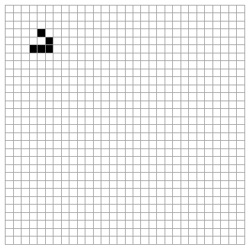

# 类型系统常见问题

> 原文：<https://dev.to/stereobooster/type-system-faq-3oi0>

> 坐下，我们需要谈谈类型

这个帖子的灵感来自[这个帖子](https://dev.to/parkroolucas/typescript-is-a-waste-of-time-change-my-mind-pi8)。人们对类型有太多的误解，使用错误的术语并得出错误的结论。我并不提倡静态类型系统，我唯一关心的是让我们使用正确的术语，这样我们可以进行建设性的讨论。

我自发地写了这篇文章。我希望没有错误，但是如果你发现什么，请告诉我。请随意提出更多问题。让我们一劳永逸地解决这个问题。

## 动态 vs 无类型

有些人认为动态类型系统和无类型系统是一样的。这是不正确的。非类型化类型系统是没有意义区分类型的系统。如果只有一种类型，那么区分类型是没有意义的。例如:

*   汇编语言:唯一的一种类型是位串
*   lambda-calculus:唯一的一种类型是 lambdas

你可能会说，这没什么大不了的，无论是动态的还是无类型的。实际上，这是一件大事，因为当你将动态和无类型化等同起来时，你就自动地将动态与静态类型系统对立起来，所以人们分成了两个阵营动态 vs 静态类型(这是不正确的，参见动态 vs 静态)。

> 不限制变量范围的语言被称为无类型语言:它们没有类型，或者说，只有一个包含所有值的通用类型。
> 
> - [型系统，卢卡·卡代利](http://lucacardelli.name/papers/typesystems.pdf)

* * *

> 无类型—程序简单地直接执行；没有尝试检查“形状的一致性”
> 
> 类型化—在编译时或运行时尝试检查形状一致性
> 
> 编程语言的类型系统

## 动态 vs 静态

动态类型系统是动态检查类型的系统(在运行时)。静态类型系统是静态检查类型的系统(在编译或传输时)。

他们是对立的吗？不，他们不是。它们都是关于类型的。你可以两者兼得，事实上，大多数静态类型系统也有动态类型检查。作为一个例子，我们可以采取任何 IO(输入输出)验证。假设您需要读取来自用户的输入，假设输入数字。您将在运行时检查字符串的解析是否给出了数字(它可能抛出一个异常或返回 NaN)。当你检查给定的输入是否可以被认为是数字时，你做的是动态类型检查。

所以，这不是静态类型和动态类型的战争。两个都可以用。

更重要的是:静态类型检查是一个复杂的过程，有时很难静态地验证程序的某些部分，所以你可以用动态类型检查来代替静态类型检查。

将静态类型系统视为静态检查的类型。

将动态类型系统视为动态检查的类型。

## 静态类型是不是在编译时就知道类型了？

不会。如果你打开任何解析器(包括 JS)的源代码，你会看到解析器在解析时知道值的类型(这是编译过程的一部分)。

```
let x = "test"; 
```

解析器知道`"test"`是一个字符串。这是不是让 JS 静态类型化了？号码

## 渐进型系统

渐进类型系统是一个静态类型系统，它允许跳过程序部分的类型检查，例如 typescript 中的`any`或`@ts-ignore`。

从一个方面来说，这使它不太安全。从另一方面来说，渐进类型系统允许向动态类型语言中渐进地添加类型。

## 健全 vs 不健全的类型系统

声音类型检查器是一个不会“批准”有类型错误的程序的检查器。因此，如果您使用不健全的类型检查器，您的应用程序中仍然会有类型错误😱。不要惊慌。实际上，可能对你没有影响。合理性是类型检查算法的一个数学属性，你需要证明它。外面的许多编译器(内部的类型检查器)是不健全的。

如果你想使用声音类型系统，看看 ML-family，它使用 Hindley-Milner 类型系统。

你也需要明白，声音类型系统不会通过无效的程序(假阳性)，但也可能拒绝有效的程序(假阴性)。

从不拒绝有效程序的类型系统称为完全系统。

我能两者兼得吗-完整的和健全的？据我所知，他们不存在。我不确定，但根据哥德尔的不完全性定理，这似乎是根本不可能的。

## 弱对强

我不认为这个术语有用，因为它含糊不清，会造成更多的混乱而不是清晰:

> 这些语言可以**委婉地**称为弱检查(或弱类型，在文献中)意味着一些不安全的操作被静态地检测到，而一些没有被检测到。**这一类的语言在薄弱程度上差别很大**。
> 
> - [型系统，卢卡·卡代利](http://lucacardelli.name/papers/typesystems.pdf)

* * *

> 类型系统最常见的分类方式可能是“强”或“弱”这很不幸，因为这些单词几乎没有任何意义。在有限的范围内，可以比较两种类型系统非常相似的语言，并指定一种语言具有这两种系统中较强的一种。除此之外，这些话毫无意义。
> 
> - [在讨论类型系统之前要知道什么，Steve Klabnik](http://blog.steveklabnik.com/posts/2010-07-17-what-to-know-before-debating-type-systems)

* * *

> “强”和“弱”这两个术语**极其模糊**。以下是这些术语的一些用法:
> 
> *   有时候，“强”就是“静”。这很简单，但最好说“静态”，因为我们大多数人都同意它的定义。
> *   有时，“强”意味着“不在数据类型之间隐式转换”。例如，JavaScript 允许我们说“a”-1，我们可以称之为“弱类型”。但是几乎所有的语言都提供了某种程度的隐式转换，允许像 1 - 1.1 一样自动进行整数到浮点数的转换。在实践中，大多数以这种方式使用“强”的人在“可接受的”和“不可接受的”转换之间划了一条线。没有公认的界线；它们都是武断的，只针对个人的观点。
> *   有时，“强”意味着无法逃脱语言的类型规则。
> *   有时，“强”意味着内存安全。c 是内存不安全语言的一个显著例子。如果 xs 是一个由四个数字组成的数组，C 将很乐意允许执行 xs[5]或 xs[1000]的代码，给出那些用于存储 xs 的内存地址之后的任何值。
> 
> - [类型-程序员概要，加里·伯恩哈特](https://www.destroyallsoftware.com/compendium/types?share_key=baf6b67369843fa2)

## 静态类型语言需要类型声明吗？

不总是。有时类型系统可以推断类型(根据代码结构猜测)。例如(打字稿)，

```
const x = "test"; 
```

Type system 知道`"test"`是一个字符串(因为解析规则)。类型系统知道`x`是常量，例如它不能被重新赋值，所以它可以断定`x`是一个字符串。

其他示例(流程):

```
const add = (x, y) => x / y
//                        ^ Cannot perform arithmetic operation because string [1] is not a number.
add(1, "2") 
```

类型检查器发现我们用数字和字符串调用了`add`,它将其追溯到定义。类型检查器知道除法运算需要数字作为输入，所以它认为使用字符串作为输入之一是错误的。

没有类型声明，但是我们可以做静态类型检查。在现实世界中，你迟早要写一些类型，因为类型系统不能推断一切。但是静态类型语言与声明无关，它们与运行前的类型检查有关。

## TypeScript 因为向下编译为 JavaScript 而不安全吗？

TypeScript 是不健全的，所以它可以产生不安全的应用程序，但它与它编译成什么无关。

桌面版的编译器大多编译成汇编语言，安全性甚至不如 JS `¯\_(ツ)_/¯`。

你可能会问:但是编译后的代码在浏览器中运行，JS 是不安全的，例如，它可能在需要字符串时给出空值。

好问题。因此，TS 可以保证应用程序内部的安全性，您需要在 TS 与外部世界交互的地方设置“防护”，例如，您需要验证 IO(输入-输出):用户输入、服务器响应、从浏览器存储读取等。

例如，在 Elm 中，他们为此使用[“端口”](https://guide.elm-lang.org/interop/ports.html)。在 TS 中，您可以使用 io-ts 或类似的。

这种“防护”在静态类型系统和动态类型系统之间建立了一座桥梁。

简化示例:

```
const makeSureIsNumber = (x: any) => {
  const result = parseFloat(x);
  if (isNaN(result)) {
    throw Error("Not a number");
  }
  return result;
}
const read = (input: any) => {
  try {
    const n = makeSureIsNumber(input);
    // in this branch of code, n is for sure number
    // otherwise, we would get into a different branch of code
    // makeSureIsNumber "proofs" that n is number
  } catch (e) { }
} 
```

## 只有编译器才需要类型吗？

> 类型只是给你的编译器一些提示。
> 
> -想去美人鱼

这是一个哲学问题。人需要类型，机器不需要类型。编译器需要类型，因为那些是人类写的程序。

作为现象的类型因人而存在，没有类型，除非有人会观察它们。这是人类的思维把不同的东西放在不同的桶(或类别)里。没有观察者，它们就没有意义。

这是给你的一个思维实验。想想《人生的游戏》。你有一个正方形细胞的二维网格，每个细胞都处于两种可能的状态之一，活着或死了。每个单元格都与其八个邻居交互，这八个邻居是水平、垂直或对角相邻的单元格。在每个时间步，会发生以下转变:

*   任何少于两个活邻居的活细胞都会死亡，好像是由于人口减少。
*   任何有两个或三个活邻居的活细胞都可以存活到下一代。
*   任何有三个以上活邻居的活细胞都会死亡，好像是由于人口过剩。
*   任何一个死细胞，只要有三个活的邻居，就会变成活细胞，就像通过繁殖一样。

它是一串“闪烁”(打开和关闭)的方块。用它玩[在线](https://bitstorm.org/gameoflife/)。

但是你有一些结构，比如“滑翔机”:

[](https://res.cloudinary.com/practicaldev/image/fetch/s--jZiQWcPI--/c_limit%2Cf_auto%2Cfl_progressive%2Cq_66%2Cw_880/https://thepracticaldev.s3.amazonaws.com/i/foro1kmft5fn06q977sz.gif)

你能看见它吗？是滑翔机在屏幕上移动，对吗？现在暂停。它真的存在吗？它只是将出现和消失的方块分开。但是我们的大脑可以把这个结构作为一个实体来观察。

或者我们可以说它的存在是因为方块不是独立的(它们依赖于邻居)，而且即使滑翔机本身不存在，但是滑翔机的概念作为柏拉图式的观念存在。

现在考虑任何类型化编程语言中的程序。我们可以看到类型，对吗？但它是编译下来的汇编代码。汇编代码和程序代表同样的东西，同样的逻辑(第二个对人类来说更难读懂)。从计算机的角度来看，没有类型，只有位串——0 和 1(死的、活的细胞)的集合。**类型存在于人**。

## PS

我以前写类型的尝试:

*   [https://github.com/stereobooster/pragmatic-types](https://github.com/stereobooster/pragmatic-types)
*   [https://dev.to/t/pragmatictypes](https://dev.to/t/pragmatictypes)

这些文章需要更新和一些返工，我想把它们纳入这个常见问题。

> 封面图片由 [reddit](https://www.reddit.com/r/Apandah/comments/9yd3t5/posting_funny_cats_until_apondos_posts_funny_cats/)