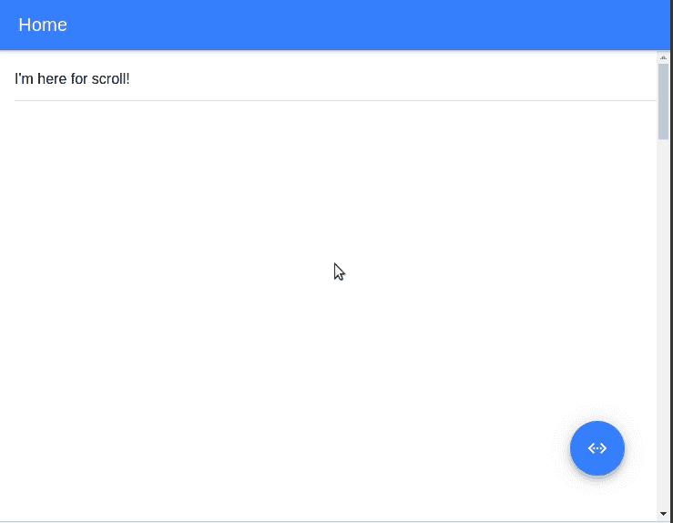

# 用 StencilJS 和 Ionic 4 构建聊天 Web 组件

> 原文：<https://dev.to/keyvan_m_sadeghi/building-chat-web-components-with-stenciljs-and-ionic-4-537b>

向神奇开发者社区问好！我想和你分享我使用 StencilJS 构建 Web 组件库的经验，并听取你宝贵的反馈/意见。

这是我做的:

[](https://res.cloudinary.com/practicaldev/image/fetch/s--b70DSsK3--/c_limit%2Cf_auto%2Cfl_progressive%2Cq_66%2Cw_880/https://i.imgur.com/gt0TjLS.gif)

[现场演示](https://assister.ai/chat/)

[GitHub](https://github.com/assister-ai/assister/blob/master/packages/chat/README.md)

# 问题

首先让我们讨论一下我为什么选择 web 组件，我们已经看到了关于为什么一个人[会](https://dev.to/shihn/why-i-use-web-components-my-use-cases-1nip)和[不会](https://dev.to/richharris/why-i-don-t-use-web-components-2cia)使用 Web 组件的争论。

你可能见过很多聊天机器人出现在各种网页上。这些通常是人们从供应商那里购买的专有附加组件，通过一个将`iframe`推送到`body`的脚本将它们添加到页面中。[对讲](https://www.intercom.com/)和[漂移](https://www.drift.com/)好像比较流行。我在考虑一个开源的替代方案，Web 组件似乎是一个自然的选择，主要原因是`ShaddowDOM`防止了 CSS 与主机应用程序的冲突。

# 技术选择

在选择合适的工具上，我[挣扎了](https://github.com/assister-ai/assister/issues/7) **很多次**。

## 你应该好好想想**的反应**

人或爱或恨都会有所反应，但事情的真相是，它的影响**巨大**。今年早些时候，在[MDN Docs spring planning repo](https://github.com/mdn/sprints/issues/967#issuecomment-464257121)上有一个关于为什么一个 web 标准团体使用一个非标准库的长时间的热烈讨论。David Flanagan 在 IMO 中提出了一个合理的论点，即不使用 React 很难吸引贡献者。这是一方面，贡献者。

另一边是人们使用你的组件。React 开发者很可能会忽略你的库，如果他们不能在 JSX 以他们习惯的方式使用它的话(例如`ref={}`)。

## 视图 vs 逻辑

关于标准 HTML 的一个简单事实经常被忽略，我自己也有这种感觉。

**你不要*看到*没有的东西*描述***

```
<p> I've been described, therefore I am! </p> 
```

<svg width="20px" height="20px" viewBox="0 0 24 24" class="highlight-action crayons-icon highlight-action--fullscreen-on"><title>Enter fullscreen mode</title></svg> <svg width="20px" height="20px" viewBox="0 0 24 24" class="highlight-action crayons-icon highlight-action--fullscreen-off"><title>Exit fullscreen mode</title></svg>

打破这一规则的一个例子。它包含逻辑并显示未描述的元素(`chat-input`)。

我正要对`chat-message`做同样的事情，我认为`chat-message`拥有一个名为`meta`的属性会很酷，这个属性包含了作者、发送日期、阅读日期等信息。所以它可以根据这些`meta`数据来呈现页脚。**不酷！这不是 HTML 做事的方式。**

在所有这些前端框架之前，HTML 是 web 方式的*【视图】*。如果我们正在创建 Web 组件，我们应该努力用相同的语义扩展 HTML 词汇表。人们嘲笑属性只是 web 组件中的字符串。尽情嘲笑吧！这是一个优雅的 HTML 设计，经受住了时间的考验，将 HTML 从 JS/JSON 中分离出来。

也就是说，我一点也不反对嵌入应用程序逻辑的高级组件。然而，它们的位置是在特定的应用程序内部，而不是我们为重用而设计的通用 web 组件。

## 离子 4

我做的另一个选择是重用来自`Ionic`的组件。在复古中，我对这个选择很满意。起初，离子组件似乎势不可挡，但是你会意识到它们一点也不复杂，像`ion-content`和`ion-item`这样的东西本质上是用一些有用的工具美化了的`div`!Ionic 团队在`v4`迁移到 Web 组件的灵活性值得称赞。还是有怪癖的，比如， [`ion-virtual-scroll`](https://ionicframework.com/docs/api/virtual-scroll) 目前只是有角的。我的猜测是，随着时间的推移，离子成分只会变得更好。毫不奇怪，在 Stencil 中使用它们是无缝的，因为它们都是由同一家公司制造的。

# StencilJS，它有答案吗？

先说一下**编译器**的事情:

```
@Component({
  tag: 'chat-message',
  styleUrl: 'message.css',
  shadow: true
})
export class Message { ... } 
```

<svg width="20px" height="20px" viewBox="0 0 24 24" class="highlight-action crayons-icon highlight-action--fullscreen-on"><title>Enter fullscreen mode</title></svg> <svg width="20px" height="20px" viewBox="0 0 24 24" class="highlight-action crayons-icon highlight-action--fullscreen-off"><title>Exit fullscreen mode</title></svg>

看到那个类的名字了吗，`Message`？你觉得如果我改成`JustinBieber`会怎么样？

**没事！**

什么都没坏，一切都还正常！你知道为什么吗？因为这个类的名字根本没有任何语义。该类不包含 HTMLElement 类或任何其他类。它只是为了让那个`@Component`装饰器从中创建许多其他类！即:

`HTMLChatMessageElement`:由编译器生成，用于与元素进行本机接口。这个确实延伸了`HTMLElement`。

`interface ChatMessage extends JSXBase.HTMLAttributes<HTMLChatMessageElement>`:这就是美。还记得 React 用户吗？被编译器覆盖！

一开始我对使用 TypeScript 有些“meh ”,但是你知道吗？模板自动创建[文档页](https://github.com/assister-ai/assister/tree/master/packages/chat/src/components/message)仅从类型。再加上不必为项目写一个`types.d.ts`并维护它，我认为这是一个胜利。

# 结论

那么 StencilJS 就是答案吗？依我看，太好了！对于一个特定的场景。如果你像我一样是一个缺人手的开发者，Stencil 为你自动化了很多 T2。然而，这样做的话，它属于[框架/库类别](https://www.technotification.com/2019/03/frameworks-vs-libraries-computer-science.html/)的框架。另一方面，最终结果完全符合 web 标准。在[演示页面](https://assister.ai/chat/)上做一个`view page source`，让我满心欢喜地看到这又成为可能。