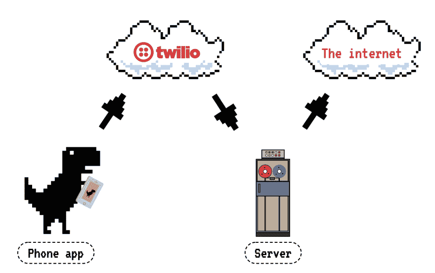
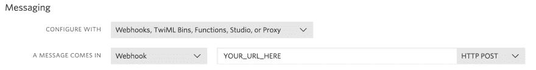
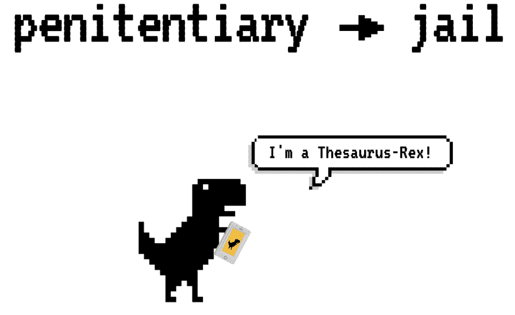
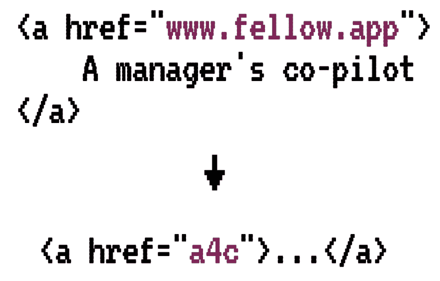
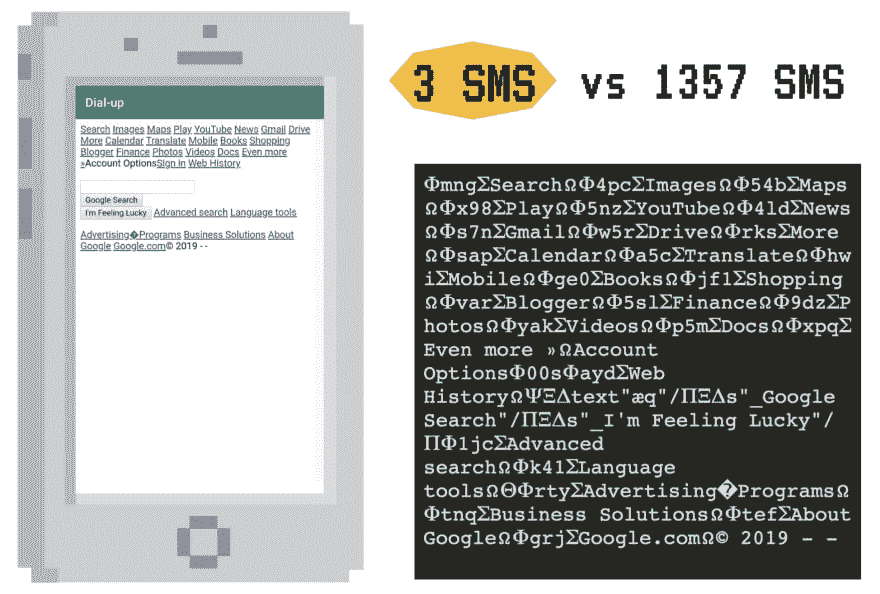

# 使用 Twilio 构建互联网

> 原文：<https://dev.to/twilio/using-twilio-to-build-the-internet-2cnf>

如果你曾经在国际上旅行过，你可能会问自己:“我是应该买一个昂贵的漫游数据计划，还是从一个免费的 wifi 热点跳到另一个，还是应该在一个不熟悉的地方不顾一切地去连接？”。如果你像我一样方向感受损，并且在直线行走中迷路，那么去任何没有实时导航的地方都不是一个选择。我总是不得不选择数据计划，这可能会让我为微不足道的 1GB 花费 80 美元。加拿大电信行业缺乏竞争，这使得我们的数据价格成为世界上最高的价格之一，这一大笔额外的旅行费用让我感到沮丧，以至于我决定要为此做点什么。

就像任何有理智的人都会做的那样，我决定为我的手机构建一个浏览器，通过短信传输所有内容，同时保留真正浏览器的外观和感觉。因为我当时的电话计划包括无限短信，我可以使用这个应用程序在任何地方无限上网！我认为这会很慢，有点老派，所以我的新项目**“拨号”**诞生了。

一想到短信和代码，我就想到 [Twilio](https://www.twilio.com/) 。几年前，[发布了一个集成](http://fluidsurveys.com/blog/conduct-voice-sms-surveying-fluidsurveys-new-integration-twhello/)，让你可以通过短信/语音回答 Twilio 和 FluidSurveys 之间的调查，fluid surveys 是我当时工作的初创公司(后来被 SurveyMonkey 收购，我现在回到创始人身边，正在开发 [Fellow.app](https://fellow.app) )。我认为这非常酷，所以我很高兴终于可以在我自己的非传统用例中使用 Twilio 的服务了！

这个项目需要构建两个组件:

*   **手机 app:** 无限短信，会充当浏览器。
*   **服务器:**无限制上网，将代表手机做所有实际的网页加载。

当我开始这个项目的时候，它是为我自己设计的一个有用的工具，所以我只为 Android 开发了 Java 版(StackOverflow 上关于 SMS for Java 的回答比 Kotlin 还多！).我在 Node.js 中构建了项目的服务器端，因为我认为在服务器上(它不属于的地方)使用 JavaScript 来制作一个无 JavaScript 的浏览器(它应该在的地方)会很有趣。

[](https://res.cloudinary.com/practicaldev/image/fetch/s--maz2OOEn--/c_limit%2Cf_auto%2Cfl_progressive%2Cq_auto%2Cw_880/https://thepracticaldev.s3.amazonaws.com/i/napjb6916xirgue00cd9.png)

上图显示了每个服务之间的信息流。让我们深入了解并通过应用程序跟踪请求的生命周期:

### 🔗请求 URL

我们想在应用程序中做的第一件事是请求一个 URL 来加载。下图显示了该应用程序主页的布局，其中提供了一个文本框来输入 URL 和一个“Go”按钮。当按下“Go”按钮时，会发生一些事情:

*   如果应用程序没有被授予所需的权限，它将请求`SEND_SMS`、`READ_SMS`和`RECEIVE_SMS`。
*   URL 将被缩短:`https://www.`将被删除，因为它应该存在，并且任何查询参数都将被删除，因为该应用程序不允许任何类似的花哨内容。
*   生成的 URL 将通过 Android 的内置 SMS API 发送到我们在 Twilio 上拥有的一个电话号码。

[](https://res.cloudinary.com/practicaldev/image/fetch/s--plWjUGbB--/c_limit%2Cf_auto%2Cfl_progressive%2Cq_auto%2Cw_880/https://thepracticaldev.s3.amazonaws.com/i/qb3sk4cgif4fajic573g.png)

### ☎️成立朱棣

接下来，我们需要设置我们在 Twilio 上拥有的电话号码。我决定使用 Twilio 的 [webhooks](https://support.twilio.com/hc/en-us/articles/223136047-Configuring-Phone-Numbers-to-Receive-and-Respond-to-SMS-and-MMS-Messages#webhook) ，它可以让我指定一个 URL，所有发送到我号码的短信都应该转发到这个 URL。我是这样设置我的 webhook 的:
[](https://res.cloudinary.com/practicaldev/image/fetch/s--9eMXamoh--/c_limit%2Cf_auto%2Cfl_progressive%2Cq_auto%2Cw_880/https://thepracticaldev.s3.amazonaws.com/i/ziqbmfdtpx3eta6up2o5.png) 
保存后，向我设置的号码发送一条短信，会向指定的 URL 发送一个带有`json`有效载荷的`POST`请求，其中包含关于该消息的各种信息，如发送者的电话号码、发件国家和发送时间。

### 🌎获取网页并通过短信发送

此时，我们已经能够指定一个 URL，并通过 Twilio 通过 SMS 发送它，Twilio 会将它转发到我们的服务器。让真正的乐趣开始吧！🎉

作为一名倾向于在 React 这样的框架中一次开发看似很小的组件的开发人员，很容易忘记构成我们网站的 HTML 最终有多大。如果你在你最喜欢的单框单按钮简单搜索引擎上，你会注意到把它放在一起的 HTML 差不多有 25 万个字符长。由于 SMS 有 160 个字符的限制，直接通过 SMS 传输将需要 1300 多条消息！

那是行不通的。

即使有无限的消息发送能力，短信也不能保证送达。我们需要能够找出哪些消息没有被手机接收到，并重新发送它们，这将在已经很长的时间内增加大量开销，因为一次接收这么多消息需要很长时间。

我的手机倾向于在每次超过 10 条时就开始删除短信，所以我设定了一个目标，将 1，300 条短信减少到 10 条，**减少 99%以上**。

这是一个雄心勃勃的目标，但这些不可能的目标和有趣的问题正是最初吸引我从事计算机科学的原因。点击它将意味着比仅仅使用 [Gzip](https://www.gnu.org/software/gzip/) 更有创造性，所以我放弃了所有关于传统压缩的想法，开始工作。

#### 压缩第一步:再见 JavaScript！👋

我们正在构建的浏览器不会支持 JavaScript、CSS、图像或任何你在 90 年代的网站上找不到的东西(动画插图和访问者计数器除外)，因为它会增加大量的开销，但好处却很少。在获得所请求网站的 HTML 后，我们要做的第一件事是删除所有对我们的浏览器没有明确用途的内容。

我在这一步使用了 [sanitize-html](https://www.npmjs.com/package/sanitize-html) ，它允许您指定应该从一些 html 中保留或删除的标签和属性，作为普通列表或它们的值的函数。以下是我使用的部分配置:

```
const sanitizeHtml = require('sanitize-html');

sanitizeHtml(HTML, {
  allowedTags: ['a', 'input', 'form'],
  allowedAttributes: {
    input: ['value', 'type', 'name'],
    a: ['href']
  },
  exclusiveFilter: (f) => {
    var att = f.attribs;
    return (f.tag == 'input' && att.type == 'hidden') ||
      (f.tag == 'a' && att && (att.href == undefined || 
      att.href.indexOf('policies') > -1));
  },
}); 
```

<svg width="20px" height="20px" viewBox="0 0 24 24" class="highlight-action crayons-icon highlight-action--fullscreen-on"><title>Enter fullscreen mode</title></svg> <svg width="20px" height="20px" viewBox="0 0 24 24" class="highlight-action crayons-icon highlight-action--fullscreen-off"><title>Exit fullscreen mode</title></svg>

我设置的配置只允许在生成的 HTML 中保留文本、`<a>`、`<input>`和`<form>`标签，并且只保留`value`、`type`、`name`和`href`属性。我之所以选择这个小列表，是因为我觉得在我想从这个浏览器中得到的使用中，那些是唯一能提供切实价值并允许与网站交互的浏览器。因为我们通过不允许使用`<style>`标签来削减所有的 CSS，所以没有必要允许使用`class`标签(JavaScript 和其他相关标签也是如此)。

`sanitize-html`也允许根据标签和属性值的功能删除元素。我在上面定义的部分`exclusiveFilter`删除了所有隐藏的元素、无处链接以及隐私政策和条款&条件的链接:我们无论如何都不会点击它们，所以为什么要浪费空间呢？

#### 压缩步骤二:缩短常用词📏

一旦我们通过`sanitize-html`运行了 HTML，我们就剩下了大量的文本和链接。许多语言都有一些在书面文本中经常出现的非常常见的单词，比如英语中的“the”或“and”。因为我们知道有一组这样的单词，所以我们可以用一种确定的方式来压缩它们:用单个字母(不是“a”或“I”)来替换它们。如果文本被压缩，使得*的* ➜ *t* 、*和* ➜ *n* ，或者*的* ➜ *s* ，这些单词的压缩和解压缩对于每一对都变成简单的“查找并替换全部”，因为我们知道“s”不是有效单词。
*那是恐龙和最好的东西* ➜ *S 是 t 恐龙 n t 最好的东西*

#### 压缩步骤 3:同义词库-rex🦖

本着继续构建一些完全荒谬和不必要的东西的精神，我压缩文本的第二种方式是使用同义词库 API。英语中有很多单词过长，可以在保持大致意思不变的情况下缩短，比如下图中的*监狱* ➜ *监狱*(这是 12 个字符到 4 个字符的压缩！).通过使用同义词库 API，我们可以找到长单词的同义词并进行替换。这种方法绝对是一种有损压缩(通常实际数据和意义上都是如此)，但它是有效的，而且很有趣！

[](https://res.cloudinary.com/practicaldev/image/fetch/s--ml-X_SDX--/c_limit%2Cf_auto%2Cfl_progressive%2Cq_auto%2Cw_880/https://thepracticaldev.s3.amazonaws.com/i/efeo74gioz4sqbw5unnc.png)

#### 压缩步骤 4:链接的新方法🔗

起初这并不明显，因为当 HTML 呈现时它们是隐藏的，但是锚标签中的链接占据了大部分剩余空间。在页面上每个 10 个字符的蓝色单词后面是一个 200 个字符长的 URL，这是一个问题。在手机上预览链接是一件痛苦的事情，所以当我点击它们时，我不在乎链接是什么，只要它能把我带到它应该去的地方。因为这种行为，我认为发送一个`<a>`的真实值`href`并不重要，只要点击一个链接就能把我带到我想去的地方，我就能节省大量的*空间。*

[](https://res.cloudinary.com/practicaldev/image/fetch/s--l3ub29Td--/c_limit%2Cf_auto%2Cfl_progressive%2Cq_auto%2Cw_880/https://thepracticaldev.s3.amazonaws.com/i/5tb9n7mabn7u0md5hzmr.png)

让你定义一个函数来修改属性值，这就是我用来修改链接的。当在 HTML 中遇到一个链接时，网站的电话号码和*真实的*链接 URL 被传递给下面的函数，该函数将`{phone_number}_{shortUrl}` / `realUrl`的键/值对存储在 [Redis](https://redis.io/) 中，其中`shortUrl`是一个随机的 3 个字符串。

```
const redis = require('redis');
const redisClient = redis.createClient(process.env.REDIS_URL); 

const urlShortener = (phoneNum, url) => {
  if (url) {
    const urlShort = Math.random().toString(36).substr(2, 3);
    redisClient.set(`${phoneNum}_${urlShort}`, url);
    return urlShort;
  }
  return '';
}; 
```

<svg width="20px" height="20px" viewBox="0 0 24 24" class="highlight-action crayons-icon highlight-action--fullscreen-on"><title>Enter fullscreen mode</title></svg> <svg width="20px" height="20px" viewBox="0 0 24 24" class="highlight-action crayons-icon highlight-action--fullscreen-off"><title>Exit fullscreen mode</title></svg>

最终的 HTML 将所有链接替换为从上述代码生成的短代码。当从应用程序中点击一个链接时，该短代码被发送到服务器(通过 SMS ),服务器从其格式中知道如何在 Redis 中查找完整的值，并从该真实的 URL 中检索网站。

对于像维基百科这样几乎全是链接的网站来说，这为压缩增加了很多价值。

#### 压缩第五步:HTML 到乱码ω

我们现在已经压缩了所有的文本，并尽可能多地删除了页面中的 HTML，所以我们已经为将网页发送到应用程序之前的最后一步做好了准备！

我们使用的短信字符集叫做 [GSM-7](https://www.twilio.com/docs/glossary/what-is-gsm-7-character-encoding) ，它包括所有的英文字母、数字和基本符号...还有希腊字母！在压缩的第二部分中，我们已经用完了所有的单个英文字母，但是除非我们在看关于数学或科学的网站，否则 HTML 中可能没有希腊字母。

我们可以用这些字母压缩 HTML 关键字的有限集，就像以前一样采用“查找并替换所有”的方法。下图显示了元素与其匹配符号之间的颜色映射。我们可以通过组合我们知道会一起出现的角色来节省空间，比如`<`和`input`或者`value`和`=`和`"`。因为这种映射是显式的，所以很容易通过反方向进行解压缩。

[](https://res.cloudinary.com/practicaldev/image/fetch/s--c3MTE7qI--/c_limit%2Cf_auto%2Cfl_progressive%2Cq_auto%2Cw_880/https://thepracticaldev.s3.amazonaws.com/i/hajlltxrncf82gok0bsc.png)

#### 准备起飞🚀

我设定的压缩目标是将一个网页的短信数量从 1300 多条减少到 10 条，我做得怎么样？
**我记下来了 3 条短信。**
还有最好的部分？我写的代码没有一个是专门针对这个网站的，它对任何基于文本的页面都是通用的。

现在网站已经全部压缩了，我们需要把它从服务器发送回手机。Twilio 提供了一个很棒的[节点助手库](https://www.twilio.com/docs/libraries/node)来完成所有繁重的工作。这就是将信息发送回手机所需的全部内容:

```
 const twilioClient = require('twilio')(
    process.env.TWILIO_SID, process.env.TWILIO_AUTH_TOKEN);

// Divide HTML into the max sized SMS - 5
const smss = HTML.match(/.{155}/g);

// Send out all the SMS via Twilio
smss.map((sms, index) => {
    twilioClient.messages.create({
        body: `${index+1}/${smss.length}  ${sms}`,
        from: process.env.TWILIO_NUMBER,
        to: req.body.From,
    });
}); 
```

<svg width="20px" height="20px" viewBox="0 0 24 24" class="highlight-action crayons-icon highlight-action--fullscreen-on"><title>Enter fullscreen mode</title></svg> <svg width="20px" height="20px" viewBox="0 0 24 24" class="highlight-action crayons-icon highlight-action--fullscreen-off"><title>Exit fullscreen mode</title></svg>

### 📱在应用程序中重建网站

在 Android 端，设置了一个`BroadcastReceiver`来监听来自我们 Twilio 号码的短信。一旦组成一个网站的所有短信都被接收到，它们就被链接在一起，并按照相反的压缩步骤进行解压缩(跳过同义词库-Rex🦖).生成的 HTML 被传递给一个 [Webview](https://developer.android.com/reference/android/webkit/WebView) 组件(一个应用程序中的 Chrome 浏览器，接受 URL 或 HTML)，我们的网站就显示出来了！

google.ca 的最终结果如下图所示，其中包括压缩的 SMS 文本。这是这个网站 15 年前的样子，对于一个免费的互联网连接来说还不算太寒酸！

[](https://res.cloudinary.com/practicaldev/image/fetch/s--nGyskF5T--/c_limit%2Cf_auto%2Cfl_progressive%2Cq_auto%2Cw_880/https://thepracticaldev.s3.amazonaws.com/i/ienbtsathy29vw90986d.png)

而我就是这样骗过系统，获得无限上网的！这种方法几乎只对基于文本的网站有效，而且可能很慢(毕竟它*叫做*拨号上网)，但我知道我宁愿能够免费使用这个应用程序在 10 秒内加载搜索结果，也不愿每隔几分钟就必须找到一个 wifi 热点，以确保我仍然走在正确的方向上。

如果你想更多地了解我是如何构建这个项目的，并在一些 Downasaurs 的帮助下看到它的解释，请查看 JSConf EU 2019 的 [my talk，看看](https://www.youtube.com/watch?v=ZsBAkSxwU5c)[我的网站](https://alexandras.dev)上的代码，或者给我发消息 [@alexandras_dev](https://twitter.com/alexandras_dev) ！