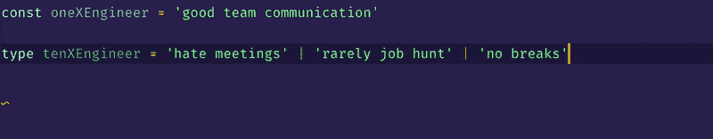
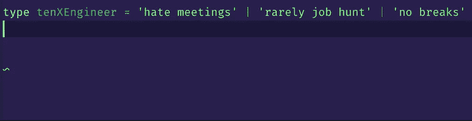

# 使用 Typescript 字符串枚举？考虑字符串文字！

> 原文：<https://dev.to/bholmesdev/using-enums-with-string-values-in-typescript-consider-string-literals-instead-486e>

如果您使用 TypeScript 已经有一段时间了，您可能至少曾经对此感到疑惑:

我可以在 TypeScript 枚举中使用字符串值代替数字吗？

当你希望一个变量有几个选择的字符串值时，经常会出现这种情况。例如，假设您正在为一个网站创建一个横幅，黄色表示警告，红色表示紧急情况。您想让一些东西可重用，所以您添加了一个 enum，用于它是哪种类型的横幅:

```
enum BannerType = {
    Warning = "warning",
    Danger = "danger"
} 
```

<svg width="20px" height="20px" viewBox="0 0 24 24" class="highlight-action crayons-icon highlight-action--fullscreen-on"><title>Enter fullscreen mode</title></svg> <svg width="20px" height="20px" viewBox="0 0 24 24" class="highlight-action crayons-icon highlight-action--fullscreen-off"><title>Exit fullscreen mode</title></svg>

这为如何使用该枚举的值提供了很大的灵活性。一个常见的用法可能是定义一个用于设计横幅的类名:

```
{/* Yes, this is written a JSX-y fashion for you React users */}
<div className={BannerType.Danger}>Uh oh!</div> 
```

<svg width="20px" height="20px" viewBox="0 0 24 24" class="highlight-action crayons-icon highlight-action--fullscreen-on"><title>Enter fullscreen mode</title></svg> <svg width="20px" height="20px" viewBox="0 0 24 24" class="highlight-action crayons-icon highlight-action--fullscreen-off"><title>Exit fullscreen mode</title></svg>

这比编写奇怪的帮助函数和 ternaries 来确定使用什么类名要容易得多。枚举字符串值有更多的用例，如对象键、CMS 内容标识符、段落文本、错误日志等。

## 当弦枚举落平

对于枚举+字符串初始化器，您可能会发现一些麻烦:

*   他们有点啰嗦
*   它们需要查找和工具提示来查看实际的字符串值是什么
*   它们受限于枚举可以使用的特殊字符

这最后一点对我的 web 开发团队来说是一个巨大的摩擦点。为了解释，我们希望为来自 [Contentful CMS](https://www.contentful.com/) 的内容生成密钥。在 Contentful 中，一个键可以是你能想到的任何字符串。这意味着你可以，比如说，用点来表示一个子类别(例如。“labels.danger”)或破折号来镜像 [URL slugs](https://prettylinks.com/2018/03/url-slugs/) (例如。“结帐-促销-代码”)。

***澄清**:“CMS”是一种为你的网站托管所有内容的外部服务。在我们的例子中，我们使用 Contentful 来存储我们显示的所有标题文本、正文文本、图像和视频。为了检索这些内容，我们通过特定的键进行 API 调用。*

这给我们的 enum 解决方案带来了问题。我们需要使用这些键来检索站点的内容，将每个内容丰富的键映射到一个枚举意味着去掉所有的点和破折号！不用说，这可能会导致一些键之间令人讨厌的冲突，这些键在 Contentful 中是唯一的，但在我们的 hacky enums 中不是唯一的。

## 字符串文字来救援！

幸运的是，当您需要这些字符串值时，TypeScript 有一个更简洁的解决方案。您可以提供一个有限的字符串列表，一个变量可以被分配。否则，它应该抛出一个类型错误。

[](https://res.cloudinary.com/practicaldev/image/fetch/s--RZOiE5LV--/c_limit%2Cf_auto%2Cfl_progressive%2Cq_66%2Cw_880/https://thepracticaldev.s3.amazonaws.com/i/vg17yj980e8yzi3s3ihj.gif)

这也将阻止您将传统的“字符串”类型分配给字符串文字。因此，在声明类型时，需要导出字符串类型，并像使用枚举一样使用它。

[](https://res.cloudinary.com/practicaldev/image/fetch/s--lC7hLhbJ--/c_limit%2Cf_auto%2Cfl_progressive%2Cq_66%2Cw_880/https://thepracticaldev.s3.amazonaws.com/i/4l8srodbtpwfn88dp22d.gif)

从上面信息丰富的 gif 可以看出，自动完成功能也可以工作！

### 局限性

字符串文字并不是所有情况下的灵丹妙药。值得注意的是，使用字符串文字并不能改善枚举的冗长本质。事实上，在指定文字类型时，它通常会提供比必要信息更多的信息。

当分配`'random string'`而不是`SpecificTypes.Enum`时，在视觉上也更不清楚所有可能的值。这需要团队沟通来决定字符串文字是否最适合顺利的 PR 审查和文本编辑器/ IDE 支持。

## 学点小东西？

噪音。如果你错过了，我发布了一个[我的“网络魔法”时事通讯](https://tinyletter.com/bholmesdev)来探索更多像这样的知识金块！

这个东西解决了 web 开发的[【首要原则】](https://www.swyx.io/first-principles-approach/)。换句话说，是什么让我们所有的 web 项目运转起来的所有 janky 浏览器 API、弯曲的 CSS 规则和半可访问的 HTML？如果你正在寻找超越框架的*，这是给你亲爱的网络巫师的🔮*

 *[立即在此订阅](https://tinyletter.com/bholmesdev)。我保证永远教，永远不会垃圾邮件❤️*