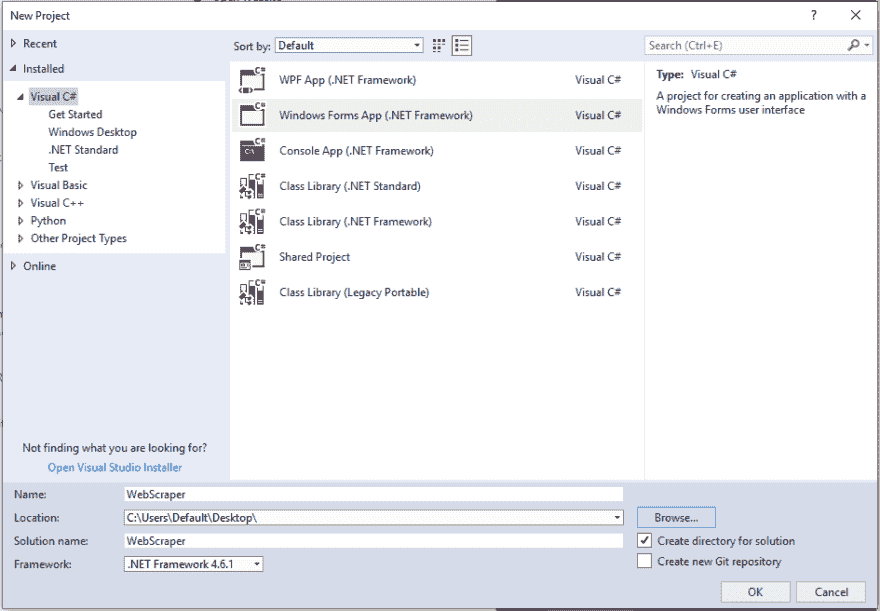
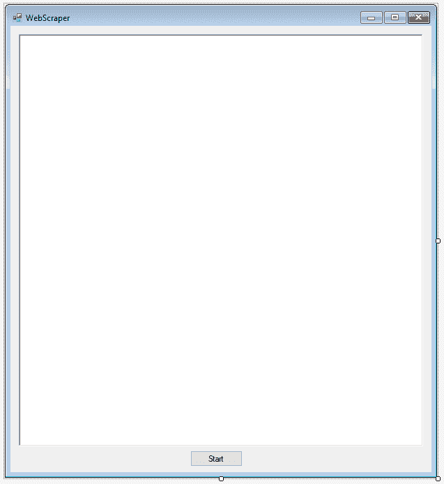
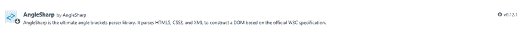
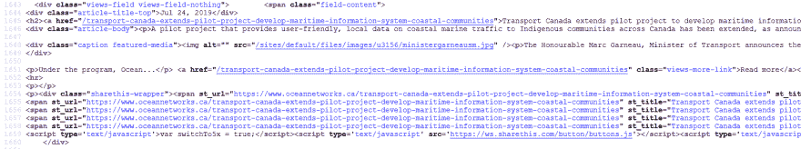
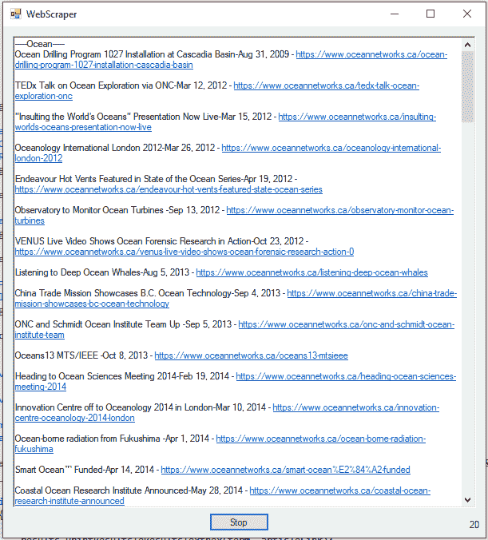

# 用 C#创建一个简单的 Web Scraper

> 原文：<https://dev.to/rachelsoderberg/create-a-simple-web-scraper-in-c-1l1m>

网络抓取是一项在很多情况下都可以派上用场的技能，主要是当你需要从网站上获取一组特定的数据时。我相信这在工程和科学中最常用于检索数据，如统计数据或带有特定关键字的文章。在本教程中，我将教你如何为后者抓取一个网站——带有特定关键词的文章。

在我们开始之前，我想介绍一下网络抓取及其局限性。网络抓取也称为网络采集或网络数据提取，是一种通过互联网从网站自动提取数据的方法。我今天要教你的解析方法是 HTML 解析，这意味着我们的 web scraper 将查看页面的 HTML 内容，并提取与我们想要从中检索信息的类相匹配的信息(如果这没有意义，不用担心。稍后我会详细介绍！)这种抓取网页的方法受到这样一个事实的限制，即并非所有的网站都以 html 格式存储它们的所有信息——我们今天所看到的许多信息都是动态的，并且是在页面被加载之后构建的。为了查看这些信息，需要一个更复杂的网络爬虫，通常带有自己的 web 加载器，这超出了本教程的范围。

我选择用 C#来构建 web scraper，因为大多数教程都是用 Python 来构建 web scraper 的。虽然这可能是这项工作的理想语言，但我想向自己证明用 C#也能做到这一点。我也希望通过提供仅有的几个 C# web 抓取教程中的一个来帮助其他人学习构建自己的 web 抓取器(截至本文撰写之时)。

# 构建 Web 刮刀

我们将要抓取的网站是加拿大海洋网络公司，该网站致力于提供关于海洋和我们星球的信息。使用这个项目在互联网上搜集文章和数据的人会发现，这个网站提供了一个与他们将遇到的许多其他网站相似的模型。

1.  启动 Visual Studio 并创建新的 C#。NET Windows 窗体应用程序。

    [](https://res.cloudinary.com/practicaldev/image/fetch/s--4D8bhJB5--/c_limit%2Cf_auto%2Cfl_progressive%2Cq_auto%2Cw_880/https://thepracticaldev.s3.amazonaws.com/i/hbd5i4lw5b0d34j46ndq.PNG)

2.  设计一个基本的表单，带有一个启动 scraper 的按钮和一个用于打印结果的富文本框。

    [](https://res.cloudinary.com/practicaldev/image/fetch/s--M3C0jRQM--/c_limit%2Cf_auto%2Cfl_progressive%2Cq_auto%2Cw_880/https://thepracticaldev.s3.amazonaws.com/i/rdz8wnswc6f8xa9g2y01.PNG)

3.  通过在解决方案资源管理器中右键单击您的项目名称并选择“管理 NuGet 包”,打开您的 NuGet 包管理器。搜索“AngleSharp”并单击安装。

    [](https://res.cloudinary.com/practicaldev/image/fetch/s--HkqJxiRK--/c_limit%2Cf_auto%2Cfl_progressive%2Cq_auto%2Cw_880/https://thepracticaldev.s3.amazonaws.com/i/dqrdgryd1yflyroyakzz.PNG)

4.  添加一组查询词(这些词应该是您希望文章标题中包含的词)并创建一个方法，我们将在该方法中设置我们的文档以进行抓取。您的代码应该如下所示:

    ```
     private string Title { get; set; }
        private string Url { get; set; }
        private string siteUrl = "https://www.oceannetworks.ca/news/stories";
        public string[] QueryTerms { get; } = {"Ocean", "Nature", "Pollution"};

        internal async void ScrapeWebsite()
        {
              CancellationTokenSource cancellationToken = new CancellationTokenSource();
              HttpClient httpClient = new HttpClient();
              HttpResponseMessage request = await httpClient.GetAsync(siteUrl);
              cancellationToken.Token.ThrowIfCancellationRequested();

              Stream response = await request.Content.ReadAsStreamAsync();
              cancellationToken.Token.ThrowIfCancellationRequested();

              HtmlParser parser = new HtmlParser();
              IHtmlDocument document = parser.ParseDocument(response);
        } 
    ```

    如果任务或线程请求取消，cancelationtokensource 提供一个令牌。
    [HttpClient](https://docs.microsoft.com/en-us/dotnet/api/system.net.http.httpclient?view=netframework-4.8) 提供了一个基类，用于发送 HTTP 请求和从 URI 标识的资源接收 HTTP 响应
    [HttpResponseMessage](https://docs.microsoft.com/en-us/dotnet/api/system.net.http.httpresponsemessage?view=netframework-4.8) 表示 HTTP 响应消息，包括状态代码和数据。
    HtmlParser 和 IHtmlDocument 是 AngleSharp 类，允许您从网站 HTML 内容构建和解析文档。

5.  创建另一个新方法来获取和显示 AngleSharp 文档的结果。在这里，我们将解析文档并检索任何匹配我们的查询条件的文章。这可能会很棘手，因为没有两个网站使用相同的 HTML 命名约定-这可能需要一些试验和错误，才能使“article link”LINQ 查询正确:

    ```
     private void GetScrapeResults(IHtmlDocument document)
        {
              IEnumerable<IElement> articleLink;

              foreach (var term in QueryTerms)
              {
                    articleLink = document.All.Where(x => x.ClassName == "views-field views-field-nothing" && (x.ParentElement.InnerHtml.Contains(term) || x.ParentElement.InnerHtml.Contains(term.ToLower())));
              }

              if (articleLink.Any())
              {
                    // Print Results: See Next Step
              }
        } 
    ```

    如果您不确定这里发生了什么，我将更详细地解释:我们循环遍历每个查询项(海洋、自然和污染),并解析我们的文档，以查找类名为“views-field views-field-nothing”且 ParentElement。InnerHtml 包含我们当前正在查询的术语。

    如果您不熟悉如何查看网页的 HTML，您可以通过导航到您想要的 URL，右键单击页面上的任意位置，然后选择“查看页面源”来找到它。有的页面 HTML 量很小，有的页面上万行。您需要筛选所有这些内容，找到文章标题存储的位置，然后确定保存它们的类。我使用的一个技巧是搜索文章标题的一部分，然后向上移动几行。

    [](https://res.cloudinary.com/practicaldev/image/fetch/s--m90x0U6S--/c_limit%2Cf_auto%2Cfl_progressive%2Cq_auto%2Cw_880/https://thepracticaldev.s3.amazonaws.com/i/yfqoqugbzcb1cogyumal.PNG)

6.  现在，如果我们的查询条件有利可图，我们应该有一个包含几组 HTML 的列表，其中包含我们的文章标题和 URL。创建一个新方法将结果打印到 Rich Textbox。

    ```
     public void PrintResults(string term, IEnumerable<IElement> articleLink)
        {
              // Clean Up Results: See Next Step

              resultsTextbox.Text = $"{Title} - {Url}{Environment.NewLine}";
        } 
    ```

7.  如果我们按原样打印我们的结果，它们看起来就像 HTML 标记，带有所有的标签、尖括号和其他非人类友好的项目。我们需要插入一个方法，在将结果打印到表单之前对其进行清理，就像步骤 5 一样，不同网站的标记会有很大不同。

    ```
     private void CleanUpResults(IElement result)
        {
              string htmlResult = result.InnerHtml.ReplaceFirst("        <span class=\"field-content\"><div><a href=\"", "https://www.oceannetworks.ca");
              htmlResult = htmlResult.ReplaceFirst("\">", "*");
              htmlResult = htmlResult.ReplaceFirst("</a></div>\n<div class=\"article-title-top\">", "-");
              htmlResult = htmlResult.ReplaceFirst("</div>\n<hr></span>  ", "");

              // Split Results: See Next Step
        } 
    ```

    这里发生了什么？嗯，我检查了传入的 result 对象的 InnerHtml，以查看需要从我实际想要显示的内容中删除哪些额外的内容——标题和 URL。从左到右，我简单地用一个空字符串或“nothing”替换了 html 内容的每一个块，然后对于 URL 和标题之间的块，我用一个“*”替换作为占位符，以便稍后分割字符串。ReplaceFirst()的每一种用法在每个网站上都是不同的，它甚至不能完美地适用于特定网站上的每一篇文章。您可以继续添加新的替换，或者如果它们不够常见，就忽略它们。

8.  我相信您已经注意到，在我们可以将干净的结果打印到文本框之前，还有最后一个方法要添加。既然我们已经清理了结果字符串，我们可以使用“*”占位符将它分成两个字符串——一个标题和一个 URL。

    ```
     private void SplitResults(string htmlResult)
        {
              string[] splitResults = htmlResult.Split('*');
              Url = splitResults[0];
              Title = splitResults[1];
        } 
    ```

9.  最后，我们有一个干净的，对人类友好的结果！如果一切顺利，并且自撰写本文以来文章没有发生重大变化，那么运行您的代码应该会产生以下结果(以及更多...有很多！)是你的申请从 Ocean Networks 上刮下来的:

    [](https://res.cloudinary.com/practicaldev/image/fetch/s--gOmxu0JU--/c_limit%2Cf_auto%2Cfl_progressive%2Cq_auto%2Cw_880/https://thepracticaldev.s3.amazonaws.com/i/dy1zki97mpi4bffwjfax.PNG)

* * *

我希望这篇教程能让你对网络抓取有所了解。如果有足够的兴趣，我可以继续这个系列，并教您如何设置您的应用程序在特定的时间间隔做一次新的刮擦，并向您发送一封时事通讯式的电子邮件，其中包含一天或一周的结果。

如果你想在社交媒体上与我交流，来 Twitter 或 T2 LinkedIn 打个招呼吧！