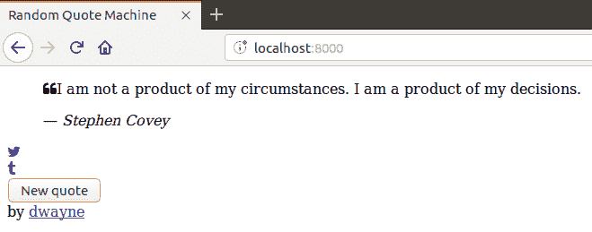
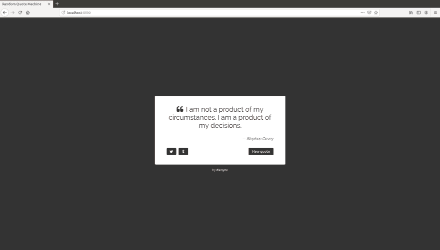

# 让我们在 Elm 中构建一个随机报价机——第 1 部分

> 原文：<https://dev.to/dwayne/let-s-build-a-random-quote-machine-in-elm-part-1-3n64>

在这个系列中，我将教你如何在 Elm 中构建[随机报价机](https://github.com/dwayne/elm-random-quote-machine/) web 应用程序。

观看[演示](https://dwayne.github.io/elm-random-quote-machine/)，了解我们正在努力实现的目标。

我们将从头开始，在 3 篇短文中，我们将涵盖完成应用程序所需的所有步骤。

这是我们要做的:

1.  我们将使用 HTML 构建应用程序。
2.  我们将使用 CSS 来设计应用程序的样式。
3.  我们将把 HTML 移植到 Elm 中它的对等物上。
4.  我们将重构 Elm 代码。
5.  我们会让“新报价”按钮正常工作。
6.  我们将从遥远的地方获取报价。

你将获得使用[随机性](https://guide.elm-lang.org/effects/random.html)、 [JSON 解码器](https://guide.elm-lang.org/effects/json.html)、 [HTTP](https://guide.elm-lang.org/effects/http.html) 和[标志](https://guide.elm-lang.org/interop/flags.html)的经验。

让我们开始吧。

## 使用 HTML 构建应用程序

创建一个名为`random-quote-machine`的新目录，并在其中创建一个
文件。

```
$ mkdir random-quote-machine
$ cd random-quote-machine
$ touch index.html 
```

<svg width="20px" height="20px" viewBox="0 0 24 24" class="highlight-action crayons-icon highlight-action--fullscreen-on"><title>Enter fullscreen mode</title></svg> <svg width="20px" height="20px" viewBox="0 0 24 24" class="highlight-action crayons-icon highlight-action--fullscreen-off"><title>Exit fullscreen mode</title></svg>

在你最喜欢的编辑器中打开`index.html`，写下如下内容:

```
<!doctype html>
<html lang="en">
  <head>
    <meta charset="utf-8">
    <meta name="viewport" content="width=device-width, initial-scale=1">

    <title>Random Quote Machine</title>

    <link rel="stylesheet" href="https://cdnjs.cloudflare.com/ajax/libs/font-awesome/4.7.0/css/font-awesome.min.css" />
  </head>
  <body>
    <!-- Background -->
    <div>
      <!-- Wraps the quotation box and attribution -->
      <div>
        <!-- Quotation box -->
        <div>
          <!-- Quote and author -->
          <blockquote>
            <!-- Quote -->
            <p>
              <span><i class="fa fa-quote-left"></i></span>I am not a product of my circumstances. I am a product of my decisions.
            </p>
            <!-- Author -->
            <footer>
              &mdash; <cite>Stephen Covey</cite>
            </footer>
          </blockquote>

          <!-- Actions -->
          <div>
            <!-- Tweet it -->
            <div>
              <a href="https://twitter.com/intent/tweet?hashtags=quotes&text=%22I%20am%20not%20a%20product%20of%20my%20circumstances.%20I%20am%20a%20product%20of%20my%20decisions.%22%20%E2%80%94%20Stephen%20Covey" target="_blank"><i class="fa fa-twitter"></i></a>
            </div>
            <!-- Post it to Tumblr -->
            <div>
              <a href="https://www.tumblr.com/widgets/share/tool?posttype=quote&tags=quotes&content=I%20am%20not%20a%20product%20of%20my%20circumstances.%20I%20am%20a%20product%20of%20my%20decisions.&caption=Stephen%20Covey&canonicalUrl=https%3A%2F%2Fwww.tumblr.com%2Fdocs%2Fen%2Fshare_button" target="_blank"><i class="fa fa-tumblr"></i></a>
            </div>
            <!-- Get a new random quote -->
            <div>
              <button type="button" autofocus>New quote</button>
            </div>
          </div>
        </div>

        <!-- Attribution -->
        <footer>
          by <a href="https://github.com/dwayne/" target="_blank">dwayne</a>
        </footer>
      </div>
    </div>
  </body>
</html> 
```

<svg width="20px" height="20px" viewBox="0 0 24 24" class="highlight-action crayons-icon highlight-action--fullscreen-on"><title>Enter fullscreen mode</title></svg> <svg width="20px" height="20px" viewBox="0 0 24 24" class="highlight-action crayons-icon highlight-action--fullscreen-off"><title>Exit fullscreen mode</title></svg>

当您在浏览器中查看 HTML 时，您会看到以下内容:

[](https://res.cloudinary.com/practicaldev/image/fetch/s--s7PP-ePo--/c_limit%2Cf_auto%2Cfl_progressive%2Cq_auto%2Cw_880/https://thepracticaldev.s3.amazonaws.com/i/d5c9exb57ythoaybco6y.png)

更多详情，请点击[此处](https://github.com/dwayne/elm-random-quote-machine/blob/tutorial/tutorial/step-01.md)。

## 使用 CSS 样式化应用程序

创建一个名为`assets`的新目录，并在其中创建一个`styles.css`文件。

```
$ mkdir assets
$ touch assets/styles.css 
```

<svg width="20px" height="20px" viewBox="0 0 24 24" class="highlight-action crayons-icon highlight-action--fullscreen-on"><title>Enter fullscreen mode</title></svg> <svg width="20px" height="20px" viewBox="0 0 24 24" class="highlight-action crayons-icon highlight-action--fullscreen-off"><title>Exit fullscreen mode</title></svg>

打开`index.html`并在字体 Awesome 链接之后添加一个样式表链接。

```
<link rel="stylesheet" href="assets/styles.css"> 
```

<svg width="20px" height="20px" viewBox="0 0 24 24" class="highlight-action crayons-icon highlight-action--fullscreen-on"><title>Enter fullscreen mode</title></svg> <svg width="20px" height="20px" viewBox="0 0 24 24" class="highlight-action crayons-icon highlight-action--fullscreen-off"><title>Exit fullscreen mode</title></svg>

### 文体体

```
@import url("https://fonts.googleapis.com/css?family=Raleway:400,500");

/* General */

body {
  margin: 0;
  height: 100vh;

  font-family: Raleway, sans-serif;
  font-weight: 400;
} 
```

<svg width="20px" height="20px" viewBox="0 0 24 24" class="highlight-action crayons-icon highlight-action--fullscreen-on"><title>Enter fullscreen mode</title></svg> <svg width="20px" height="20px" viewBox="0 0 24 24" class="highlight-action crayons-icon highlight-action--fullscreen-off"><title>Exit fullscreen mode</title></svg>

### 样式背景

```
<!-- Background -->
<div class="background">
  <!-- Wraps the quotation box and attribution -->
  <div>
    <!-- ... -->
  </div>
</div> 
```

<svg width="20px" height="20px" viewBox="0 0 24 24" class="highlight-action crayons-icon highlight-action--fullscreen-on"><title>Enter fullscreen mode</title></svg> <svg width="20px" height="20px" viewBox="0 0 24 24" class="highlight-action crayons-icon highlight-action--fullscreen-off"><title>Exit fullscreen mode</title></svg>

```
/* Background */

.background {
  height: 100vh;

  display: flex;
  align-items: center;
  justify-content: center;

  background-color: #333;
} 
```

<svg width="20px" height="20px" viewBox="0 0 24 24" class="highlight-action crayons-icon highlight-action--fullscreen-on"><title>Enter fullscreen mode</title></svg> <svg width="20px" height="20px" viewBox="0 0 24 24" class="highlight-action crayons-icon highlight-action--fullscreen-off"><title>Exit fullscreen mode</title></svg>

### 样式报价框

```
<!-- Quotation box -->
<div class="quote-box">
  <!-- Quote and author -->
  <blockquote class="quote-box__blockquote">
    <!-- Quote -->
    <p class="quote-box__quote-wrapper">
      <span class="quote-left"><i class="fa fa-quote-left"></i></span>...
    </p>
    <!-- Author -->
    <footer class="quote-box__author-wrapper">
      &#8212; <cite class="author">...</cite>
    </footer>
  </blockquote>

  <!-- Actions -->
  <div class="quote-box__actions">
    <!-- Tweet it -->
    <div>
      <a href="..." target="_blank" class="icon-button"><i class="fa fa-twitter"></i></a>
    </div>
    <!-- Post to Tumblr -->
    <div>
      <a href="..." target="_blank" class="icon-button"><i class="fa fa-tumblr"></i></a>
    </div>
    <!-- Get a new quote -->
    <div>
      <button type="button" autofocus class="button">New quote</button>
    </div>
  </div>
</div> 
```

<svg width="20px" height="20px" viewBox="0 0 24 24" class="highlight-action crayons-icon highlight-action--fullscreen-on"><title>Enter fullscreen mode</title></svg> <svg width="20px" height="20px" viewBox="0 0 24 24" class="highlight-action crayons-icon highlight-action--fullscreen-off"><title>Exit fullscreen mode</title></svg>

```
/* Quote box */

.quote-box {
  width: 450px;
  padding: 40px 50px;

  border-radius: 3px;

  color: #333;
  background-color: #fff;
}

.quote-box__blockquote {
  margin: 0 0 30px 0;
}

.quote-box__quote-wrapper {
  margin-top: 0;

  text-align: center;
  font-size: 1.8rem;
}

.quote-box__quote-wrapper .quote-left {
  margin-right: 12px;
}

.quote-box__author-wrapper {
  text-align: right;
}

.quote-box__author-wrapper .author {
  font-style: italic;
}

.quote-box__actions {
  display: flex;
}

.quote-box__actions .button {
  height: 30px;

  padding-left: 15px;
  padding-right: 15px;

  border: 0;
  border-radius: 3px;

  cursor: pointer;

  color: #fff;
  background-color: #333;
}

.quote-box__actions .icon-button {
  display: flex;
  align-items: center;
  justify-content: center;

  width: 40px;
  height: 30px;

  border-radius: 3px;

  text-decoration: none;

  color: #fff;
  background-color: #333;
}

.quote-box__actions .button:hover,
.quote-box__actions .icon-button:hover {
  opacity: 0.9;
}

.quote-box__actions > div:first-child {
  margin-right: 10px;
}

.quote-box__actions > div:last-child {
  margin-left: auto;
} 
```

<svg width="20px" height="20px" viewBox="0 0 24 24" class="highlight-action crayons-icon highlight-action--fullscreen-on"><title>Enter fullscreen mode</title></svg> <svg width="20px" height="20px" viewBox="0 0 24 24" class="highlight-action crayons-icon highlight-action--fullscreen-off"><title>Exit fullscreen mode</title></svg>

### 样式归属

```
<!-- Attribution -->
<footer class="attribution">
  by <a href="https://github.com/dwayne/" target="_blank" class="attribution__link">dwayne</a>
</footer> 
```

<svg width="20px" height="20px" viewBox="0 0 24 24" class="highlight-action crayons-icon highlight-action--fullscreen-on"><title>Enter fullscreen mode</title></svg> <svg width="20px" height="20px" viewBox="0 0 24 24" class="highlight-action crayons-icon highlight-action--fullscreen-off"><title>Exit fullscreen mode</title></svg>

```
/* Attribution */

.attribution {
  margin-top: 15px;

  text-align: center;
  font-size: 0.8rem;

  color: #fff;
}

.attribution__link {
  text-decoration: none;
  font-weight: 500;

  color: #fff;
} 
```

<svg width="20px" height="20px" viewBox="0 0 24 24" class="highlight-action crayons-icon highlight-action--fullscreen-on"><title>Enter fullscreen mode</title></svg> <svg width="20px" height="20px" viewBox="0 0 24 24" class="highlight-action crayons-icon highlight-action--fullscreen-off"><title>Exit fullscreen mode</title></svg>

这是应用程序现在的样子:

[](https://res.cloudinary.com/practicaldev/image/fetch/s--w1EUmHHc--/c_limit%2Cf_auto%2Cfl_progressive%2Cq_auto%2Cw_880/https://thepracticaldev.s3.amazonaws.com/i/6gd3j0xl2krjwf8iwzps.png)

**提示:** *我发现，我越早解决大部分 HTML 和 CSS 的问题，就越容易弄清楚如何构建 Elm 代码并在特性上分层。不过，这不是 Elm 特有的。这就是我在 React 和 Angular 中的做法。*

更多详情，请点击[此处](https://github.com/dwayne/elm-random-quote-machine/blob/tutorial/tutorial/step-02.md)。

明天我们将把 HTML 移植到 Elm，并做一点重构来组织代码，以便在后面的步骤中更容易添加特性。