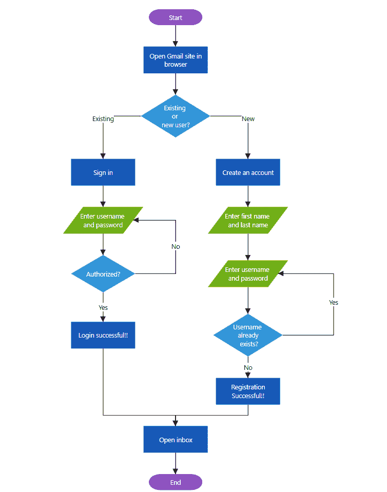
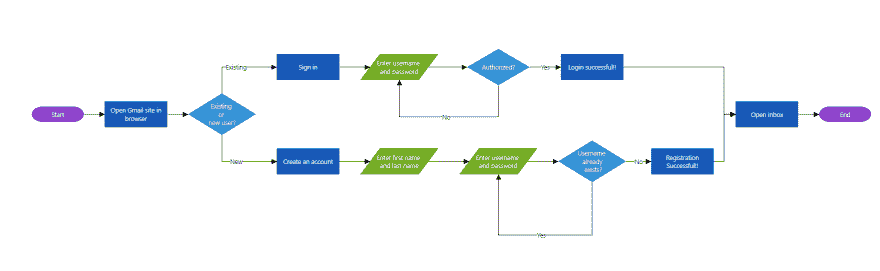
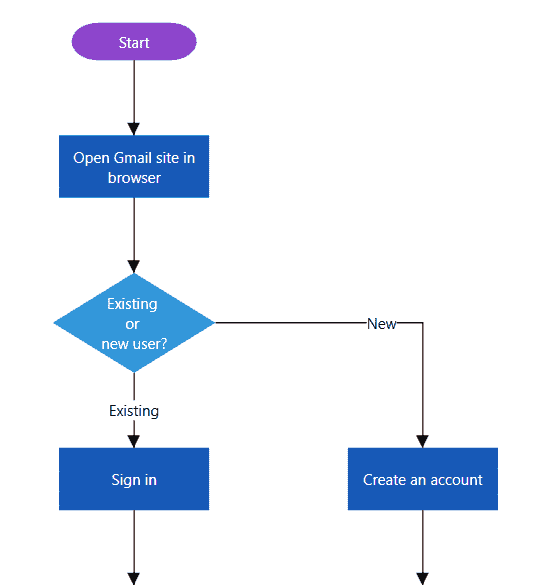
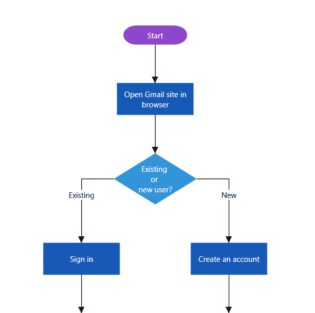

# 如何根据数据创建流程图，而无需指定 WPF 坐标

> 原文：<https://dev.to/syncfusion/how-to-create-a-flowchart-from-data-without-specifying-coordinates-in-wpf-3fkh>

在创建流程图的过程中，为每个元素提供坐标是非常繁琐的。为了帮助你避免这个令人厌烦的过程，Syncfusion [WPF 图表库](https://www.syncfusion.com/wpf-ui-controls/diagram)只需要一些配置设置就可以做到。在这篇博客中，我将引导您使用 Syncfusion 图表库创建流程图，而不需要手动指定坐标，而是使用内置的流程图自动布局算法。

[流程图](https://en.wikipedia.org/wiki/Flowchart)是流程、工作流程、系统或计算机算法的图示。流程图使用各种符号来说明不同类型的操作，这些符号由箭头连接，表示流程的流向。

## 常见流程图符号

不同的流程图符号具有不同的含义，用于表示流程图中的特定状态。下表描述了最常见的流程图符号。

| **符号** | **名称** | **描述** |
|  | 终止符/开始/结束 | 指示进程的开始或结束。 |
|  | 数据 | 表示进程的数据输入或输出。 |
|  | 过程 | 表示一个或一组操作和数据操作。 |
|  | 决定 | 显示了决定从两条路径中选择一条的分支点。 |
|  | 文件 | 代表流程中的单个文档或报表。 |
|  | 子流程/预定义流程 | 表示组合起来执行在别处定义的特定任务的一系列操作。 |
|  | 数据库ˌ资料库 | 表示允许搜索、排序和筛选的信息集合。 |
|  | 数据存储 | 表示在流程中存储数据的步骤。 |
|  | 人工输入 | 表示将数据手动输入到流程中的字段或步骤。 |
|  | 手控 | 表示流程中必须手动完成而不是自动完成的操作。 |
|  | 准备 | 表示过程中另一个步骤的设置或初始化过程。 |
|  | 页面上的参考 | 代表一对带标签的连接线，用于链接流程图中的长线条或易混淆的线条。 |
|  | 离页参考 | 代表用于链接不同页面上的两个流程图的带标签的连接线。 |
|  | 多文档 | 代表一个流程中的多个文档或报表。 |
|  | 流线 | 表示从一个步骤到另一个步骤的流动方向。 |

## 从简单的流程图开始

让我们使用 [Syncfusion 图表库](https://www.syncfusion.com/wpf-ui-controls/diagram)创建一个简单的流程图，如下图所示。图表控件具有内置的高性能布局算法，可以自动排列每个流程图符号，并且它支持可视化来自数据源的流程图。【T2

*用图表控件的自动布局算法建立的流程图*

1.  创建一个 WPF 应用程序，并参考我们的帮助[文档](https://help.syncfusion.com/wpf/sfdiagram/getting-started)来了解更多关于集成图表控件所需的依赖程序集引用和名称空间的信息。
2.  将流程图信息定义为数据源。该信息应包含流程图符号形状数据、每个动作的简短描述以及符号宽度和高度。
3.  创建* *图** 控件的实例。
4.  使用数据映射配置创建一个**流程图数据源设置**的实例，并将其分配给所创建的**图**实例的**数据源设置**属性。
5.  用流程图布局设置配置**布局管理器**，以自动排列流程图元素。这些设置将配置流程图方向、符号之间的水平和垂直间距以及决策输出分支方向。

在图表控件中，前面屏幕截图中显示的不同形状代表节点，线条代表连接器。形状和线条内的文本代表注释。下面的代码示例包括前面的所有步骤。完整样本可从 [Syncfusion 网站](https://www.syncfusion.com/downloads/support/directtrac/general/ze/Flowchart_Layout-2088923614.zip)获得。

```
/// <summary>
/// Interaction logic for MainWindow.xaml
/// </summary>
public partial class MainWindow : Window
{
    public MainWindow()
    {
        InitializeComponent();
        //Initialize new instance of Diagram control
        SfDiagram diagram = new SfDiagram();
        //Initialize Nodes with Observable Collection of NodeViewModel.
        diagram.Nodes = new NodeCollection();
        //Initialize Connectors with Observable Collection of ConnectorViewModel
        diagram.Connectors = new ConnectorCollection();
        RootGrid.Children.Add(diagram);
        // Initialize DataSourceSettings for SfDiagram
        diagram.DataSourceSettings = new FlowchartDataSourceSettings()
        {
            //Set the unique field from data source
            Id = "Id",
            //Field used to identify the previous flowchart element
            ParentId = "ParentId",
            //Define the flowchart information
            DataSource = GetData(),
            //Field used to identify the line text
            ConnectorTextMapping = "LineText",
            //Field used to identify the symbol description
            ContentMapping = "Description",
            //Field used to identify the symbol shape
            ShapeMapping = "Shape",
            //Field used to identify the symbol width
            WidthMapping = "Width",
            //Field used to identify the symbol height
            HeightMapping = "Height"
        };

        // Initialize LayoutSettings for SfDiagram
        diagram.LayoutManager = new LayoutManager()
        {
            Layout = new FlowchartLayout()
            {
                //Set the flowchart flow direction
                Orientation = FlowchartOrientation.TopToBottom,
                //Set the decision yes branch direction
                YesBranchDirection = BranchDirection.LeftInFlow,
                //Set the decision no branch direction
                NoBranchDirection = BranchDirection.RightInFlow,
                //Set the custom yes branch values
                YesBranchValues = new List<string> { "Yes", "Existing" },
                //Set the custom no branch values
                NoBranchValues = new List<string> { "No", "New" },
                //Set the horizontal spacing between node
                HorizontalSpacing = 60,
                //Set the vertical spacing between node
                VerticalSpacing = 40,
                Margin = new Thickness(10),
            },
        };
    }
    /// <summary>
    /// Method to Get Data for DataSource
    /// </summary>
    /// <param name="data"></param>
    private SymbolInfoCollection GetData()
    {
        SymbolInfoCollection symbolInfoCollection = new SymbolInfoCollection();
        #region Gmail
        symbolInfoCollection.Add(new SymbolInfo() { Id = "1", Description = "Start", Shape = App.Current.Resources["StartOrEnd"] as string, Width = 100, Height = 30, Color = "#8E44CC" });

        symbolInfoCollection.Add(new SymbolInfo() { Id = "2", Description = "Open Gmail site in browser", ParentId = new List<string> { "1" }, Shape = App.Current.Resources["Rectangle"] as string, Width = 120, Height = 50, Color = "#1759B7" });

        symbolInfoCollection.Add(new SymbolInfo() { Id = "3", Description = "Existing \nor \nnew user?", ParentId = new List<string> { "2" }, Shape = App.Current.Resources["Decision"] as string, Width = 130, Height = 80, Color = "#2F95D8" });

        symbolInfoCollection.Add(new SymbolInfo() { Id = "4", LineText = new List<string> { "New" }, Description = "Create an account", ParentId = new List<string> { "3" }, Shape = App.Current.Resources["Rectangle"] as string, Width = 120, Height = 50, Color = "#1759B7" });

        symbolInfoCollection.Add(new SymbolInfo() { Id = "5", Description = "Sign in", LineText = new List<string> { "Existing" }, ParentId = new List<string> { "3" }, Shape = App.Current.Resources["Rectangle"] as string, Width = 120, Height = 50, Color = "#1759B7" });

        symbolInfoCollection.Add(new SymbolInfo() { Id = "6", Description = "Enter username \nand password", LineText = new List<string> { "", "No" }, ParentId = new List<string> { "5", "7" }, Shape = App.Current.Resources["Data"] as string, Width = 150, Height = 50, Color = "#70AF16" });

        symbolInfoCollection.Add(new SymbolInfo() { Id = "7", Description = "Authorized?", ParentId = new List<string> { "6" }, Shape = App.Current.Resources["Decision"] as string, Width = 120, Height = 70, Color = "#2F95D8" });

        symbolInfoCollection.Add(new SymbolInfo() { Id = "8", Description = "Login successful!!", LineText = new List<string> { "Yes" }, ParentId = new List<string> { "7" }, Shape = App.Current.Resources["Rectangle"] as string, Width = 120, Height = 50, Color = "#1759B7" });

        symbolInfoCollection.Add(new SymbolInfo() { Id = "9", Description = "Enter first name \nand last name", ParentId = new List<string> { "4" }, Shape = App.Current.Resources["Data"] as string, Width = 150, Height = 50, Color = "#70AF16" });

        symbolInfoCollection.Add(new SymbolInfo() { Id = "10", Description = "Enter username \nand password", LineText = new List<string> { "", "Yes" }, ParentId = new List<string> { "9", "11" }, Shape = App.Current.Resources["Data"] as string, Width = 150, Height = 50, Color = "#70AF16" });

        symbolInfoCollection.Add(new SymbolInfo() { Id = "11", Description = "Username \nalready\n exists?", ParentId = new List<string> { "10" }, Shape = App.Current.Resources["Decision"] as string, Width = 130, Height = 80, Color = "#2F95D8" });

        symbolInfoCollection.Add(new SymbolInfo() { Id = "12", Description = "Registration Successful!!", LineText = new List<string> { "No" }, ParentId = new List<string> { "11" }, Shape = App.Current.Resources["Process"] as string, Width = 120, Height = 50, Color = "#1759B7" });

        symbolInfoCollection.Add(new SymbolInfo() { Id = "13", Description = "Open inbox", ParentId = new List<string> { "8", "12" }, Shape = App.Current.Resources["Process"] as string, Width = 120, Height = 50, Color = "#1759B7" });

        symbolInfoCollection.Add(new SymbolInfo() { Id = "14", Description = "End", ParentId = new List<string> { "13" }, Shape = App.Current.Resources["StartOrEnd"] as string, Width = 100, Height = 30, Color = "#8E44CC" });
        #endregion

        return symbolInfoCollection;
    }
} 
```

## 特性

### 流程图方向定制

您可以将流程图的方向自定义为垂直(从上到下)或水平(从左到右)。

使用 **FlowchartLayout** 类的 **Orientation** 属性将流向定义为**顶部底部**或**向左向右**。有关详细信息，请参考下面的代码示例。

```
LayoutManager = new LayoutManager()
{
    Layout = new FlowchartLayout()
    {
        //Set the flowchart flow direction
        Orientation = FlowchartOrientation.LeftToRight
    },
}; 
```

[](https://res.cloudinary.com/practicaldev/image/fetch/s--0IwaIQ2r--/c_limit%2Cf_auto%2Cfl_progressive%2Cq_auto%2Cw_880/https://blog.syncfusion.com/wp-content/uploads/2019/07/Horizontal-Flowchart.png)

*水平流程图*

### 自定义决策符号输出方向

决策符号显示了一个分支点，在这个分支点上决定选择两条路径中的一条。**流程图布局**的 **YesBranchDirection** 和 **NoBranchDirection** 属性控制 **Yes** 和 **No** 分支的方向。下面的代码示例阐释了这一点。

```
LayoutManager = new LayoutManager()
{
    Layout = new FlowchartLayout()
    {
        //Set the decision yes branch direction
        YesBranchDirection = BranchDirection.SameAsFlow,
        //Set the decision no branch direction
        NoBranchDirection = BranchDirection.RightInFlow,
    },
}; 
```

[](https://res.cloudinary.com/practicaldev/image/fetch/s--l4BmFXnS--/c_limit%2Cf_auto%2Cfl_progressive%2Cq_auto%2Cw_880/https://blog.syncfusion.com/wp-content/uploads/2019/07/Flowchart-with-Decision-Branch.png)

*带有决策分支的流程图*

### 自定义是和否分支线文本

判定符号将产生两个分支作为输出:是分支和否分支。如果输出分支连接器文本值与**流程图布局**类的 **YesBranchValues** 属性中的值相匹配，它将被视为是分支。类似地，如果一个连接器文本值与 **NoBranchValues** 属性中的值匹配，它将被认为是一个 No 分支。默认情况下， **YesBranchValues** 属性将包含 **Yes** 和 **True** 字符串值，而 **NoBranchValues** 属性将包含 **No** 和 **False** 字符串值。

为连接器文本提供任何文本值来描述流。另外，在 **YesBranchValues** 和 **NoBranchValues** 中提供任意字符串值。如果或**否则**要基于**决定流，连接器文本应该匹配 **YesBranchValues** 和 **NoBranchValues** 中的值。下面的代码示例阐释了这一点。** 

```
//Add the custom yes branch values
(LayoutManager.Layout as FlowchartLayout).YesBranchValues.Add("Existing");
//Add the custom no branch values
(LayoutManager.Layout as FlowchartLayout).NoBranchValues.Add("New"); 
```

[](https://res.cloudinary.com/practicaldev/image/fetch/s--LZjf1QIT--/c_limit%2Cf_auto%2Cfl_progressive%2Cq_auto%2Cw_880/https://blog.syncfusion.com/wp-content/uploads/2019/07/Custom-Branch-Line-Text.png)

## 总结

在这篇博文中，我们看到了如何使用 [Syncfusion WPF 图表库](https://www.syncfusion.com/wpf-ui-controls/diagram)根据数据创建和定制流程图，而无需指定坐标。您还可以使用该库来创建交互式流程图制作应用程序。更多内置的自动布局，如分层和径向树，在图表控件中也是可用的。要探索更深入的功能，请参考我们关于[自动布局](https://help.syncfusion.com/wpf/sfdiagram/automatic-layouts)的帮助文档。

如果您已经是 Syncfusion 用户，您可以从我们的网站下载产品设置。否则，你可以在这里下载免费的 30 天试用版。

如果你有任何问题，请在下面的评论区告诉我们。您也可以通过我们的[支持论坛](https://www.syncfusion.com/forums)、[直接跟踪](https://www.syncfusion.com/support/directtrac/incidents)或[反馈门户](https://www.syncfusion.com/feedback/wpf)联系我们。我们随时乐意为您提供帮助！

帖子[如何在 WPF 不指定坐标的情况下根据数据创建流程图](https://www.syncfusion.com/blogs/post/create-flowchart-without-specifying-coordinates-in-wpf.aspx)最先出现在 [Syncfusion 博客](https://www.syncfusion.com/blogs)上。