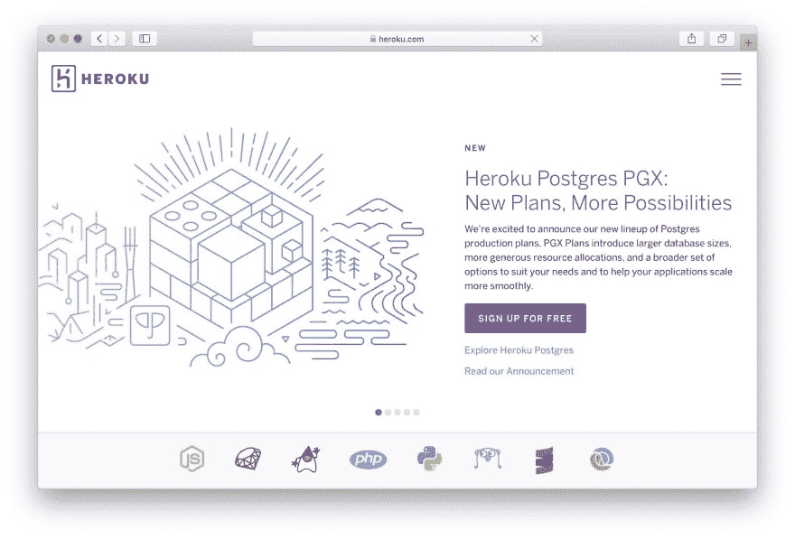
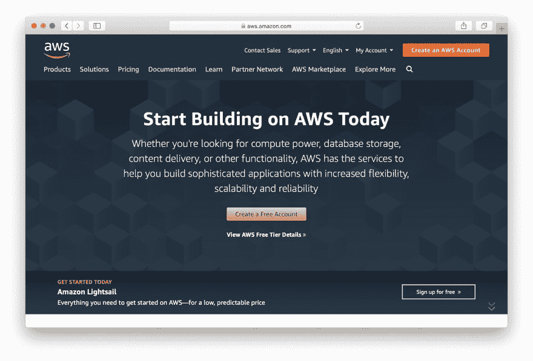
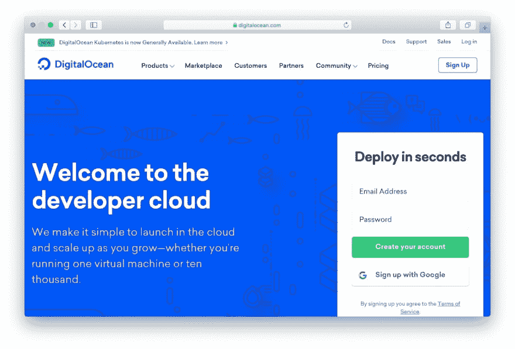
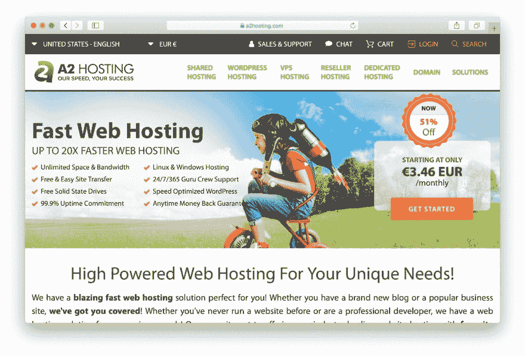
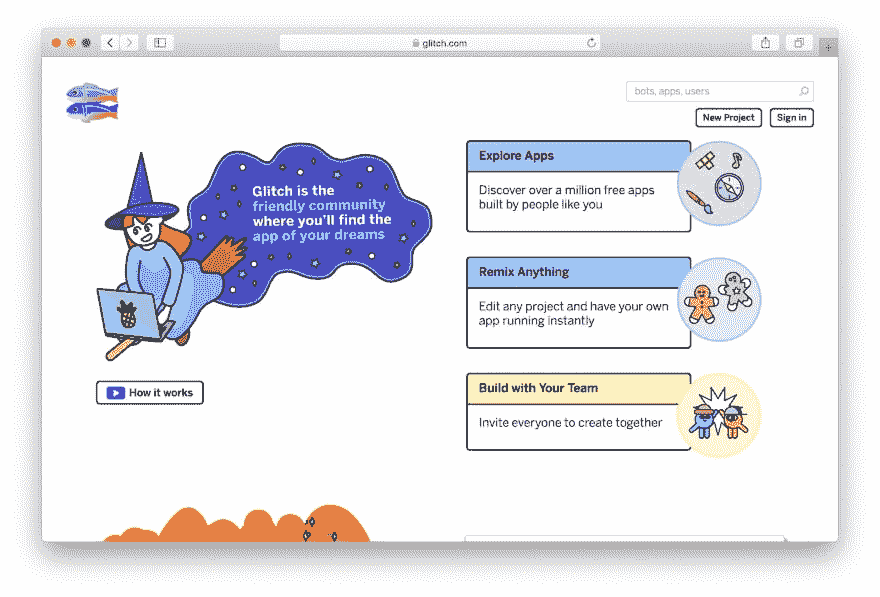
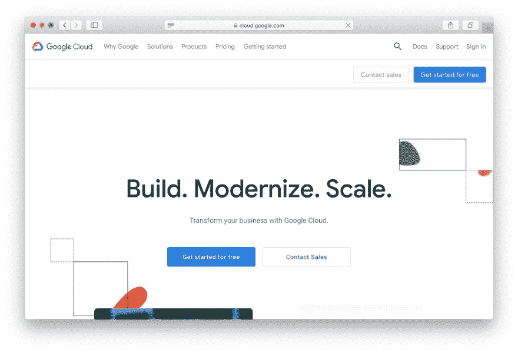
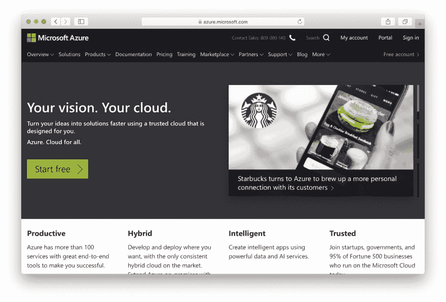
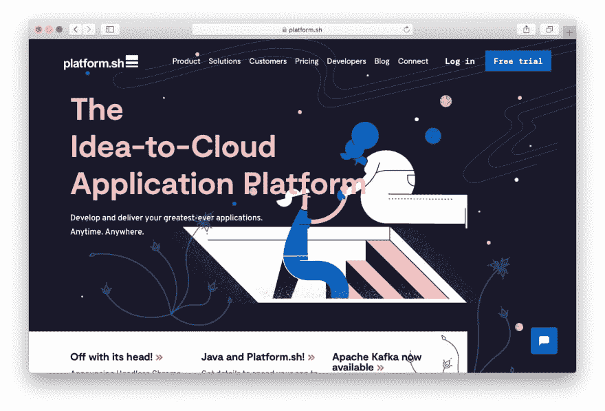
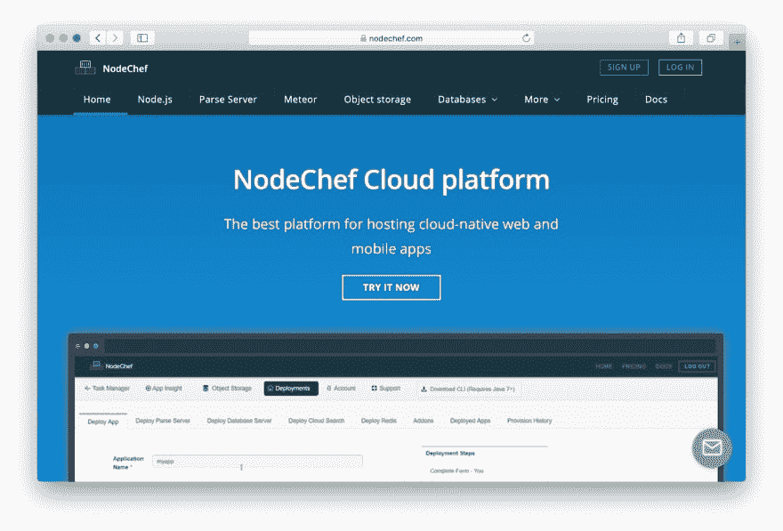

# 9 个 2019 年最佳 Node.js 托管平台(免费和付费)

> 原文：<https://dev.to/codeinwp/9-of-the-best-node-js-hosting-platforms-of-2019-free-and-paid-286c>

为你的下一个应用项目寻找最好的 Node.js 主机？在这篇文章中，我将为所有知识水平的用户分享各种优质和免费的 Node.js 托管服务。

总的来说，我们将涉及的选项有:

1) Heroku
2)亚马逊网络服务
3)数字海洋
3) A2 托管
4)故障
5)谷歌云平台
6)微软 Azure
7)Platform . sh
8)node chef

请继续阅读，更详细地了解每个平台！

### **1。[Heroku【Heroku.com】T4](https://www.heroku.com/)**

Heroku 是一个云应用平台，提供**免费 Node.js 托管**，这本身就是一个相当大的吸引力。当然，也有一些限制，而且，很像[免费 WordPress 托管](https://www.codeinwp.com/blog/free-wordpress-hosting/)，你可能会想为一个严肃的项目付费托管。但是，如果您对这些限制没有意见，并且只是在寻找免费的 Node.js 主机来玩，这是一个很好的起点！

Heroku 还提供付费计划，根据您的需求，这也是一个不错的选择。

那么 Heroku 的免费 Node.js 托管有什么限制呢？即:

*   512 兆内存
*   30 分钟不活动后睡眠
*   只有一个用户
*   你的整个账户有 1，000 个“动态小时”的限制(如果你用信用卡验证+,否则只有 550 个小时)

如果这些限制妨碍了你的计划，Heroku 的付费计划仍然可以负担得起，起价仅为 7 美元。

Heroku 是有据可查的，提供了简单的扩展，并且对开发者非常友好。

### **2。[亚马逊网络服务【AWS.Amazon.com T4】](https://aws.amazon.com/)**

你可能听说过亚马逊网络服务，因为它的功能就像…整个互联网。好吧，这有点夸张，但这很受欢迎。

通过它的许多集成服务，AWS 为托管 Node.js 应用程序提供了一个很好的选择。

虽然有许多不同的服务可供选择，但你最有可能希望从弹性 Beanstalk 开始使用 T2，它“使得使用亚马逊 web 服务部署、管理和扩展你的 Node.js web 应用程序变得容易”

你只需要上传你的代码，然后 AWS 处理部署和供应。另外，Elastic Beanstalk 服务没有特别的费用——您仍然只需为您实际使用的 AWS 服务付费。

另一个有趣的选项是 Lambda，它提供了一种[无服务器托管](https://www.codeinwp.com/blog/serverless-wordpress-shifter-vs-hardypress-top-headless-wordpress-hosting-options-compared/)的方法。

如果你还不太熟悉 AWS，你可以查看[“部署 Node.js Web 应用程序”项目指南](https://aws.amazon.com/getting-started/projects/deploy-nodejs-web-app/)来学习基础知识，让你的应用程序运行起来。

### **3。[数字海洋【DigitalOcean.com T4】](https://www.digitalocean.com/)**

流行的云基础设施服务 DigitalOcean 也是 Node.js 托管的一个很好的选择，让你只需点击几下就可以运行一个新的 Node.js Ubuntu droplet 。或者，您也可以创建自己的 droplet 并自行设置一切。

对于没有经验的用户来说，这不是最好的选择，因为你需要自己管理基础设施，但价格是可以承受的，DigitalOcean 可以根据需要轻松扩展应用程序。

你可以开始使用一个新的 droplet，每月只需 5 美元，并且你可以在三个不同的大陆上选择八个不同的数据中心。

DigitalOcean 最近还收购了 [Nanobox](https://nanobox.io/) ，这有助于更容易地部署网络应用程序——[你可以在这里注册测试版](https://www.digitalocean.com/nanobox/)。

### **4。 [A2 主持【A2Hosting.com T4】](https://www.a2hosting.com/)**

A2 主机是少数几个提供专用 Node.js 主机包的“传统”主机之一。也就是说，你通常会为 [Node.js](https://www.codeinwp.com/blog/learning-javascript-for-wordpress/) 寻找云或专用选项，但 A2 托管让你使用他们的共享计划。

这使得 A2 托管成为一个相当实惠的选择，计划从每月 3.92 美元开始:

*   1 个网站
*   5 个数据库
*   无限制存储和转移
*   通过 Let's Encrypt 获得免费的 SSL 证书
*   服务器管理的 cPanel

更多的网站和更好的表现的计划从那里开始。

然而，A2 托管的缺点是，它不像这个列表中的许多 cloud Node.js 托管提供商那样容易扩展您的应用程序。

### **5。[小故障【Glitch.com T4】](https://glitch.com/)**

如果你正在为一个有趣的项目寻找免费的 Node.js 主机，Glitch 可能是你的工具。对于严肃的业务来说，这不是一个好的选择，但对于有趣的应用程序或原型来说，这是一个很好的选择。

你甚至可以匿名创建一个应用程序，不过如果你想让你的项目保持活跃，你需要通过 GitHub 或脸书登录(*匿名应用程序将在五天后过期*)。

Glitch 不允许您使用自己的域，还有一些其他限制，如:

*   如果不使用，项目会在 5 分钟后休眠，并在 12 小时后自动停止。它们在收到另一个 HTTP 请求时醒来。
*   200MB 磁盘空间限制和 512MB 资产存储空间。
*   512MB RAM，就像 Heroku 的免费 Node.js 托管限制一样。
*   限制为每小时 4000 次请求。

Glitch 与 Stack Overflow、Stack Exchange 和 Trello ( *在 Trello 被 Atlassian* 收购之前)来自同一个团队，所以它的背后有一些分量。

### **6。[谷歌云平台【Cloud.Google.com T4】](https://cloud.google.com/)**

如果你想在支持谷歌搜索和 YouTube 的同一基础设施上托管 Node.js 应用，谷歌云平台可能是最适合你的 Node.js 托管平台。

像亚马逊网络服务一样，你可以选择大量不同的产品和服务。你肯定想考虑的一件事是[谷歌应用引擎](https://cloud.google.com/appengine/)，它让你“只专注于编写代码，而不用担心管理底层基础设施”。

和 AWS 一样，您只需为您实际使用的资源付费。

关于在谷歌云平台上托管 Node.js 应用的入门指南，请查看谷歌的 Node。JS App 引擎快速入门指南。

### **7。[微软蔚蓝【Azure.Microsoft.com T4】](https://azure.microsoft.com/en-us/)**

另一个知名的云计算平台，微软 Azure 也提供了许多服务，使托管和部署 Node.js 应用程序变得容易。

具体来说， [Azure 的应用服务](https://azure.microsoft.com/en-in/services/app-service/)为托管 Node.js 应用提供了一个完全托管的解决方案。

微软 Azure 的另一个吸引人的地方是，它提供 12 个月的免费核心服务，以及 200 美元的信用，你可以在头 30 天内使用这些信用来获得额外的服务。因此，虽然它不是永远免费的，但在你需要付费之前，你可以获得很多里程。

### **8。[平台. sh](https://platform.sh/) (平台. sh)**

如果您不喜欢为 Node.js 应用程序管理基础设施，Platform.sh 可能是为您的应用程序托管 Node.js 的最佳选择。

顾名思义，它是一个平台即服务(PaaS ),负责管理您应用的所有基础设施。

它在技术上并不托管自己，因为 Platform.sh 与 AWS、谷歌云平台、微软 Azure 等合作。但它确实让您在云基础设施上运行 Node.js 应用程序变得更加容易。

Platform.sh 的计划起价为每月 50 美元，并根据您的需求逐步上调。你也可以免费试用来测试它——不需要信用卡。

### **9。[主厨【NodeChef.com T4】](https://www.nodechef.com/)**

NodeChef 的计划起价仅为每月 9 美元，在四大洲的四个数据中心中，您可以选择裸机服务器上的 Docker 容器为您的应用程序提供经济实惠的 Node.js 托管服务:

*   美国东部
*   EU-西(巴黎)
*   新加坡
*   悉尼

您可以在 SQL 和 NoSQL 数据库之间进行选择，NodeChef 还提供了简单的扩展和自动化的 SSL 证书供应。

NodeChef 每月 9 美元的入门级计划让您:

*   1 个 CPU
*   128 MB 应用程序内存
*   100 MB 数据库内存
*   1 GB 数据库存储
*   未计量的带宽

然后，您可以根据需要扩大单个资源的规模。

### **最适合你需求的 Node.js 主机是什么？**

这里有一个简短的总结:

市场上最好的 Node.js 主机

| 宿主 | 价格形式 | 按使用付费？* | 基于云的？ |
| --- | --- | --- | --- |
| Heroku | $0 | 981 号房 | 981 号房 |
| 自动警报系统 | $0 | 981 号房 | 981 号房 |
| 数字海洋 | $5 | -好的 | -好的 |
| A2 托管 | $3.92 | -好的 | -好的 |
| 小故障 | $0 | 无数据 | 不适用的 |
| 谷歌云平台 | $0 | 981 号房 | 981 号房 |
| 微软 Azure | $0 | 981 号房 | 981 号房 |
| Platform.sh | $50 | -好的 | 981 号房 |
| 厨师长 | $9 | -好的 | -好的 |

我们所说的“按使用付费”是指您根据实际使用的资源付费，而不是每月固定的金额。

**为了结束这篇文章并帮助你选择最适合你的情况的 Node.js 主机，让我们来看一些场景:**

首先，如果你精通技术，大型云基础设施服务是一个不错的选择，它们通常会为你提供有助于简化应用管理的服务，并消除大量更繁琐的基础设施需求。

当然，这里有三大要素:

*   [AWS](https://aws.amazon.com/) ，连同弹性豆茎
*   [谷歌云平台](https://cloud.google.com/)，以及应用引擎
*   微软 Azure 以及应用服务

[DigitalOcean](https://www.digitalocean.com/) 和 [Heroku](https://www.heroku.com/) 也提供了不错的选择， [Platform.sh](https://platform.sh/) 提供了 PaaS 来帮助你进行端到端的开发。

如果你特别想找免费的 Node.js 主机，那么对于非关键任务的东西来说， [Glitch](https://glitch.com/) 是个不错的选择，而 [Heroku](https://www.heroku.com/) 也提供有限的免费计划。

最后，如果你不想走云路线， [A2 Hosting](https://www.a2hosting.com/) 以每月 4 美元的价格提供了一个实惠的切入点，并且是少数几个让你在没有自己的 VPS 或专用服务器的情况下运行 [Node.js](https://www.nodechef.com/) 的主机之一。NodeChef 还通过其在裸机服务器上的 Docker 容器方法提供了一个可承受的价格点。

关于为 Node.js 挑选最佳主机有什么问题吗？请在评论中提问！

*文章最初发表于[CodeinWP.com](https://www.codeinwp.com/blog/best-nodejs-hosting/)T3】*