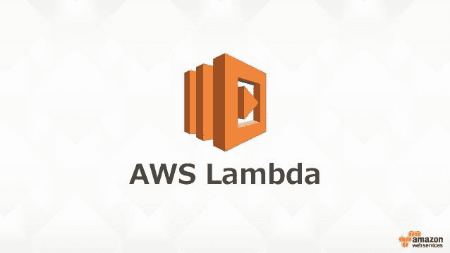
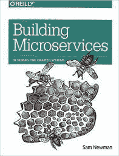
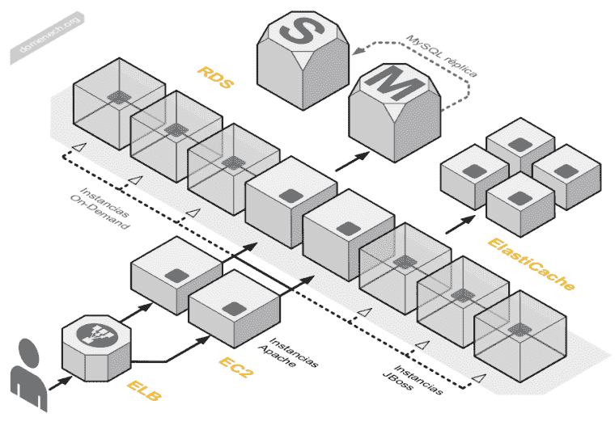
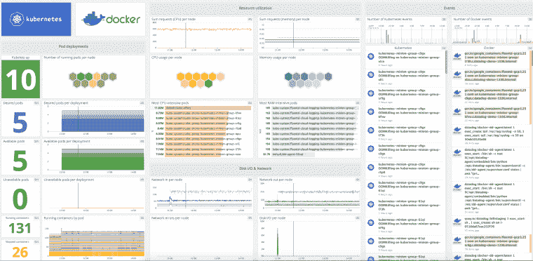
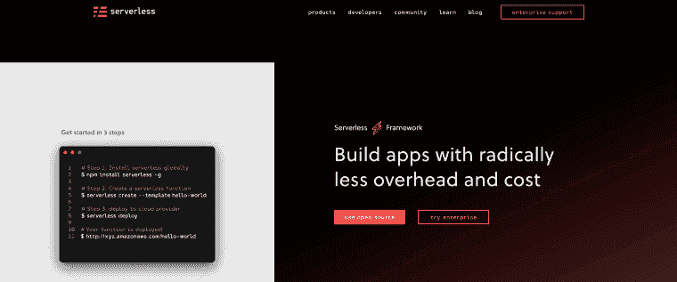

# 尝试无服务器之前需要了解的 6 个概念

> 原文：<https://dev.to/loujaybee/the-6-concepts-you-need-to-know-before-trying-serverless-4cim>

在满怀信心地构建无服务器应用程序之前，您需要知道什么。

那么你已经听说了很多关于无服务器的事情了？在[云原生软件工程](https://thedevcoach.co.uk/what-is-a-cloud-native-software-engineer/)领域，无服务器是一项非常棒的技术。但是，如果您还不熟悉无服务器的许多概念，那么让您了解这个概念可能有点困难。

无服务器计算作为一个原则是相当容易理解的。但是，为了有效地使用无服务器，在开始之前，您应该了解一些其他概念。今天，我们将讨论一些关于使用无服务器的未知情况。

今天，我们将讨论您需要了解的以下 6 个概念，以便开始使用无服务器:云提供商知识、微服务、分布式系统、部署、[监控&可观察性](https://thedevcoach.co.uk/serverless-error-monitoring-strategies/)和[基础设施代码](https://dev.to/loujaybee/infrastructure-as-code-a-quick-and-simple-explanation-56ln)。

到本文结束时，你应该知道与无服务器相关的主要概念，并且你应该有信心开发你自己的无服务器应用程序！

## 无服务器:一个定义

首先，像往常一样，让我们从无服务器的定义开始:

> 无服务器是一种云计算执行模型，允许动态运行任意代码，而无需管理主机及其额外的复杂性，如配置和扩展。无服务器概念既适用于计算工作负载，也适用于数据库工作负载。

在我们的定义出来之后，让我们来看看在开始无服务器开发之前你应该知道的概念。

## 1。云提供商知识

无服务器开发你需要知道的第一个概念是:云提供商！云提供商是为您提供无服务器功能的公司。云提供商可以是 AWS、GCP 或其他公司。

为了部署无服务器应用程序，您需要知道如何导航您选择的云提供商。您可能需要了解如何使用用户、角色等来提供安全访问。您可能需要知道云提供商如何路由请求，可能是通过 API 网关。

除了了解您的无服务器应用程序的这些服务依赖性，您还需要了解您的云提供商施加的细微差别和限制。例如:您的无服务器应用程序一次可以运行多长时间，为您的无服务器功能分配了多少内存，以及您的无服务器功能可以多快启动。

## 2。微服务

[来源](https://www.amazon.co.uk/gp/product/1492034029/ref=as_li_qf_asin_il_tl?ie=UTF8&tag=wwwthelifting-21&creative=6738&linkCode=as2&creativeASIN=1492034029&linkId=29b8293341906b375091d42aaa492c34)

无服务器的本质迫使开发者采用某种形式的微服务架构。因此，了解微服务架构的优势和局限性是非常有益的。

微服务是小型的、独立部署的服务，实现业务领域的一小部分。细粒度方法的优势包括(但不限于):由于业务领域较小，它们更容易维护，更容易推理，并且可以用不同的语言或技术部署。

但是微服务并不简单。例如，微服务可能会在错误的边界上被错误地实现。并且不正确的边界会导致维护开销。微服务的实现还会引入额外的复杂性，并导致服务之间的重复代码。

尽管如此，如果你打算从事无服务器，你应该真正开始了解微服务架构模式的原理、优点和缺点。

**注意:**我强烈推荐萨姆·纽曼的[构建微服务](https://www.amazon.co.uk/gp/product/1492034029/ref=as_li_qf_asin_il_tl?ie=UTF8&tag=wwwthelifting-21&creative=6738&linkCode=as2&creativeASIN=1492034029&linkId=29b8293341906b375091d42aaa492c34)，因为它深入地涵盖了微服务，也就是说:测试、部署、集成模式等。真的值得一读。

## 3。分布式系统

[来源](http://blog.domenech.org/2012/05/aws-diagrams.html)

类似于微服务的概念是分布式系统的概念。就本质而言，无服务器是分布式的。例如，分布式系统需要通过网络进行通信，而不是与一台机器进行通信。为了让无服务器功能进行通信，它们需要通过网络发送消息，比如使用 HTTP 或 RPC，或者它们需要发送或接收事件。

分布式系统是复杂的，因为它们需要复杂的监控，对系统边界 API 的仔细管理，并且它们很难调试。但是，正如微服务一样，分布式系统带来了许多好处，因此在进入无服务器之前值得探索。

## 4。管道:持续集成&持续交付

自动化和部署对于无服务器应用程序至关重要。

由于无服务器功能通常作为微服务架构的一部分工作，因此服务契约不会中断并导致下游服务出现问题是至关重要的。

我们可以通过建立坚如磐石的持续集成/交付渠道来确保高质量的服务。Jenkins、Drone 等工具允许工程师快速、频繁地测试代码。

## 5。监控和可观察性

[来源](https://datadoghq.com)

正如我们在分布式系统中提到的，无服务器系统需要高级监控。通常情况下，一个单一的应用程序从一开始就有它的监控设置。然而，已经设置的监控会导致工程师在使用无服务器应用程序时，在监控应用程序时变得自满。

然而，由于分布式系统增加了复杂性，开发人员能够远程调试服务而不需要太多(或任何！)服务本身的额外变化。

一个好的监控策略在用户之前向内部工程师报告。我们可以通过 DataDog 或 New Relic 等第三方工具在无服务器环境下实现可观测性。或者我们可以利用云平台工具，如 CloudWatch。

## 6。基础设施作为代码

作为代码的基础设施(IaC)是把你的软件写成代码的实践。IaC 有助于:可重复性、协作、停机时恢复服务等等。

如果你打算用类似无服务器框架的东西来构建你的无服务器应用程序，那么框架本身将会处理你的基础设施的大量繁重工作。

但是，如果您选择在没有框架的情况下构建无服务器应用程序，您可能会希望将自己的基础设施写成代码。因此，您需要熟悉 Terraform 或 CloudFormation 等工具。

## 轮到你构建无服务器了！

还有许多其他的概念需要你去理解，但这是作为云原生软件工程师的代价！

仅此而已。为了开始使用无服务器，这些是您需要理解的主要概念。一如既往，使用任何技术的最佳方式是尝试它。所以我建议推出你自己的服务。

我以前也写过关于用无服务器框架建立一个最小的无服务器应用程序的文章，如果你想以此为起点的话！

* * *

帖子[在尝试无服务器之前你需要知道的 6 个概念](https://www.thedevcoach.co.uk/the-6-serverless-concepts-you-need-to-know/)首先出现在[的开发者蔻驰](https://www.thedevcoach.co.uk)上。

像您一样加入云原生软件工程师社区。

使用[thedevcoach.co.uk](https://thedevcoach.co.uk)了解最新的云技术，并学习核心云工程主题的基本技能，如:Docker。无服务器和 Linux，等等。[加入我们](https://thedevcoach.co.uk/newsletter)并取得成功！