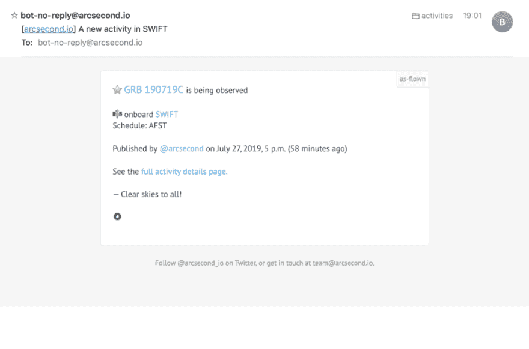
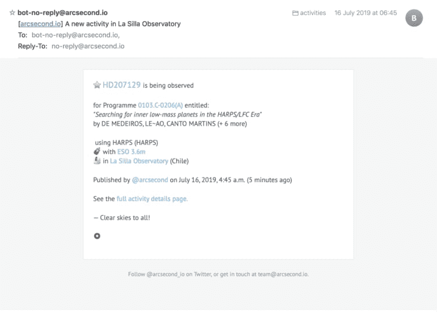
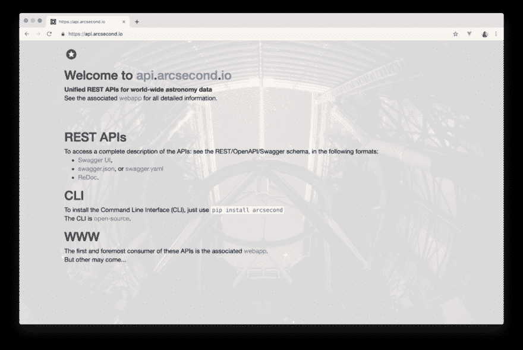
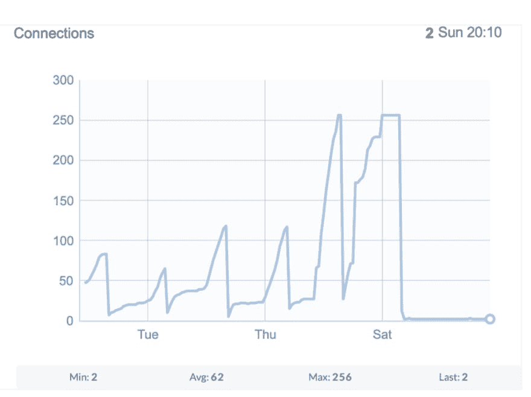
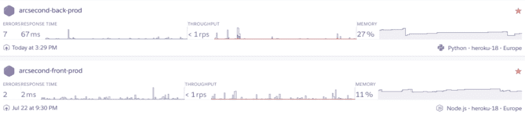

# 一千次部署之后...

> 原文：<https://dev.to/onekiloparsec/a-thousand-deployments-later-4i5j>

【原载[于我的博客](https://onekiloparsec.dev/2019/07/28/a-thousand-deployments-later/)。

在它成立四年多一点，真正开始两年后，一千次部署，大约 10 000 次提交，1200 多次单元和集成测试，10 0 多个 REST API 端点， [Arcsecond.io](https://www.arcsecond.io) 正在接近 v1.0。多么漫长的旅程，[又一次](https://onekiloparsec.dev/2015/12/29/the-story-of-6-years-of-development-of-iobserve/)！

我编写 arcsecond.io 的代码越多，我就越喜欢它，并对未来的岁月充满信心。从一开始，我就知道这一努力将持续多年，而不仅仅是一个爱好项目。毕竟我已经开发了一款名为 iob server 的 [macOS 应用 8 年多了。因此，我构建 Arcsecond.io 的长期目标是:最大的可靠性、永久的部署能力、永久的干净和经过测试的代码。当然:最大限度地关心用户和全球天文学家的反馈。为此，我知道我将不得不学习和掌握它所需要的任何东西，无论它的复杂性或技术层次如何，并开发和掌握一个相当不错的全栈软件系统的永久操作。本文解释了 arcsecond.io 中使用的技术堆栈中的重要选择。](https://apps.apple.com/us/app/iobserve/id424693907)

让我先展示一件我今天引以为豪的事情。虽然我很高兴将我的 macOS 应用程序 iObserve 的核心移植到了网络上([查看一下](https://www.arcsecond.io/iobserve))，但 arcsecond.io 今天最酷的功能之一是**全球观测活动**，也就是说，**可以实时**了解世界上(最大但不仅仅是)天文台和一些科学卫星正在观测什么！

 

<figcaption>世界范围内和太空中发生的现场观测活动！</figcaption>

更好的是:你可以订阅它，如果有符合你订阅的内容，你会马上得到通知。比方说，当 HST 开始观测时，或者当一个程序正在为一个给定的观测者执行时，或者当一个望远镜仪器正在使用时，或者当一个天空区域正在被观测时，你想要被通知。鲍姆。你有邮件！多酷啊。

*   

    <figcaption>快速观察邮件的例子</figcaption>

*   

    <figcaption>拉新罗天文台观测邮件的例子</figcaption>

要达到这个结果，需要很长时间的努力，以及相当长的决策、优化、试验和错误列表。但结果是我想要的:即使用户体验并不完美(有些链接并不总是在这里，并不总是指向完整的信息等)，它的潜力显然是巨大的。现在，我必须用更多的连接器来“填充”它。

好了，我们开始吧。我们将从后端开始，然后是基础设施、前端，最后是代码组织。

## 后端

 

<figcaption>好吧，不是互联网最美的网页。但它的美是内在的。</figcaption>

后端服务器本来是用 [Django](https://www.djangoproject.com) 2.2 和 Python 3.7 写的，arcsecond.io 从 Django 1.5 什么的开始，Python 2。到 Python 3 的迁移是在一年多前进行的，这显然是一个不错的选择。迁移过程中几乎没有第三方库崩溃。一开始，我评估了用[烧瓶](https://palletsprojects.com/p/flask/)代替 Django 的可能性。但是 Django 内置了很多东西，特别是它的自动管理门户，随着时间的推移，它被证明是非常宝贵的。

后端的设计选择是创建一个 RESTful 的纯数据中心服务器。因此，显而易见的选择是使用奇妙的 Django REST 框架。这是 arcsecond.io 的重要组成部分。本文的目的不是解释 REST 原则，而是简单地让我说*这是一种思维方式*，DRF 允许您轻松部署这种方式。

在后端使用 Python 的一个关键原因显然是它与科学和天文图书馆的无缝集成。特别是，没有 [AstroPy](http://astropy.org/) (及其附属软件包)和 [NumPy](https://numpy.org) 是不可能的。一旦 arcsecond.io 有所收益(希望有一天！)，我会将一部分资金用于资助这些项目。

这些项目声明了 52 个直接依赖项(其中的`django-cors-headers`用于轻松管理 HTTP 头，`django-cryptography`用于加密一些模型字段，`django-otp`用 2FA 保护生产管理路由，`django-allauth`和`django-rest-auth`用于处理复杂的 auth 过程，`django-storages`用于远程处理多个存储，`psycopg2`用于与 PostgresQL DB 对话，`[requests](https://2.python-requests.org/en/master/)`和`[pyvo](https://pyvo.readthedocs.io)`用于简化多个连接器的编写)...).

更重要的是，后端依赖于`[celery](http://www.celeryproject.org)`和`[channels](https://github.com/django/channels)`(和 ASGI `[daphne](https://github.com/django/daphne)`服务器)，这两个库非常重要。

芹菜是一个分布式任务队列。当我在这个全栈之旅的最开始还是一个新手时，我问自己:为什么我需要这样一个东西？直到我意识到，后端服务器的很多活动(如果不是大部分的话)可能与服务 HTML 页面或序列化数据不同。在 arcsecond.io 中，活动不够稳定，无法判断后台芹菜工是否比 Dahne 服务器更重要。然而，随着对 ESO、Gemini 和 HST 等数据档案以及 Swift 等卫星时间表的永久解析，以及观测活动永久流量的创建,“arcsecond.io”后端的大部分负载发生在 Celery 处理的后台任务中。

第二个库是 Django 官方支持的项目，不仅处理 HTTP 请求，还处理 WebSockets。即使到目前为止我们在 arcsecond.io 中只打开了一个只读的 WebSocket 路由(这里的活动是:【api.arcsecond.io/activities/live】的)，从一个简单的 WSGI pure-HTTP 服务器(很长时间以来都是 gunicorn 的)到`channels`和`daphne`的迁移也不是一件简单的事情。我们有两个主要困难。一个是 [`channels_redis`](https://github.com/django/channels_redis) 库(为服务器的`channels`层提供后台存储)[有一个 bug](https://github.com/django/channels_redis/issues/125) ，导致我们的基础设施中产生了大量连接，远远超出了预期。很长一段时间，我们有各种错误指向不同的方向，不知道问题的真正原因。但是有一次(最近)修好了，结果还是挺可观的！

 

<figcaption>我们的渠道/ daphne 服务器使用的 Redis 连接数随时间的变化。看看一个 bug 修正的效果有多戏剧性。</figcaption>

第二个困难是理解 WebSockets 的底层机制，以及如何自动提供相似的序列化 JSON 数据。换句话说，如何使用我们精心制作的 REST 序列化程序来格式化 WebSocket 管道中的数据，就像处理 HTTP 请求一样。为此，我们使用开源(非常早期，但是干净且写得很好)的 djangochannelsrestframework 库。

至于测试，我们使用 [pytest](https://pytest.org/en/latest/) 库，必要时使用标准 python 模拟，以及这些额外的和*非常有用的库:*

*   [freezegun](http://stevepulec.com/freezegun/) :为了及时地在你想要的任何地方编写测试，
*   [factory_boy](https://factoryboy.readthedocs.io/en/latest/) :为了在测试设置过程中轻松地创建许多实例，
*   django-naomi :在开发过程中，为了在浏览器中轻松查看后端发送的电子邮件，
*   [vcrpy](https://github.com/kevin1024/vcrpy) :非常容易的重放“卡带”，也就是重放真实的网络请求。

## 基础设施

Arcsecond.io 有两个服务器:一个用于后端，一个用于前端。这两艘部署在著名的 [PaaS](https://en.wikipedia.org/wiki/Platform_as_a_service) [Heroku](http://heroku.com/) 上。为什么是 Heroku？因为我的一个同事，当我在瑞士工作的时候，刚刚提到这是部署服务器最简单的方法。这在今天仍然是真理，我很高兴这个决定(即使今天我会考虑使用无服务器堆栈，例如被 zeit.co[的产品所震惊)。](https://zeit.co)

使用 Heroku 的一些优势:

*   针对大量辅助服务(存储、日志记录、监控)的一键安装附加组件的大型市场...)
*   使用简单的`git push`进行部署。
*   一个非常易于使用的 CLI，允许您与您的服务器进行交互和连接。
*   一个非常简单的方法让你的主机名使用证书(使用 [letsencrypt](https://letsencrypt.org)

这是 arcsecond.io 的基础设施:

*   一台 Daphne 服务器(一台 Heroku dyno - 7 美元/月)，
*   后台工作人员的芹菜实例(一个 Heroku dyno-7 $/月)，
*   芹菜节拍时间表(一个 Heroku dyno - 7 美元/月)，
*   一个生产 [PostgresQL](https://www.postgresql.org) DB 实例，每小时自动备份一次- 9 美元/月，
*   用于日志记录的基本 [Papertrail](http://papertrailapp.com/) 实例，
*   用于发送电子邮件的基本 [Sendgrid](https://sendgrid.com) 实例，
*   Daphne 服务器后备存储的基本[redisude](https://redislabs.com)实例，
*   HTTP 缓存的基本 Heroku Redis 实例，
*   一个 [Express.js](https://expressjs.com) 服务器用于前端(一个 Heroku dyno-7 $/月)，
*   用于存储数据的多个亚马逊 S3 存储桶(价格随数据量而定)，
*   这些域名是从法国云提供商[ovh.com](http://ovh.com)购买的(一个`.io`域名大约 40 美元/年)，
*   我曾经支付 GitHub 的 Pro 版本来存储私有库，但是后来它变成了免费的，
*   还有另外两个免费的 Heroku dynos 用于暂存环境(一个用于后端，一个用于前端)。

总价:约 40 美元+ S3 存储空间(外加一点谷歌地图)...)每个月！人们可以说它不多，但同时又很多。所有这些服务 40 美元确实不多。但这些大多是服务的一级或二级条目，只要有一些钱流入，我就会提升其中一些条目的级别。多亏了 Heroku，这将像移动光标一样简单！从目前来看，arcsecond.io 对所有人都是完全免费的，从这个意义上来说，这是“很多”的。

基础设施中还有一个关键部分没有提到: [CircleCI](http://circleci.com/) 。后端的代码从来不会被直接推送到生产中。CircleCI 总是在试运行环境中，然后在生产环境中对其进行自动测试和部署。

至于前端，出于一个原因，代码不通过外部 CI 服务。Javascript 代码被分割在不同的私有 [NodeJS](https://nodejs.org/en/) 模块中(见下文)，我无法理解支付额外的 Amazon EC2 实例来保存 [Verdaccio](http://verdaccio.org) 服务器，或者使用[npmjs.com](http://npmjs.com/)的高级模式“只为 5 个小 JS 库”的想法。所以我用的是在家里 iMac 上运行的 Verdaccio 服务器。

到目前为止，我估计大约有 750 个部署在后端，260 个部署在前端。

在结束这一部分之前，不能不提到神奇的碰撞记者哨兵的使用。这个工具的丰富性和易用性真的很棒，它对查找和纠正 bug 的帮助是无价的。即使 Django 在出现错误时会自动发送电子邮件(所有 500 个状态代码都在我的收件箱中)，Sentry 也会帮助您读取代码堆栈，并更清楚地确定发生了什么。它还提供了非常简单的问题管理，分组相同的问题，当关闭的问题再次出现时发出警报等。

这个“软件系统”已经投入生产一年多了，已经处理了相当多的访问高峰(hello [ProductHunt)。](https://www.producthunt.com/posts/arcsecond)..).它已准备好支持更大的负载，而无需改变其底层组织。

## 前端

 

<figcaption>我从未想象过我能在浏览器中构建出如此复杂的视图。</figcaption>

前端是一个 [Vuejs](https://vuejs.org) [单页面应用](https://en.wikipedia.org/wiki/Single-page_application) (SPA)。Vue.js 的发现简直是救命稻草。最初 arcsecond.io 的前端是用 AngularJS 编写的，这是现在所谓的 [Angular](http://angular.io) 前端框架的第一个版本(这是三部曲之一，有 Vuejs 和 [Reactjs](https://reactjs.org) )。但是代码库对于结果来说是巨大的，并且很难维护。我至少尝试了 5 次迁移到 Angular 2，但总是失败。对我来说，Reactjs 的 JSX 语言似乎是一件可怕的事情，也是一笔令人望而却步的费用(我仍然认为这对于易读性来说是一个可怕的想法)。

然后是 Vuejs。简单。简单易学。自然。没有 cruft，没有疯狂的语法(简单的`v-`前缀如`v-if`，相比之下`*ngIf`代表 Angular——真的吗，伙计们？)，一个必须如何编写和显示文档的教科书示例(是的，Python 我的朋友，你的文档很难*与*一起工作)。然后是 Vuejs 的 v3[命令行界面](https://cli.vuejs.org)。哦伙计。甚至将项目从最初的形式移植到 Vuejs-CLI v3 组织也是轻而易举的事情。感谢上帝，它抽象掉了所有疯狂的复杂性(对于非前端开发人员来说，Webpack 非常难学)。对我来说，Vuejs 就是 web 开发应该有的样子。

测试是用 [Jest](https://jestjs.io) 和 [vue-test-utils](https://vue-test-utils.vuejs.org) 编写的。我用 [Cypress](https://www.cypress.io) 做了几次端到端的测试，但是我在我的 iMac 上安装一个稳定的版本时遇到了麻烦。此外，一个人可以用 Jest 走很长的路，所以我现在专注于单元测试。

作为 API 及其数据的消费者，最后一个可以被归类为“前端”的部分是 Arcsecond 命令行界面(CLI)，它是开源的，在 GitHub 上可以免费获得。很长一段时间，我认为提供有趣数据的 REST APIs 就足够了，我不会像这个星球上的每个科学家一样致力于另一个 Python 脚本/模块...但是现实更强大，我很高兴有了这样的工具。它有助于将 api.arcsecond.io 更轻松地集成到自定义工作流中。

## 代码的组织

到那天为止，后端存储库包含 4200 个提交，前端存储库包含 4900 个提交。是的，我倾向于做很多微委托。这个项目两年前才真正开始，当时我能够真正为长期设计一个严肃的超越 hello-world 前端应用程序。Vuejs 前端的第一次提交是在 2017 年 2 月 28 日星期二。但是 Python 后端的第一次提交是在 2014 年 4 月 15 日星期二！(周二开始一个项目总是好的。)

在代码中，我有 295 个 Vuejs 组件(`.vue`文件)，允许构建一个 webapp，最终重量为 3.1 MB。到目前为止，它还没有使用服务器端渲染( [SSR](https://ssr.vuejs.org) )，而且现在很难对其进行转换(我有专门的处理程序来处理组织门户的动态路由...).但是我打算至少增加使用预渲染的页面数量(见上面的 SSR 链接)。在后端，即使只有一个“arcsecond”Django monolyth 应用程序，代码也会被分成 24 个不同的 Django 子应用程序(它们都有自己的模型、序列化程序、视图、URL，有时还有任务和/或连接器...).

没错，后端应用是一个单一的应用，即使这个行业正在兴起微服务。实际上，考虑到所有模型之间的大量关系，在我看来，开发的真正工作及其操作在单一的微服务中比在不同的微服务中要容易得多。我是一个人(Eric 我的朋友和合作伙伴主要帮助提供建议、测试和评论)，arcsecond.io 是一种需要大量开发才能开始有用的产品。我只是不能把更多的时间花在开发以外的事情上。

对于 ide，我从一开始就使用 pro 版本的 [PyCharm](https://www.jetbrains.com/pycharm/) 用于后端(大约 80 美元/年)。对于前端，我多年来尝试了[崇高](https://www.sublimetext.com)、[原子](https://atom.io)、 [VSCode](http://vscode) 、 [WebStorm](https://www.jetbrains.com/webstorm/) ，最后也使用了 PyCharm，因为它有一个优秀的 Vuejs 插件。最后，如果没有优秀的 Git 客户端[和 Tower](https://www.git-tower.com/mac) (大约 65 美元/年——光是提交就已经很多了),我就不能这么快、这么容易地提交，也不能这么快找到变更的历史...但是我认为 Tower 更像是一个调试和管理工具)。

GitHub 存储库(用开发人员的行话来说就是 repos..)组织如下:

*   后端的单个 arcsecond-back repo，有时借助开源库的分叉，
*   一个 arcsecond-front repo 用于前端，但使用 6 个私有 repo 用于自定义 Vuejs 库，
*   天文算法的 [AA.js 开源 repo](https://github.com/onekiloparsec/AA.js) ，
*   [Arcsecond CLI](https://github.com/arcsecond-io/cli) 开源 repo，
*   [public-issues](http://github.com/arcsecond-io/public-issues/issues) repo 收集并处理我或用户发现的公共问题。
*   [标准星表](https://github.com/arcsecond-io/standard-stars-catalogues)回购，用于持有标准星表的开源和可靠来源。

就是这样。感谢你读到这些台词！我希望你已经了解了如何开始一个“小而成长”的项目，这个项目占据了你每天醒着的时间的很大一部分。

––向所有人开放晴朗的天空！

P.S .星夜的美丽影像来自 g . hüdepohl([atacamaphoto.com](http://atacamaphoto.com/))/ESO。