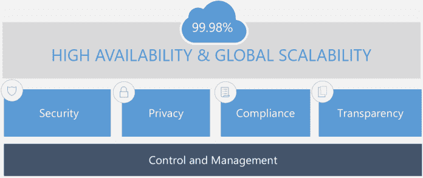
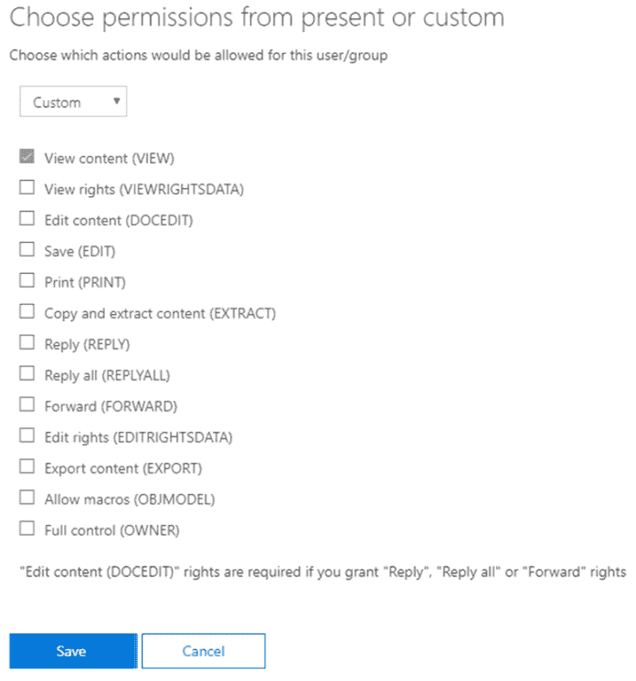
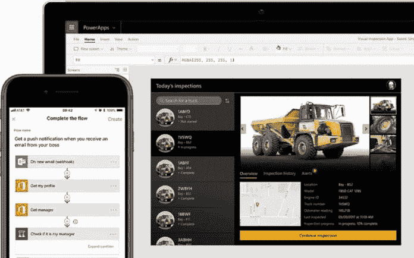
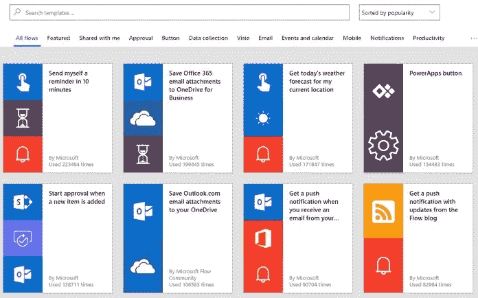

# 为什么您应该迁移到 Office 365(第 2 部分)

> 原文：<https://dev.to/mlisidoro/why-you-should-migrate-to-office-365-part-2-5943>

帖子[为什么你应该迁移到 Office 365(第二部分)](https://blogit.create.pt/miguelisidoro/2019/07/29/why-your-business-should-migrate-to-sharepoint-online-and-office-365-the-value-offer-part-2/)首先出现在[博客 IT](https://blogit.create.pt) 上

您的企业是否正在评估是否应该迁移到云计算和 Office 365？那你来对地方了！这个帖子系列将向您展示一些迁移到云和 Office 365 的主要原因。

## 简介

这篇由两部分组成的博客文章是博客文章系列的第一部分，该系列文章试图让您了解迁移到云的优势以及采用 Office 365 作为协作平台的好处。

我们所处的世界正在迅速向软件即服务(SaaS)发展，在协作、电子商务和许多其他领域，系统和各自的数据都部署在公司基础设施(内部)内，而现在已经发展到云端。

这篇由两部分组成的博客文章的目标是向您概述 Office 365 中包含的主要功能，以及您的组织如何利用它们。

这些是我将在这两篇博文的第二部分中讨论的主要话题:

*   安全性和可靠性
*   商业应用开发
*   洞察力
*   迁移选项
*   混合场景
*   其他好处

要阅读这篇文章的第一部分，点击[这里](https://dev.to/mlisidoro/why-your-business-should-migrate-to-sharepoint-online-and-office-365-the-value-offer-part-1-il4-temp-slug-9552043)。

## 安全性和可靠性

在这篇博文的第一部分中，我已经简单介绍了微软 365，包括 Windows 10、Office 365 和企业移动+安全。

在选择云协作平台(Office 365 就是一个例子和领先平台)时，公司的主要关注点之一是信息的安全性。Office 365 面临的最大挑战之一与以下事实有关:将信息存储在云中比存储在组织内部更不安全。

为了解决这些同样的问题，Microsoft 在安全性方面进行了大量投资，为用户和系统管理员提供了多种功能来满足这些需求，并在四个主要领域应用了一组最佳实践:

*   安全性
*   隐私
*   服从
*   透明度

除了安全性，**可靠性**是云解决方案的另一个主要优势(Office 365 的平均可用性为 99.98%)，组织无需担心维护自己的基础架构。

下面是该平台本身提供的一些主要安全特性。

### 安全

关于**安全**，Office 365 确保传输中的数据和静态数据的加密。静止时， *Bitlocker* 技术用于加密服务器硬盘上的所有信息。此外，所有文件都被分段(分成称为数据块的小块)，每个数据段都单独加密，加密密钥安全地存储在不同的物理位置。

在传输中，所有文件都使用 2048 位的 TLS 密钥进行加密。

### 隐私

关于**隐私**，可以基于 4 个向量定义不同的访问策略:用户、设备、位置和信息的敏感性。一些例子包括:

*   为外部共享设置时间限制窗口，或仅允许与某些域共享
*   阻止来自不安全位置的访问(例如:开放的 Wi-Fi 网络)
*   实施多因素身份认证(例如:向移动设备发送 PIN 码)。您可以对所有用户、一组受限用户或基于使用的设备或访问位置等条件(例如:开放的 Wi-Fi 网络)实施多因素身份验证

### 顺从

关于**法规遵从性**，主要关注的是定义一套规则来保护敏感信息，并防止敏感信息泄露到组织之外。以下是 Office 365 为满足这一需求而提供的一些功能:

*   **数据丢失防护**:允许组织创建策略来保护其最敏感的信息。示例:防止包含信用卡信息或公民卡号的文档在组织外部共享。要了解更多关于数据丢失防护的信息，请点击[此处](https://docs.microsoft.com/en-us/office365/securitycompliance/data-loss-prevention-policies)。
*   **Office 365 统一标签**:允许组织创建保护 Office 365 平台(主要是 SharePoint、OneDrive 和 Exchange)中存储的文档内容的策略。保护基于 Azure 权限管理服务，允许管理员配置可应用于电子邮件和文档的敏感性标签，以保护敏感信息。标签可以根据文档内容的特定内容类型(例如:包含信用卡号的文档)自动应用于 SharePoint 文档库中的所有文档。对于受保护的文档，您可以限制一组受限用户的访问权限，启用加密并应用各种文档级保护，例如:
    *   阻止复制和粘贴电子邮件或文档信息
    *   阻止文档的打印屏幕
    *   块文档打印
    *   阻止转发或回复等电子邮件操作
    *   等等

 

<figcaption>Office 365 统一标注保护</figcaption>

要了解 Office 365 统一标签和信息保护，请单击[此处](https://docs.microsoft.com/en-us/Office365/SecurityCompliance/protect-information)。

### 隐私

关于**透明度**，一个非常重要的注意事项是，微软无权访问组织的数据，只有在解决需要访问数据的支持事件时才有必要这样做。在这些情况下，通过使用一个名为*客户锁箱*的功能，客户可以批准或拒绝访问请求，并且只有在请求被批准的情况下才允许访问。此外，所有访问都经过审核，以确保流程的透明度。

这些只是用户和管理员可以用来保护 Office 365 平台上的信息的众多功能中的几个例子。安全是一个非常大的话题，不可能在这篇文章中总结所有的特性。请继续关注我的下一篇帖子，在那里我将更详细地讨论安全特性！

## 业务应用开发

Office 365 具有非常丰富的功能集，可以满足非常广泛的协作需求。好的一面是它也是高度可扩展的，允许开发者为几乎任何业务需求构建丰富的用户体验。

还有其他强大的方法来扩展 SharePoint Online 和 Office 365，而不需要专业开发人员，快速应用程序开发方法在开发领域获得了越来越大的空间，主要用于构建业务应用程序。

微软的快速应用程序开发愿景由两个主要开发平台组成:

*   PowerApps
*   微软流程

### PowerApps

PowerApps 是一套应用程序、服务、连接器和数据平台，提供了一个快速的应用程序开发环境来构建定制的业务应用程序。使用 PowerApps，“公民开发人员”可以快速构建定制的业务应用程序，这些应用程序可以连接到存储在内部的业务数据(可通过[On-On primes 数据网关](https://powerapps.microsoft.com/pt-pt/blog/connect-to-your-on-premises-data-sources-using-on-premises-data-gateway-from-powerapps/)访问)或在线数据源。

目前有几十个连接器允许 PowerApps 应用程序连接到 SharePoint、OneDrive、Exchange、Dynamics 365、SQL Server 等数据源。

PowerApps 应用程序的一个优点是，它们是以移动优先的方式开发的，您可以在平板电脑和手机等任何移动设备上轻松使用业务应用程序。

 

<figcaption>微软 PowerApps</figcaption>

PowerApps 非常适合快速构建业务应用程序，下面是一些可以使用 PowerApps 开发的业务应用程序示例:

*   费用报告
*   差旅申请
*   休假申请

要看一个 PowerApps 能做什么的例子，请看一下[微软费用报告示例](https://docs.microsoft.com/en-us/powerapps/maker/canvas-apps/expense-report-install)。

要了解更多关于 PowerApps 的信息，请点击[此处](https://powerapps.microsoft.com/)。

### 微软流程

Microsoft Flow 是一项基于云的服务，使业务线用户可以更轻松地创建工作流，帮助自动化耗时的业务流程，并帮助连接应用程序和服务。

与 PowerApps 一样，Flow 目前有几十个连接器[允许 Flow 连接到 SharePoint、OneDrive、Exchange、Dynamics 365、SQL Server 等数据源。](https://emea.flow.microsoft.com/en-us/connectors/)

 

<figcaption>微软流程模板</figcaption>

有很多例子可以说明 Flow 可以用来自动化流程，而且 Flow 与 PowerApps 结合使用非常好。一个很好的例子是使用 PowerApps 构建的费用报告，其审批流程由 Flow 处理，允许您将批准的费用与您的 ERP 或财务系统自动集成。

要了解更多关于 Microsoft Flow 的信息，请点击[此处](https://emea.flow.microsoft.com/)。

### 其他开发选项

如果业务需求过于复杂，PowerApps 和 Flow 可能不是最佳方法，SharePoint 和 Office 365 提供了一个巨大的开发平台，主要通过开发基于[SharePoint Framework(SPFx)](https://docs.microsoft.com/en-us/sharepoint/dev/spfx/sharepoint-framework-overview)的解决方案。

要阅读整篇文章，请点击[这里](https://blogit.create.pt/miguelisidoro/2019/07/29/why-your-business-should-migrate-to-sharepoint-online-and-office-365-the-value-offer-part-2/)。

帖子[为什么你应该迁移到 Office 365(第二部分)](https://blogit.create.pt/miguelisidoro/2019/07/29/why-your-business-should-migrate-to-sharepoint-online-and-office-365-the-value-offer-part-2/)首先出现在[博客 IT](https://blogit.create.pt) 上。