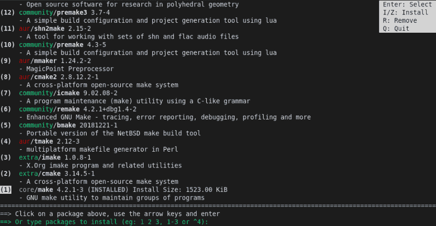
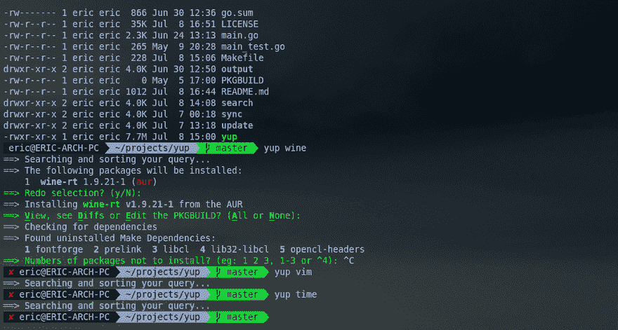

# 具有 ncurses 功能和更好的搜索和排序的 Arch Linux AUR 助手

> 原文：<https://dev.to/ericm/arch-linux-aur-helper-with-ncurses-functionality-and-better-searching-and-sorting-44kl>

链接:[https://github.com/ericm/yup](https://github.com/ericm/yup)

**是的**灵感来自其他 AUR 助手，但有许多新功能，例如:

*   用`yup [search-terms]`搜索返回最准确的结果
    

*   使用 *ncurses* 显示搜索结果。这允许终端中的鼠标交互和更容易的导航。
    T3T5】

*   不想用 ncurses？使用`yup -n`来使用非 ncurses 模式

*   想独家搜索 AUR 吗？使用`yup -a`

*   像*耶*一样，键入`yup`运行系统升级。

*   JSON 格式的位于`~/.config/yup/config.json`的易于使用的配置文件。

*   想看看哪些软件包扰乱了你的系统吗？运行`yup -Qos`以获得订购包装尺寸列表。

## yay 或 trizen 的区别

*   Yup 先给你**最准确的结果**。正如在上面的例子中所看到的，yup 对结果进行排序，以使最准确的结果出现在最前面。

*   `Yupfiles`是允许你用一个命令批量安装软件包的小文件。[这里有一个例子 Yupfile](//test.Yupfile)

*   Yup 使用 *ncurses* 。这允许用户在不移动底部条的同时滚动，并且使用更自然的用户输入形式容易地导航到某些结果。

*   Yup 有一个简单的配置文件，独立于 pacman 的配置文件。这使得它从一开始就更加可定制。

*   Yup 既有`yup -c`(用于清除所有包缓存)又有 yup `yup -C`(仅用于清除 yup 的缓存)。

*   通过更改配置文件中的值，Yup 允许您使用`yup -n`暂时或永久禁用 ncurses 模式(到正常终端输出)。

*   在搜索菜单中，yup 允许您使用`R`热键立即删除已安装的软件包。

*   选择要安装的软件包后，如果您犯了错误，可以修改您的决定。

*   是的，很快*就会*允许你在安装过程中使用配置菜单禁用任何对话。