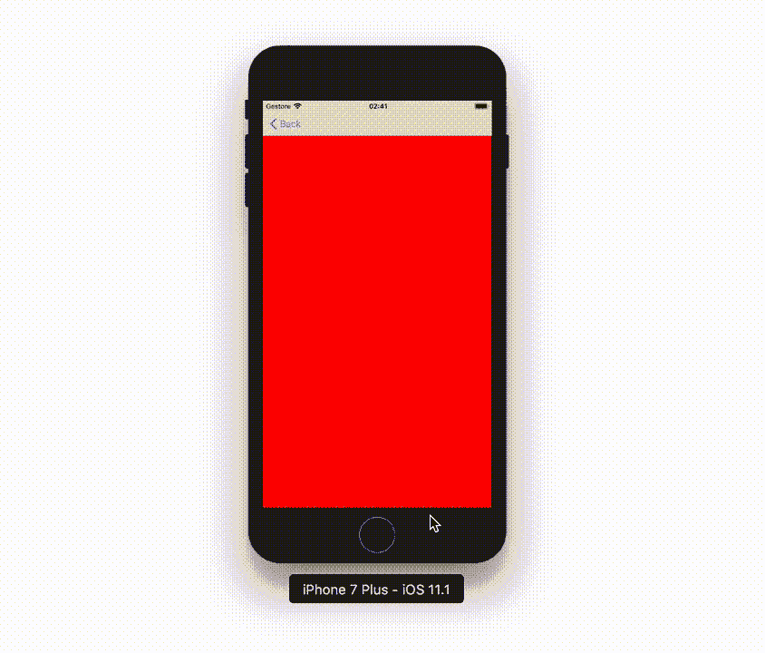
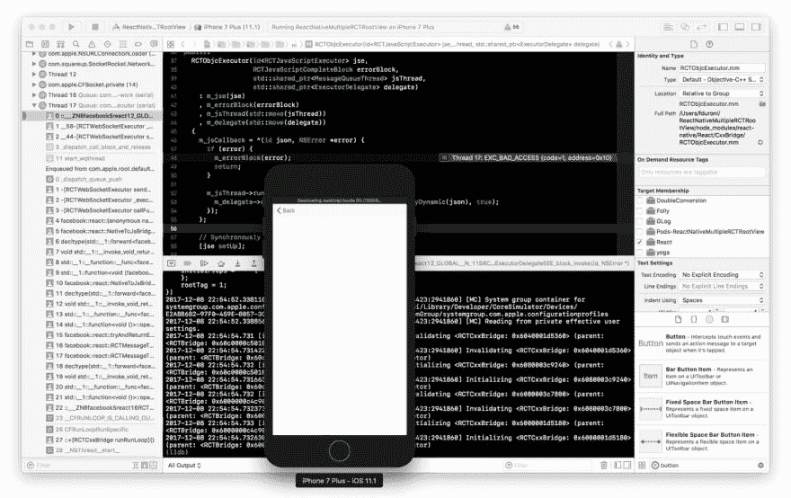
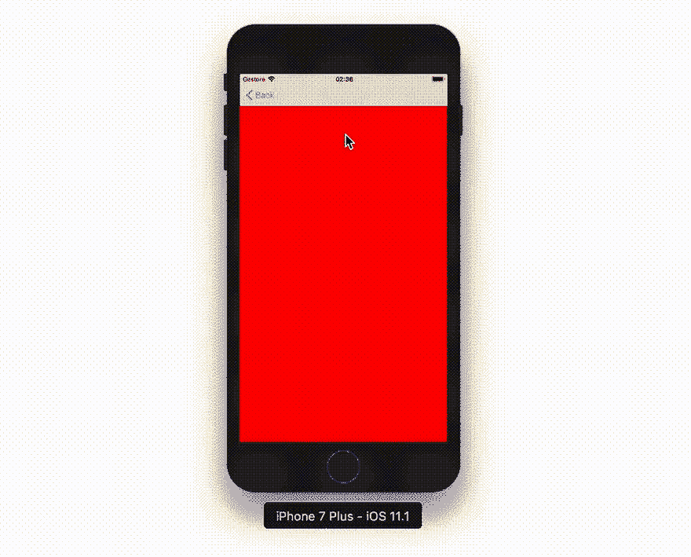

# React Native:在现有 iOS 应用中使用多个 RCTRootView 实例

> 原文：<https://dev.to/chicio/react-native-use-multiple-rctrootview-instances-in-an-existing-ios-app-1g92>

在这篇文章中，我将向你展示如何在现有的 iOS 应用中使用多个 RCTRootView 实例。

如果我们想在现有的应用程序中开始使用 React Native，这真的很容易。我们可以让我们的第一个 React 本地组件在我们的应用程序中运行，只需遵循现有应用程序的[入门教程。但是，如果我们需要在现有应用程序不同部分使用多个 React 本地组件，会发生什么呢😨？在本教程中，我将向你展示如何使用多个`RCTRootView`实例来显示应用程序不同部分的不同 React 本地组件。
例如，考虑一个简单的带有 React Native 的 iOS 现有应用程序。它有两个非常简单 React 本地组件:](https://facebook.github.io/react-native/docs/integration-with-existing-apps.html)

*   `BlueScreen`，显示蓝色视图
*   `RedScreen`，显示红色视图

```
class BlueScreen extends React.Component {
    render() {
        return (
            <View style={styles.blue} />
        );
    }
}

class RedScreen extends React.Component {
    render() {
        return (
            <View style={styles.red} />
        );
    }
}

const styles = StyleSheet.create({
    blue: {
        backgroundColor: "#0000FF",
        width: "100%",
        height: "100%"
    },
    red: {
        backgroundColor: "#FF0000",
        width: "100%",
        height: "100%"
    }
});

AppRegistry.registerComponent('BlueScreen', () => BlueScreen);
AppRegistry.registerComponent('RedScreen', () => RedScreen); 
```

<svg width="20px" height="20px" viewBox="0 0 24 24" class="highlight-action crayons-icon highlight-action--fullscreen-on"><title>Enter fullscreen mode</title></svg> <svg width="20px" height="20px" viewBox="0 0 24 24" class="highlight-action crayons-icon highlight-action--fullscreen-off"><title>Exit fullscreen mode</title></svg>

在本机端有一个控制器`ReactViewController`，它显示了一个名为 React 的本机组件。

```
class ReactViewController: UIViewController {
    init(moduleName: String) {
        super.init(nibName: nil, bundle: nil)
        view = RCTRootView(bundleURL: URL(string: "http://localhost:8081/index.bundle?platform=ios"),
                           moduleName: moduleName,
                           initialProperties: nil,
                           launchOptions: nil)
    }

    required init?(coder aDecoder: NSCoder) {
        fatalError("init(coder:) has not been implemented")
    }
} 
```

<svg width="20px" height="20px" viewBox="0 0 24 24" class="highlight-action crayons-icon highlight-action--fullscreen-on"><title>Enter fullscreen mode</title></svg> <svg width="20px" height="20px" viewBox="0 0 24 24" class="highlight-action crayons-icon highlight-action--fullscreen-off"><title>Exit fullscreen mode</title></svg>

还有另一个控制器`MainViewController`，它使用多个`ReactViewController`实例显示了上述 React 本地组件。该应用的用户界面非常简单:在`MainViewController`的视图上有两个按钮。点击第一个按钮，显示带有包含
`RedComponent`的`RCTRootView`的`ReactViewController`。点击第二个按钮，显示带有包含`BlueComponent`的`RCTRootView`的`ReactViewController`。

这基本上意味着在这个应用程序中有多个`RCTRootView`，每个控制器创建一个。这个实例同时保持活动(因为`MainViewController`保持对两个`ReactViewController`的引用)。启动 React 本地组件的代码与现有应用程序的[入门教程中包含的代码相同。](https://facebook.github.io/react-native/docs/integration-with-existing-apps.html) 

```
class MainViewController: UIViewController {
    private let blueViewController: ReactViewController
    private let redViewController: ReactViewController

    required init?(coder aDecoder: NSCoder) {
        blueViewController = ReactViewController(moduleName: "BlueScreen")
        redViewController = ReactViewController(moduleName: "RedScreen")
        super.init(coder: aDecoder)
    }

    @IBAction func showRedScreen(_ sender: Any) {
        navigationController?.pushViewController(redViewController, animated: true)
    }

    @IBAction func showBlueScreen(_ sender: Any) {
        navigationController?.pushViewController(blueViewController, animated: true)
    }
} 
```

<svg width="20px" height="20px" viewBox="0 0 24 24" class="highlight-action crayons-icon highlight-action--fullscreen-on"><title>Enter fullscreen mode</title></svg> <svg width="20px" height="20px" viewBox="0 0 24 24" class="highlight-action crayons-icon highlight-action--fullscreen-off"><title>Exit fullscreen mode</title></svg>

如果我们尝试运行该应用程序，将会发生非常奇怪的事情:

*   如果我们进行实时重新加载，我们将看到我们的 **React 组件被多次刷新**
*   如果我们在模拟器中按下 cmd + ctrl + z(摇动手势模拟) **2 开发菜单将显示**

[](https://res.cloudinary.com/practicaldev/image/fetch/s--YwhsRyFo--/c_limit%2Cf_auto%2Cfl_progressive%2Cq_66%2Cw_880/https://www.fabrizioduroni.it/asseimg/posts/react-native-multiple-debugger.gif)

*   如果我们在调试模式下进行**实时重新加载，应用程序可能会崩溃**

[](https://res.cloudinary.com/practicaldev/image/fetch/s--a8Csxsoa--/c_limit%2Cf_auto%2Cfl_progressive%2Cq_auto%2Cw_880/https://www.fabrizioduroni.it/asseimg/posts/react-native-crash-reload-with-debugger.jpg)

这里发生了什么事？我们的代码有问题。如果我们看一下 React Native 代码中对`RCTRootView`初始化器的注释，我们会注意到一些非常奇怪的事情:

```
/**
 * - Designated initializer -
 */
- (instancetype)initWithBridge:(RCTBridge *)bridge
                    moduleName:(NSString *)moduleName
             initialProperties:(NSDictionary *)initialProperties NS_DESIGNATED_INITIALIZER;

/**
 * - Convenience initializer -
 * A bridge will be created internally.
 * This initializer is intended to be used when the app has a single RCTRootView,
 * otherwise create an `RCTBridge` and pass it in via `initWithBridge:moduleName:`
 * to all the instances.
 */
- (instancetype)initWithBundleURL:(NSURL *)bundleURL
                       moduleName:(NSString *)moduleName
                initialProperties:(NSDictionary *)initialProperties
                    launchOptions:(NSDictionary *)launchOptions; 
```

<svg width="20px" height="20px" viewBox="0 0 24 24" class="highlight-action crayons-icon highlight-action--fullscreen-on"><title>Enter fullscreen mode</title></svg> <svg width="20px" height="20px" viewBox="0 0 24 24" class="highlight-action crayons-icon highlight-action--fullscreen-off"><title>Exit fullscreen mode</title></svg>

什么😆？？？？？！？！？！？？？这基本上意味着入门中的文档只考虑了我们只有一个`RCTRootView`实例的情况。所以我们需要对我们的`ReactViewController`做些什么，这样我们就可以同时让多个`RCTRootView`活着。
我们问题的解决方案包含在上面初始化器的注释中:我们需要使用指定的`RCTRootView`初始化器，开始在 app 中同时使用它们的多个实例。所以新的`ReactViewController`和新的`RCTRootView`初始化如下:

```
class ReactViewController: UIViewController {

    init(moduleName: String, bridge: RCTBridge) {
        super.init(nibName: nil, bundle: nil)
        view = RCTRootView(bridge: bridge,
                           moduleName: moduleName,
                           initialProperties: nil)
    }

    required init?(coder aDecoder: NSCoder) {
        fatalError("init(coder:) has not been implemented")
    }
} 
```

<svg width="20px" height="20px" viewBox="0 0 24 24" class="highlight-action crayons-icon highlight-action--fullscreen-on"><title>Enter fullscreen mode</title></svg> <svg width="20px" height="20px" viewBox="0 0 24 24" class="highlight-action crayons-icon highlight-action--fullscreen-off"><title>Exit fullscreen mode</title></svg>

对于`ReactViewController`和`RCTRootView`的新初始化，我们从哪里获得一个`RCTBridge`的实例？一个新对象`ReactNativeBridge`创建了一个新的`RCTBridge`实例，并将其存储为一个属性。

`RCTBridge`实例需要一个`RCTBridgeDelegate`。另一个新对象`ReactNativeBridgeDelegate`将成为`RCTBridge`的代理。

```
class ReactNativeBridge {
    let bridge: RCTBridge

    init() {
        bridge = RCTBridge(delegate: ReactNativeBridgeDelegate(), launchOptions: nil)
    }
}

class ReactNativeBridgeDelegate: NSObject, RCTBridgeDelegate {

    func sourceURL(for bridge: RCTBridge!) -> URL! {
        return URL(string: "http://localhost:8081/index.bundle?platform=ios")
    }
} 
```

<svg width="20px" height="20px" viewBox="0 0 24 24" class="highlight-action crayons-icon highlight-action--fullscreen-on"><title>Enter fullscreen mode</title></svg> <svg width="20px" height="20px" viewBox="0 0 24 24" class="highlight-action crayons-icon highlight-action--fullscreen-off"><title>Exit fullscreen mode</title></svg>

现在可以修改`MainViewController`。这个控制器将创建一个带有单个`RCTBridge`实例的单个`ReactNativeBridge`。这个实例将传递给两个`ReactViewController`。所以它们基本上共享同一个桥实例。

```
class MainViewController: UIViewController {
    private let blueViewController: ReactViewController
    private let redViewController: ReactViewController
    private let reactNativeBridge: ReactNativeBridge

    required init?(coder aDecoder: NSCoder) {
        reactNativeBridge = ReactNativeBridge()
        blueViewController = ReactViewController(moduleName: "BlueScreen",
                                                 bridge: reactNativeBridge.bridge)
        redViewController = ReactViewController(moduleName: "RedScreen",
                                                bridge: reactNativeBridge.bridge)
        super.init(coder: aDecoder)
    }

    @IBAction func showRedScreen(_ sender: Any) {
        navigationController?.pushViewController(redViewController, animated: true)
    }

    @IBAction func showBlueScreen(_ sender: Any) {
        navigationController?.pushViewController(blueViewController, animated: true)
    }
} 
```

<svg width="20px" height="20px" viewBox="0 0 24 24" class="highlight-action crayons-icon highlight-action--fullscreen-on"><title>Enter fullscreen mode</title></svg> <svg width="20px" height="20px" viewBox="0 0 24 24" class="highlight-action crayons-icon highlight-action--fullscreen-off"><title>Exit fullscreen mode</title></svg>

现在，如果我们再次尝试运行该应用程序，一切都会按预期运行:

*   如果我们进行实时重新加载，我们将看到我们的 **React 组件仅刷新一次**
*   如果我们在模拟器中按下 cmd + ctrl + z 键**，将显示 1 个开发菜单**
*   **调试模式下实时重新加载不再崩溃**

[](https://res.cloudinary.com/practicaldev/image/fetch/s--XTC4QZqg--/c_limit%2Cf_auto%2Cfl_progressive%2Cq_66%2Cw_880/https://www.fabrizioduroni.it/asseimg/posts/react-native-single-debugger.gif)

本文中用作示例的应用程序的完整源代码包含在 github repo 中。
现在我们准备在我们的应用程序中同时使用多个 React 本地组件😌。

*原载于[https://www . fabrizioduroni . it](https://www.fabrizioduroni.it/2017/12/08/react-native-multiple-instance-rctrootview.html)2017 年 12 月 8 日。*