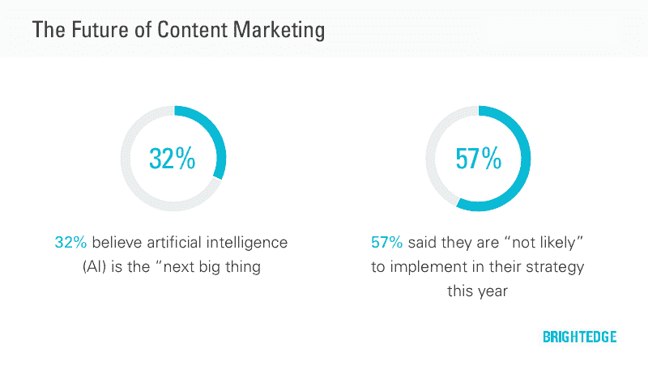
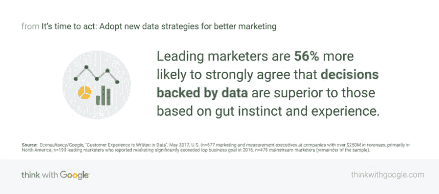

# 内容营销中的 AI？！

> 原文：<https://dev.to/dev_ganesh/ai-in-content-marketing-72g>

### 我们处在一个人工智能在内容营销中的作用已经达到临界点的局面。它比大多数营销人员意识到的更加普遍。[目前使用的许多工具](https://betapage.co/search?query=artificial%20intelligence&source=post_page---------------------------)都采用了人工智能的某些方面，尽管软件提供商并不总是承认这一点。

人工智能是一个庞大的主题，有几十个分支影响着内容营销人员。这篇文章考察了五个有前途的人工智能学科，以更好地理解它们的潜在影响。具体来说，我们考虑推荐引擎、聊天机器人、智能自动化、图像处理、自然处理的当前能力，以及它们塑造内容营销未来的能力。

# 推荐引擎工作得相当好

如果你曾经在网飞上看电影，在 Spotify 上听音乐，或者在亚马逊上购物，你就会体验到推荐引擎在努力工作。同样，如果你作为内容营销人员在专业领域使用过 Curata 或 Scoop.it。

一个简单的推荐引擎使用一个被用户“喜欢”的项目的属性来确定其他潜在的推荐。它还可以利用他人的好恶来推荐商品。更强大的解决方案依赖于机器学习和深度学习来持续提供最合适的建议。

毫不奇怪，亚马逊推荐的成功导致了许多第三方提供他们自己的推荐引擎用于电子商务场合。[biblio](https://www.bibblio.org/?source=post_page---------------------------)就是这样一个专门为内容发布者构建的解决方案，也可以作为 WordPress 插件使用。

虽然相关的帖子插件并不新鲜，但人工智能的应用给事情带来了全新的变化。与更简单的插件不同，人工智能驱动的插件提供更相关和个性化的建议，并且越用越好。随着更多的参与者进入该领域提供改进的解决方案，预计未来将会继续发展。

# 聊天机器人无处不在

聊天机器人无孔不入；毫无疑问。然而，并非所有人生而平等。最好利用自然语言处理来进行丰富的对话。那些没有的人在他们的互动中受到严重的限制，这可能是一个令人沮丧的经历。

一些聊天机器人是基于规则的，而另一些则使用人工智能来指导交互并提供服务。有各种各样的机器人，包括新闻、天气和日程安排机器人。

聊天机器人通常与 Facebook Messenger、Skype、Slack 等一个或多个平台集成。例如，全食超市有一个 Facebook Messenger 机器人，为用户提供烹饪灵感、产品信息和食谱。聊天机器人不需要特别实用才能广受欢迎。床垫公司 Casper 发明了 [Insomnobot-3000](http://insomnobot3000.com/?source=post_page---------------------------) 来“在你无法入睡时陪伴你”

幸运的是，内容营销人员可以把他们的编程技能留在门口，这要感谢众多可用的机器人创建平台。然而，提前制定一个丰富的内容策略是很重要的。

那么，聊天机器人的未来会是怎样的呢？

聊天机器人杂志的创始人 Matt Schlicht 认为聊天机器人将推动对话商务，提供更高的服务效率。他认为这是“品牌和客户互动方式的重大范式转变”，并认为这将对改善客户旅程产生重大影响。

# 智能自动化越来越智能

对于内容营销人员来说，自动化并不是什么新鲜事。几十年来，我们一直用电脑来做这件事。不同的是，人工智能增加了它可以自动化的任务类型的复杂程度。

智能自动化融合了许多人工智能学科，如知识管理、机器学习、自然语言处理和自动推理。

网格是一个人工智能驱动的发布工具，用来建立网站。不需要拖放设计，你只需添加内容。只需给网格的人工智能设计师莫莉反馈，它就会不断重新设计网站，直到你满意为止，绝对没有抱怨。

越来越多的营销人员使用营销自动化在多个渠道开展营销活动，并在整个购买周期中培养客户。这还不常见，但预计会看到更多的采用和更大的个性化，因为人工智能提供了更智能的选择。

# 图像处理达到新水平

你知道脸书正在训练人工智能像人类一样回答关于图像的问题吗？目前，它只能提供简短的回应，但他们正在努力获得更精细的输出。

但你会问，图像识别和内容营销有什么关系？像 Clarifai 这样的公司正在使用人工智能来解决现实世界的商业问题，例如:

*   节省组织和管理媒体的时间。
*   呈现高度相关的内容。
*   在视觉搜索中使用图像返回匹配的内容。
*   调节内容以自动过滤任何被认为敏感的内容。

目前，通过分析受试者消费不同广告或尝试不同产品时的瞳孔，帮助营销研究的技术工作正在进行中。

从短期来看，这将有助于缩短创建合适的用户体验所需的开发时间。也许在未来，这项技术会立即适应用户的需求，即时提供适当的内容。

# NLP 影响深远

对于许多内容营销者来说，文字是他们赖以生存的货币。因此，他们最有可能受到自然语言处理进步的影响。

如果您曾经使用过自动更正功能来修复一个打字错误，或者阅读过美联社的一份财务报告，那么您一定体验过自然语言处理(NLP)的艰辛。

理解语言就是理解思想。人类的语言可能是模糊和不一致的，正是在这种环境下，NLP 寻求理解[语法、语义和上下文](https://www.lexalytics.com/lexablog/machine-learning-vs-natural-language-processing-part-1?source=post_page---------------------------)。

NLP 的影响是深远的。像[自动化洞察](https://automatedinsights.com/wordsmith?source=post_page---------------------------)和[叙事科学](https://narrativescience.com/Products/Our-Products/Dynamic-Narratives?source=post_page---------------------------)这样的应用程序自动将数据转化为引人注目的叙事，无需人工干预。其他人，如 [MarketMuse](https://www.marketmuse.com/?source=post_page---------------------------) 和 [Acrolinx](https://www.acrolinx.com/?source=post_page---------------------------) ，使用人工智能来增加作家的创造性产出。

但是人工智能不会很快让任何人失业。正如波特纳特的开发设计师马太·亨利解释的那样，“没有一台计算机能像人类一样真正理解自然语言。甚至一个十岁的孩子都能比电脑做得更好。”

那我们应该期待什么？改进包括:

*   让你的内容更具可读性。
*   搜索引擎越来越善于理解页面上的内容。
*   更快地从更高复杂性的数据中产生改进的叙述。
*   更严谨的主题模型，帮助作者创作更好的内容。

# 人工智能和内容营销的未来

我们才刚刚开始。数十家软件供应商已经提供了无数人工智能驱动的解决方案，这些解决方案远远超越了传统工具。期待看到更多的[供应商进入这个新兴领域](https://learn.g2.com/machine-learning-examples?source=post_page---------------------------)。一些将在现有能力的基础上提供巨大的改进，而另一些将进行超出我们想象的彻底创新。