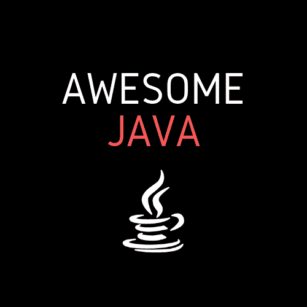
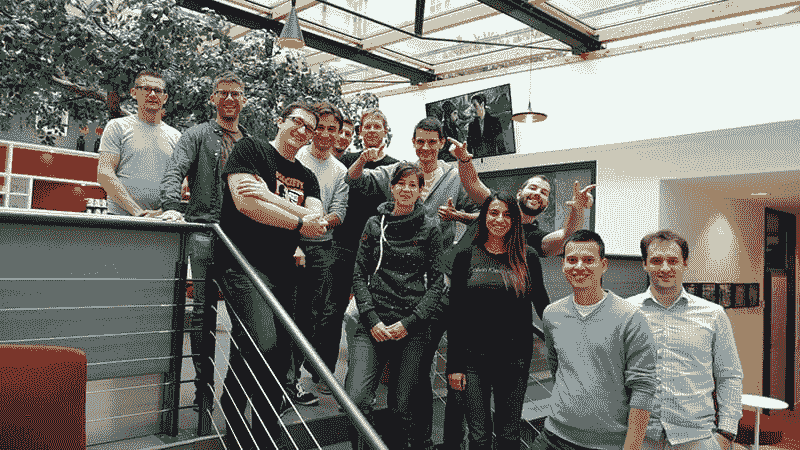
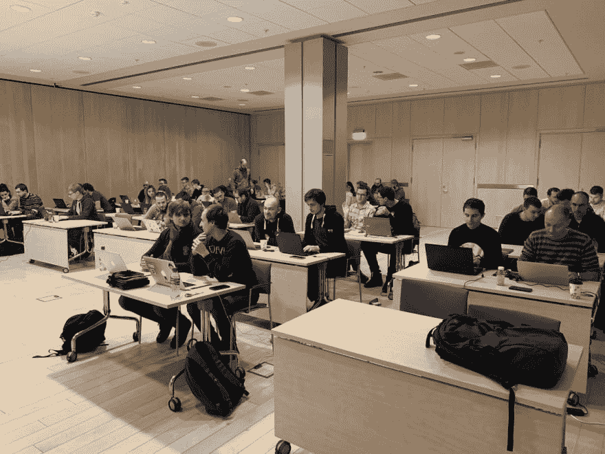
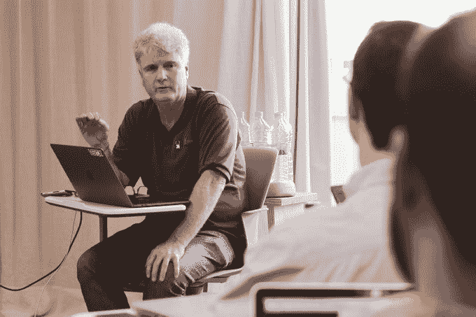

# 面向开发人员的有效 Java 培训

> 原文：<https://dev.to/codingunicorn/effective-java-training-for-developers-45le>

我认为参加教师指导的课程是提高 Java 技能的最佳方式。没有任何在线课程可以与现场学习相比，当你在一群志同道合的人中间工作时，向行业从业者提问和学习。

下面是我亲自参加并喜欢的实用、有效的 Java 培训课程列表。

# 有效的 Java 软件设计(🏅)

**受众** : Java 开发人员、架构师、团队负责人
**地点**:里加、斯德哥尔摩、柏林
**日期**:9 月/10 月
**持续时间** : 2 天

👉TLDR:这绝对是我参加过的最好的 Java 培训。

**[有效的 Java 软件设计](https://devchampions.com/training/java/)** 超出预期，我的期望很高。多亏了 Eduards，他充满了能量和灵感，我学到了惊人的模式、框架和库，我现在在日常工作中使用它们。

我和我的团队领导一起参加了课程，他也很喜欢。我有三年的 Java 实践经验，他有 10+。

一切都非常实用，包括课堂练习和小组讨论。我对如何编写代码有了新的认识，从简单的任务到做出高层架构决策。我们涵盖了有效的 Java 编码原则和模式、Spring Boot、Hibernate、DDD、函数式编程、测试、干净代码、架构和许多重要的主题。

我仍然使用 Eduard 的幻灯片作为优秀代码编写的鼓舞人心的例子。

**[有效 Java](https://devchampions.com/training/java/) 是必去的课程。跳过，后果自负。**👨‍💻

# 桑德罗·曼库索制作代码

**观众** : Java 开发者
**地点**:不定
**日期**:不定
**持续时间** : 2 天

制作代码是一门课程，将教你如何使用测试驱动的开发方法编写干净的代码。我参加了 2017 年 **[发展大会](https://devterntiy.com)** 的课程，非常喜欢。

Sandro 教会了我如何编写易于理解和维护的干净代码。我对测试驱动开发(TDD)越来越适应，并学会了如何使用“由外向内”的 TDD 方法来设计和构建我的代码库。强烈推荐！

# 叶夫根尼·博里索夫的春天框架

**观众** : Java 开发者
**地点**:不定
**日期**:不定
**持续时间** : 2 天

Spring 是企业 Java 最流行的应用程序开发框架。全世界数以百万计的开发人员使用 Spring Framework 来创建高性能、易于测试、可重用的代码。

对于包括我在内的许多开发人员来说，Spring 有点神奇。这就是为什么 Eugene 深入钻研 Spring 源代码，不仅解释了如何使用 Spring，还解释了它是如何工作的。

尤金是一位精力充沛、务实的培训师。我喜欢工作坊几乎零理论。相反，在 Evgeny 的指导下，你进入源代码，看看事情是如何工作的。[真的好训练](https://naya.academy/course/spring/)！

# Java 和 JVM 性能研讨会

**观众** : Java 和 DevOps 专业人士
**地点**:不定
**日期**:不定
**持续时间** : 2 天

**[JVM 性能](http://www.kodewerk.com/workshop.html)** 是您在高性能应用程序上工作时需要参加的培训。

Kirk 教会了我一些可靠的技术，可以让我快速找到任何性能退化的根源。这个研讨会让我对 JVM 如何与工具一起工作有了深入的了解，这些工具是完全描述性能退化所需要的。

您将进行包含真实生产环境中常见的真实问题的练习。

**[JVM 性能](http://www.kodewerk.com/workshop.html)** 是当你的老板紧盯着你问为什么你的 Java 应用程序慢的时候，你会希望你参加的课程:)

# 用无锁算法编写并发代码

**观众**:铁杆 Java 开发者
T3】地点:不定
**日期**:不定
**持续时间** : 3 天

**[用无锁算法编写并发代码](https://www.real-logic.co.uk/training.html)** 对于想要掌握 Java 并发的 Java 开发人员来说是一个硬核培训。

凭借多年来得来不易的经验，Martin 为对构建低延迟、高吞吐量系统感兴趣的 Java 程序员创建了一门真正鼓舞人心且富有挑战性的课程。

Martin 教会了我如何构建达到世界级性能水平的代码。在本课程结束时，我获得了深入的并发编程知识，这让我能够有效地使用和构建数据结构，如集合、队列和执行器。我还学到了很多关于性能分析的知识。

## 总结

所以，你有五个令人敬畏的 Java 课程的最终列表可供选择:

*   **[有效的 Java 软件设计](https://devchampions.com/training/java/)** ❤️
*   **[神石代号](https://codurance.com/services/training/crafting-code/)**
*   **[弹簧框架](https://naya.academy/course/spring/)**
*   **[JVM 性能](http://www.kodewerk.com/workshop.html)**
*   **[用无锁算法编写并发代码](https://www.real-logic.co.uk/training.html)**

做出选择，然后向你的经理申请许可和预算。以下是模板:

1️⃣，我想参加 _ _ _ _ _ 的 _ _ _ _。这要花费 _ _ _ _ _。
2️⃣项目和公司的收益:_ _ _ _ _ _ _。
3️⃣这门课是最好的，因为:_ _ _ _ _ _ _。
4️⃣我考虑了以下几种选择:_ _ _ _ _ _ _。
5️⃣这个时机对团队和项目都有好处，因为 _ _ _ _ _。6️⃣:我不在的时候，_ _ _ _ _ 将代替我。
7️⃣当我回来时，我会通过创建一个 _ _ _ _ _ 来与 _ _ _ _ _ 分享我学到的经验。⠀
尽情享受吧！