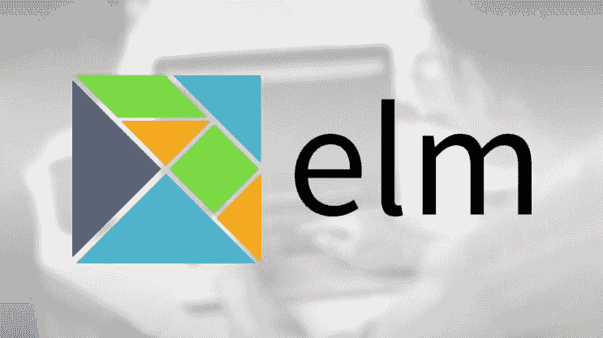
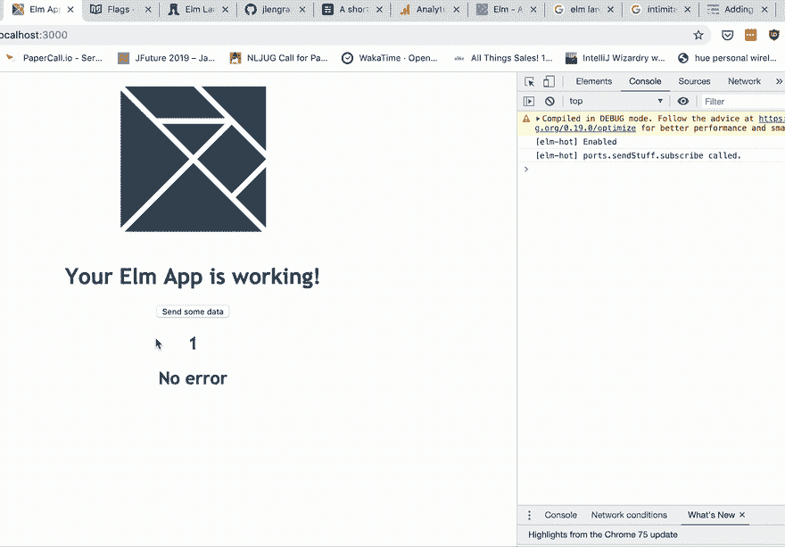
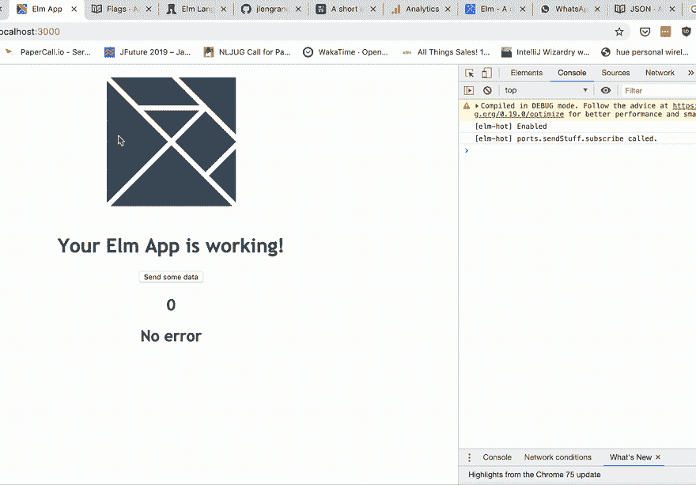
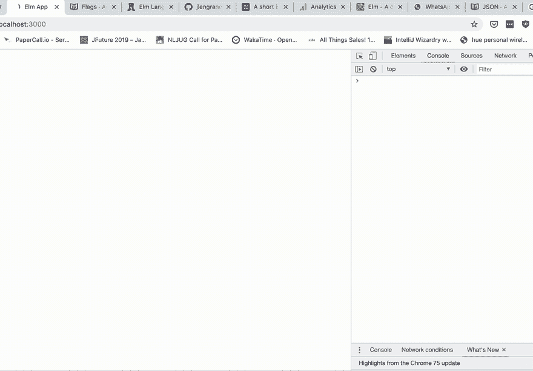

# Elm 中的端口和标志简介

> 原文：<https://dev.to/jlengrand/a-short-introduction-to-ports-and-flags-in-elm-14em>

[](https://res.cloudinary.com/practicaldev/image/fetch/s--qgOcemxY--/c_limit%2Cf_auto%2Cfl_progressive%2Cq_auto%2Cw_880/https://lengrand.fr/conteimg/2019/07/1_o-gIsoWXAhk-oZoz-WSdXg.jpeg)

**[TLDR:完整的最小工作示例，这里有端口和标志](https://github.com/jlengrand/elm-ports)，这里有现场演示。**

我已经关注 **[【榆树】](https://elm-lang.org/)** 的发展好几年了。我已经连续两年去了 [Elm Europe](https://2019.elmeurope.org) ，但是不知何故，我对这门语言的实际经验仍然非常有限，我仅仅用它写了几个基本的原型。

根据维基百科的描述，榆树比我更好

> 一种特定于领域的编程语言，用于以声明方式创建基于 web 浏览器的图形用户界面。Elm 是纯功能性的，开发时强调可用性、性能和健壮性。

我不是函数式编程的专家，但是 Elm 无疑让我在这方面做得更好。Elm 就是“一边看电影，一边确保你的东西不会有问题”那种好。它是纯粹的，非常注重编译器错误可读性。这实际上意味着，如果你的东西编译了，它可能会像预期的那样工作。

到目前为止，令人畏惧的事情之一是 Javascript 的互操作性。因为 Elm 是纯的，所以与糟糕的、不纯的 Javascript 世界交互的唯一方式是将它推到边界，并用它描述接口:即端口和标志。直到昨天，那对我来说似乎是一座遥不可及的桥。

## 端口和标志

本质上，榆树是纯洁的。这意味着在编写基本的 Elm 时，几乎不可能产生和处理副作用。您不能做任何可能失败的事情，比如从系统获取时间，或者进行 HTTP 调用。它有巨大的好处。根据设计，您编写的任何代码都不会生成任何运行时异常。

当然，这是相当有限的，人们需要与世界互动来构建应用程序。这个世界根本就不纯洁。这就是为什么 Elm 允许你通过标志和订阅与不纯洁的世界互动。并且您可以使用端口生成自己的与外部的接口，这些端口将生成触发那些订阅。

如果你想了解更多关于端口和标志的知识，最好的方法是阅读该语言的创造者自己写的文档。

本质上，

*   **端口**允许你定义一个与 Javascript 的接口。因为它是基于命令和订阅的，所以这些交互对 Elm 来说是纯粹的。
*   **标志**是一种在模型实例化的最开始使用来自 Javascript 的数据来设置一些 Elm 模型的方法。

我仔细阅读了这些页面，但一些实际的细节对我来说仍然很模糊，因为那里没有完整的工作示例。这就是这篇文章想要解决的问题。[你可以在这里找到完整的工作库](https://github.com/jlengrand/elm-ports)。

## 发送数据榆树- > Javascript 使用端口

我们将尽可能做最简单的事情:每当用户按下按钮时，向 Javascript 发送一些消息。我们将使用一个`console.log`语句来证明消息的接收。

我们首先需要指出我们的 Elm 模块将包含端口:

```
port module Main exposing (Model, Msg(..), init, main, update, view) 
```

<svg width="20px" height="20px" viewBox="0 0 24 24" class="highlight-action crayons-icon highlight-action--fullscreen-on"><title>Enter fullscreen mode</title></svg> <svg width="20px" height="20px" viewBox="0 0 24 24" class="highlight-action crayons-icon highlight-action--fullscreen-off"><title>Exit fullscreen mode</title></svg>

然后定义我们的端口。它将接受一些 JSON 编码的值作为输入，并生成一个命令。Elm 知道如何将命令转换成 Javascript 世界。

```
port sendStuff : Json.Encode.Value -> Cmd msg 
```

<svg width="20px" height="20px" viewBox="0 0 24 24" class="highlight-action crayons-icon highlight-action--fullscreen-on"><title>Enter fullscreen mode</title></svg> <svg width="20px" height="20px" viewBox="0 0 24 24" class="highlight-action crayons-icon highlight-action--fullscreen-off"><title>Exit fullscreen mode</title></svg>

我们最不需要的就是一个触发这个方法的方法。我们可以用多种方法来实现，但是在我们的例子中，我们将创建一个`SendData`消息，它将在按钮点击时被触发。

```
type Msg
    = SendData 
```

<svg width="20px" height="20px" viewBox="0 0 24 24" class="highlight-action crayons-icon highlight-action--fullscreen-on"><title>Enter fullscreen mode</title></svg> <svg width="20px" height="20px" viewBox="0 0 24 24" class="highlight-action crayons-icon highlight-action--fullscreen-off"><title>Exit fullscreen mode</title></svg>

最后，在我们的视图中，我们触发按钮中的消息

```
button [onClick SendData] [text "Send some data"] 
```

<svg width="20px" height="20px" viewBox="0 0 24 24" class="highlight-action crayons-icon highlight-action--fullscreen-on"><title>Enter fullscreen mode</title></svg> <svg width="20px" height="20px" viewBox="0 0 24 24" class="highlight-action crayons-icon highlight-action--fullscreen-off"><title>Exit fullscreen mode</title></svg>

我们准备好了！现在，我们需要连接 Javascript 端来接收我们的消息:)。

```
app.ports.sendStuff.subscribe(data => {
  console.log(JSON.stringify(data));
}); 
```

<svg width="20px" height="20px" viewBox="0 0 24 24" class="highlight-action crayons-icon highlight-action--fullscreen-on"><title>Enter fullscreen mode</title></svg> <svg width="20px" height="20px" viewBox="0 0 24 24" class="highlight-action crayons-icon highlight-action--fullscreen-off"><title>Exit fullscreen mode</title></svg>

就是这样！来测试一下吧！

<figure>[](https://res.cloudinary.com/practicaldev/image/fetch/s--aprOAKGz--/c_limit%2Cf_auto%2Cfl_progressive%2Cq_66%2Cw_880/https://lengrand.fr/conteimg/2019/07/ScreenRecording2019-07-28at4.gif) 

<figcaption>使用端口</figcaption>

</figure>

向 javascript 发送数据

## 发送数据 Javascript - >榆树使用端口

这个过程与上一步相似，只是稍微复杂一点。

首先，我们定义我们的端口

```
port receiveStuff : (Json.Encode.Value -> msg) -> Sub msg 
```

<svg width="20px" height="20px" viewBox="0 0 24 24" class="highlight-action crayons-icon highlight-action--fullscreen-on"><title>Enter fullscreen mode</title></svg> <svg width="20px" height="20px" viewBox="0 0 24 24" class="highlight-action crayons-icon highlight-action--fullscreen-off"><title>Exit fullscreen mode</title></svg>

这里，`receiveStuff`是**一个函数，它接受一个函数**，这个函数接受一个 JSON 编码的值作为输入并返回一些东西，并返回一个带有有效载荷的订阅。所以我们必须以某种方式使用函数组合。

因为我们接收 JSON 有效载荷，我们将不得不使用一个解码器。这里我就不详细解释了，[你可以在这里阅读更多关于解码器的内容](https://guide.elm-lang.org/effects/json.html)。

我的有效载荷是形式`{value: Int}`，所以下面的解码器就足够了:

```
valueDecoder : Json.Decode.Decoder Int
valueDecoder =
    Json.Decode.field "value" Json.Decode.int 
```

<svg width="20px" height="20px" viewBox="0 0 24 24" class="highlight-action crayons-icon highlight-action--fullscreen-on"><title>Enter fullscreen mode</title></svg> <svg width="20px" height="20px" viewBox="0 0 24 24" class="highlight-action crayons-icon highlight-action--fullscreen-off"><title>Exit fullscreen mode</title></svg>

这允许我们创建我们的订阅:

```
subscriptions : Model -> Sub Msg
subscriptions model =
    receiveStuff (Json.Decode.decodeValue valueDecoder >> Received) 
```

<svg width="20px" height="20px" viewBox="0 0 24 24" class="highlight-action crayons-icon highlight-action--fullscreen-on"><title>Enter fullscreen mode</title></svg> <svg width="20px" height="20px" viewBox="0 0 24 24" class="highlight-action crayons-icon highlight-action--fullscreen-off"><title>Exit fullscreen mode</title></svg>

其中我们的端口获取接受 JSON 的函数，并按预期返回有效载荷。

在我们的订阅中，我们定义了`Received`。这是一条包含解组 JSON 结果的消息。它可能成功，也可能失败。这导致处理错误的代码更加复杂:

```
type Msg
    = ...
    | Received (Result Json.Decode.Error Int)

update : Msg -> Model -> ( Model, Cmd Msg )
update msg model =
    case msg of
        ...

        Received result ->
            case result of
                Ok value ->
                    ( { model | counter = value }, Cmd.none )

                Err error ->
                    ( { model | error = Json.Decode.errorToString error }, Cmd.none ) 
```

<svg width="20px" height="20px" viewBox="0 0 24 24" class="highlight-action crayons-icon highlight-action--fullscreen-on"><title>Enter fullscreen mode</title></svg> <svg width="20px" height="20px" viewBox="0 0 24 24" class="highlight-action crayons-icon highlight-action--fullscreen-off"><title>Exit fullscreen mode</title></svg>

有趣的一行是我们将内部计数器设置为新值的地方。

在 Elm 中，我们必须做的最后一件事是使我们的计数器可见。我们在视图中这样做

```
h2 [] [text <| String.fromInt model.counter] 
```

<svg width="20px" height="20px" viewBox="0 0 24 24" class="highlight-action crayons-icon highlight-action--fullscreen-on"><title>Enter fullscreen mode</title></svg> <svg width="20px" height="20px" viewBox="0 0 24 24" class="highlight-action crayons-icon highlight-action--fullscreen-off"><title>Exit fullscreen mode</title></svg>

好了，剩下唯一要做的就是用 Javascript 发送数据。为了便于演示，我们将使用`setInterval`每秒增加一次计数器，并定期向 Elm 发送数据。

```
let counter = 1;
setInterval(() => {
  counter += 1;
  console.log(JSON.stringify(counter));
  app.ports.receiveStuff.send({ value: counter });
}, 1000); 
```

<svg width="20px" height="20px" viewBox="0 0 24 24" class="highlight-action crayons-icon highlight-action--fullscreen-on"><title>Enter fullscreen mode</title></svg> <svg width="20px" height="20px" viewBox="0 0 24 24" class="highlight-action crayons-icon highlight-action--fullscreen-off"><title>Exit fullscreen mode</title></svg>

我们来测试一下！

<figure>[](https://res.cloudinary.com/practicaldev/image/fetch/s--bXTtMq9d--/c_limit%2Cf_auto%2Cfl_progressive%2Cq_66%2Cw_880/https://lengrand.fr/conteimg/2019/07/trim2.gif) 

<figcaption>使用端口</figcaption>

</figure>

从 Javascript 接收数据

## 使用标志在 Elm 中设置初始模型值

从上一个例子中我们可以注意到的一件事是，在我们的应用程序中，**我们的计数器从 0 跳到 2** ，而不经过 1。

这是因为在我们的 init 方法中，我们选择将初始计数器设置为 0。实际上，在端口实际开始被激活之前，Elm 启动整个模型并返回一个视图。这导致我们在 Javascript 中遗漏了计数器的初始值 1。

我们可以使用标志来解决这个问题，这样 Elm 就可以在实例化之前知道计数器**的初始值。**

变化相对较小。首先，我们将定义一个类型别名，它将描述数据将以何种形式提供给 Elm。因为我们这样发送数据:`{value: 1}`，下面的代码就足够了:

```
type alias Flags =
    { value : Int
    } 
```

<svg width="20px" height="20px" viewBox="0 0 24 24" class="highlight-action crayons-icon highlight-action--fullscreen-on"><title>Enter fullscreen mode</title></svg> <svg width="20px" height="20px" viewBox="0 0 24 24" class="highlight-action crayons-icon highlight-action--fullscreen-off"><title>Exit fullscreen mode</title></svg>

然后，我们让 init 函数知道这个输入，并在创建模型时考虑到它。我们的 init 方法现在将标志作为额外的输入，而不是一个空元组:

```
init : Flags -> ( Model, Cmd Msg )
init flags =
    ( { counter = flags.value, error = "No error" }, Cmd.none ) 
```

<svg width="20px" height="20px" viewBox="0 0 24 24" class="highlight-action crayons-icon highlight-action--fullscreen-on"><title>Enter fullscreen mode</title></svg> <svg width="20px" height="20px" viewBox="0 0 24 24" class="highlight-action crayons-icon highlight-action--fullscreen-off"><title>Exit fullscreen mode</title></svg>

嗯，就是这样。现在，我们只需在 Javascript 中使用 flags 参数与 Elm 共享初始值:

```
let counter = 1;

const app = Elm.Main.init({
  node: document.getElementById("root"),
  flags: { value: counter }
}); 
```

<svg width="20px" height="20px" viewBox="0 0 24 24" class="highlight-action crayons-icon highlight-action--fullscreen-on"><title>Enter fullscreen mode</title></svg> <svg width="20px" height="20px" viewBox="0 0 24 24" class="highlight-action crayons-icon highlight-action--fullscreen-off"><title>Exit fullscreen mode</title></svg>

让我们看看这是否让我们满意！

不再有初始 0，也不再有跳转。成功就是这个样子！

<figure>[](https://res.cloudinary.com/practicaldev/image/fetch/s--9zvPnXrj--/c_limit%2Cf_auto%2Cfl_progressive%2Cq_66%2Cw_880/https://lengrand.fr/conteimg/2019/07/trimlast.gif) 

<figcaption>设置初始值使用标志</figcaption>

</figure>

## 最后的话

这篇文章比我想象的要长，但是我希望额外的信息是有用的。总而言之，[完整的代码示例](https://github.com/jlengrand/elm-ports/blob/master/src/Main.elm)只有 100 行代码，因此阅读起来应该很方便。

你可以在这里尝试在线演示。

我花了几个小时才真正进入港口的流程，但它们现在真的为我打开了一个充满可能性的世界。不再需要搜索与库的集成(例如 firebase)，因为我可以创建自己的库。同时保持纯粹的功能性。非常方便！

当然，建议总是受欢迎的。给我打电话 [@jlengrand](https://twitter.com/jlengrand) ，或者直接上 G [ithub](https://github.com/jlengrand/elm-ports) 回购。