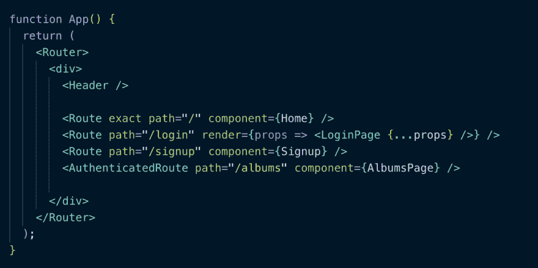
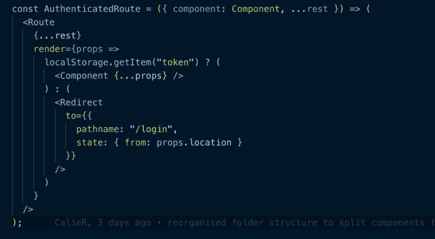
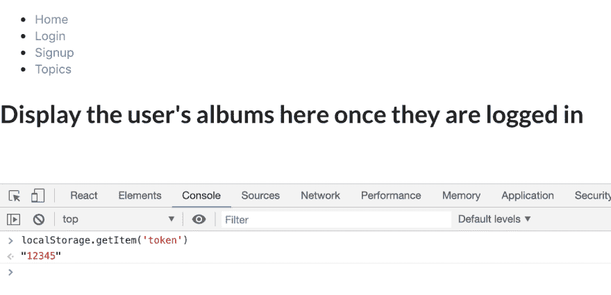
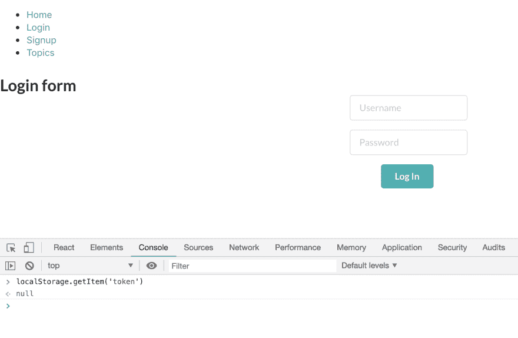

# 在 React 中设置认证路由

> 原文：<https://dev.to/calier/setting-up-an-authenticated-route-in-react-4m9a>

在我完成训练营之后，我想通过重建我的最终项目来继续学习——一个为我和我的朋友们设计的图片分享应用程序。这对我来说非常特别，因为在我真正了解编码之前，我告诉他们我将为他们构建它。几年前，我们去佛罗里达度过了一个美好的假期，我们去了迪斯尼，做了所有有趣的事情，带了一大堆照片回来，但从未聚在一起分享过所有那些快乐的回忆。现在它是这样工作的:

[https://www.youtube.com/embed/zJOcueH0bjY](https://www.youtube.com/embed/zJOcueH0bjY)

起初，我有一个宏伟的计划，用一个完全不同的堆栈来重写它，自学所有这些不同的技术。我一次尝试所有这些有点混乱，所以现在后端可以保持原样——它已经工作得很好，我已经有了端点，所以我将从关注前端开始。我只有 2 周的时间在 bootcamp 建立应用程序，所以尽管它可以工作，代码可以更好。这是我想象中的一系列博客的第一部分，讲述我在重建过程中所学到的东西。

#### 按指定路线发送

就像我说的，我在 2 周内完成了一个工作项目，但是我想用不同的方式写它的一部分。前端使用 create-react-app 搭建，所有组件都使用 ternaries 有条件地呈现，结果主要基于不同的状态。过了一段时间，设置和更新所有这些状态变得复杂了，我想我可以回头重构代码来使用 React Router——很简单，对吧？嗯，你可以，我试过了，但并不简单。路线成了我重建的首要任务。

该应用程序将有一个标题与按钮去登录和注册页面，所以我知道我想为这些路线。我还需要一个主页的路线。我的应用程序使用 JWT 进行授权，所以如果本地存储中存在令牌，我希望相册路由为登录用户显示相册。如果没有令牌，这个路由就不能工作，所以需要向用户显示登录表单。

我创建了一个新的 react 应用程序，并使用了来自 react 培训网站的快速启动代码。这是一个很好的方式，通过玩来适应链接和路线。当我开始显示某个特定相册的内容时，有一点关于嵌套路由的信息会派上用场。

一旦用一些简单的组件(只包含说明其用途的 h1)奠定了基础，我就需要解决如何实现相册页面:我的应用程序的原始版本使用一个函数来检查 localStorage 中的令牌，该函数在相册页面组件挂载时被调用。如果有令牌，这意味着用户当前已登录，因此它从数据库中获取该用户的所有相册。

我不知道如何用路线来表达这一点，直到我在这个平台上发现了索菲写的一篇精彩的[博客](https://dev.to/sophiedebenedetto/jwt-auth-with-phoenix-and-react-router-4)，索菲曾是熨斗学校的毕业生和教师。遵循第一部分后，我能够将该解决方案实施到我的应用程序组件中:

以上是我到目前为止使用的常规路由，还有一个额外的经过身份验证的(受保护的)路由指向显示用户所有相册页面的组件。

认证路由看起来有点混乱，但本质上只是一个功能组件。

它接受包括 AlbumsPage 组件在内的 props，并返回一个 Route 组件。路由的组成由其 render 方法决定，该方法检查 localStorage 中是否存在一个令牌:如果存在，则意味着一个经过身份验证的用户已经登录，所以继续调用传入的 AlbumsPage 组件。如果没有，请使用重定向组件。重定向是 react-router-dom 的一个特性，你可以在这里了解更多。本质上，它使您能够指定您希望用户重定向到什么路由，而不是所请求的 URL。有益的是，您可以记住您被重定向的位置。

我还不需要从后端抓取所有内容，我只想检查我是否正确地实现了认证路由，所以我在浏览器中通过使用控制台设置和清除一个令牌来测试它...

*   使用令牌，将显示相册页面(现在只是一个占位符):

*   清除令牌，应用程序重定向到登录页面(尚未连接):

都管用，感谢 [@sophiedebenedetto](https://dev.to/sophiedebenedetto) ！这真的很好很整洁，因为到目前为止，我把所有的路径都放在一个我可以清楚看到的地方，而不是把这些不同的函数放在不同的文件中。正是我想要的。

接下来，我将在登录表单上放置一些处理程序，并将其连接到后端，这样我就可以从数据库中登录一个实际的用户...