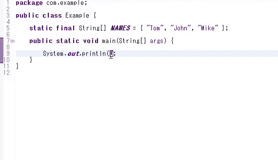
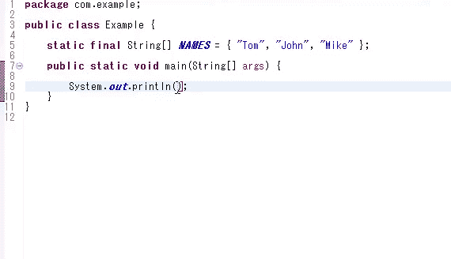
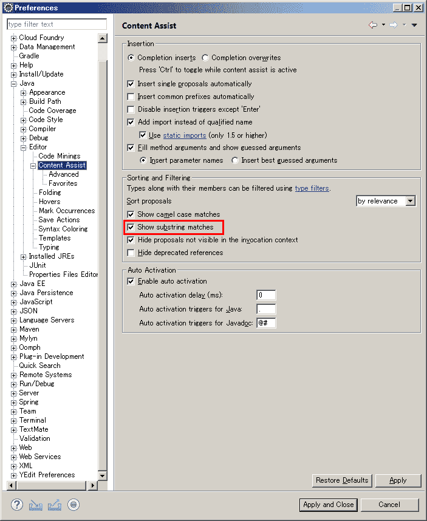
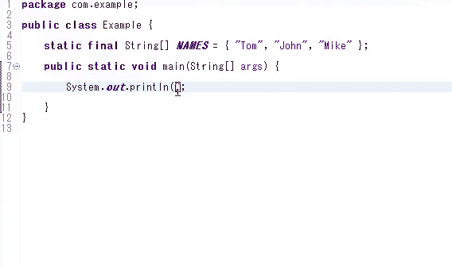
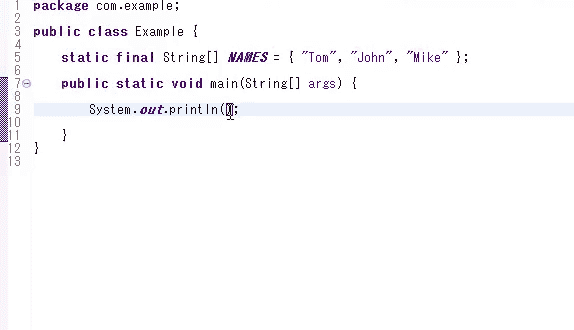
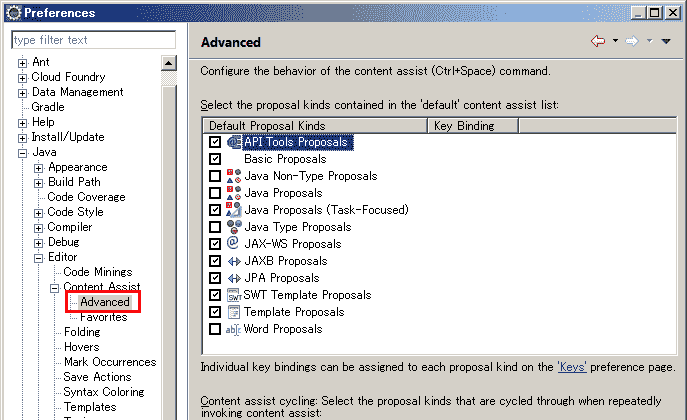
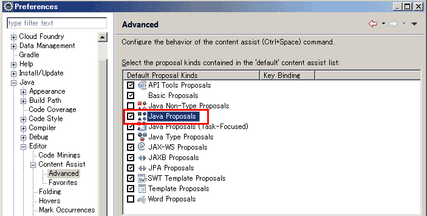
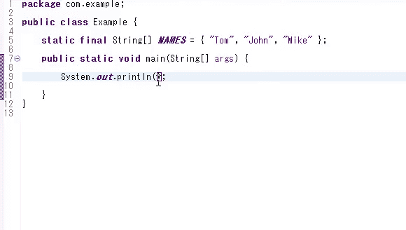

# 当您在 Eclipse 的代码完成中得到非预期的结果时，这可能是子串代码完成的副作用。

> 原文：<https://dev.to/riversun/when-you-get-unintended-results-in-eclipse-s-code-completion-that-might-be-the-side-effect-of-substring-code-completion-191f>

# 概述

*   当您想要完成一个类的方法名时，有时 eclipse 会完成一个非预期的方法名。
*   我想解释一下在这种情况下的措施。
*   这可能是在 [Eclipse NEON](https://www.eclipse.org/eclipse/news/4.6/jdt.php) 中添加的新特性“Substring code completion”的副作用

## 环境

*   eclipse IDE 2019-06

# “意外完成”如下。先看看。

输入“数组”后，输入一个点(。)开始代码完成。
接下来，如果输入“tostring”并按回车键，“deepToString”被选为问题。

## “子串代码补全”是个有用的功能，你懂的。

即使只键入“string ”,包含“string”作为方法名一部分的方法也将被建议作为候选方法。

# 解决方案 1:关闭子串补全

选择**窗口>首选项> Java >编辑器>内容辅助**，则可以找到**显示子串匹配**设置  。然后关机 

## 尝试使用“子串补全关闭”

感觉挺好的。
无意的“deepToString”不再补。

## 但是，如果“子串补全”关闭，子串补全就无法自然完成。

我试着在“数组”后面输入“字符串”没有其他候选人了。

# 解-2

像以前一样重新打开设置窗口**窗口>首选项> Java >编辑器>内容辅助**并打开  上的“子串完成”

接下来，点击“内容辅助”上的[+]“加号”标记，然后展开设置，选择“高级”。

检查 **Java 提议**如下。

## 试代码补全

看看这个。

它似乎是按照预定的动作移动的

## 用子串匹配尝试代码补全

子字符串完成也工作正常。

解决方案 2 似乎更符合预期。

# 印象

至于代码补全，我认为，“Intellij IDEA”(或者 Android Studio)要高级得多，对应的是“子串代码补全”，而且好像是预先调好的，没有这样的副作用。

(直到在 Eclipse 中遇到才注意到，但是使用感受的调优所改善的细微差异影响了生产力和质量等。)