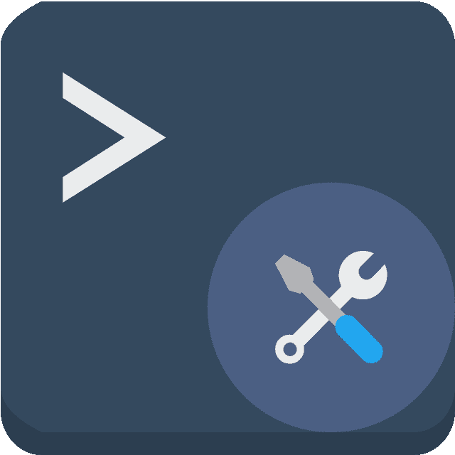
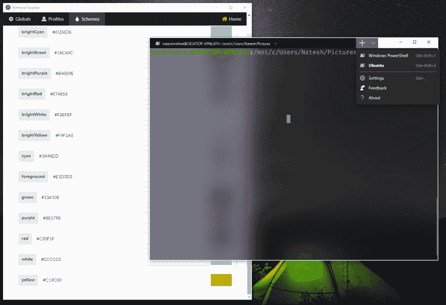
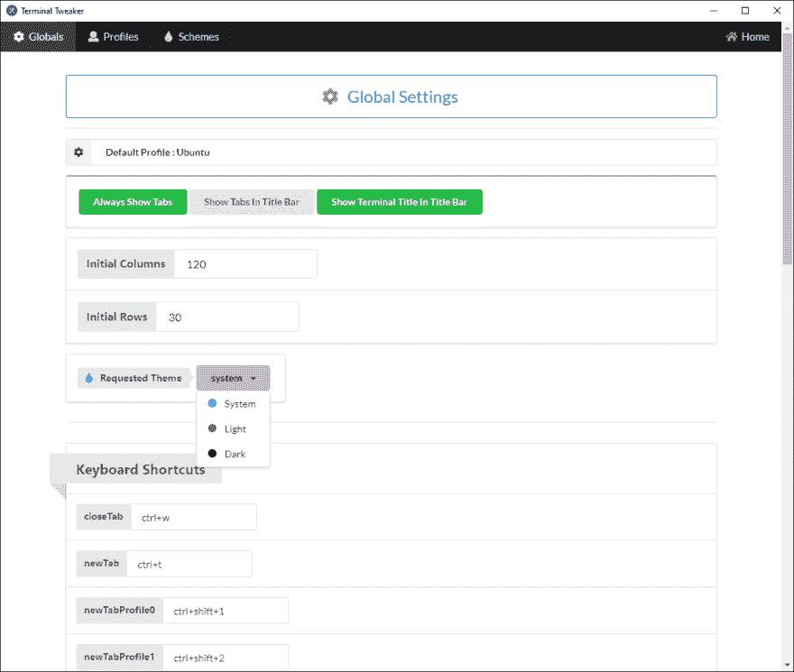
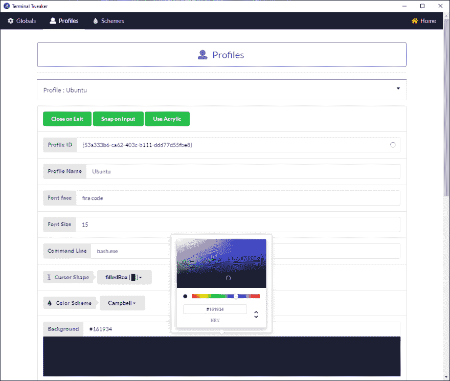

# 终端微调:一个电子反应项目，以调整新的 windows 终端到心脏的内容❤.

> 原文：<https://dev.to/nateshmbhat/terminal-tweaker-an-electron-react-project-to-tweak-the-new-windows-terminal-to-heart-s-content-4c95>

嘿伙计们，日安。在我谈论这个项目之前，我很高兴地说，这是我在 dev 社区上的第一篇帖子，我非常兴奋地将我在 pc 上制作的任何小东西分享给这个精彩的社区。有了这个，让我们用一些电子的东西来填充我们的大脑。

**如果你想要的只是检查应用程序和项目，这里有到库和二进制文件的链接:**
**[终端调整程序可执行文件](https://github.com/nateshmbhat/windows-terminal-tweaker/releases)**

## [nateshmbhat](https://github.com/nateshmbhat)/[windows-终端-tweaker](https://github.com/nateshmbhat/windows-terminal-tweaker)

### 使用此应用程序，使用其漂亮的界面来配置关于终端的一切，调整您的 windows 终端以适应您的需求。

<article class="markdown-body entry-content container-lg" itemprop="text">

# 终端微调器

使用此应用程序，使用其漂亮的界面来配置关于终端的一切，调整您的 windows 终端以适应您的需求。

使用提供的材质主题颜色选择器，配置终端中看到的所有可爱的小颜色变得超级简单。查看实时反映在终端上的调整。

该应用程序可以控制所有个人资料和配色方案的创建、删除和更新等等。

## 点击此处下载调整工具:

*   [便携式终端扭结器](https://github.com/nateshmbhat/windows-terminal-tweaker/releases/download/0.1.1/Terminal.Tweaker.Portable.zip)
*   [终端 Tweaker 单文件可执行文件](https://github.com/nateshmbhat/windows-terminal-tweaker/releases/download/0.1.1/Terminal.Tweaker.0.1.1.single.executable.exe)

### 链接:

*   [关于这个应用程序和我在这个项目中使用的技术](https://bit.ly/2MhyTAp)
*   我在我的[电子反应打字稿](https://github.com/nateshmbhat/electron-react-ts-starter)入门包的基础上建立了这个，它带有甜蜜的打字稿自动加载和大多数 CRA 支持的错误修复。
*   [新的 windows 终端](https://www.microsoft.com/store/productId/9N0DX20HK701)如果你还没有。

### 截图:

</article>

[View on GitHub](https://github.com/nateshmbhat/windows-terminal-tweaker)

当我看到新的 windows 终端预告片时，该死的它看起来很热。但是在我安装它之前，我一点也不知道配置它会有点痛苦。所以我为终端推出了自己的微调器，它通过显示给用户的微调器 UI 进行配置解析和编辑。

该应用程序通过文件编辑减少了手动配置的繁琐，并提供选项来配置有关终端的一切，包括材质颜色选择器和其他用户界面元素以进行定制。

谈到 UI，它是使用 react 和语义 UI 样式组件构建的，状态管理是使用 redux 完成的。由于我已经使用 React 有一段时间了，目前(截至 2019 年)推出桌面应用程序的最佳技术应该是电子。

#### 嗯，在使用电子之后，我对它有着复杂的想法。这里有一个纲要。

### 键入安全和自动重装:

在使用 javascript 和 typescript 一段时间后，当我可以使用 typescript 时，我感到不安全。虽然使用 electron 很有趣，但是当将 create-react-app 与 typescript 集成在一起并使自动重载正常工作时，它确实出现了一些问题。由于一路上我遇到了许多错误和问题，我决定制作一个包含所有错误修复、可爱的自动重载和 typescript 支持的入门包，让开发过程中的测试变得轻松。这是我对这一包的回购。

## /[电子反应启动器](https://github.com/nateshmbhat/electron-react-ts-starter)

### 一个固体:)锅炉板启动包当启动一个电子项目使用创建-反应-应用与类型脚本。

<article class="markdown-body entry-content container-lg" itemprop="text">

# 电子反应启动器

#### (具有自动重装功能，可与 Create-React-App 配合使用)

这是在启动一个使用 react with typescript 的电子项目时的一个模板启动包。该代码包含一些在使用 react with electron 和 typescript 时发现的错误修复，并具有自动监控 typescript 更改以重新加载 electronic 应用程序以加快开发速度的功能。

### 为什么这个电子反应启动器:

*   用 create-react-app 运行电子 app，不弹出。
*   当 typescript 源文件更改时，自动重新加载电子应用程序。(这是许多教程文章所缺少的，它们只有一个 electron.js 文件，而没有一个 electron.ts 文件)
*   为简单到复杂的项目提供所需的 npm 脚本和文件夹结构。
*   包括一个非常简单的捆绑过程。
*   自动重新加载应用程序，以更改主流程文件和 react 文件。
*   利用所提供的文件夹结构，可以独立地维护主进程和呈现器进程代码库。

## 用法:

…</article>

[View on GitHub](https://github.com/nateshmbhat/electron-react-ts-starter)

### 启动次数:

电子版使用了 chromium 的渲染引擎，这意味着它比其他应用程序需要更多的启动时间。尽管你可以做一些小的调整来加快速度，但你能做的也就这么多了。

### 反应过来:

对我来说，这是这个项目最闪亮的部分。我很喜欢使用新的钩子 API，所有新的有趣的钩子和非常有用的定制钩子。使用 react 和 redux 很有趣，也很令人满意。

### 建筑和包装:

使用这样的技术时，最可怕的事情之一是在构建和发布过程中出现问题。令人欣慰的是，我能够修复在应用程序打包发布期间出现的一些问题，上面的入门包包括这些修复，使打包更容易。对于建筑，我使用电子建筑。我不必担心跨平台的问题，因为这个微调器只适用于 windows 10 及以上版本。

### 你最终 app 要承受的事情:

*   内存消耗高。
*   启动时间稍长。
*   如果您的应用程序是一个基本的应用程序，那么打包的可执行文件可能看起来太大了，因为 electron 本身在打包的应用程序中占用了大约 80 MB 的空间(粗略估计)。

## 值不值？

对我来说，是的。除了可执行文件的大小更大这一事实之外，在当今 web 框架和技术蓬勃发展的情况下，将您的 web 应用程序制作成桌面应用程序的能力并不是一件小事。

#### 努力修正电子的局限性:

*   这里有一些值得注意的工作来减少电子应用程序的大小和内存使用:[https://medium . com/daily js/put-your-electron-app-on-a-diet with-electri no-c 7 ffdf 1d 6297](https://medium.com/dailyjs/put-your-electron-app-on-a-diet-with-electrino-c7ffdf1d6297)