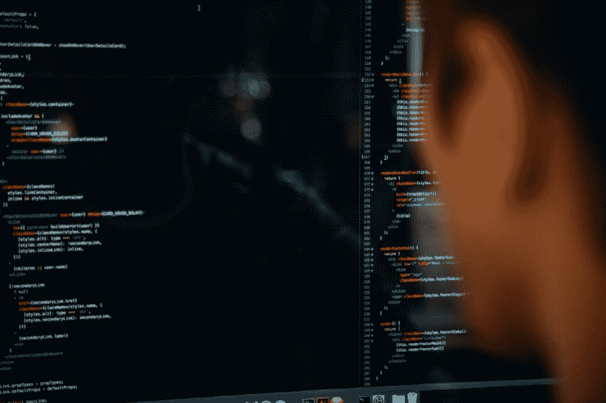

# 基本 Web 开发设置

> 原文：<https://dev.to/jmspace/basic-web-development-setup-2738>

#### 当你不知道从哪里开始时，开始你的第一个项目可能会令人生畏。

<figure> 

<figcaption>照片由[查尔斯·🇵🇭](https://unsplash.com/@charlesdeluvio?utm_source=medium&utm_medium=referral)上[下](https://unsplash.com?utm_source=medium&utm_medium=referral)</figcaption>

</figure>

### 第一件事首先:决定一个编辑。

1.  VS 代码
2.  崇高的文本
3.  支架
4.  原子
5.  看版台

VS 代码是使用最多的编辑器。崇高的文本，轻表和括号是轻量级编辑器。Atom 就在那里，将 VS 代码作为完整的包。做研究，选择一个满足你需求的，或者全部尝试。

我开始使用括号，然后我转向崇高的文本，然后是 VS 代码。我试过 Atom，但它对我的笔记本电脑来说太大了。如果你的电脑是基本的，你应该使用崇高的文字或括号。但是如果它足够强大，可以处理 VS 代码或 Atom，那就试试吧。所以现在我只是坚持崇高的文本，但我的总体选择是 VS 代码。

**这里有一个关于网络开发 14 大编辑的帖子:**

[**2019 年 14 款最佳 Web 开发 IDE【CSS，HTML，JavaScript】| TMS**](https://tms-outsource.com/blog/posts/web-development-ide/)

### 下载量

*   [去](https://git-scm.com/downloads)
*   你选择的编辑
*   Chrome 或 Firefox

开始时，你唯一需要的是 Git 和一个编辑器。下载并安装 Git。在 Git 入门的迷雾中，您需要学习 Git 命令。Git 是 GitHub 的网关。这就是你的代码如何从你的电脑到达 GitHub，反之亦然。GitHub 允许其他人查看您的项目。

[Git & GitHub 初学者速成班——YouTube](https://m.youtube.com/watch?v=SWYqp7iY_Tc&feature=youtu.be)

对于一个开发者来说，ie 浏览器可能还不够，而且我从来没有听到有人说他们在制作网站时使用 ie 浏览器。使用 Chrome 或 Firefox。反正你最有可能用的是 Chrome。

### 设置你的编辑器环境

有许多插件可以使您的开发尽可能高效。你不需要使用这些，但是它们让生活变得更简单。开始时，您应该:

*   Emmet —自动填充标签
*   自动加载到浏览器—每次保存文件时，浏览器中的文件都会更新

### 开始那个项目

<figure> 

<figcaption>照片由[安德鲁·尼尔](https://unsplash.com/@andrewtneel?utm_source=medium&utm_medium=referral)上[下](https://unsplash.com?utm_source=medium&utm_medium=referral)</figcaption>

</figure>

**GitHub**

当你对自己的 Git 技能不自信时，在 GitHub 中创建项目。转到您要在计算机上保存项目的位置。创建一个文件夹，然后打开 Git Bash 到所需的文件夹。(右击并点击 Git bash，会打开一个命令行。)

返回 GitHub 中的存储库。复制 URL 并返回命令行，粘贴并按回车键。您的文件夹现在已连接到 GitHub。

#### 打开你的编辑器。

1.  创建一个 HTML 文件。
2.  创建一个 CSS 文件。

对于命名约定，我通常以文件夹或项目来命名我的文件。

例如，项目 setup 包含一个文件夹 html 和一个名为 Setup 的 css 文件。有些网站只是将主页命名为 index.css，将 css 命名为 index.css。多页面网站以页面名称作为文件名。如果 CSS 没有变得太疯狂，就不需要新的 CSS 文件。目前只有一个可以。

是时候进行第一次 Git 提交了。每次您对项目进行更改时，最好提交一份更改标记。不要在两次改变之间花太长时间。你可能犯了一个错误，或者对某件事做了一个改变，你想回到过去，但是你不能，因为你没有打破你的承诺。我是吃了苦头才知道的。一次做一件事。

首先添加 HTML，然后提交。在页面的整体外观中添加一些 CSS，提交。处理标题，提交。更改布局，提交。

在某些时候，您的提交需要被推送到 GitHub。如果你是唯一一个在做这个项目的人，那么你可以在一天或一夜结束时，或者在你休息的时候去做。Git 会将你所做的所有更改推送到 GitHub。

如果您在多台计算机上工作，或者有一个团队与您一起工作，那么当您重新开始工作时，您应该总是做一个拉请求。git 状态将显示您是否是最新的。

### 添加内容

对于你的第一个网页，它会很简单。添加一些标题，一些链接，一两段文字，一些图片，也许还有一个按钮。加入一些颜色，选择不同的字体。嘭！！完成了。一个工作网页。它可能达不到设计良好的网站的标准，但你得到了一个网站的东西。

下一步:让它看起来不错。你不必让它看起来像你知道设计和颜色如何工作，但它应该看起来像样和整洁。只需要花一点时间投入网站的设计。

### 总结起来

#### 链接和资源:

**教程**

[免费代码营](http://freecodecamp.com) —获得基础、中级和高级技能的免费资源。FCC 提供了学习内容的路线图。

你不必付费就能完成大部分基础课程。Udacity 上有很多程序可以尝试。

最好的内容不是免费的，但也有一些是低价甚至免费提供的。在你的预算中找到一些东西。

[代码大战](http://codewars.com) —一旦你很好地掌握了 JavaScript，你就可以试试这个。实践你所知道的，然后更多。

**YouTube**T2】频道

这些频道在您开始编码之旅时提供了不同范围的教程。我把这些渠道都作为一种资源。

[移动媒体](https://www.youtube.com/user/TechGuyWeb)

[免费代码营](https://www.youtube.com/channel/UC8butISFwT-Wl7EV0hUK0BQ)

凯文·鲍威尔

[杠杆式开关](https://www.youtube.com/user/LevelUpTuts)

[学习 Code.academy](https://www.youtube.com/user/learncodeacademy)

**资源**

为你的问题寻找答案从未如此困难。堆栈溢出很可能会有你的问题的解决方案。你只需要正确地拼写它。

谷歌(Google)—谷歌无所不知。

[Codepen](http://codepen.io) —创建网页的沙盒。Codepen 是创建网页并分享给全世界的好方法。它是免费的。

* * *