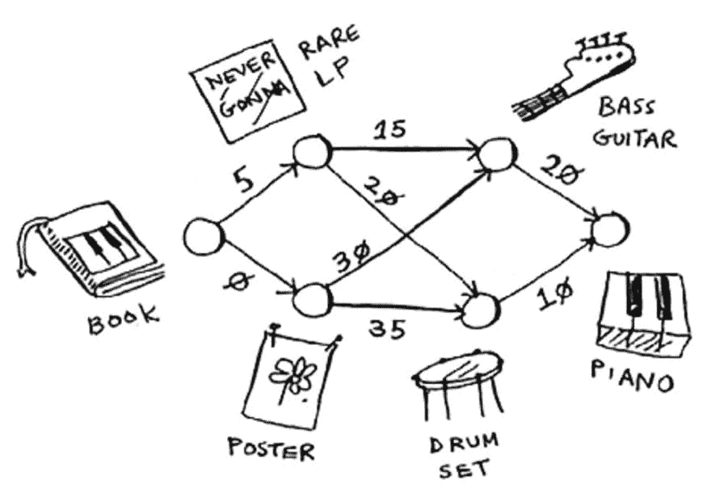
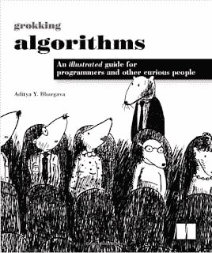
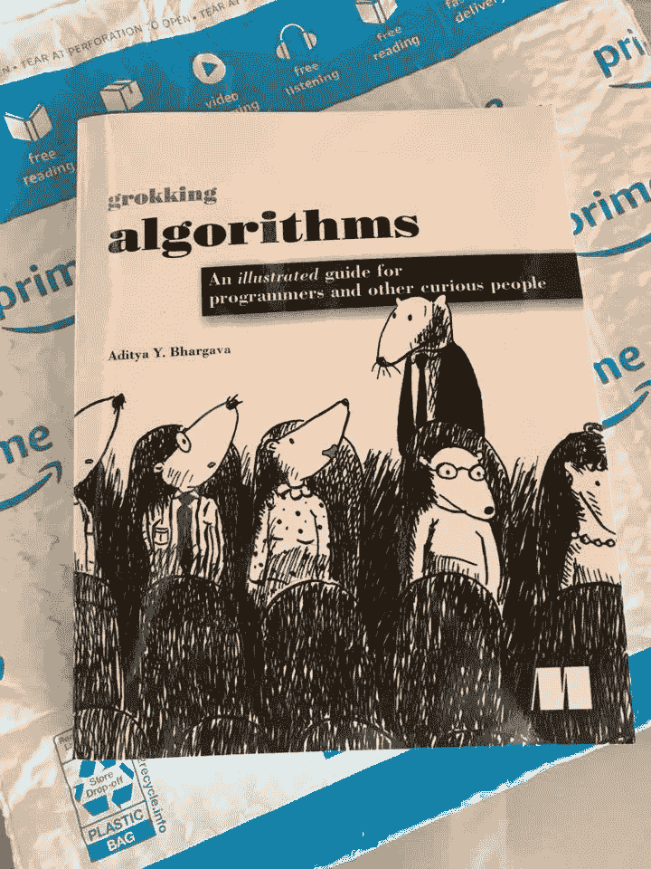
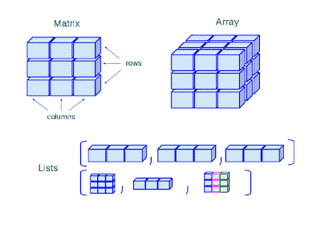

# 最佳数据结构和算法书，适合初学 Python 的人

> 原文：<https://dev.to/javinpaul/grokking-algorithms-best-data-structure-and-algorithms-book-for-beginners-with-python-54cp>

*披露:这篇文章包括附属链接；如果您从本文提供的不同链接购买产品或服务，我可能会收到报酬。*

 
大家好，我读过很多关于数据结构和算法的书，比如托马斯·h·科尔曼的[算法导论](http://www.amazon.com/dp/0072970545/?tag=javamysqlanta-20)和史蒂夫·s·斯基纳的[算法设计手册](http://www.amazon.com/Algorithm-Design-Manual-Steven-Skiena/dp/1849967202?tag=javamysqlanta-20)，所以当我开始了解这本书时，我以为，这只是另一本关于算法的书，但我错了。

> *这不仅仅是另一本关于算法的书，而是* ***你会读到的关于算法和数据结构的最*有趣的书之一，尤其是对初学者** * *。*

它**没有** *涵盖你在计算机科学中看到的所有数据结构和算法*，但无论它涵盖了什么，它都做得很好，这是对初学程序员或计算机科学的学生来说最重要的。

让我们接受它，[数据结构](https://medium.freecodecamp.org/these-are-the-best-free-courses-to-learn-data-structures-and-algorithms-in-depth-4d52f0d6b35a)和[算法](https://dev.to/javinpaul/10-data-structure-algorithms-sql-and-java-courses-to-crack-any-programming-job-interview-11f6)很有趣，但同时它们非常复杂，很难理解，特别是，如果没有很好地解释，这就是这本书的亮点。

> 它用非常简单的语言解释事情，最重要的是有一个上下文，这有助于更好地理解主题。

例如，当 Aditya 在 [**搜索算法**](https://www.amazon.com/Grokking-Algorithms-illustrated-programmers-curious/dp/1617292230/?tag=javamysqlanta-20) 中谈到数组和链表时，他举了一群朋友去看电影时如何努力寻找相邻座位的例子，说明了数组因连续内存需求而面临的问题。

这样有趣又真实的例子有很多，让[算法](http://www.java67.com/2019/02/top-10-free-algorithms-and-data.html)和[数据结构](https://hackernoon.com/10-data-structure-algorithms-and-programming-courses-to-crack-any-coding-interview-e1c50b30b927)这个复杂的话题变得更容易理解。

你也会欣赏他简单的解释像*为什么* [*快速排序*](https://javarevisited.blogspot.com/2014/08/quicksort-sorting-algorithm-in-java-in-place-example.html) *比* [*合并排序*](http://www.java67.com/2018/03/mergesort-in-java-algorithm-example-and.html) *？*，一些我以前想过，但不理解的东西，这只是一个例子，书中充满了关于基本主题的例子，如[数组](http://www.java67.com/2015/07/array-concepts-interview-questions-answers-java.html)、[链表](https://javarevisited.blogspot.com/2017/07/top-10-linked-list-coding-questions-and.html)、[排序算法](https://javarevisited.blogspot.com/2019/04/top-20-searching-and-sorting-algorithms-interview-questions.html)、搜索算法、递归等。

如果他的语言和例子还不够，书中的美术、绘画和图表一定会吸引你。

这本书有大约 **400 张图**，它们都是独一无二的(下面是一个例子)。它们与文本配合得很好，并帮助您直观地了解算法是如何工作的，或者数据结构是如何工作的。

Aditya 在编程和美术方面的背景确实创造了一个很好的融合，在[**Grokking Algorithms:a Illustrated Guide for Programmers**](https://www.amazon.com/Grokking-Algorithms-illustrated-programmers-curious/dp/1617292230/?tag=javamysqlanta-20)* *中结合在一起，并使这本书成为任何程序员和计算机科学学生的必读之作。

> 披露:我会得到报酬，如果你买这本书或任何课程使用本文中的链接。

### 我喜欢搜索算法的什么

嗯，说实话，我喜欢整本书，从引言到结尾。这也是我在过去几年里从头到尾读过的少数几本书之一，另外两本是叶戈尔·布加延科的《优雅的物体》和鲍伯·马丁叔叔的《T2》和《干净的建筑》。

无论如何，这是我喜欢的东西的列表，事实上，我喜欢在搜索算法中:

1.通俗易懂的语言。

2.有趣的图片有助于可视化算法和数据结构的工作。

3.想想看，当你需要设计一个应用程序来记录你的开销，你需要更有规律地添加和删除项目，并在一个月内查看一次或两次，你会使用哪种数据结构？

1.  当代的例子使它更加有趣。例如，脸书如何存储用户名，以便他们可以让你登录和处理注册？[数组](https://dev.to/javinpaul/50-data-structure-and-algorithms-problems-from-coding-interviews-4lh2)或[链表](https://hackernoon.com/50-data-structure-and-algorithms-interview-questions-for-programmers-b4b1ac61f5b0)或由数组和链表组成的混合数据结构。

5.这本书的大小，是的，它不是压倒性的，所以你会有更多的机会阅读它并再次回来。

6.涵盖了基本的数据结构，如[数组](http://www.java67.com/2015/07/array-concepts-interview-questions-answers-java.html)、[字符串](https://dev.to/javinpaul/top-20-string-coding-problems-from-programming-job-interviews-493m)、[二叉树](https://hackernoon.com/50-data-structure-and-algorithms-interview-questions-for-programmers-b4b1ac61f5b0)、[链表](https://javarevisited.blogspot.com/2017/07/top-10-linked-list-coding-questions-and.html)和[哈希表](https://javarevisited.blogspot.com/2016/01/how-does-java-hashmap-or-linkedhahsmap-handles.html#axzz5paOZUJMR)。

这些是我喜欢的一些观点，但是《整体搜索算法》是一本可读性很强的书，有很多好的图片，这使得这个困难的话题相对容易理解。

但是，如果你喜欢像在线课程这样的主动学习，那么你可以将这本书与 Udemy 的 [**数据结构和算法:使用 Java**](https://click.linksynergy.com/fs-bin/click?id=JVFxdTr9V80&subid=0&offerid=323058.1&type=10&tmpid=14538&RD_PARM1=https%3A%2F%2Fwww.udemy.com%2Fdata-structures-and-algorithms-deep-dive-using-java%2F) 课程结合起来，该课程涵盖了比搜索算法更多的数据结构，有效地补充了这本书。

### 是什么让搜索算法变得更好

与你们许多人的想法相反，这本书肯定不是经典书籍的替代品，例如托马斯·h·科尔曼的《算法简介》，因为它并不全面，也没有涵盖大多数数据结构，如树或 Trie 等。

充其量，这是一本关于[数据结构和算法](https://hackernoon.com/50-data-structure-and-algorithms-interview-questions-for-programmers-b4b1ac61f5b0)的介绍性书籍，它让数据结构和算法这个有些枯燥的话题变得更加有趣。以下是我在这本书里错过的一些东西:

1.  这本书在数据结构上有点轻，数据结构是算法的对应物，因为算法是在数据结构上工作的，它对影响算法的数据结构的选择，如果 Aditya 在基本的数据结构上提供更多的内容，如[二叉树](http://www.java67.com/2017/05/binary-tree-post-order-traversal-in-java-without-recursion.html)、[二叉查找树](http://javarevisited.blogspot.sg/2015/10/how-to-implement-binary-search-tree-in-java-example.html#axzz4wnEtnNB3)、trie 等，会更好。

2.  即使这本书涵盖了[动态编程](https://medium.com/javarevisited/6-best-dynamic-programming-courses-for-coding-interviews-14744060923c)和贪婪算法，并解释了一些高级算法，如 k-最近邻，但它仍然没有涵盖关键算法，如编码和加密算法、 [map-reduce](http://www.java67.com/2016/09/map-reduce-example-java8.html) 等。

他试图在关于下一步的最后一章中做些弥补，在那里他提供了主要内容中没有涉及的 10 种算法的简要概述。

顺便说一句，如果你想探索比本书中给出的更多的数据结构和算法，我还建议看看罗伯特·霍维克 的 [**算法和数据结构，这是 Pluralsight 的一门在线课程。**](https://pluralsight.pxf.io/c/1193463/424552/7490?u=https%3A%2F%2Fwww.pluralsight.com%2Fcourses%2Fads-part1)

顺便说一句，你需要 Pluralsight 会员资格才能阅读这些每月花费 29 美元或每年花费 299 美元的书籍(实际上我是在他们每季度举办的减价活动中花 199 美元买的)。

即使你没有会员资格，你也可以通过使用他们的 [**10 天免费试用**](http://pluralsight.pxf.io/c/1193463/424552/7490?u=https%3A%2F%2Fwww.pluralsight.com%2Flearn) 来免费访问该课程，该课程允许 200 小时访问他们的所有在线课程。

老实说，这本书传达了它所说的内容，但是一旦你开始喜欢一本书，你就会开始对它有更多的期待，希望 Aditya 会注意到它，第二版会比第一版更全面一些。

这就是关于搜索算法的全部内容:给程序员和其他好奇的人的图解指南。简而言之，我向程序员、开发人员、软件工程师、学生、计算机科学毕业生以及所有其他好奇的人强烈推荐这本书，正如书名所示。

阅读起来很有趣，用简单易懂的语言教授复杂的概念，解决问题，关注概念而不是实现，这意味着

> *即使你不每天写代码，你也能理解*特定的算法如何工作*以及*如何选择特定的数据结构*来解决问题。*

它关于数组和链表的章节是我读过的最好的，我强烈推荐所有的程序，尤其是那些刚刚开始职业生涯的人去读它。它也不贵，值得花每一分钱。

所以，如果你现在只想做一件事，就去读一读 Aditya Bhargava 的**搜索算法，非常感谢你写了这么棒的书，让这个话题变得更加有趣和可读。**

 **您可能喜欢的其他**编程文章和资源**

1.  [7 门适合初学者的最佳数据结构和算法课程](https://medium.com/javarevisited/7-best-courses-to-learn-data-structure-and-algorithms-d5379ae2588)
2.  [5 门免费学习数据结构和算法的课程](https://javarevisited.blogspot.com/2018/01/top-5-free-data-structure-and-algorithm-courses-java--c-programmers.html)
3.  [有效的 Java 在 Java 8 时代还有效吗？](http://javarevisited.blogspot.sg/2017/06/is-joshua-blochs-effective-java-still-valid-in-the-era-of-java-8.html)
4.  [干净的建筑由大叔书评](http://javarevisited.blogspot.sg/2017/09/clean-architecture-by-uncle-bob-martin.html)
5.  [实践中的 Java 并发在 Java 8 时代还有效吗？](http://javarevisited.blogspot.sg/2016/12/is-java-concurrency-in-practice-still-relevant-in-era-of-java8.html)
6.  [每个程序员都应该读的 10 本算法书](http://www.java67.com/2015/09/top-10-algorithm-books-every-programmer-read-learn.html)
7.  [提高程序员编码技能的 5 本书](http://www.java67.com/2016/02/5-books-to-improve-coding-skills-of.html)
8.  【Java 开发人员应该学习的 10 种工具
9.  【Java 程序员应该学习的 10 件事

感谢阅读这篇文章。如果你喜欢这本书和我的评论，请与你的朋友和同事分享。如果您有任何问题或反馈，请发表评论。

> 如果你更喜欢在线课程而不是书本，或者想要两全其美，那么你也可以在阅读这本书的同时查看一下 [**数据结构和算法:使用 Java**](https://click.linksynergy.com/fs-bin/click?id=JVFxdTr9V80&subid=0&offerid=323058.1&type=10&tmpid=14538&RD_PARM1=https%3A%2F%2Fwww.udemy.com%2Fdata-structures-and-algorithms-deep-dive-using-java%2F) 的深度学习。这将帮助你更好地学习这些关键技能。**