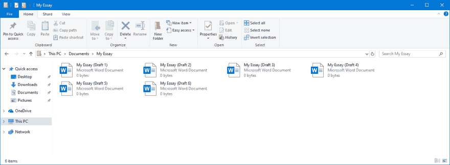

# 所有关于阿帕奇卡珊德拉:快照

> 原文：<https://dev.to/ecnepsnai/all-about-apache-cassandra-snapshots-3oo2>

欢迎来到“关于 Apache Cassandra 的一切”的开篇文章，这是我将在 dev.to 上专门写的关于 Apache Cassandra 的新系列文章！

* * *

# “快照”的概念

在计算中，快照是数据或机器状态的时间点副本。

你曾经做过这样的事情吗？

[](https://res.cloudinary.com/practicaldev/image/fetch/s--vSwA0XyD--/c_limit%2Cf_auto%2Cfl_progressive%2Cq_auto%2Cw_880/https://thepracticaldev.s3.amazonaws.com/i/nja4d08zs7tdg65mldjz.PNG)

这些文件中的每一个都是一个快照，因为它是您保存文章的时间点的副本。

快照为我们提供了一种撤销更改和备份系统的简单方法。

## Cassandra 如何存储数据

Cassandra 通过*键空间*(类似于 MySQL 中的数据库或 PostgreSQL 中的模式)和*列族*(一个表)来分解数据。列族的数据存储在*表*(排序字符串表)中。

当 Cassandra 写入磁盘时，它会写入一个新的 SSTable。每个 SSTable 都是不可变的，所以每次刷新时都会创建一个新的 SSTable。称为*压缩*的过程会自动将这些表合并成一个新表。

例如，如果我们在键空间`App`中有一个名为`Users`的列族，那么该表的数据看起来应该是:

```
<Cassandra Data>/App/Users/
1-big-Data.db
2-big-Data.db
3-big-Data.db
4-big-Data.db 
```

<svg width="20px" height="20px" viewBox="0 0 24 24" class="highlight-action crayons-icon highlight-action--fullscreen-on"><title>Enter fullscreen mode</title></svg> <svg width="20px" height="20px" viewBox="0 0 24 24" class="highlight-action crayons-icon highlight-action--fullscreen-off"><title>Exit fullscreen mode</title></svg>

每个`big-Data`文件都是一个表。压缩会将所有这些表合并成一个新的文件`5-big-Data.db`。

# 卡珊德拉如何拍摄快照

当你用 Apache Cassandra 拍快照时，它会创建一个所有实时表格的硬链接。很简单，对吧？这比你想象的要复杂一点

## 什么是硬链接？

硬链接是指向与另一个文件相同的数据的文件。

在类 UNIX 系统(Linux、macOS、BSD)中，系统使用*inode*引用磁盘上的数据，你电脑上的文件引用 inode。硬链接是指与另一个文件共享相同 INode 的文件。

硬链接不同于软链接，软链接告诉应用程序实际的文件路径在哪里。

# 军规

硬链接有一个**非常重要的陷阱**:只有当所有对磁盘的引用都被删除时，磁盘上的数据才会被删除。

例如:索引节点 1001 引用磁盘上 500MB 的数据，我们有两个文件指向索引节点 1001。如果我们删除了第一个链接，由于第二个链接，500MB 的数据仍将在磁盘上。在**所有链接都被删除**之前，我们不会从磁盘中释放那 500MB。

# 卡珊德拉存储快照的地方

因为快照是现有文件的硬链接，所以这些文件必须与您的数据在同一个文件系统中。因此，快照存储在列族的`snapshots`目录中。如果我们在现有用户表上拍摄一个名为`snapshot1`的快照，结果将是:

```
<Cassandra Data>/App/Users/
1-big-Data.db
2-big-Data.db
3-big-Data.db
4-big-Data.db
<Cassandra Data>/App/Users/snapshots/snapshot1
1-big-Data.db (Hard link)
2-big-Data.db (Hard link)
3-big-Data.db (Hard link)
4-big-Data.db (Hard link) 
```

<svg width="20px" height="20px" viewBox="0 0 24 24" class="highlight-action crayons-icon highlight-action--fullscreen-on"><title>Enter fullscreen mode</title></svg> <svg width="20px" height="20px" viewBox="0 0 24 24" class="highlight-action crayons-icon highlight-action--fullscreen-off"><title>Exit fullscreen mode</title></svg>

当压缩发生并且表被合并时，我们的快照不受影响:

```
<Cassandra Data>/App/Users/
5-big-Data.db
<Cassandra Data>/App/Users/snapshots/snapshot1
1-big-Data.db
2-big-Data.db
3-big-Data.db
4-big-Data.db 
```

<svg width="20px" height="20px" viewBox="0 0 24 24" class="highlight-action crayons-icon highlight-action--fullscreen-on"><title>Enter fullscreen mode</title></svg> <svg width="20px" height="20px" viewBox="0 0 24 24" class="highlight-action crayons-icon highlight-action--fullscreen-off"><title>Exit fullscreen mode</title></svg>

因为仍然至少有一个对表 1-4 的数据的引用，所以系统不会从磁盘中删除该数据。

# 快照如何影响容量

与任何分布式存储系统一样，计算您的容量不仅仅是查看您有多少可用磁盘空间这么简单。

快照会对您的群集容量产生非常大的影响，如果您考虑按计划拍摄快照，就需要非常小心。

由于这一点*硬链接的一个重要问题*(见上文)，压缩作业会显著增加快照使用的数据量。

当您在没有任何活动的服务器上拍摄快照时，该快照不会消耗任何(有意义的)磁盘数据量。但是一旦写入新的表或发生压缩，快照就会开始占用空间，可能会使磁盘上的数据量增加一倍。

让我试着分解一下:

假设您有一个 100GB 的磁盘，Cassandra 使用其中的 50GB 存储数据。

1.  你拍了一张新的快照。这不会占用太多磁盘空间。还是五成满。
2.  发生了一次大的压缩，类似于清理或擦除，这将重写磁盘上的所有表。
3.  该快照现在引用已经完全重写的 SSTables 版本，本质上是重复的数据。现在 100%满了。

当然，这是一个稍微夸张的例子，但事实是，快照和压缩会破坏您的磁盘容量，毁了您的一天。

# 从快照恢复

从快照恢复是一种破坏性操作，会导致拍摄快照后创建的任何新数据丢失。只有在别无选择时，才应该从快照恢复。没有自动将 Cassandra 恢复到快照的方法，这是一个手动过程。

**当集群运行时:**

1.  截断您需要恢复的表
2.  停止卡珊德拉服务

*为什么要截断？*如果有任何剩余的墓碑，它们将在您恢复后被删除。截断会从该表中移除任何逻辑删除块。

**在集群中的所有节点上:**

1.  导航到要从中恢复的快照的目录
2.  将该目录中的所有表复制到该表的数据目录中

**最后:**

1.  启动服务
2.  运行一个`nodetool refresh`

# 命令行参考

与大多数操作任务一样，您将使用`nodetool`应用程序来管理服务器上的快照。这些是您可能会用到的一些命令。

## 拍快照

```
nodetool snapshot [options] [keyspace] 
```

<svg width="20px" height="20px" viewBox="0 0 24 24" class="highlight-action crayons-icon highlight-action--fullscreen-on"><title>Enter fullscreen mode</title></svg> <svg width="20px" height="20px" viewBox="0 0 24 24" class="highlight-action crayons-icon highlight-action--fullscreen-off"><title>Exit fullscreen mode</title></svg>

参考:[https://Cassandra . Apache . org/doc/latest/tools/node tool/snapshot . html](https://cassandra.apache.org/doc/latest/tools/nodetool/snapshot.html)

**用特定的名字** :
`nodetool snapshot -t <name>`拍快照

**对特定键空间中的所有表拍摄快照** :
`nodetool snapshot <keyspace>`

**对两个特定的表进行快照** :
`nodetool snapshot -kt <comma separated list of keyspace.tableName>`

## 列出所有快照

```
nodetool listsnapshots 
```

<svg width="20px" height="20px" viewBox="0 0 24 24" class="highlight-action crayons-icon highlight-action--fullscreen-on"><title>Enter fullscreen mode</title></svg> <svg width="20px" height="20px" viewBox="0 0 24 24" class="highlight-action crayons-icon highlight-action--fullscreen-off"><title>Exit fullscreen mode</title></svg>

参考:[https://Cassandra . Apache . org/doc/latest/tools/node tool/list snapshot s . html](https://cassandra.apache.org/doc/latest/tools/nodetool/listsnapshots.html)

## 删除一个或多个快照

```
nodetool clearsnapshot [options] [keyspaces] 
```

<svg width="20px" height="20px" viewBox="0 0 24 24" class="highlight-action crayons-icon highlight-action--fullscreen-on"><title>Enter fullscreen mode</title></svg> <svg width="20px" height="20px" viewBox="0 0 24 24" class="highlight-action crayons-icon highlight-action--fullscreen-off"><title>Exit fullscreen mode</title></svg>

参考:[https://Cassandra . Apache . org/doc/latest/tools/node tool/clear snapshot . html](https://cassandra.apache.org/doc/latest/tools/nodetool/clearsnapshot.html)

**删除所有快照** :
`nodetool clearsnapshot`

**删除名为**
`nodetool clearsnapshot -t <snapshot name>`的快照

**从特定的键空间中删除快照:**
`nodetool clearsnapshot <keyspace>`