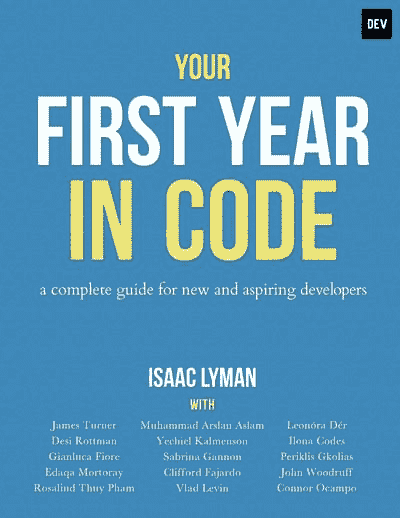
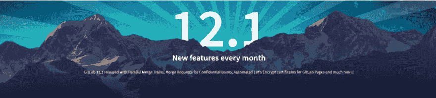
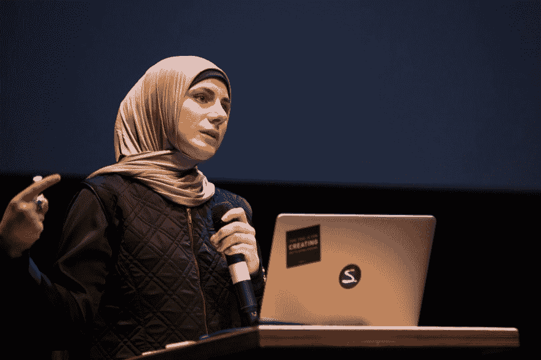

# 前端新闻#11:你写代码的第一年，HTML 手册，GitLab 12.1

> 原文：<https://dev.to/adriansandu/front-end-news-11-your-first-year-in-code-html-handbook-gitlab-12-1-2an7>

<figure> 

<figcaption>在 YouTube 上查看[https://youtu.be/lod_N5b2OOY](https://youtu.be/lod_N5b2OOY)</figcaption>

</figure>

大家好，欢迎收看新一轮的前端新闻。这是我今天为你们准备的:

*   DEV 社区出版了一本名为《你的代码元年》的书
*   现在可以在 freeCodeCamp 上找到 HTML 手册
*   GitLab 升级至 12.1 版

还有一些软件更新值得一提，还有一个全新的# DeveloperOfTheWeek。

一如既往，我也为那些喜欢听而不是读的人准备了视频版本。如果你喜欢这种格式，如果你也能订阅 YouTube 频道，我将不胜感激。

[https://www.youtube.com/embed/lod_N5b2OOY](https://www.youtube.com/embed/lod_N5b2OOY)

### 你在代码的第一年

作为一名开发人员开始您的职业生涯可能是一项非常艰巨的任务。而且不仅仅是编码。这是容易的部分。难的是没人告诉你的事情。比如如何应对会议、新同事、新工作场所的文化以及其他许多事情。

这就是 Dev.to 社区伸出援手的地方。资深成员之一 Isaac Lyman 领导了一个团队，最终出版了《你的代码元年》。这不仅仅是博客帖子的简单汇编——有很多反馈说这是他们希望在开始职业生涯时拥有的指南。

<figure> 

<figcaption>在[https://leanpub.com/firstyearincode](https://leanpub.com/firstyearincode)</figcaption>

</figure>

购买本书

这本书采用量入为出的定价模式，建议价格为 15 美元。收入将在合作作者之间分配，而所有收益的 10%将直接给编码运动的女孩。虽然你可以免费得到它，但艾萨克和所有的合著者已经花费了大量的时间和精力把这本书放在一起，所以所有的贡献都受到了感谢。

这本书可以通过 LeanPub 购买。我已经拿到了我的副本，我读完之后会尽快给你更多的细节。

*   [https://dev . to/dev team/the-dev-community-published-a-book-your-first-year-in-code-1ejk](https://dev.to/devteam/the-dev-community-published-a-book-your-first-year-in-code-1ejk)

### HTML 手册

有一本新的手册可供所有前端开发人员使用。这是一个 HTML 版本，由 Flavio Copes 编写，发布在 freeCodeCamp 新闻门户上。Flavio 是多产的手册作者，主题包括 CSS、JavaScript、React、NodeJS 或 VueJS。

该手册对所有级别的开发人员都有用。初学者会找到一个简单而全面的学习 HTML 的方法。有经验的开发人员会重温他们的知识以及一些晦涩难懂的信息，这会让你说“我不知道 HTML 可以做到这一点！”

使用下面的链接开始在线阅读手册，或者为你喜欢的电子阅读器下载一份。

*   [https://www.freecodecamp.org/news/the-html-handbook/](https://www.freecodecamp.org/news/the-html-handbook/)

### GitLab 12.1

对于那些还不知道的人来说，GitLab 是一个完整的 DevOps 平台，作为一个应用程序交付。它提供了开发、部署和维护各种规模项目的一体化解决方案。您正在开发的应用程序的代码库很可能是使用 GitLab 管理的。

GitLab 以每月发布新功能为荣。这就把我们带到了最新的版本——12.1。这个版本的明星特点是并行合并列车和合并机密问题的请求。现在也可以使用“让我们加密”来自动获得网页的 HTTPS 证书。

新功能的完整列表、不推荐使用的功能列表以及如何执行升级的说明都可以在下面链接中的发布博客帖子上找到。

*   [https://about.gitlab.com/2019/07/22/gitlab-12-1-released/](https://about.gitlab.com/2019/07/22/gitlab-12-1-released/)

### 软件更新和发布

今天，我有更多的软件通知部分的项目。

**NodeJS 12.7.0**

NodeJS 是带来“JavaScript 无处不在”的平台。本周代码库更新到了 12.7.0 版本。完整的细节可以在下面链接的官方发行说明中找到。

*   [https://nodejs . org/en/blog/release/v 12 . 7 . 0/](https://nodejs.org/en/blog/release/v12.7.0/)

**验证 2.0.0**

Vuetify 是一个语义组件框架，它使得所有使用 VueJS 的开发人员都可以使用材料设计。2.0 版开启了框架生命周期的新篇章，带来了对 Material Design 2 规范的遵从、新组件和许多其他改进。有关完整列表，您可以查看下面链接的发行说明。

*   [https://github.com/vuetifyjs/vuetify/releases/tag/v2.0.0](https://github.com/vuetifyjs/vuetify/releases/tag/v2.0.0)

**Atom 1.39**

Atom 代码编辑器的新版本(1.39)已经发布，带来了更快的查找和替换操作，更快的大型单行文件加载，现在一切都可以在 Electron 3.1 上运行。同样，完整的更新，以及对 1.40 测试版即将推出的功能的预览，都可以在下面链接的发布公告中找到。

*   [https://blog.atom.io/2019/07/23/atom-1-39.html](https://blog.atom.io/2019/07/23/atom-1-39.html)

### 一周的开发者

又一集意味着又一个# DeveloperOfTheWeek。今天我要向你们展示…

…小号…

> “苏伊丹家族的萨拉，她的名字，SVGs 的班德，无障碍冠军 CSS 氏族的首领”

Sara 是一名独立的前端开发人员、培训师、作家和演讲者，来自黎巴嫩。她的记录令人印象深刻。她主持前端开发研讨会，并在她的博客和各种大型出版物上撰写技术文章。Sara 编写了 Codrops CSS Reference，与人合著了畅销书籍 5，并在 2015 net awards 中被选为年度开发人员。

一些关于 Sara 的鲜为人知的事情是，她喜欢鸟类，喜欢绿茶胜过咖啡，并且在她开始网络生涯之前很久，她就已经开始用木炭画画了。

谢谢你，Sara，你太棒了，继续努力吧！

*   [https://www.sarasoueidan.com/](https://www.sarasoueidan.com/)
*   [https://twitter.com/SaraSoueidan](https://twitter.com/SaraSoueidan)

### 今日问题

在我们的“本周开发人员”部分，您希望看到的下一个人是谁？请在评论区或在[https://twitter.com/frontendnexus.](https://twitter.com/frontendnexus.)上留下你的建议

这一版就这么多了。在 https://twitter.com/frontendnexus[的 Twitter 上关注 Front End Nexus](https://twitter.com/frontendnexus)，一旦有新的更新，我们将立即通知您。我还想鼓励你在 https://www.youtube.com/channel/UCgACtqiDmnSaskDIBsK54ww[的](https://www.youtube.com/channel/UCgACtqiDmnSaskDIBsK54ww)订阅 YouTube 频道。一旦该频道达到 100 名订户，我可以解锁更多的选项，因此非常感谢您的支持。

祝您度过愉快而富有成效的一周，我们下次再见！

* * *